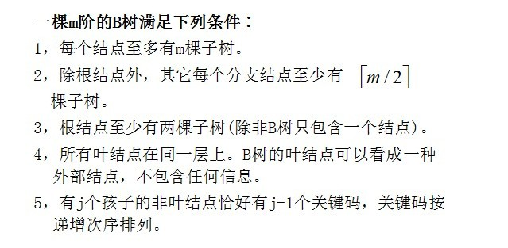
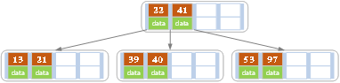
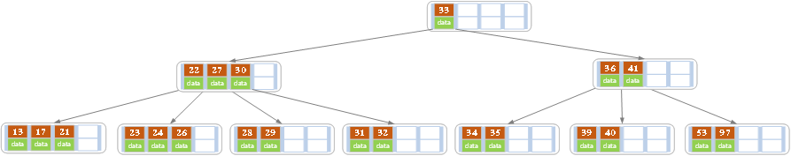

承接上篇SQLite采用B树结构使得SQLite内存占用资源较少，本篇将讲述B树的具体操作（建树，插入，删除等操作）。在看博客时，建议拿支笔和纸，一点一点操作，毕竟知识是自己的，自己也要消化的。本篇通读下来，大约需要25-35分钟，关键掌握B树的具体操作思想，欢迎大家指正。

 

**一、前言**

动态查找树主要包括：二叉查找树，平衡二叉树，红黑树，B树，B-树，查找的时间复杂度就为O(log2N)，通过对数就可以发现降低树的深度就会提高查找效率。在大数据存储过程，大量的数据会存储到外存磁盘，外存磁盘中读取与写入某数据的时候，首先定位到磁盘中的某一块，这就有个问题：如何才能有效的查找磁盘中的数据呢，这就需要一种高效的外存数据结构，也就引出了下面的课题。

B树为了存储设备或者磁盘而设计的一种平衡查找树，与红黑树类似（拓展会讲）。

拓展：

B树与红黑树的

不同在于：B树的节点可以有很多子女，从几个到几万个不等，

相同：一颗含有n个节点的B树高度和红黑树是一样的，都是O（lgn）。

 

**二、定义**

 

**1.B树**

（1）一棵m阶的B树，特性如下：



利用书面的定义（参考书籍-《数据结构》）

1）树中的每个结点最多含有m个孩子；

2）除了根结点和叶子结点，其他结点至少有[ceil(m / 2)（代表是取上限的函数）]个孩子；

3）若根结点不是叶子结点时，则至少有两个孩子（除了没有孩子的根结点）

4）所有的叶子结点都出现在同一层中，叶子结点不包含任何关键字信息；

 

（2）B树的类型与节点定义

```python
#define m 1024
struct BTNode;
typedef struct BTNode *PBTNode;
struct BTNode {
 int keyNum;//实际关键字个数，keyNum < m
 PBTNode parent;//指向父亲节点
 PBTNode *ptr;
 keyType *key;//关键字向量
 
}
typedef struct BTNode *BTree;
typedef BTree *PBTree;
```

**2.B+树**

B+树可以说是B树的一种变形，它把数据都存储在叶结点，而内部结点只存关键字和孩子指针，因此简化了内部结点的分支因子，B+树遍历也更高效，其中B+树只需所有叶子节点串成链表这样就可以从头到尾遍历，其中内部结点是并不存储信息，而是存储叶子结点的最小值作为索引，下面将讲述到。

定义：参考数据《数据结构》与百度百科

B+树用于数据库和文件系统中，NTFS等都使用B+树作为数据索引，

1）有n棵子树的结点含有n个关键字，每个关键字都不会保存数据，只会用来索引，并且所有数据都会保存在叶子结点；

2）所有的叶子结点包含所有关键字信息以及指向关键字记录的指针，关键字自小到大顺序连接；

参考下图（来自百度百科）


**三、问答**

**1.为什么**说B+树比B树更适合做操作系统的数据库索引和文件索引？

（1）B+树的磁盘读写的代价更低

B+树内部结点没有指向关键字具体信息的指针，这样内部结点相对B树更小。

（2）B+树的查询更加的稳定

因为非终端结点并不是最终指向文件内容的结点，仅仅是作为叶子结点中关键字的索引。这样所有的关键字的查找都会走一条从根结点到叶子结点的路径。所有的关键字查询长度都是相同的，查询效率相当。

 

**四、B树与B+树操作**（建议大家找张纸，跟着一起，毕竟知识是自己的）

**1.B树**

**1.1 B树的插入**

B树的插入是指插入一条记录，如果B树已存在需要插入的键值时，用新的值替换旧的值；若B树不存在这个值时，则是在叶子结点进行插入操作。

对高度为h的m阶B树，新结点一般插第h层。通过检索可以确定关键码应插入的位置，

1）若该结点中关键码个数小于等于m-1，则直接插入就可

2）若该结点中关键码个数等于m-1，则将引起结点的分裂，以中间的关键码为界将结点一分为二，产生了一个新的结点，并将中间关键码插入到父结点中；

重复上述过程，最坏情况一直分裂到根结点， 建立一个新的根结点，整个B树就增加一层。

举例如下：

》〉》〉下面以5阶B树举例，根据B树的定义，结点最多有4个值，最少有2个值。

a）在空树插入39，此时就有一个值，根结点也是叶子结点


b）继续插入22，97和41值，根结点变为4个值，符合要求


c）插入53值


插入之后发现超过结点最多只有4个值，所以要以中间值进行分开，分开后当前结点要指向父结点，分裂之后，发现符合要求


d）插入13，21，40，同样造成分裂，



e）紧接着插入30，27，33，36，24，34，35


f）将26再次插入进去


发现有5个值，超过B树的定义，需要以27为中心分裂，27进军父结点


发现父结点也超过4个，再次分裂


g）最后插入17，28，29，31，32的记录




**1.2 B树的删除**

B树删除：首先要查找该值是否在B树中存在，如果存在，判断该元素是否存在左右孩子结点，如果有，则上移孩子结点中的相近结点（左孩子最右边的结点或者有孩子最左边的结点）到父结点中，然后根据移动之后的情况；如果没有，进行直接删除；如果不存在对应的值，则删除失败。

1）如果当前要删除的值位于非叶子结点，则用后继值覆盖要删除的值，再用后继值所在的分支删除该后继值。（该后继值必须位于叶子结点上）

2）该结点值个数不小于Math.ceil(m/2)-1（取上线函数），结束删除操作，否则下一步

3）如果兄弟结点值个数大于Math.ceil(m/2)-1，则父结点中下移到该结点，兄弟的一个值上移，删除操作结束。

将父结点的key下移与当前的结点和他的兄弟姐妹结点key合并，形成一个新的结点，

有些结点可能有左兄弟，也有右兄弟，我们可以任意选择一个兄弟结点即可。

 

》〉》〉下面以5阶B树举例进行删除，根据B树的定义，结点最多有4个值，最少有2个值。

a）原始状态


b）在上面的B树删除21，删除之后结点个数大于等于2，所以删除结束


c）删除27之后为


27处于非叶子结点，用27的后继替换。也即是28替换27，然后在右孩子结点删除28，如上。

发现删除，当前叶子结点的记录的个数已经小于2，而兄弟结点中有3个记录我们可以从兄弟结点中借取一个key，父结点中的28就下移，兄弟结点中的26就上移,删除结束，结果如下


d）删除32


删除之后发现，当前结点中有key，而兄弟都有两个key，所以只能让父结点的30下移到和孩子一起合并，成为新的结点，并指向父结点，经拆封发现符合要求


**2.B+树**

**2.1 B+树的插入**

B+树插入：

1）若为空树，直接插入，此时也就是根结点

2）对于叶子结点：根据key找叶子结点，对叶子结点进行插入操作。插入后，如果当前结点key的个数不大于m-1，则插入就结束。反之将这个叶子结点分成左右两个叶子结点进行操作，左叶子结点包含了前m/2个记录，右结点包含剩下的记录key，将第m/2+1个记录的key进位到父结点中（父结点必须是索引类型结点），进位到父结点中的key左孩子指针向左结点,右孩子指针向右结点。

3）针对索引结点：如果当前结点key的个数小于等于m-1，插入结束。反之将这个索引类型结点分成两个索引结点，左索引结点包含前(m-1)/2个数据，右结点包含m-(m-1)/2个数据，然后将第m/2个key父结点中，进位到父结点的key左孩子指向左结点, 父结点的key右孩子指向右结点。


》〉》〉下面以5阶B+树举例进行插入，根据B+树的定义，结点最多有4个值，最少有2个值。

a）空树插入5，8，10，15


b）插入16


超过了最大值4，所以分裂，以中间为准


c）插入17，18


结点的关键字等于5，大于4，进行分裂。


符合条件，插入完成。


**2.2 B+树删除**


》〉》〉下面以5阶B+树举例进行删除，根据B+树的定义，结点最多有4个值，最少有2个值。

下面是初始状态


a）删除22，删除后个数为2，删除结束


b）删除15，结果如下：


删除之后，只有一个值，而兄弟有三个值，所以从兄弟结点借一个关键字，并更新索引结点


大家可以考虑删除7.我在这里直接给出结果


以上就是B树和B+树的操作，建议大家拿支笔操作一下，毕竟提高能力是没有错的。

**五、代码实现**

```
//测试程序1  
#include <iostream>  
#include <cstdlib>  
#include <ctime>  
#include "BTree.h"  
using namespace std;  
  
int main()  
{     
    char iKey[] = {'C','N','G','A','H','E','K','Q','M','F','W','L','T','Z','D','P','R','X','Y','S'};  
    char dKey[] = {'C','N','G','A','H','E','K','Q','M','F','W','L','T','Z','D','P','R','X','Y','S'};  
    int iSize = sizeof(iKey)/sizeof(char);  
    int dSize = sizeof(dKey)/sizeof(char);  
  
    int i;  
    BTree<char> btree(5, NULL);     
    cout<<"----------插入测试----------"<<endl;  
    for(i = 0; i < iSize; i++) //插入测试  
    {  
        cout<<"插入"<<iKey[i]<<"以后"<<endl;  
        btree.Insert(iKey[i]);  
        btree.PrintBTree();  
    }  
    cout<<"----------删除测试----------"<<endl;  
    for(i = 0; i < dSize; i++) //删除测试  
    {  
        cout<<"删除"<<dKey[i]<<"以后"<<endl;  
        btree.Delete(dKey[i]);  
        btree.PrintBTree();  
    }  
    return 0;  
}
```

```
//测试程序2  
#include <iostream>  
#include <cstdlib>  
#include <ctime>  
#include "BTree.h"  
using namespace std;  
  
int main()  
{     
    srand((int)time(0));  
    const int iSize = 100000;  //插入次数   
    const int dSize = 100000;  //删除次数  
    const int num = 100;       //测试组数  
    int *iKey = new int[iSize];  
    int *dKey = new int[dSize];   
    int i, j;  
    for(j = 0; j < num; j++)  //测试组数，每次测试都是插入iSize次，删除dSize次  
    {  
        for(i = 0; i < iSize; i++)  //插入数据生成  
            iKey[i] = rand()%iSize;  
        for(i = 0; i < dSize; i++)  
            dKey[i] = rand()%iSize; //删除数据生成  
  
        int m = rand()%400 + 3;  //随机生成3阶到402阶  
        BTree<int> btree(m, NULL);      
        cout<<"----------第"<<j<<"组插入测试----------"<<endl;  
        for(i = 0; i < iSize; i++) //插入测试  
            btree.Insert(iKey[i]);  
        cout<<"第"<<j<<"组插入测试成功，为"<<m<<"阶B树"<<endl;  
        cout<<"----------第"<<j<<"组删除测试----------"<<endl;  
        for(i = 0; i < dSize; i++) //删除测试  
            btree.Delete(dKey[i]);  
        cout<<"第"<<j<<"组删除测试成功，为"<<m<<"阶B树"<<endl<<endl;  
    }  
    delete [] iKey;  
    delete [] dKey;  
    return 0;  
}
```

```
//BTree.h文件，由于使用了模板所以没法将声明与实现分离  
#pragma once  
#include <queue>  
using namespace std;  
  
//B树的结点定义  
template <typename T>  
struct BTreeNode  
{  
    int num;               //关键字个数    
    T *K;                  //指向关键字数组  
    BTreeNode<T> *parent;  //指向父亲结点  
    BTreeNode<T> **A;      //指向孩子结点数组的指针  
    BTreeNode(int n, int m, BTreeNode<T>  *p)  
    {  
        num = n;  
        parent = p;  
        K = new T[m+1];           //最多有m-1个关键字，K0不用，Km用来当哨兵  
        A = new BTreeNode *[m+1]; //最多有m个分支，Am用来当哨兵  
        for(int i = 0; i <= m; i++)  
            A[i] = NULL;  
    }  
    ~BTreeNode()  
    {  
        delete [] K; K = NULL;    
        delete [] A; A = NULL;  
    }  
};  
  
//搜索结果的三元组定义  
template <typename T>  
struct Triple  
{  
    BTreeNode<T> * node;  //关键字所在结点  
    int i;                //关键字下标位置  
    bool tag;             //搜索是否成功  
    Triple(BTreeNode<T> *nd, int pos, bool t)   
    { node = nd; i = pos; tag = t;}  
};  
  
//B树定义  
template <typename T>  
class BTree  
{  
public:  
    BTree();  
    BTree(int m , BTreeNode<T> * root);  
    ~BTree();  
    Triple<T> Search(const T& x); //搜索核心函数  
    bool Insert(const T& x);      //插入核心函数  
    bool Delete(const T& x);      //删除核心函数  
    void InsertKey(BTreeNode<T> *p, T k, BTreeNode<T> *a, int i);    //插入一个二元组(K,A)  
    void SpliteNode(BTreeNode<T> *p, T *k, BTreeNode<T> **a, int i); //分裂结点  
    void RightAdjust(BTreeNode<T> *p, BTreeNode<T> *q, int i);  //从右子女取关键字  
    void LeftAdjust(BTreeNode<T> *p, BTreeNode<T> *q, int i);   //从左子女取关键字  
    void LeftCompress(BTreeNode<T> *p, int i);  //往左移动1个位置  
    void RightCompress(BTreeNode<T> *p, int i); //往右移动1个位置  
    void MergeNode(BTreeNode<T> *p, BTreeNode<T> *q, BTreeNode<T> *pR, int i); //合并两个结点  
    void PrintBTree(); //打印B树  
private:  
    int m_m;                //路数，即最大子树棵数  
    BTreeNode<T> *m_pRoot;  //B树的根结点  
};  
template<typename T>  
BTree<T>::BTree() //默认构造函数  
{  
    m_m = 5;         //默认是5阶  
    m_pRoot = NULL;  //根结点初始为空  
}  
template<typename T>  
BTree<T>::BTree(int m , BTreeNode<T> * root)  
{  
    m_m = m;        
    m_pRoot = root;  
}  
template<typename T>  
BTree<T>::~BTree() //释放所有的空间  
{  
    if(m_pRoot != NULL)  
    {  
        queue<BTreeNode<T> *> nodeQueue; //利用队列，按层次遍历B树  
        nodeQueue.push(m_pRoot);         //放入根结点  
        while(nodeQueue.size())  
        {  
            BTreeNode<T> * p = nodeQueue.front();  
            if(p->A[0] != NULL) //不是叶结点，需考虑子女结点的删除  
            {  
                for(int i = 0; i <= p->num; i++)  
                    nodeQueue.push(p->A[i]);  
            }  
            nodeQueue.pop();  
            delete p;  
            p = NULL;  
        }  
    }  
}  
//函数功能： 查找关键字x是否在B树中  
//函数参数： x为查找的关键字  
//返回值：   一个Triple对象(node, i, tag)，tag=true表示x等于结点r中的Ki；tag=false表示x不在树中，r是最后一个被搜索的结点  
template <typename T>  
Triple<T> BTree<T>::Search(const T &x)  
{  
    int i = 0;  //下标  
    BTreeNode<T> *p = m_pRoot, *q = NULL;  //用来保存当前结点和它的父结点  
  
    while(p != NULL) //一直检查到叶结点  
    {  
        //n, A0,(K1, A1), (K2, A2), ... (Kn, An)  
        //确定i，使得Ki <= x < Ki+1，K[0]不放数据  
        //下面这条语句当然也可以写成 for(i = 1; i <= n && x >= p->K[i]; i++)  
        //但是为了与Ki <= x < Ki+1这个关系式统一，采用了下述写法，观察后面的程序，发现这样写还避免了下标溢出的判断   
        int n = p->num;   //当前结点的关键字个数     
        for(i = 0; i < n && x >= p->K[i+1]; i++)  //可以改进一下，用二分查找  
            ;  
        if(x == p->K[i]) //是否已找到，不用判断下标，i最大为n   
            return Triple<T>(p, i, true);  
        q = p;  
        p = p->A[i];     //搜索下一层，Ki与Ki+1中间的指针  
    }  
    return Triple<T>(q, i, false); //x不在树中，找到了可以插入的结点位置  
}  
//函数功能： 插入关键字x到B树中  
//函数参数： x为插入的关键字  
//返回值：   插入是否成功  
template <typename T>  
bool BTree<T>::Insert(const T &x)  
{  
    if(m_pRoot == NULL) //空树  
    {  
        m_pRoot = new BTreeNode<T>(1, m_m, NULL);  //新的根含有1个关键字  
        m_pRoot->K[1] = x;    //根的关键字  
        return true;  
    }  
  
    Triple<T> triple = Search(x);     //检查是否已存在  
    if(triple.tag == true) //x已在B树中  
        return false;  
  
    BTreeNode<T> *p = triple.node, *q; //结点地址  
    //构造插入的两元组(k,a) 其中k为关键字，a为右邻指针  
    BTreeNode<T> *a = NULL;  
    T k  = x;  
    int i = triple.i;   
  
    while(1) //插入过程  
    {  
        if(p->num < m_m-1) //关键字个数未到达上限，可以直接插入  
        {  
            InsertKey(p, k, a, i); //(k, a)插入到位置(Ki, Ai)后面  
            return true;  
        }  
        SpliteNode(p, &k, &a, i); //将p结点分裂成两个结点，一个结点仍为p，另外一个变为两元组(k,a)，以便插入到父结点  
        if(p->parent != NULL)     //父结点不为空  
        {  
            q = p->parent; //获得父结点  
            for(i = 0; i < q->num && x >= q->K[i+1]; i++) //确定新的插入位置i  
                ;  
            p = q;   //进入上一层  
        }  
        else  
        {  
            //已经到达了根，需要新建一个结点  
            m_pRoot = new BTreeNode<T>(1, m_m, NULL);  //新的根含有1个关键字  
            m_pRoot->K[1] = k; //新根的关键字  
            m_pRoot->A[0] = p; //左指针  
            m_pRoot->A[1] = a; //右指针  
            p->parent = a->parent = m_pRoot; //更新左右指针的父结点  
            return true;  
        }  
    }  
}  
//函数功能： 插入关键字x到B树中，这是实际的插入函数  
//函数参数： p指向插入关键字所在结点，k为插入的关键字，a为关键字的右邻，i为插入位置  
//返回值：   无  
template <typename T>  
void BTree<T>::InsertKey(BTreeNode<T> *p, T k, BTreeNode<T> *a, int i)  
{  
    for(int j = p->num; j > i; j--) //将K[i],A[i]以后的元素都往后移一个位置  
    {  
        p->K[j + 1] = p->K[j];  
        p->A[j + 1] = p->A[j];  
    }  
    p->num++;        //结点的关键字个数加1  
    p->K[i + 1] = k; //插入两元组在K[i],A[i]以后  
    p->A[i + 1] = a;  
    if(a != NULL)    //若为为空，需更新父结点指针  
        a->parent = p;  
}  
//函数功能： 分裂结点  
//函数参数： p指向要分裂的结点，k指向插入的关键字，a指向关键字的右邻，i为插入位置  
//返回值：   无  
template <typename T>  
void BTree<T>::SpliteNode(BTreeNode<T> *p, T *k, BTreeNode<T> **a, int i)  
{  
    InsertKey(p, *k, *a, i); //先插了再说  
    int mid = (m_m + 1)/2;   //[ceil(m/2)]  
    int size = (m_m & 1)? mid : mid + 1; //奇偶性决定了分裂时拷贝的关键字个数  
  
    BTreeNode<T> *q = new BTreeNode<T>(0, m_m, p->parent); //新结点  
    //将p的K[mid+1...m]和A[mid..m]移到q的K[1...mid-1]和A[0...mid-1]  
    q->A[0] = p->A[mid];  
    for(int j = 1; j < size; j++)  
    {  
        q->K[j] = p->K[mid + j];    
        q->A[j] = p->A[mid + j];    
    }  
    //修改q中的子女的父结点为q，这里很重要，因为这些子女原来的父结点为p  
    if(q->A[0] != NULL)  
    {     
        for(int j = 0; j < size; j++)  
            q->A[j]->parent = q;  
    }  
    //更新结点的关键字个数  
    q->num = m_m - mid;  //结点q：m –[ceil(m/2)], A[ceil(m/2)],(K [ceil(m/2)]+1, A [ceil(m/2)]+1), …, (Km, Am)  
    p->num = mid - 1;    //结点p：[ceil(m/2)]–1, A0, (K1, A1), (K2,A2), …, (K[ceil(m/2)]–1, A[ceil(m/2)]–1)   
    //构建新的两元组(k,a)  
    *k = p->K[mid];  
    *a = q;  
}  
  
//函数功能： 删除关键字x  
//函数参数： x为要删除的关键字  
//返回值：   删除是否成功  
template <typename T>  
bool BTree<T>::Delete(const T& x)  
{  
    Triple<T> triple = Search(x); //检查是否已存在  
    if(triple.tag == false)       //x不在B树中  
        return false;  
    BTreeNode<T> *p = triple.node, *q; //要删除的关键字所在结点  
    int i = triple.i;  
  
    if(p->A[i] != NULL) //非叶结点  
    {  
        q = p->A[i];    //找右子树的最小关键码  
        while(q->A[0] != NULL)  
            q = q->A[0];  
        p->K[i] = q->K[1];   //用叶结点替换  
        LeftCompress(q, 1);  //删除K[1]，其实只是用后面的结点覆盖一下即可  
        p = q;               //转换为叶结点的删除  
    }  
    else  
        LeftCompress(p, i);  //叶结点直接删除，其实只是用后面的结点覆盖一下即可  
  
    int mid = (m_m + 1) / 2; //求[ceil(m/2)]  
    //下面开始调整  
    while(1)  
    {  
        if(p == m_pRoot || p->num >= mid-1) //情形1和情形2  
            break;  
        else  
        {  
            q = p->parent; //父亲结点  
            for(i = 0; i <= q->num && q->A[i] != p; i++) //找到p在父结点中的位置Ai  
                ;  
            if(i == 0)     //p为最左指针  
                RightAdjust(p, q, i);  //结点p、父结点q、p的右兄弟结点进行旋转调整  
            else  
                LeftAdjust(p, q, i);   //结点p、父结点q、p的左兄弟结点进行旋转调整  
            p = q;         //向上调整  
        }  
    }  
    if(m_pRoot->num == 0) //一颗空树  
    {  
        p = m_pRoot->A[0];  
        delete m_pRoot;  
        m_pRoot = p;  
        if(m_pRoot != NULL)  
            m_pRoot->parent = NULL;  
    }  
    return true;  
}  
//函数功能： 通过右子女调整，如果右子女有多余结点，从右子女取一个关键字  
//函数参数： p指向被删除的关键字所在结点，q指向父结点，i为p在q中的位置  
//返回值：   无  
template <typename T>  
void BTree<T>::RightAdjust(BTreeNode<T> *p, BTreeNode<T> *q, int i)  
{  
    BTreeNode<T> *pR = q->A[i+1];  //p的右兄弟  
    if(pR->num >= (m_m+1)/2)       //情形3，兄弟有足够多的关键字，即至少还有[ceil(m/2)]  
    {  
        //调整p  
        p->num++;                  //p的关键字个数加1  
        p->K[p->num] = q->K[i+1];  //父结点相应关键码下移  
        p->A[p->num] = pR->A[0];   //右兄弟最左指针移到p的最右  
        if(p->A[p->num] != NULL)  
            p->A[p->num]->parent = p;  //修改父结点，原来是pR  
        //调整父结点  
        q->K[i+1] = pR->K[1];      //右兄弟的最小关键码上移到父结点  
        //调整右兄弟  
        pR->A[0] = pR->A[1];       //右兄弟剩余关键字与指针前移  
        LeftCompress(pR, 1);       //覆盖K[1],A[1]，关键字个数减1，LeftCompress中自动会减1    
    }  
    else  
        MergeNode(p, q, pR, i + 1);//情形4 (...p Ki+1 pR...)  
}  
//函数功能： 通过左子女调整，如果左子女有多余结点，从左子女取一个关键字  
//函数参数： p指向被删除的关键字所在结点，q指向父结点，i为p在q中的位置  
//返回值：   无  
template <typename T>  
void BTree<T>::LeftAdjust(BTreeNode<T> *p, BTreeNode<T> *q, int i)  
{  
    BTreeNode<T> *pL = q->A[i-1]; //p的左兄弟  
    if(pL->num >= (m_m+1)/2)      //情形3  
    {  
        //调整p  
        RightCompress(p, 1);     //p的关键字和指针往右移动，空出位置放左子女的关键字，RightCompress会自动加1  
        p->A[1] = p->A[0];     
        p->K[1] = q->K[i];        //父结点相应关键码下移  
        p->A[0] = pL->A[pL->num]; //左兄弟最右指针移到p的最左  
        if(p->A[0] != NULL)  
            p->A[0]->parent = p;      //修改父结点，原来是pL  
        //调整父结点  
        q->K[i] = pL->K[pL->num]; //左兄弟的最大关键码上移到父结点  
        //调整左兄弟  
        pL->num--;   //左兄弟的关键字个数减1  
    }  
    else  
    {  
        //左右互换一下，以符合合并函数的参数要求  
        BTreeNode<T> *pR = p;  
        p = pL;  
        MergeNode(p, q, pR, i);   //情形4，注意这里i，而不是i+1 (...p Ki pR...)  
    }  
}  
//函数功能： 将结点p自i+1开始的关键字和指针往左移动1，原来的K[i],A[i]其实被覆盖掉了  
//函数参数： p指向结点，i为被覆盖的位置  
//返回值：   无  
template <typename T>  
void BTree<T>::LeftCompress(BTreeNode<T> *p, int i)  
{  
    int n = p->num;   //结点关键字个数  
    for(int j = i; j < n; j++)  
    {  
        p->K[j] = p->K[j + 1];  
        p->A[j] = p->A[j + 1];  
    }  
    p->num--; //关键字个数减1  
}  
//函数功能： 将结点p自i开始的关键字和指针往右移动1，原来的K[i],A[i]空出来了  
//函数参数： p指向结点，i为空出来的位置，用于放新的关键字  
//返回值：   无  
template <typename T>  
void BTree<T>::RightCompress(BTreeNode<T> *p, int i)  
{  
    for(int j = p->num; j >= i; j--) //K[i],A[i]空出来用以放插入的二元组  
    {  
        p->K[j + 1] = p->K[j];  
        p->A[j + 1] = p->A[j];  
    }  
    p->num++; //关键字个数加1  
}  
//函数功能： 合并两个结点  
//函数参数： p指向结点，q指向父亲，pR指向p的右兄弟，i为(...p,K,pR...)中的K位置  
//返回值：   无  
template <typename T>  
void BTree<T>::MergeNode(BTreeNode<T> *p, BTreeNode<T> *q, BTreeNode<T> *pR, int i)  
{  
    int n = p->num + 1;   //p结点下一个放关键字的位置  
    p->K[n] = q->K[i];    //下降父结点的关键字  
    p->A[n] = pR->A[0];   //从右兄弟左移一个指针  
    for(int j = 1; j <= pR->num; j++) //将右兄弟剩余关键字和指针移到p中  
    {  
        p->K[n + j] = pR->K[j];  
        p->A[n + j] = pR->A[j];  
    }  
    if(p->A[0]) //修改p中的子女的父结点为p，这里很重要，因为这些子女原来的父结点为pR，与分裂相对  
    {  
        for(int j = 0; j <= pR->num; j++)  
            p->A[n + j]->parent = p;  
    }  
    LeftCompress(q, i);            //父结点的关键字个数减1  
    p->num = p->num + pR->num + 1; //合并后关键字的个数  
    delete pR;  
    pR = NULL;  
}  
//函数功能： 打印B树  
//函数参数： 无  
//返回值：   无  
template <typename T>  
void BTree<T>::PrintBTree()  
{  
    if(m_pRoot != NULL)  
    {  
        queue<BTreeNode<T> *> nodeQueue; //利用队列  
        nodeQueue.push(m_pRoot);         //放入根结点  
        while(nodeQueue.size())  
        {  
            BTreeNode<T> * p = nodeQueue.front();  
            if(p->A[0] != NULL) //非叶结点  
            {  
                nodeQueue.push(p->A[0]);  //将子女结点的指针放入队列中  
                for(int i = 1; i <= p->num; i++)  
                {  
                    nodeQueue.push(p->A[i]);  
                    cout<<p->K[i]<<' ';  
                }  
            }  
            else  
            {  
                for(int i = 1; i <= p->num; i++)  
                    cout<<p->K[i]<<' ';  
            }     
  
            if(p->parent) //打印父结点的第一个关键字  
                cout<<"-----First key of their parent:"<<p->parent->K[1]<<endl;  
            else  
                cout<<endl;  
            nodeQueue.pop();  
        }  
    }  
}
```

可以直接运行，大家可以复制粘贴进行效果查看（算法思想很重要）

 

上面就是B树和B+树从概念到代码应用，B树从数据库引出的，讲完之后，也会重回数据库。下一篇将继续讲解针对SQLite进行封装的FMDB第三方的讲解并附带项目中实际使用。

 

[#1楼](https://www.cnblogs.com/guohai-stronger/p/9225057.html#4061558) 2018-09-08 19:04 [夜无痕星](https://www.cnblogs.com/haust/)

“1）有n棵子树的结点含有n-1个关键字。” -》n个关键字

 

[#2楼](https://www.cnblogs.com/guohai-stronger/p/9225057.html#4070843)[楼主] 2018-09-19 10:32[国孩](https://www.cnblogs.com/guohai-stronger/)

[@](https://www.cnblogs.com/guohai-stronger/p/9225057.html#4061558) 夜无痕星
好的，你的是对的，写错了，谢谢

 

[#3楼](https://www.cnblogs.com/guohai-stronger/p/9225057.html#4432676)2019-11-21 10:29[菜鸟侯军奋斗记](https://www.cnblogs.com/houj/)

第四部分1.1 b树的插入，5阶的度，不是应该插入第四个关键码就分裂吗。就是97插入之后？？

 

[#4楼](https://www.cnblogs.com/guohai-stronger/p/9225057.html#4439473)[楼主] 2019-11-26 15:01[国孩](https://www.cnblogs.com/guohai-stronger/)

[@](https://www.cnblogs.com/guohai-stronger/p/9225057.html#4432676) 菜鸟侯军奋斗记
你的理解是对的,我博客写错了,上面应该是小于等于m-1时,直接插入,已修改好,谢谢提醒

 

[#5楼](https://www.cnblogs.com/guohai-stronger/p/9225057.html#4449306)2019-12-04 17:34[joeyyzhao](https://home.cnblogs.com/u/1889619/)

B树插入步骤e少写了插入29这个元素？

 

[#6楼](https://www.cnblogs.com/guohai-stronger/p/9225057.html#4449323)2019-12-04 17:41[joeyyzhao](https://home.cnblogs.com/u/1889619/)

@
还有g步骤少了插入23？


