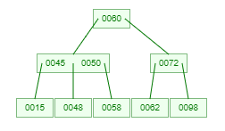
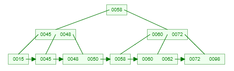

**问题1. 数据库为什么要设计索引？**

　　图书馆存了1000W本图书，要从中找到《架构师之路》，一本本查，要查到什么时候去？

　　于是，图书管理员设计了一套规则：

　　　　(1)一楼放历史类，二楼放文学类，三楼放IT类…

　　　　(2)IT类，又分软件类，硬件类…

　　　　(3)软件类，又按照书名音序排序…

　　以便快速找到一本书。

 

　　与之类比，数据库存储了1000W条数据，要从中找到name=”shenjian”的记录，一条条查，要查到什么时候去？

　　于是，要有**索引**，用于提升数据库的查找速度。

 

**问题2. 哈希(hash)比树(tree)更快，索引结构为什么要设计成树型？**

　　加速查找速度的数据结构，常见的有两类：

　　　　(1)**哈希**，例如HashMap，查询/插入/修改/删除的平均时间复杂度都是O(1)；

　　　　(2)**树**，例如平衡二叉搜索树，查询/插入/修改/删除的平均时间复杂度都是O(lg(n))；

 

　　可以看到，**不管是读请求，还是写请求**，哈希类型的索引，都要比树型的索引更快一些，那**为什么，索引结构要设计成树型**呢？

　　*画外音：80%的同学，面试都答不出来。*

 

　　索引设计成树形，和SQL的需求相关。

 

　　对于这样一个**单行查询**的SQL需求：

```
select * from t where name=”shenjian”;
```

　　确实是哈希索引更快，因为每次都只查询一条记录。

　　*画外音：所以，如果业务需求都是单行访问，例如passport，确实可以使用哈希索引。*

 

但是对于**排序查询**的SQL需求：

- 分组：group by
- 排序：order by
- 比较：<、>
- …

**哈希**型的索引，时间复杂度会退化为O(n)，而**树型**的“有序”特性，依然能够保持O(log(n)) 的高效率。

 

**任何脱离需求的设计都是耍流氓。**

 

多说一句，InnoDB并不支持哈希索引。

 

**问题3. 数据库索引为什么使用B+树？**

　　为了保持知识体系的完整性，简单介绍下几种树。

 

**第一种：二叉搜索树**

 

二叉搜索树，如上图，是最为大家所熟知的一种数据结构，就不展开介绍了，**它为什么不适合用作数据库索引？**

　　(1)当数据量大的时候，树的高度会比较高，数据量大的时候，查询会比较慢；

　　(2)每个节点只存储一个记录，可能导致一次查询有很多次磁盘IO；

　　*画外音：这个树经常出现在大学课本里，所以最为大家所熟知。*

 

**第二种：B树**

 

B树，如上图，它的特点是：

　　(1)不再是二叉搜索，而是m叉搜索；

　　(2)叶子节点，非叶子节点，都存储数据；

　　(3)中序遍历，可以获得所有节点；

　　*画外音，实在不想介绍这个特性：非根节点包含的关键字个数j满足，**(┌m/2┐)-1 <= j <= m-1**，节点分裂时要满足这个条件。*

 

　　B树被作为实现索引的数据结构被创造出来，是因为它能够完美的利用“局部性原理”。

 

**什么是局部性原理？**

局部性原理的逻辑是这样的：

　　(1)内存读写块，磁盘读写慢，而且慢很多；

　　(2)**磁盘预读**：磁盘读写并不是按需读取，而是按页预读，一次会读一页的数据，每次加载更多的数据，如果未来要读取的数据就在这一页中，可以避免未来的磁盘IO，提高效率；

　　*画外音：通常，一页数据是4K。*

　　(3)**局部性原理**：软件设计要尽量遵循“数据读取集中”与“使用到一个数据，大概率会使用其附近的数据”，这样磁盘预读能充分提高磁盘IO；

 

**B树为何适合做索引？**

　　(1)由于是m分叉的，高度能够大大降低；

　　(2)每个节点可以存储j个记录，如果将节点大小设置为页大小，例如4K，能够充分的利用预读的特性，极大减少磁盘IO；

 

**第三种：B+树**

 

B+树，如上图，仍是m叉搜索树，在B树的基础上，做了**一些改进**：

　　(1)非叶子节点不再存储数据，数据只存储在同一层的叶子节点上；

　　*画外音：B+树中根到每一个节点的路径长度一样，而B树不是这样。* 

 

　　(2)叶子之间，增加了链表，获取所有节点，不再需要中序遍历；

　　这些改进让B+树比B树有更优的特性：

　　　　(1)范围查找，定位min与max之后，中间叶子节点，就是结果集，不用中序回溯；

　　　　*画外音：范围查询在SQL中用得很多，这是B+树比B树最大的优势。*

 

　　　　(2)叶子节点存储实际记录行，记录行相对比较紧密的存储，适合大数据量磁盘存储；非叶子节点存储记录的PK，用于查询加速，适合内存存储；

 

　　　　(3)非叶子节点，不存储实际记录，而只存储记录的KEY的话，那么在相同内存的情况下，B+树能够存储更多索引；

 

最后，量化说下，**为什么m叉的B+树比二叉搜索树的高度大大大大降低？**

大概计算一下：

　　(1)局部性原理，将一个节点的大小设为一页，一页4K，假设一个KEY有8字节，一个节点可以存储500个KEY，即j=500

　　(2)m叉树，大概m/2<= j <=m，即可以差不多是1000叉树

　　(3)那么：

　　　　一层树：1个节点，1*500个KEY，大小4K

　　　　二层树：1000个节点，1000*500=50W个KEY，大小1000*4K=4M

　　　　三层树：1000*1000个节点，1000*1000*500=5亿个KEY，大小1000*1000*4K=4G

　　*画外音：额，帮忙看下有没有算错。*

 

　　可以看到，存储大量的数据（5亿），并不需要太高树的深度（高度3），索引也不是太占内存（4G）。

 

**总结**

- 数据库索引用于加速查询
- 虽然哈希索引是O(1)，树索引是O(log(n))，但SQL有很多“有序”需求，故数据库使用树型索引
- InnoDB不支持哈希索引
- **数据预读**的思路是：磁盘读写并不是按需读取，而是按页预读，一次会读一页的数据，每次加载更多的数据，以便未来减少磁盘IO
- **局部性原理**：软件设计要尽量遵循“数据读取集中”与“使用到一个数据，大概率会使用其附近的数据”，这样磁盘预读能充分提高磁盘IO
- 数据库的索引最常用B+树：

　　　　(1)很适合磁盘存储，能够充分利用局部性原理，磁盘预读；

　　　　(2)很低的树高度，能够存储大量数据；

　　　　(3)索引本身占用的内存很小；

　　　　(4)能够很好的支持单点查询，范围查询，有序性查询；


##为什么选择B+树作为数据库索引结构？

### 背景

首先，来谈谈B树。为什么要使用B树？我们需要明白以下两个事实：

【事实1】
不同容量的存储器，访问速度差异悬殊。以磁盘和内存为例，访问磁盘的时间大概是ms级的，访问内存的时间大概是ns级的。有个形象的比喻，若一次内存访问需要1秒，则一次外存访问需要1天。所以，**现在的存储系统，都是分级组织的。最常用的数据尽可能放在更高层、更小的存储器中，只有在当前层找不到，才向更低层、更大的存储器中寻找**。这也就解释了，**当处理大规模数据的时候（指无法将数据一次性存入内存），算法的实际运行时间，往往取决于数据在不同存储级别之间的IO次数**。因此，要想提升速度，**关键在于减少IO**。

【事实2】
磁盘读取数据是以**数据块**(**block**)（或者：页，page）为基本单位的，位于同一数据块中的所有数据都能被**一次性全部读取出来**。换句话说，从磁盘中读1B，与读1KB几乎一样快！因此，想要提升速度，应该利用外存**批量访问**的特点，在一些文章中，也称其为**磁盘预读**。系统之所以这么设计，是基于一个著名的**局部性原理**：

> 当一个数据被用到时，其附近的数据也通常会马上被使用，程序运行期间所需要的数据通常比较集中

### B树

假设有10亿条记录（1000*1000*1000），如果使用平衡二叉搜索树（Balanced Binary Search Tree, BBST），最坏的情况下，查找需要log(2, 10^9) = 30次 I/O 操作，且每次只能读出一个关键字（即如果这次读出来的关键字不是我要查找的，就要再进行一次I/O去读取数据）。如果换成B树，会是怎样的情况呢？

B 树是为了磁盘或其它辅助存储设备而设计的一种多叉平衡搜索树。**多级存储系统中使用B树，可针对外部查找，大大减少I/O次数**。通过B树，可充分利用外存对**批量访问**的高效支持，将此特点转化为优点。每下降一层，都以**超级结点**为单位（**超级结点就是指一个结点内包含多个关键字**），从磁盘中读入一组关键字。那么，具体多大为一组呢？

一个节点存放多少数据视磁盘的数据块大小而定，比如磁盘中1 block的大小有1024KB，假设每个关键字的大小为 4 Byte，则可设定每一组的大小m = 1024 KB / 4 Byte = 256。目前，多数数据库系统采用 m = 200~300。假设取m = 256，则B树存储1亿条数据的树的高度大概是 log(256, 10^9) = 4，也就是单次查询所需要进行的I/O次数不超过 4 次，由此大大减少了I/O次数。

一般来说，B树的根节点常驻于内存中，B树的查找过程是这样的：首先，由于一个节点内包含多个（比如，是256个）关键码，所以需要先顺序/二分来查找，如果找到则查找成功；如果失败，则根据相应的引用从磁盘中读入**下一层**的节点数据（这里就涉及到一次磁盘I/O），同样的在节点内顺序查找，如此往复进行...事实上，B树查找所消耗的时间很大一部分花在了I/O上，所以减少I/O次数是非常重要的。

#### B树的定义

B树就是平衡的多路搜索树，所谓的m阶B树，即m路平衡搜索树。根据维基百科的[定义](https://en.wikipedia.org/wiki/B-tree#Definition)，一棵m阶B树需满足以下要求：

1. 每个结点**至多**含有m个分支节点（m>=2）。
2. 除根结点之外的每个非叶结点，**至少**含有┌m/2┐个分支。
3. 若根结点不是叶子结点，则至少有2个孩子。
4. 一个含有k个孩子的非叶结点包含k-1个关键字。 （**每个结点内的关键字按升序排列**）
5. **所有的叶子结点都出现在同一层**。实际上这些结点并不存在，可以看作是外部结点。

根据节点的分支的上下限，也可以称其为(┌m/2┐, m)树。比如，阶数m=4时，这样的B树也可以称为(2,4)树。（事实上，(2,4)树是一棵比较特殊的B树，它和红黑树有着特别的渊源！后面谈及红黑树时会谈到。）

并且，**每个内部结点的关键字都作为其子树的分隔值**。比如，某结点含有2个关键字（假设为a1和a2），也就是说该结点含有3个子树。那么，最左子树的关键字均小于a1；中间子树的关键字介于a1~a2；最右子树的关键字均大于a2。

示例，一棵3阶的B树是这个样子：



#### B树的高度（了解）

假定一棵B树非空，具有n个关键字、高度为h（令根结点为第1层）、阶数为m，那么该B树的最大高度和最小高度分别是多少？

**最大高度**

当树的高度最大时，则每个结点含有的关键字数应该尽量少。根据定义，根结点至少有2个孩子（即1个关键字），除根结点之外的非叶结点至少有┌m/2┐个孩子（即┌m/2┐-1个关键字），为了描述方便，这里令p = ┌m/2┐。

```
第1层 1个结点  （含1个关键字）
第2层 2个结点  （含2*(p-1)个关键字）
第3层 2p个结点 （含2p*(p-1)^2个关键字）
...
第h层 2p^(h-2)个结点

故总的结点个数n
≥ 1+(p-1)*[2+2p+2p^2+...+2p^(h-2)]
≥ 2p^(h-1)-1
从而推导出 h ≤ log_p[(n+1)/2] + 1 （其中p为底数，p=┌m/2┐）
```

**最小高度**

当树的高度最低时，则每个结点的关键字都至多含有m个孩子（即m-1个关键字），则有

```
n ≤ (m-1)*(1 + m + m^2 +...+ m^(h-1)) = m^h - 1
从而推导出 h ≥ log_m(n+1)  （其中m为底数）
```

### B+树

#### B+树的定义

B+树是B树的一个变体，B+树与B树最大的区别在于：

1. **叶子结点包含全部关键字以及指向相应记录的指针，而且叶结点中的关键字按大小顺序排列，相邻叶结点用指针连接**。
2. **非叶结点仅存储其子树的最大（或最小）关键字，可以看成是索引**。

一棵3阶的B+树示例：（好好体会和B树的区别，两者的关键字是一样的）



问：**为什么说B+树比B树更适合实际应用中操作系统的文件索引和数据库索引？**

答：

1. B+树更适合外部存储。由于内结点不存放真正的数据（只是存放其子树的最大或最小的关键字，作为索引），一个结点可以存储更多的关键字，每个结点能索引的范围更大更精确，也意味着B+树单次磁盘IO的信息量大于B树，I/O的次数相对减少。
2. MySQL是一种关系型数据库，**区间访问**是常见的一种情况，B+树叶结点增加的链指针，加强了区间访问性，可使用在区间查询的场景；而使用B树则无法进行区间查找。