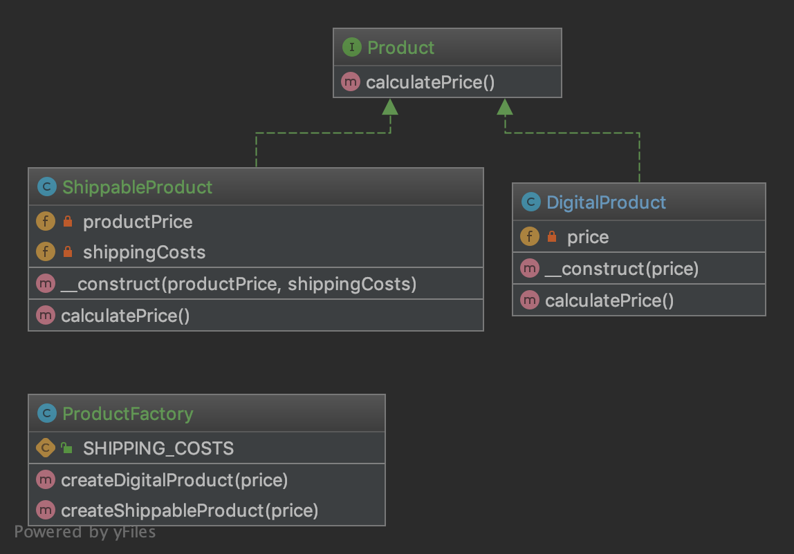
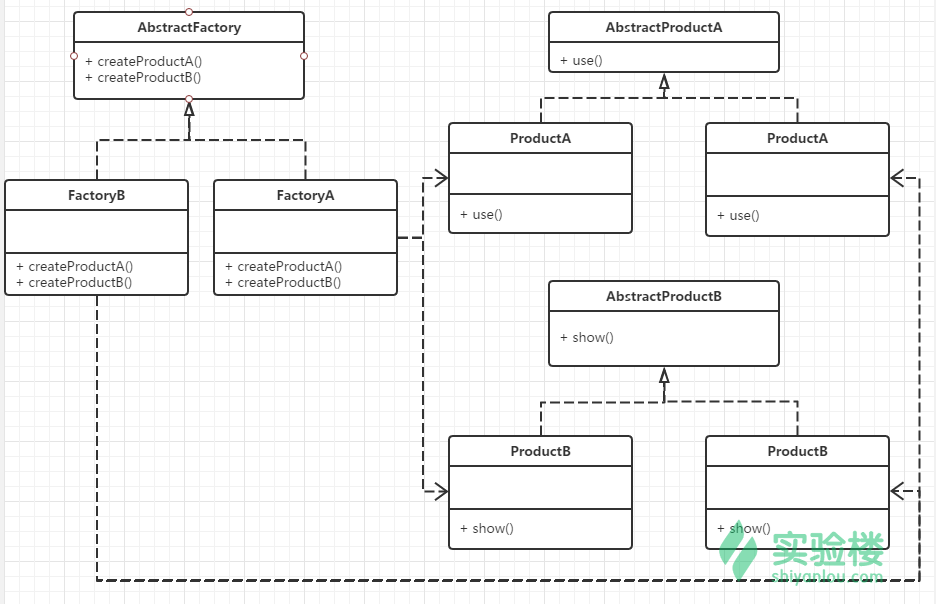

抽象工厂（AbstractFactory）模式的定义：是一种为访问类提供一个创建一组相关或相互依赖对象的接口，且访问类无须指定所要产品的具体类就能得到同族的不同等级的产品的模式结构。

抽象工厂模式是工厂方法模式的升级版本，工厂方法模式只生产一个等级的产品，而抽象工厂模式可生产多个等级的产品。

使用抽象工厂模式一般要满足以下条件。

- 系统中有多个产品族，每个具体工厂创建同一族但属于不同等级结构的产品。
- 系统一次只可能消费其中某一族产品，即同族的产品一起使用。


抽象工厂模式除了具有工厂方法模式的优点外，其他主要优点如下。

- 可以在类的内部对产品族中相关联的多等级产品共同管理，而不必专门引入多个新的类来进行管理。
- 当需要产品族时，抽象工厂可以保证客户端始终只使用同一个产品的产品组。
- 抽象工厂增强了程序的可扩展性，当增加一个新的产品族时，不需要修改原代码，满足开闭原则。


其缺点是：当产品族中需要增加一个新的产品时，所有的工厂类都需要进行修改。增加了系统的抽象性和理解难度。

模式的结构

抽象工厂模式的主要角色如下。

1. 抽象工厂（Abstract Factory）：提供了创建产品的接口，它包含多个创建产品的方法 newProduct()，可以创建多个不同等级的产品。
2. 具体工厂（Concrete Factory）：主要是实现抽象工厂中的多个抽象方法，完成具体产品的创建。
3. 抽象产品（Product）：定义了产品的规范，描述了产品的主要特性和功能，抽象工厂模式有多个抽象产品。
4. 具体产品（ConcreteProduct）：实现了抽象产品角色所定义的接口，由具体工厂来创建，它同具体工厂之间是多对一的关系。

**1.1.1. 目的**
在不指定具体类的情况下创建一系列相关或依赖对象。 通常创建的类都实现相同的接口。 抽象工厂的客户并不关心这些对象是如何创建的，它只是知道它们是如何一起运行的。

**1.1.2. UML 图**



## 1.1.3. 代码

你可以在 [GitHub](https://github.com/domnikl/DesignPatternsPHP/tree/master/Creational/AbstractFactory) 上找到这个代码。

Product.php

```php
<?php

namespace DesignPatterns\Creational\AbstractFactory;
interface Product
{
    public function calculatePrice(): int;
}
```

ShippableProduct.php

```php
<?php

namespace DesignPatterns\Creational\AbstractFactory;
class ShippableProduct implements Product
{
    /**
     * @var float
     */
    private $productPrice;
    /**
     * @var float
     */
    private $shippingCosts;
    public function __construct(int $productPrice, int $shippingCosts)
    {
        $this->productPrice = $productPrice;
        $this->shippingCosts = $shippingCosts;
    }
    public function calculatePrice(): int
    {
        return $this->productPrice + $this->shippingCosts;
    }
}
```

DigitalProduct.php

```php
<?php

namespace DesignPatterns\Creational\AbstractFactory;
class DigitalProduct implements Product
{
    /**
     * @var int
     */
    private $price;
    public function __construct(int $price)
    {
        $this->price = $price;
    }
    public function calculatePrice(): int
    {
        return $this->price;
    }
}
```

ProductFactory.php

```php
<?php

namespace DesignPatterns\Creational\AbstractFactory;
class ProductFactory
{
    const SHIPPING_COSTS = 50;
    public function createShippableProduct(int $price): Product
    {
        return new ShippableProduct($price, self::SHIPPING_COSTS);
    }
    public function createDigitalProduct(int $price): Product
    {
        return new DigitalProduct($price);
    }
}
```

## 1.1.4. Test

Tests/AbstractFactoryTest.php

```php
<?php

namespace DesignPatterns\Creational\AbstractFactory\Tests;
use DesignPatterns\Creational\AbstractFactory\DigitalProduct;
use DesignPatterns\Creational\AbstractFactory\ProductFactory;
use DesignPatterns\Creational\AbstractFactory\ShippableProduct;
use PHPUnit\Framework\TestCase;
class AbstractFactoryTest extends TestCase
{
    public function testCanCreateDigitalProduct()
    {
        $factory = new ProductFactory();
        $product = $factory->createDigitalProduct(150);
        $this->assertInstanceOf(DigitalProduct::class, $product);
    }
    public function testCanCreateShippableProduct()
    {
        $factory = new ProductFactory();
        $product = $factory->createShippableProduct(150);
        $this->assertInstanceOf(ShippableProduct::class, $product);
    }
    public function testCanCalculatePriceForDigitalProduct()
    {
        $factory = new ProductFactory();
        $product = $factory->createDigitalProduct(150);
        $this->assertEquals(150, $product->calculatePrice());
    }
    public function testCanCalculatePriceForShippableProduct()
    {
        $factory = new ProductFactory();
        $product = $factory->createShippableProduct(150);
        $this->assertEquals(200, $product->calculatePrice());
    }
}
```


## 抽象工厂模式

提供一个创建一系列相关或相互依赖对象的接口，而无须指定它们具体的类。抽象工厂模式又称为Kit模式，属于对象创建型模式。
此模式是对工厂方法模式的进一步扩展。在工厂方法模式中，一个具体的工厂负责生产一类具体的产品，即一对一的关系，但是，如果需要一个具体的工厂生产多种产品对象，那么就需要用到抽象工厂模式了。
为了便于理解此模式，这里介绍两个概念：
• 产品等级结构：产品等级结构即产品的继承结构，如一个抽象类是电视机，其子类有海尔电视机、海信电视机、TCL电视机，则抽象电视机与具体品牌的电视机之间构成了一个产品等级结构，抽象电视机是父类，而具体品牌的电视机是其子类。
• 产品族 ：在抽象工厂模式中，产品族是指由同一个工厂生产的，位于不同产品等级结构中的一组产品，如海尔电器工厂生产的海尔电视机、海尔电冰箱，海尔电视机位于电视机产品等级结构中，海尔电冰箱位于电冰箱产品等级结构中。
角色：
• 抽象工厂（AbstractFactory）：担任这个角色的是抽象工厂模式的核心，是与应用系统的商业逻辑无关的。
• 具体工厂（Factory）：这个角色直接在客户端的调用下创建产品的实例，这个角色含有选择合适的产品对象的逻辑，而这个逻辑是与应用系统商业逻辑紧密相关的。
• 抽象产品（AbstractProduct）：担任这个角色的类是抽象工厂模式所创建的对象的父类，或它们共同拥有的接口
• 具体产品（Product）：抽象工厂模式所创建的任何产品对象都是一个具体的产品类的实例。
UML类图：



此处输入图片的描述示例代码：

```php
<?php 
interface TV{
  public function open();
  public function use();
}
class HaierTv implements TV
{
  public function open()
  {
      echo "Open Haier TV <br>";
  }
  public function use()
  {
      echo "I'm watching TV <br>";
  }
}
interface PC{
  public function work();
  public function play();
}
class LenovoPc implements PC
{
  public function work()
  {
      echo "I'm working on a Lenovo computer <br>";
  }
  public function play()
  {
      echo "Lenovo computers can be used to play games <br>";
  }
}
abstract class Factory{
  abstract public static function createPc();
  abstract public static function createTv();
}
class ProductFactory extends Factory
{
  public static function createTV()
  {
      return new HaierTv();
  }
  public static function createPc()
  {
      return new LenovoPc();
  }
}
$newTv = ProductFactory::createTV();
$newTv->open();
$newTv->use();
$newPc = ProductFactory::createPc();
$newPc->work();
$newPc->play();
```

