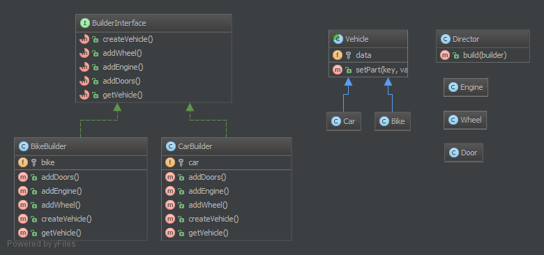

建造者（Builder）模式的定义：指将一个复杂对象的构造与它的表示分离，使同样的构建过程可以创建不同的表示，这样的[设计模式](http://c.biancheng.net/design_pattern/)被称为建造者模式。它是将一个复杂的对象分解为多个简单的对象，然后一步一步构建而成。它将变与不变相分离，即产品的组成部分是不变的，但每一部分是可以灵活选择的。

该模式的主要优点如下：

1. 封装性好，构建和表示分离。
2. 扩展性好，各个具体的建造者相互独立，有利于系统的解耦。
3. 客户端不必知道产品内部组成的细节，建造者可以对创建过程逐步细化，而不对其它模块产生任何影响，便于控制细节风险。


其缺点如下：

1. 产品的组成部分必须相同，这限制了其使用范围。
2. 如果产品的内部变化复杂，如果产品内部发生变化，则建造者也要同步修改，后期维护成本较大。


建造者（Builder）模式和工厂模式的关注点不同：建造者模式注重零部件的组装过程，而[工厂方法模式](http://c.biancheng.net/view/1348.html)更注重零部件的创建过程，但两者可以结合使用。

模式的结构

建造者（Builder）模式的主要角色如下。

1. 产品角色（Product）：它是包含多个组成部件的复杂对象，由具体建造者来创建其各个零部件。
2. 抽象建造者（Builder）：它是一个包含创建产品各个子部件的抽象方法的接口，通常还包含一个返回复杂产品的方法 getResult()。
3. 具体建造者(Concrete Builder）：实现 Builder 接口，完成复杂产品的各个部件的具体创建方法。
4. 指挥者（Director）：它调用建造者对象中的部件构造与装配方法完成复杂对象的创建，在指挥者中不涉及具体产品的信息。

**1.2.1. 目的**
建造者是创建一个复杂对象的一部分接口。

有时候，如果建造者对他所创建的东西拥有较好的知识储备，这个接口就可能成为一个有默认方法的抽象类（又称为适配器）。

如果对象有复杂的继承树，那么对于建造者来说，有一个复杂继承树也是符合逻辑的。

注意：建造者通常有一个「流式接口」，例如 PHPUnit 模拟生成器。

**1.2.2. 例子**
PHPUnit: 模拟生成器
1.2.3. UML Diagram



## 1.2.4. 代码

你也可以在 [GitHub](https://github.com/domnikl/DesignPatternsPHP/tree/master/Creational/Builder) 上找到这个代码。

Director.php

```php
<?php

namespace DesignPatterns\Creational\Builder;

use DesignPatterns\Creational\Builder\Parts\Vehicle;

/**
 * Director 类是建造者模式的一部分。 它可以实现建造者模式的接口
 * 并在构建器的帮助下构建一个复杂的对象
 *
 * 您也可以注入许多构建器而不是构建更复杂的对象
 */
class Director
{
    public function build(BuilderInterface $builder): Vehicle
    {
        $builder->createVehicle();
        $builder->addDoors();
        $builder->addEngine();
        $builder->addWheel();

        return $builder->getVehicle();
    }
}
```

BuilderInterface.php

```php
<?php

namespace DesignPatterns\Creational\Builder;

use DesignPatterns\Creational\Builder\Parts\Vehicle;

interface BuilderInterface
{
    public function createVehicle();

    public function addWheel();
    
    public function addEngine();
    
    public function addDoors();
    
    public function getVehicle(): Vehicle;

}
```


TruckBuilder.php

```php
<?php

namespace DesignPatterns\Creational\Builder;

use DesignPatterns\Creational\Builder\Parts\Vehicle;

class TruckBuilder implements BuilderInterface
{
    /**
    * @var Parts\Truck
    */
    private $truck;

    public function addDoors()
    {
        $this->truck->setPart('rightDoor', new Parts\Door());
        $this->truck->setPart('leftDoor', new Parts\Door());
    }
    
    public function addEngine()
    {
        $this->truck->setPart('truckEngine', new Parts\Engine());
    }
    
    public function addWheel()
    {
        $this->truck->setPart('wheel1', new Parts\Wheel());
        $this->truck->setPart('wheel2', new Parts\Wheel());
        $this->truck->setPart('wheel3', new Parts\Wheel());
        $this->truck->setPart('wheel4', new Parts\Wheel());
        $this->truck->setPart('wheel5', new Parts\Wheel());
        $this->truck->setPart('wheel6', new Parts\Wheel());
    }
    
    public function createVehicle()
    {
        $this->truck = new Parts\Truck();
    }
    
    public function getVehicle(): Vehicle
    {
        return $this->truck;
    }

}
```


CarBuilder.php

```php
<?php

namespace DesignPatterns\Creational\Builder;

use DesignPatterns\Creational\Builder\Parts\Vehicle;

class CarBuilder implements BuilderInterface
{
    /**
    * @var Parts\Car
    */
    private $car;

    public function addDoors()
    {
        $this->car->setPart('rightDoor', new Parts\Door());
        $this->car->setPart('leftDoor', new Parts\Door());
        $this->car->setPart('trunkLid', new Parts\Door());
    }
    
    public function addEngine()
    {
        $this->car->setPart('engine', new Parts\Engine());
    }
    
    public function addWheel()
    {
        $this->car->setPart('wheelLF', new Parts\Wheel());
        $this->car->setPart('wheelRF', new Parts\Wheel());
        $this->car->setPart('wheelLR', new Parts\Wheel());
        $this->car->setPart('wheelRR', new Parts\Wheel());
    }
    
    public function createVehicle()
    {
        $this->car = new Parts\Car();
    }
    
    public function getVehicle(): Vehicle
    {
        return $this->car;
    }

}
```


Parts/Vehicle.php

```php
<?php

namespace DesignPatterns\Creational\Builder\Parts;

abstract class Vehicle
{
    /**
    * @var object[]
    */
    private $data = [];

    /**
    * @param string $key
    * @param object $value
    */
    public function setPart($key, $value)
    {
        $this->data[$key] = $value;
    }

}
```


Parts/Truck.php

```php
<?php

namespace DesignPatterns\Creational\Builder\Parts;

class Truck extends Vehicle
{
}
```


Parts/Car.php

```php
<?php

namespace DesignPatterns\Creational\Builder\Parts;

class Car extends Vehicle
{
}
```


Parts/Engine.php

```php
<?php

namespace DesignPatterns\Creational\Builder\Parts;

class Engine
{
}
```


Parts/Wheel.php

```php
<?php

namespace DesignPatterns\Creational\Builder\Parts;

class Wheel
{
}
```


Parts/Door.php

```php
<?php

namespace DesignPatterns\Creational\Builder\Parts;

class Door
{
}
```


**1.2.5. 测试**
Tests/DirectorTest.php

```php
<?php

namespace DesignPatterns\Creational\Builder\Tests;

use DesignPatterns\Creational\Builder\Parts\Car;
use DesignPatterns\Creational\Builder\Parts\Truck;
use DesignPatterns\Creational\Builder\TruckBuilder;
use DesignPatterns\Creational\Builder\CarBuilder;
use DesignPatterns\Creational\Builder\Director;
use PHPUnit\Framework\TestCase;

class DirectorTest extends TestCase
{
    public function testCanBuildTruck()
    {
        $truckBuilder = new TruckBuilder();
        $newVehicle = (new Director())->build($truckBuilder);

        $this->assertInstanceOf(Truck::class, $newVehicle);
    }
    
    public function testCanBuildCar()
    {
        $carBuilder = new CarBuilder();
        $newVehicle = (new Director())->build($carBuilder);
    
        $this->assertInstanceOf(Car::class, $newVehicle);
    }

}
```

