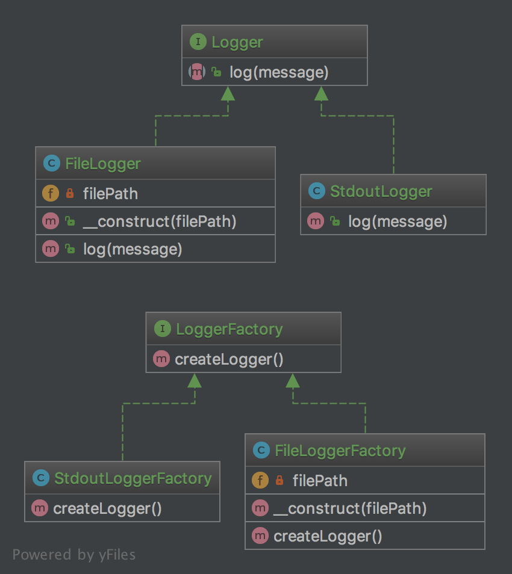

**1.3.1. 目的**
对比简单工厂模式的优点是，您可以将其子类用不同的方法来创建一个对象。

举一个简单的例子，这个抽象类可能只是一个接口。

这种模式是「真正」的设计模式， 因为他实现了 S.O.L.I.D 原则中「D」的 「依赖倒置」。

这意味着工厂方法模式取决于抽象类，而不是具体的类。 这是与简单工厂模式和静态工厂模式相比的优势。

**1.3.2. UML 图**



1.3.3. 代码
你可以在  [GitHub](https://github.com/domnikl/DesignPatternsPHP/tree/master/Creational/FactoryMethod) 查看这段代码

Logger.php

```php
<?php
namespace DesignPatterns\Creational\FactoryMethod;
interface Logger
{
    public function log(string $message);
}
```


StdoutLogger.php

```php
<?php
namespace DesignPatterns\Creational\FactoryMethod;
class StdoutLogger implements Logger
{
    public function log(string $message)
    {
        echo $message;
    }
}
```


FileLogger.php

```php
<?php
namespace DesignPatterns\Creational\FactoryMethod;
class FileLogger implements Logger
{
    /**
     * @var string
     */
    private $filePath;
    public function __construct(string $filePath)
    {
        $this->filePath = $filePath;
    }
    public function log(string $message)
    {
        file_put_contents($this->filePath, $message . PHP_EOL, FILE_APPEND);
    }
}
```


LoggerFactory.php

```php
<?php
namespace DesignPatterns\Creational\FactoryMethod;
interface LoggerFactory
{
    public function createLogger(): Logger;
}
```


StdoutLoggerFactory.php

```php
<?php
namespace DesignPatterns\Creational\FactoryMethod;
class StdoutLoggerFactory implements LoggerFactory
{
    public function createLogger(): Logger
    {
        return new StdoutLogger();
    }
}
```


FileLoggerFactory.php

```php
<?php
namespace DesignPatterns\Creational\FactoryMethod;
class FileLoggerFactory implements LoggerFactory
{
    /**
     * @var string
     */
    private $filePath;
    public function __construct(string $filePath)
    {
        $this->filePath = $filePath;
    }
    public function createLogger(): Logger
    {
        return new FileLogger($this->filePath);
    }
}
```


**1.3.4. 测试**
Tests/FactoryMethodTest.php

```php
<?php
namespace DesignPatterns\Creational\FactoryMethod\Tests;
use DesignPatterns\Creational\FactoryMethod\FileLogger;
use DesignPatterns\Creational\FactoryMethod\FileLoggerFactory;
use DesignPatterns\Creational\FactoryMethod\StdoutLogger;
use DesignPatterns\Creational\FactoryMethod\StdoutLoggerFactory;
use PHPUnit\Framework\TestCase;
class FactoryMethodTest extends TestCase
{
    public function testCanCreateStdoutLogging()
    {
        $loggerFactory = new StdoutLoggerFactory();
        $logger = $loggerFactory->createLogger();
        $this->assertInstanceOf(StdoutLogger::class, $logger);
    }
    public function testCanCreateFileLogging()
    {
        $loggerFactory = new FileLoggerFactory(sys_get_temp_dir());
        $logger = $loggerFactory->createLogger();
        $this->assertInstanceOf(FileLogger::class, $logger);
    }
}
```


## 工厂方法模式

此模式中，通过定义一个抽象的核心工厂类，并定义创建产品对象的接口，创建具体产品实例的工作延迟到其工厂子类去完成。这样做的好处是核心类只关注工厂类的接口定义，而具体的产品实例交给具体的工厂子类去创建。当系统需要新增一个产品是，无需修改现有系统代码，只需要添加一个具体产品类和其对应的工厂子类，是系统的扩展性变得很好，符合面向对象编程的开闭原则;
角色：
• Product：抽象产品类
• ConcreteProduct：具体产品类
• Factory：抽象工厂类
• ConcreteFactory：具体工厂类
UML类图：


此处输入图片的描述示例代码：

```php
<?php 
interface Animal{
  public function run();
  public function say();
}
class Cat implements Animal
{
  public function run(){
      echo "I ran slowly <br>";
  }
  public function say(){
      echo "I am Cat class <br>";
  }
}
class Dog implements Animal
{
  public function run(){
      echo "I'm running fast <br>";
  }
  public function say(){
      echo "I am Dog class <br>";
  }
}
abstract class Factory{
  abstract static function createAnimal();
}
class CatFactory extends Factory
{
  public static function createAnimal()
  {
      return new Cat();
  }
}
class DogFactory extends Factory
{
  public static function createAnimal()
  {
      return new Dog();
  }
}
$cat = CatFactory::createAnimal();
$cat->say();
$cat->run();
$dog = DogFactory::createAnimal();
$dog->say();
$dog->run();
```

工厂方法模式是简单工厂模式的进一步抽象和推广。由于使用了面向对象的多态性，工厂方法模式保持了简单工厂模式的优点，而且克服了它的缺点。在工厂方法模式中，核心的工厂类不再负责所有产品的创建，而是将具体创建工作交给子类去做。这个核心类仅仅负责给出具体工厂必须实现的接口，而不负责产品类被实例化这种细节，这使得工厂方法模式可以允许系统在不修改工厂角色的情况下引进新产品。