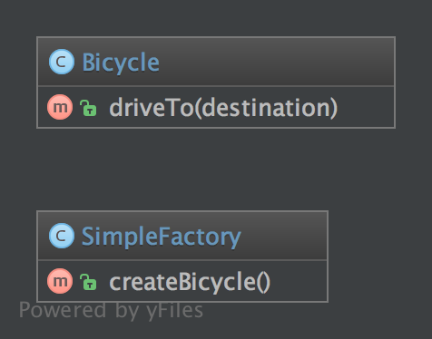
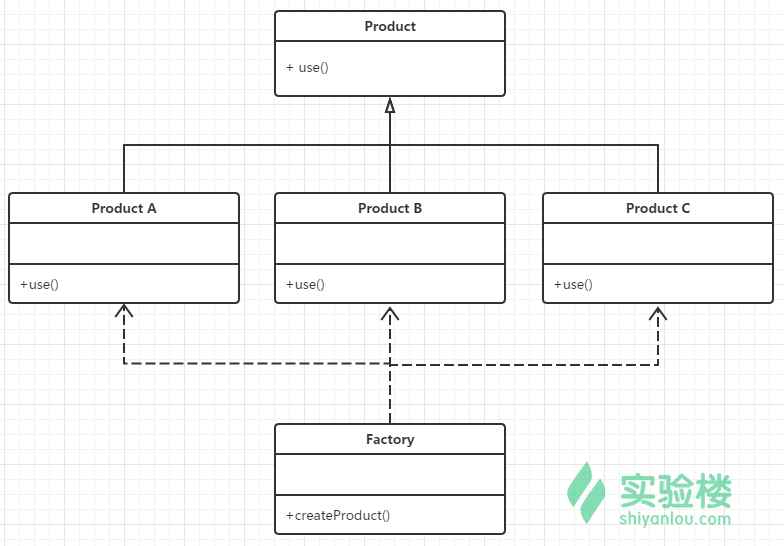

**1.7.1. 目的**
简单工厂模式是一个精简版的工厂模式。

它与静态工厂模式最大的区别是它不是『静态』的。因为非静态，所以你可以拥有多个不同参数的工厂，你可以为其创建子类。甚至可以模拟（Mock）他，这对编写可测试的代码来讲至关重要。 这也是它比静态工厂模式受欢迎的原因！

**1.7.2. UML 图**



## 1.7.3. 代码

你可以在 [GitHub](https://github.com/domnikl/DesignPatternsPHP/tree/master/Creational/SimpleFactory) 查看这段代码。

SimpleFactory.php

```php
<?php

namespace DesignPatterns\Creational\SimpleFactory;

class SimpleFactory
{
    public function createBicycle(): Bicycle
    {
        return new Bicycle();
    }
}
```


Bicycle.php

```php
<?php

namespace DesignPatterns\Creational\SimpleFactory;

class Bicycle
{
    public function driveTo(string $destination)
    {
    }
}
```


**1.7.4. 用法**

```php
$factory = new SimpleFactory();
 $bicycle = $factory->createBicycle();
 $bicycle->driveTo('Paris');
```

**1.7.5. 测试**
Tests/SimpleFactoryTest.php

```php
<?php

namespace DesignPatterns\Creational\SimpleFactory\Tests;

use DesignPatterns\Creational\SimpleFactory\Bicycle;
use DesignPatterns\Creational\SimpleFactory\SimpleFactory;
use PHPUnit\Framework\TestCase;

class SimpleFactoryTest extends TestCase
{
    public function testCanCreateBicycle()
    {
        $bicycle = (new SimpleFactory())->createBicycle();
        $this->assertInstanceOf(Bicycle::class, $bicycle);
    }
}
```


工厂模式具体可分为三类模式：简单工厂模式，工厂方法模式，抽象工厂模式；

**使用场景**：当程序编写时，并不能确定在生成对象的时候其确切的对象类型，只有程序运行的时候才能确定。
另外一个方式判断某种场景是否适合使用工厂模式，比如有一个抽象的基类，它的几个不同的派生子类需要立即被创建。这种特殊的设计结构很适合使用工厂模式，因为我们一旦创建了一个对象，对这个对象的使用就会与期望的保持一致，而不用关心他的确切类型。

工厂模式通常通过一个静态方法来实现，这个方法至少接收一个参数，用于表示将要创建的对象的类型。


工厂模式，就是负责生成其他对象的类或方法。


## 1 类实现


比如，我们有一些类，它们都继承自交通工具类：

```
<?php
interface Vehicle
{
    public function drive();
}
class Car implements Vehicle
{
    public function drive()
    {
        echo '汽车靠四个轮子滚动行走。';
    }
}
class Ship implements Vehicle
{
    public function drive()
    {
        echo '轮船靠螺旋桨划水前进。';
    }
}
class Aircraft implements Vehicle
{
    public function drive()
    {
        echo '飞机靠螺旋桨和机翼的升力飞行。';
    }
}
//再创建一个工厂类，专门用作类的创建，：
class VehicleFactory
{
    public static function build($className = null)
    {
        $className = ucfirst($className);
        if ($className && class_exists($className)) {
            return new $className();
        }
        return null;
    }
}
//工厂类用了一个静态方法来创建其他类，在客户端中就可以这样使用：
VehicleFactory::build('Car')->drive();
VehicleFactory::build('Ship')->drive();
VehicleFactory::build('Aircraft')->drive();
//省去了每次都要new类的工作。​
```

## 2 解决

参考资料：
\1. [Design Patterns: The Simple Factory Pattern](https://code.tutsplus.com/tutorials/design-patterns-the-simple-factory-pattern--cms-22345)
\2. [Understanding the Factory Method Design Pattern](https://www.sitepoint.com/understanding-the-factory-method-design-pattern/)
\3. [设计模式：简单工厂、工厂方法、抽象工厂之小结与区别](http://zyjustin9.iteye.com/blog/2094960)


## 简单工厂模式


又称为静态工厂方法(Static Factory Method)模式，它属于类创建型模式。在简单工厂模式中，可以根据参数的不同返回不同类的实例。简单工厂模式专门定义一个类来负责创建其他类的实例，被创建的实例通常都具有共同的父类。
角色：
• Factory类：负责创建具体产品的实例
• Product类：抽象产品类，定义产品子类的公共接口
• ConcreteProduct 类：具体产品类，实现Product父类的接口功能，也可添加自定义的功能

UML类图：



此处输入图片的描述示例代码：

```php
<?php 
//简单工厂模式
class Cat
{
  function __construct()
  {
      echo "I am Cat class <br>";
  }
}
class Dog
{
  function __construct()
  {
      echo "I am Dog class <br>";
  }
}
class Factory
{
  public static function CreateAnimal($name){
      if ($name == 'cat') {
          return new Cat();
      } elseif ($name == 'dog') {
          return new Dog();
      }
  }
}
$cat = Factory::CreateAnimal('cat');
$dog = Factory::CreateAnimal('dog');
```

简单工厂模式最大的优点在于实现对象的创建和对象的使用分离，将对象的创建交给专门的工厂类负责，但是其最大的缺点在于工厂类不够灵活，增加新的具体产品需要修改工厂类的判断逻辑代码，而且产品较多时，工厂方法代码将会非常复杂。