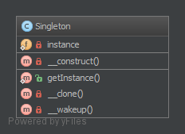
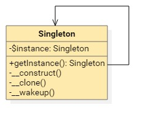
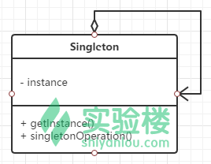

单例（Singleton）模式的定义：指一个类只有一个实例，且该类能自行创建这个实例的一种模式。

单例模式有 3 个特点：

1. 单例类只有一个实例对象；
2. 该单例对象必须由单例类自行创建；
3. 单例类对外提供一个访问该单例的全局访问点。

##### 单例模式的优点和缺点

单例模式的优点：

- 单例模式可以保证内存里只有一个实例，减少了内存的开销。
- 可以避免对资源的多重占用。
- 单例模式设置全局访问点，可以优化和共享资源的访问。


单例模式的缺点：

- 单例模式一般没有接口，扩展困难。如果要扩展，则除了修改原来的代码，没有第二种途径，违背开闭原则。
- 在并发测试中，单例模式不利于代码调试。在调试过程中，如果单例中的代码没有执行完，也不能模拟生成一个新的对象。
- 单例模式的功能代码通常写在一个类中，如果功能设计不合理，则很容易违背单一职责原则。


单例模式被公认为是 **反面模式**，为了获得更好的可测试性和可维护性，请使用『**依赖注入模式**』。

**1.8.1. 目的**
在应用程序调用的时候，只能获得一个对象实例。

**1.8.2. 例子**
数据库连接
日志 (多种不同用途的日志也可能会成为多例模式)
在应用中锁定文件 (系统中只存在一个 ...)
**1.8.3. UML 类图**



## 1.8.4. 代码部分

你也可以在 [GitHub](https://github.com/domnikl/DesignPatternsPHP/tree/master/Creational/Singleton) 中查看

Singleton.php

```php
<?php

namespace DesignPatterns\Creational\Singleton;

final class Singleton
{
    /**
    * @var Singleton
    */
    private static $instance;

    /**
    * 通过懒加载获得实例（在第一次使用的时候创建）
    */
    public static function getInstance(): Singleton
    {
        if (null === static::$instance) {
            static::$instance = new static()	;
        }
    
        return static::$instance;
    }
    
    /**
    * 不允许从外部调用以防止创建多个实例
    * 要使用单例，必须通过 Singleton::getInstance() 方法获取实例
    */
    private function __construct()
    {
    }
    
    /**
    * 防止实例被克隆（这会创建实例的副本）
    */
    private function __clone()
    {
    }
    
    /**
    * 防止反序列化（这将创建它的副本）
    */
    private function __wakeup()
    {
    }

}
```


**1.8.5. 测试**
Tests/SingletonTest.php

```php
<?php

namespace DesignPatterns\Creational\Singleton\Tests;

use DesignPatterns\Creational\Singleton\Singleton;
use PHPUnit\Framework\TestCase;

class SingletonTest extends TestCase
{
    public function testUniqueness()
    {
        $firstCall = Singleton::getInstance();
        $secondCall = Singleton::getInstance();

        $this->assertInstanceOf(Singleton::class, $firstCall);
        $this->assertSame($firstCall, $secondCall);
    }

}
```


单例模式，正如其名，允许我们创建一个而且只能创建一个对象的类。
这在整个系统的协同工作中非常有用，特别明确了只需一个类对象的时候。
那么，为什么要实现这么奇怪的类，只实例化一次？
在很多场景下会用到，如：配置类、Session类、Database类、Cache类、File类等等。
这些只需要实例化一次，就可以在应用全局中使用。
本文我们以数据库类为例。


## 1 问题


如果没有使用单例模式，会有什么样的问题？
如下是一个简单的数据库连接类，它没有使用单例模式。
```php
class Database
{
public $db = null;
public function __construct($config = array())
{
$dsn = sprintf('mysql:host=%s;dbname=%s', $config['db_host'], $config['db_name']);
$this->db = new PDO($dsn, $config['db_user'], $config['db_pass']);
}
}然后创建3个对象：
$config = array(
'db_name' => 'test',
'db_host' => 'localhost',
'db_user' => 'root',
'db_pass' => 'root'
);

$db1 = new Database($config);
var_dump($db1);
$db2 = new Database($config);
var_dump($db2);
$db3 = new Database($config);
var_dump($db3);
```
这种情况下，每当我们创建一个这个类的实例，就会新增一个到数据库的连接。
开发者每在一个地方实例化一次这个类，就会在那里多一个数据库连接。
不知不觉中，开发者就犯了个错误，给数据库和服务器性能带来巨大的影响。
上面的代码输入如下：
**object**(D*atabase*)[*1*]
*public* 'db' => **object**(*PDO*)[*2*]
**object**(D*atabase*)[*3*]
*public* 'db' => **object**(*PDO*)[*4*]
**object**(D*atabase*)[*5*]
*public* 'db' => **object**(*PDO*)[*6*]

每个对象都分配一个新的资源ID，都是新的引用，它们占用3个的内存空间。
如果有100个对象创建，就会占用内存中100块不同的空间，而其余99块并非是必须的。


## 2 解决


开发者怎样使用基础框架，如何数据库连接，这很难控制。
如果在代码评审阶段再找出问题，又会浪费大量的人力物力。
要解决这样的问题，我们可以控制住基类，在源头上限制这个类，使其无法生成多个对象，如果已经生成过，直接返回。
于是，我们的目标就是，控制数据库类，使其生成一次而且只能生成一次对象。
如下就是单例模式连接数据库代码：
```php
class Database
{
// 声明$instance为私有静态类型，用于保存当前类实例化后的对象
private static $instance = null;
// 数据库连接句柄
private $db = null;

// 构造方法声明为私有方法，禁止外部程序使用new实例化，只能在内部new
private function __construct($config = array())
{
$dsn = sprintf('mysql:host=%s;dbname=%s', $config['db_host'], $config['db_name']);
$this->db = new PDO($dsn, $config['db_user'], $config['db_pass']);
}

// 这是获取当前类对象的唯一方式
public static function getInstance($config = array())
{
// 检查对象是否已经存在，不存在则实例化后保存到$instance属性
if(self::$instance == null) {
self::$instance = new self($config);
}
return self::$instance;
}

// 获取数据库句柄方法
public function db()
{
return $this->db;
}

// 声明成私有方法，禁止克隆对象
private function __clone(){}
// 声明成私有方法，禁止重建对象
private function __wakeup(){}
}
// 再通过getInstance()方法使用类对象，
$config = array(
'db_name' => 'test',
'db_host' => 'localhost',
'db_user' => 'root',
'db_pass' => 'root'
);

$db1 = Database::getInstance($config);
var_dump($db1);
$db2 = Database::getInstance($config);
var_dump($db2);
$db3 = Database::getInstance($config);
var_dump($db3);输出信息如下：
object(Database)[1]
private 'db' => object(PDO)[2]
object(Database)[1]
private 'db' => object(PDO)[2]
object(Database)[1]
private 'db' => object(PDO)[2]
```
对比两个输出可以看出，单例模式中，不同对象获得的资源ID是一样的。
也就是说，虽然我们用getInstance()获取Database类对象3次，其实引用的是一个内存空间，PDO也只连接了数据库一次。
以上的例子是数据库连接类，要使用数据库，在应用这样获得连接句柄：

```
$db = database::getInstance($config)->db();
```

如果是其他类，则按需要修改数据库相关的代码，单例实现部分保留。


## 3 特点

单例模式的特点是4私1公：一个私有静态属性，构造方法私有，克隆方法私有，重建方法私有，一个公共静态方法。
其他方法根据需要增加。
最基础的单例模式代码如下：

```php
class Singleton
{
    private static $instance = null;

    public static function getInstance()
    {
    if(self::$instance == null) {
    self::$instance = new self();
    }
    return self::$instance;
    }

    private function __construct(){}
    private function __clone(){}
    private function __wakeup(){}
}
```


$instance用以保存类的实例化，getInstance()方法提供给外部本类的实例化对象：
对应的UML图如下，



单例模式在应用请求的整个生命周期中都有效，这点类似全局变量，会降低程序的可测试性。
大部分情况下，也可以用依赖注入来代替单例模式，避免在应用中引入不必要的耦合。
所以，对于仅需生成一个对象的类，首先考虑用依赖注入方式，其次考虑用单例模式来实现。

参考资料：
\1. [Design Patterns: The Singleton Pattern](https://code.tutsplus.com/tutorials/design-patterns-the-singleton-pattern--cms-23073)
\2. [Design Patterns - PHP The Right Way](http://www.phptherightway.com/pages/Design-Patterns.html)
\3. [Five common PHP design patterns](https://www.ibm.com/developerworks/library/os-php-designptrns/)
\4. [Php中的单例模式面面观 / 编写一个单例的基类](http://blog.gaoyuan.xyz/2014/04/26/singleton-pattern-in-php/)
\5. [PHP单例模式详细介绍](http://www.manongjc.com/article/557.html)

依赖注入和控制反转（IOC ）
IoC - Inversion **of** Control 控制反转
DI - Dependency Injection 依赖注入
依赖注入和控制反转说的实际上是同一个东西，它们是一种设计模式，这种设计模式用来减少程序间的耦合


单例模式，也叫单子模式，是一种常用的[软件设计模式](https://link.jianshu.com/?t=https://zh.wikipedia.org/wiki/软件设计模式)。在应用这个模式时，单例对象的[类](https://link.jianshu.com/?t=https://zh.wikipedia.org/wiki/类)必须保证只有一个实例存在。许多时候整个系统只需要拥有一个的全局[对象](https://link.jianshu.com/?t=https://zh.wikipedia.org/wiki/对象)，这样有利于我们协调系统整体的行为。
实现单例模式的思路是：一个类能返回对象一个引用(永远是同一个)和一个获得该实例的方法（必须是静态方法，通常使用getInstance这个名称）；当我们调用这个方法时，如果类持有的引用不为空就返回这个引用，如果类保持的引用为空就创建该类的实例并将实例的引用赋予该类保持的引用；同时我们还将该类的[构造函数](https://link.jianshu.com/?t=https://zh.wikipedia.org/wiki/构造函数)定义为私有方法，这样其他处的代码就无法通过调用该类的构造函数来实例化该类的对象，只有通过该类提供的静态方法来得到该类的唯一实例。
---维基百科
单例模式的要点有：某个类只能有一个实例；它必须自行创建本身的实例；它必须自行向整个系统提供这个实例。单例模式是一种对象创建型模式。
角色：
• Singleton：单例类
UML 类图：



此处输入图片的描述示例代码：

```php
<?php 
class Singleton
{
 private static $instance;
 //私有构造方法，禁止使用new创建对象
 private function __construct(){}
 public static function getInstance(){
 if (!isset(self::$instance)) {
 self::$instance = new self;
 }
 return self::$instance;
 }
 //将克隆方法设为私有，禁止克隆对象
 private function __clone(){}
 public function say()
 {
 echo "这是用单例模式创建对象实例 <br>";
 }
 public function operation()
 {
 echo "这里可以添加其他方法和操作 <br>";
 }
}
// $shiyanlou = new Singleton();
$shiyanlou = Singleton::getInstance();
$shiyanlou->say();
$shiyanlou->operation();
$newShiyanlou = Singleton::getInstance();
var_dump($shiyanlou === $newShiyanlou);
```


### 单例模式如何在多线程下保持单例

默认上边给出的单例代码使用的是懒汉模式，只有在获取的时候才会去实例化单例类，另外一种实现方式则为饿汉模式