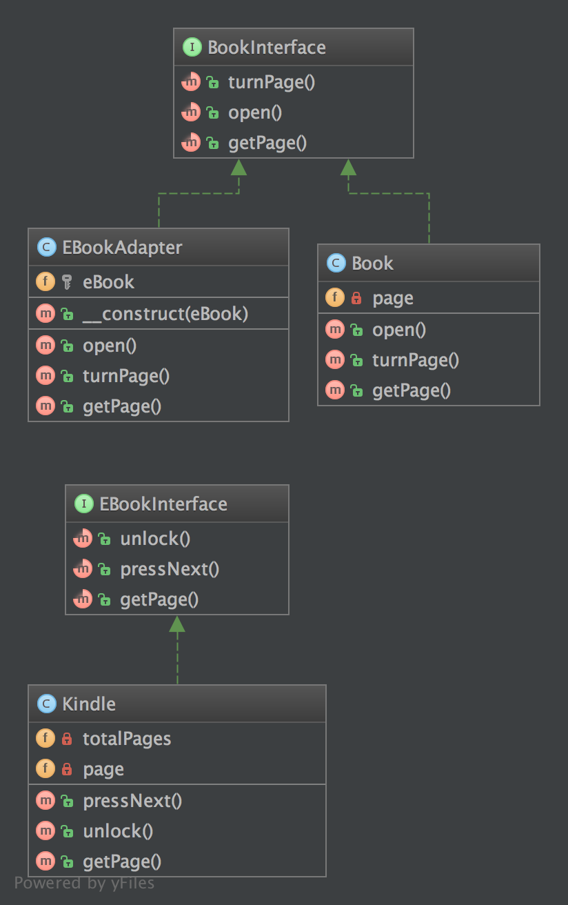
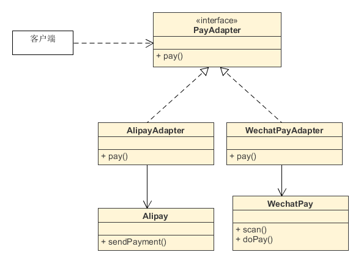

**2.1.1. 目的**
将一个类的接口转换成可应用的兼容接口。适配器使原本由于接口不兼容而不能一起工作的那些类可以一起工作。

**2.1.2. 例子**
客户端数据库适配器
使用多个不同的网络服务和适配器来规范数据使得出结果是相同的
**2.1.3. UML 图**



## 2.1.4. 代码

你也可以在 [GitHub](https://github.com/domnikl/DesignPatternsPHP/tree/master/Structural/Adapter) 上查看代码

BookInterface.php
```php
<?php

namespace DesignPatterns\Structural\Adapter;

interface BookInterface
{
    public function turnPage();

    public function open();
    
    public function getPage(): int;
}
```
Book.php
```php
<?php

namespace DesignPatterns\Structural\Adapter;

class Book implements BookInterface
{
    /**
    * @var int
    */
    private $page;

    public function open()
    {
        $this->page = 1;
    }
    
    public function turnPage()
    {
        $this->page++;
    }
    
    public function getPage(): int
    {
        return $this->page;
    }
}
```
EBookAdapter.php
```php
<?php

namespace DesignPatterns\Structural\Adapter;

/**
* 这里是一个适配器. 注意他实现了 BookInterface,
* 因此你不必去更改客户端代码当使用 Book
*/
class EBookAdapter implements BookInterface
{
    /**
    * @var EBookInterface
      */
      protected $eBook;

    /**
    * @param EBookInterface $eBook
      */
      public function __construct(EBookInterface $eBook)
      {
        $this->eBook = $eBook;
      }

    /**
    * 这个类使接口进行适当的转换.
      */
      public function open()
      {
        $this->eBook->unlock();
      }

    public function turnPage()
    {
        $this->eBook->pressNext();
    }

    /**
    * 注意这里适配器的行为： EBookInterface::getPage() 将返回两个整型，除了 BookInterface
    * 仅支持获得当前页，所以我们这里适配这个行为
      *
    * @return int
      */
      public function getPage(): int
      {
        return $this->eBook->getPage()[0];
      }
}
```
EBookInterface.php
```php
<?php

namespace DesignPatterns\Structural\Adapter;

interface EBookInterface
{
    public function unlock();

    public function pressNext();
    
    /**
    * 返回当前页和总页数，像 [10, 100] 是总页数100中的第10页。
    *
    * @return int[]
    */
    public function getPage(): array;
}
```
Kindle.php
```php
<?php

namespace DesignPatterns\Structural\Adapter;

/**
* 这里是适配过的类. 在生产代码中, 这可能是来自另一个包的类，一些供应商提供的代码。
* 注意它使用了另一种命名方案并用另一种方式实现了类似的操作
*/
class Kindle implements EBookInterface
{
    /**
    * @var int
      */
      private $page = 1;

    /**
    * @var int
      */
      private $totalPages = 100;

    public function pressNext()
    {
        $this->page++;
    }

    public function unlock()
    {
    }

    /**
    * 返回当前页和总页数，像 [10, 100] 是总页数100中的第10页。
      *
    * @return int[]
      */
      public function getPage(): array
      {
        return [$this->page, $this->totalPages];
      }
}
```

2.1.5. 测试
Tests/AdapterTest.php

```php
<?php

namespace DesignPatterns\Structural\Adapter\Tests;

use DesignPatterns\Structural\Adapter\Book;
use DesignPatterns\Structural\Adapter\EBookAdapter;
use DesignPatterns\Structural\Adapter\Kindle;
use PHPUnit\Framework\TestCase;

class AdapterTest extends TestCase
{
    public function testCanTurnPageOnBook()
    {
        $book = new Book();
        $book->open();
        $book->turnPage();

        $this->assertEquals(2, $book->getPage());
    }
    
    public function testCanTurnPageOnKindleLikeInANormalBook()
    {
        $kindle = new Kindle();
        $book = new EBookAdapter($kindle);
    
        $book->open();
        $book->turnPage();
    
        $this->assertEquals(2, $book->getPage());
    }

}
```


适配器模式，即根据客户端需要，将某个类的接口转换成特定样式的接口，以解决类之间的兼容问题。
如果我们的代码依赖一些外部的API，或者依赖一些可能会经常更改的类，那么应该考虑用适配器模式。
下面我们以集成支付宝支付功能为例。


## 1 问题


假设支付宝支付类的功能如下：
```
/**
\* 支付宝支付类
*/
class Alipay
{
public function sendPayment()
{
echo '使用支付宝支付。';
}
}
```
// 客户端代码
```
$alipay = new Alipay();
$alipay->sendPayment();
```
我们直接实例化Alipay类完成支付功能，这样的客户端代码可能很多。
一段时间后，如果支付宝的Alipay类升级，方法名由sendPayment()变成goPayment()会怎样？
所有用了sendPayment()的客户端代码都要改变。
如果Alipay类频繁升级，或者客户端在很多地方使用，这会是极大的工作量。


## 2 解决

现在我们用适配器模式来解决。
我们在客户端和Alipay类之间加一个中间类，也就是适配器类，转换原始的Alipay为客户端需要的形式。
为让客户端能调用到统一的类方法，我们先定义一个适配器接口：

```php
/**
* 适配器接口，所有的支付适配器都需实现这个接口。
* 不管第三方支付实现方式如何，对于客户端来说，都
* 用pay()方法完成支付
*/
interface PayAdapter
{
	public function pay();
}
因为Alipay类我们无法控制，而且它有可能经常更新，所以我们不对它做任何修改。
我们新建一个AlipayAdapter适配器类，在pay()中转换Alipay的支付功能，如下：
/**
* 支付宝适配器
*/
class AlipayAdapter implements PayAdapter
{
    public function pay()
    {
        // 实例化Alipay类，并用Alipay的方法实现支付
        $alipay = new Alipay();
        $alipay->sendPayment();
    }
}

// 客户端使用方式：
// 客户端代码
$alipay = new AlipayAdapter();
// 用pay()方法实现支付
$alipay->pay();这样，当Alipay的支付方法改变，只需要修改AlipayAdapter类就可以了。
```

## 3 适配新类


有了适配器后，扩展也变得更容易了。
继续以上的例子，在支付宝的基础上，我们再增加微信支付，它与支付宝的支付方式不同，必须通过扫码才能支付。
这种情况也应该使用适配器，而不是直接使用微信的支付功能。
代码如下：
```php
/**
* 微信支付类
*/
class WechatPay
{
    public function scan()
    {
    	echo '扫描二维码后，';
    }

    public function doPay()
    {
    	echo '使用微信支付';
    }
}

/**
* 微信支付适配器
*/
class WechatPayAdapter implements PayAdapter
{
    public function pay()
    {
        // 实例化WechatPay类，并用WechatPay的方法实现支付。
        // 注意，微信支付的方式和支付宝的支付方式不一样，但是
        // 适配之后，他们都能用pay()来实现支付功能。
        $wechatPay = new WechatPay();
        $wechatPay->scan();
        $wechatPay->doPay();
    }
}

// 客户端使用：
// 客户端代码
$wechat = new WechatPayAdapter();
// 也是用pay()方法实现支付
$wechat->pay();
```
这就是适配器的扩展特性。
我们创建了一个用于处理第三方类（支付宝、微信支付）的方法，
如果它们的API有变化，我们仅需修改客户端依赖的适配器类就可以，不用修改、暴露第三方类本身。


## 4 UML图


以上适配器模式的代码对应UML如下：



注意：适配器模式中，适配器类的名称和创建方式一定是不会频繁改动的。
对于客户端来说，引用适配器类的方式应该是统一而不变的，这才算是正确使用适配器。


## 5 总结


大的应用都会不断地加入新库和新API。
为避免它们的变更引发问题，应该用适配器模式包装起来，提供应用统一的引用方式。
它会让我们的代码更具结构化，便于管理和扩展。

参考资料：
\1. [Design Patterns: The Adapter Pattern](https://code.tutsplus.com/tutorials/design-patterns-the-adapter-pattern--cms-22262)
\2. [Adapter pattern - WikiPedia](https://en.wikipedia.org/wiki/Adapter_pattern)
\3. [Practical Aspects of the Adapter Pattern](https://www.sitepoint.com/practical-aspects-of-the-adapter-pattern/)
\4. [Adapter Design Pattern](https://codeinphp.github.io/post/adapter-design-pattern/)