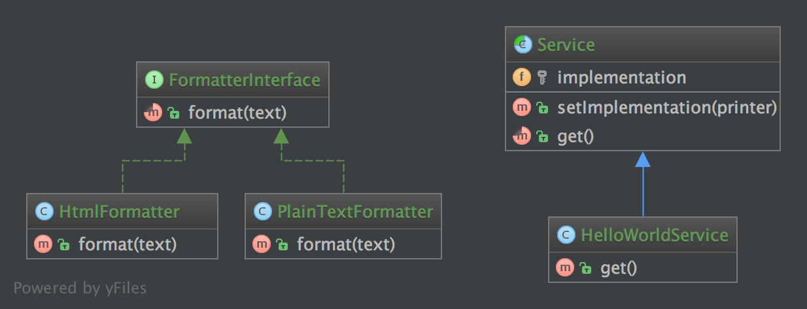

桥接（Bridge）模式的定义如下：将抽象与实现分离，使它们可以独立变化。它是用组合关系代替继承关系来实现，从而降低了抽象和实现这两个可变维度的耦合度。

通过上面的讲解，我们能很好的感觉到桥接模式遵循了里氏替换原则和依赖倒置原则，最终实现了开闭原则，对修改关闭，对扩展开放。这里将桥接模式的优缺点总结如下。

桥接（Bridge）模式的优点是：

- 抽象与实现分离，扩展能力强
- 符合开闭原则
- 符合合成复用原则
- 其实现细节对客户透明


缺点是：由于聚合关系建立在抽象层，要求开发者针对抽象化进行设计与编程，能正确地识别出系统中两个独立变化的维度，这增加了系统的理解与设计难度。

可以将抽象化部分与实现化部分分开，取消二者的继承关系，改用组合关系。

模式的结构

桥接（Bridge）模式包含以下主要角色。

1. 抽象化（Abstraction）角色：定义抽象类，并包含一个对实现化对象的引用。
2. 扩展抽象化（Refined Abstraction）角色：是抽象化角色的子类，实现父类中的业务方法，并通过组合关系调用实现化角色中的业务方法。
3. 实现化（Implementor）角色：定义实现化角色的接口，供扩展抽象化角色调用。
4. 具体实现化（Concrete Implementor）角色：给出实现化角色接口的具体实现。

## 2.2.1. 目的

将抽象与实现分离，这样两者可以独立地改变。

## 2.2.2. 例子

- [Symfony 学术桥梁](https://github.com/symfony/DoctrineBridge)

## 2.2.3. UML 图



## 2.2.4. 代码

你也可以在 [GitHub](https://github.com/domnikl/DesignPatternsPHP/tree/master/Structural/Bridge) 上查看代码

FormatterInterface.php
```php
<?php

namespace DesignPatterns\Structural\Bridge;

/**
* 创建格式化接口。
*/
interface FormatterInterface
{
    public function format(string $text);
}
```
PlainTextFormatter.php
```php
<?php

namespace DesignPatterns\Structural\Bridge;

/**
* 创建 PlainTextFormatter 文本格式类实现 FormatterInterface 接口。
*/
class PlainTextFormatter implements FormatterInterface
{

    /**
    * 返回字符串格式。
      */
      public function format(string $text)
      {
        return $text;
      }
}
```
HtmlFormatter.php
```php
<?php

namespace DesignPatterns\Structural\Bridge;

/**
* 创建 HtmlFormatter HTML 格式类实现 FormatterInterface 接口。
*/
class HtmlFormatter implements FormatterInterface
{

    /**
    * 返回 HTML 格式。
      */
      public function format(string $text)
      {
        return sprintf('<p>%s</p>', $text);
      }
}
```
Service.php
```php
<?php

namespace DesignPatterns\Structural\Bridge;

/**
* 创建抽象类 Service。
*/
abstract class Service
{
    /**
    * @var FormatterInterface
    * 定义实现属性。
      */
      protected $implementation;

    /**
    * @param FormatterInterface $printer
    * 传入 FormatterInterface 实现类对象。
      */
      public function __construct(FormatterInterface $printer)
      {
        $this->implementation = $printer;
      }

    /**
    * @param FormatterInterface $printer
    * 和构造方法的作用相同。
      */
      public function setImplementation(FormatterInterface $printer)
      {
        $this->implementation = $printer;
      }

    /**
    * 创建抽象方法 get() 。
      */
      abstract public function get();
}
```
HelloWorldService.php
```php
<?php

namespace DesignPatterns\Structural\Bridge;

/**
* 创建 Service 子类 HelloWorldService 。
*/
class HelloWorldService extends Service
{

    /**
    * 定义抽象方法 get() 。
    * 根据传入的格式类定义来格式化输出 'Hello World' 。
      */
      public function get()
      {
        return $this->implementation->format('Hello World');
      }
}
```
**2.2.5. 测试**
Tests/BridgeTest.php
```php
<?php

namespace DesignPatterns\Structural\Bridge\Tests;

use DesignPatterns\Structural\Bridge\HelloWorldService;
use DesignPatterns\Structural\Bridge\HtmlFormatter;
use DesignPatterns\Structural\Bridge\PlainTextFormatter;
use PHPUnit\Framework\TestCase;

/**
* 创建自动化测试单元 BridgeTest 。
*/
class BridgeTest extends TestCase
{

    /**
    * 使用 HelloWorldService 分别测试文本格式实现类和 HTML 格式实
    * 现类。
      */
      public function testCanPrintUsingThePlainTextPrinter()
      {
        $service = new HelloWorldService(new PlainTextFormatter());
        $this->assertEquals('Hello World', $service->get());

        // 现在更改实现方法为使用 HTML 格式器。
        $service->setImplementation(new HtmlFormatter());
        $this->assertEquals('<p>Hello World</p>', $service->get());
      }
}
```


```php
abstract class Info
{
    protected $sendObj = null;
    
    public function __construct($sendObj)
    {
        $this->sendObj = $sendObj;
    }

    abstract public function msg($content);

    public function send($to, $content)
    {
        $content = $this->msg($content);
        $this->sendObj->send($to, $content);
    }
}

// 定义消息的发送方式
class Inner
{
    public function send($to, $content)
    {
        echo '站内消息To：' . $to . ' 内容：' . $content;
    }
}

class Email
{
    public function send($to, $content)
    {
        echo 'email消息To：' . $to . ' 内容：' . $content;
    }
}

class Sms
{
    public function send($to, $content)
    {
        echo 'sms消息To：' . $to . ' 内容：' . $content;
    }
}

// 定义消息级别
class Common extends Info
{
    public function msg($content)
    {
        return '普通消息--' . $content;
    }
}

class Warn extends Info
{
    public function msg($content)
    {
        return '紧急消息--' . $content;
    }
}

class Danger extends Info
{
    public function msg($content)
    {
        return '特级消息--' . $content;
    }
}


$com = new Common(new Inner());
$com->send('张三', '发送了一个普通的站内消息');

$com = new Common(new Email());
$com->send('李四', '发送一个普通短信提醒消息');
```

