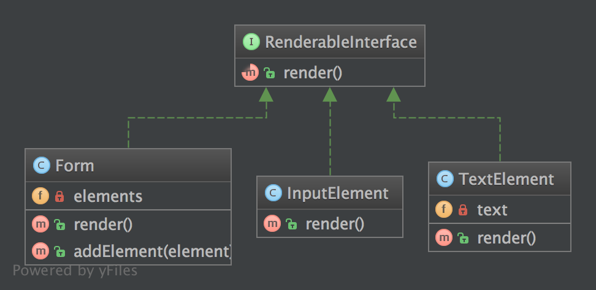
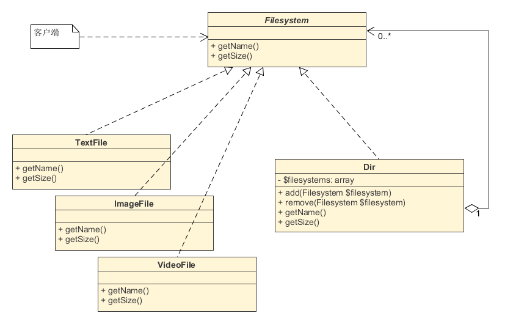

**2.3.1. 目的**
一组对象与该对象的单个实例的处理方式一致。

**2.3.2. 示例**
一个表单类实例在处理其表单所有元素的方法与处理该表单自身实例方法相同，在调用方法 render() 时，会随之遍历它的所有子元素并对他们调用 render() 方法
Zend_Config: 一个配置选项树，每个选项自身就是一个 Zend_Config 对象
**2.3.3. UML 图**



## 2.3.4. 代码

相关代码参见 [GitHub](https://github.com/domnikl/DesignPatternsPHP/tree/master/Structural/Composite)

RenderableInterface.php
```php
<?php

namespace DesignPatterns\Structural\Composite;

interface RenderableInterface
{
    public function render(): string;
}
```
Form.php
```php
<?php

namespace DesignPatterns\Structural\Composite;

/**
 * 该组合内的节点必须派生于该组件契约。为了构建成一个组件树，
 * 此为强制性操作。
 */
class Form implements RenderableInterface
{
    /**
     * @var RenderableInterface[]
     */
    private $elements;

    /**
     * 遍历所有元素，并对他们调用 render() 方法，然后返回表单的完整
     * 的解析表达。
     *
     * 从外部上看，我们不会看到遍历过程，该表单的操作过程与单一对
     * 象实例一样
     *
     * @return string
     */
    public function render(): string
    {
        $formCode = '<form>';

        foreach ($this->elements as $element) {
            $formCode .= $element->render();
        }

        $formCode .= '</form>';

        return $formCode;
    }

    /**
     * @param RenderableInterface $element
     */
    public function addElement(RenderableInterface $element)
    {
        $this->elements[] = $element;
    }
}
```
InputElement.php
```php
<?php

namespace DesignPatterns\Structural\Composite;

class InputElement implements RenderableInterface
{
    public function render(): string
    {
        return '<input type="text" />';
    }
}
```

TextElement.php

```php
<?php

namespace DesignPatterns\Structural\Composite;

class TextElement implements RenderableInterface
{
    /**
     * @var string
     */
    private $text;

    public function __construct(string $text)
    {
        $this->text = $text;
    }
    
    public function render(): string
    {
        return $this->text;
    }

}
```

**2.3.5. 测试**
Tests/CompositeTest.php

```php
<?php

namespace DesignPatterns\Structural\Composite\Tests;

use DesignPatterns\Structural\Composite;
use PHPUnit\Framework\TestCase;

class CompositeTest extends TestCase
{
    public function testRender()
    {
        $form = new Composite\Form();
        $form->addElement(new Composite\TextElement('Email:'));
        $form->addElement(new Composite\InputElement());
        $embed = new Composite\Form();
        $embed->addElement(new Composite\TextElement('Password:'));
        $embed->addElement(new Composite\InputElement());
        $form->addElement($embed);

        // 此代码仅作示例。在实际场景中，现在的网页浏览器根本不支持
        // 多表单嵌套，牢记该点非常重要
    
        $this->assertEquals(
            '<form>Email:<input type="text" /><form>Password:<input type="text" /></form></form>',
            $form->render()
        );
    }

}
```


组合模式（Composite pattern）
**适用场景**：适用于当我们的一个对象可能代表一个单一的实体，或者一个组合的实体，但是仍然需要通过同样的方式被使用的情形。
组合模式将对象组合成树形结构，以表示‘部分-整体’的层次结构。
在组合模式，客户端访问独立对象和组合对象（或称对象集合）一样。
独立对象是一个有特定功能的对象，它不引用其他任何其他对象。
组合对象则是一个提供相似功能对象的集合，主要用来管理独立对象，并为客户端提供和独立对象一样的访问方式。
 
接下来，我们就以目录和文件来举例，利用它们的一个相同的功能“查看大小”来举例。


## 1 问题


在文件系统中，我们有文本文件、图片文件、视频文件等类型的文件。
它们格式不同，但都有容量大小。
现在，我们创建文本和图片文件两个类，且各自有固定的大小。
（实际当然不是如此，这里举例所以简化处理。）
接着，我们要获取文件和目录的大小。
首先是文件：
abstract class File
{
abstract function getSize();
}

class TextFile extends File
{
public function getSize()
{
return 2;
}
}

class ImageFile extends File
{
public function getSize()
{
return 100;
}
}这样，在创建文本或图片对象后，就可以通过getSize()方法获取到它们的大小。
然后，我们创建一个目录类，它可以把文件组合起来：
class Dir
{
private $files = [];

// 传入参数必须为File文件对象
public function addFile(File $file)
{
$this->files[] = $file;
}

public function getSize()
{
$size = 0;
foreach ($this->files as $file) {
$size += $file->getSize();
}

return $size;
}
}然后，我们就可以计算目录的大小，它等于目录下所有文件大小之和。
例如，这个目录加入一个文本文件，一个图片文件，那么这个目录大小就是：102。
当然，如果问题一直这样简单的话，那么这个模型还是非常令人满意的。
但是，如果有一些新的需求加入会怎样？
比如，要在目录中再加一层目录，那么Dir类就需要变成：
class NewDir
{
private $files = [];
private $dirs = [];

public function addFile(File $file)
{
$this->files[] = $file;
}

public function addDir(NewDir $newDir) {
$this->dirs = $newDir;
}

public function getSize()
{
$size = 0;
foreach ($this->files as $file) {
$size += $file->getSize();
}

foreach ($this->dirs as $dir) {
$size += $dir->getSize();
}

return $size;
}
}是不是比之前又复杂了些？
这还不算，我们还需要修改原来的类，可能无意间又影响原来的功能 。
另外，如果我们现在要计算多级子目录的大小、或者从目录中删除目录，是不是还需要修改原有类？
显然，这个模型无法实现这些复杂的功能，我们需要一个更加灵活的模型。


## 2 组合模式


组合模式的解决方法是，用抽象类规范统一的对外接口。
然后，让文件类和目录类实现这个接口，并在目录类中递归计算文件的大小。
同时，目录类比文件类两个方法：add()和remove()，用以管理文件对象。
这样，目录类就能用同样的方式获取自身的大小。
并且，还能灵活从目录总增删子目录和文件。


### 2.1 接口


接口用于规范独立对象和组合对象，保证能够对外提供一致性的使用方法。
这里以getName()和getSize()方法为例：
/**
\* 规范独立对象和组合对象必须实现的方法，保证它们提供给客户端统一的
\* 访问方式
*/
abstract class Filesystem
{
protected $name;

public function __construct($name)
{
$this->name = $name;
}

public abstract function getName();
public abstract function getSize();
}
其中，__construct构建函数用于传入文件或目录名称，并非必须。
这个接口中规范的方法要根据需求来定义，并且同时要考虑独立对象拥有的功能。
如果独立对象之间有差异的功能，不适合聚合在一起，则不能放在组合类中。


### 2.2 目录类


目录类是对象集合，通过add()和remove()方法管理文件对象和其他目录对象。
目录类也需要实现抽象类中的方法，以提供给客户端一致性的使用方式。
/**
\* 目录类
*/
class Dir extends Filesystem
{
private $filesystems = [];

// 组合对象必须实现添加方法。因为传入参数规定为Filesystem类型，
// 所以目录和文件都能添加
public function add(Filesystem $filesystem)
{
$key = array_search($filesystem, $this->filesystems);
if ($key === false) {
$this->filesystems[] = $filesystem;
}
}

// 组合对象必须实现移除方法
public function remove(Filesystem $filesystem)
{
$key = array_search($filesystem, $this->filesystems);
if ($key !== false) {
unset($this->filesystems[$key]);
}
}

public function getName()
{
return '目录：' . $this->name;
}

public function getSize()
{
$size = 0;
foreach ($this->filesystems as $filesystem) {
$size += $filesystem->getSize();
}

return $size;
}
}

### 2.3 文件类


文件类实现具体的功能，但是没有add()和remove()方法。
/**
\* 独立对象：文本文件类
*/
class TextFile extends Filesystem
{
public function getName()
{
return '文本文件：' . $this->name;
}

public function getSize()
{
return 10;
}
}

/**
\* 独立对象2：图片文件类
*/
class ImageFile extends Filesystem
{
public function getName()
{
return '图片：' . $this->name;
}

public function getSize()
{
return 100;
}
}

/**
\* 独立对象：视频文件类
*/
class VideoFile extends Filesystem
{
public function getName()
{
return '视频：'. $this->name;
}

public function getSize()
{
return 200;
}
}组合模式中，组合对象必须在合适的地方提供独立对象的管理方法，如：add()、remove()等。
组合模式分为安全模式和透明模式，这是根据接口中是否包含管理对象的方法来区分的。
上面的例子我们举例的是安全模式，在接口中没有声明add()和remove()方法管理方法。
这样有一个缺点：组合对象和独立对象不具有相同的接口，客户端调用需要做相应的判断，带来了不便。
另外一种是透明模式，在接口中就声明add()和remove()方法。
这样所有的实现类都具备了add()和remove()，好处就是组合对象和独立对象具有一致的接口。
但问题也很明显，因为独立对象不具备add()、remove()方法的功能，所以实现他是没有意义的。
不管那种模式，都根据实际需要来配置。


### 2.4 客户端


然后，我们就可以在客户端中使用这个程序。
例如，我们要构建这样一个文件目录结构：
home
├─text1.txt
├─bg1.png
├─film1.mp4
├─source
│ ├─text2.txt代码就是：
// 创建home目录，并加入三个文件
$dir = new Dir('home');
$dir->add(new TextFile('text1.txt'));
$dir->add(new ImageFile('bg1.png'));
$dir->add(new VideoFile('film1.mp4'));

// 在home下创建子目录source
$subDir = new Dir('source');
$dir->add($subDir);

// 创建一个text2.txt，并放到子目录source中
$text2 = new TextFile('text2.txt');
$subDir->add($text2);

// 打印信息
echo $text2->getName(), '-->', $text2->getSize();
echo '<br />';
echo $subDir->getName(), ' --> ',$subDir->getSize();
echo '<br />';
echo $dir->getName(), ' --> ', $dir->getSize();可以看到，文件对象（独立对象）获取名称用getName()方法，目录对象（组合对象）用的也是getName()方法。
同样，获取大小用的也都是getSize()方法。
输出的结果为：
文本文件：text2.txt-->10
目录：source --> 10
目录：home --> 320

## 3 特点


在组合模式中，组合对象和独立对象必须实现一个接口。
其中，组合对象必须包含添加和删除节点对象。
组合模式通过和装饰模式有着类似的结构图，但是组合模式旨在构造类，而装饰模式重在不生成子类即可给对象添加职责。
并且，装饰模式重在修饰，而组合模式重在表示。
组合模式的UML图：



参考资料：
\1. [设计模式读书笔记-----组合模式](http://www.cnblogs.com/chenssy/p/3299719.html)
\2. [PHP Patterns: The Composite Pattern](http://www.craigsefton.com/programming/php-patterns-the-composite-pattern/)
\3. [设计模式学习笔记十七：组合模式（Composite Pattern）](http://www.cnblogs.com/peida/archive/2008/09/09/1284686.html)
\4. [Composite Pattern in PHP](http://www.jakowicz.com/composite-pattern-in-php/)
\5. [Composite in PHP](https://sourcemaking.com/design_patterns/composite/php)
\6. [Composite Pattern](http://www.oodesign.com/composite-pattern.html)