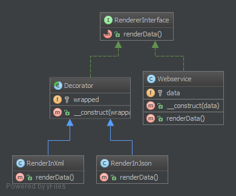

装饰（Decorator）模式的定义：指在不改变现有对象结构的情况下，动态地给该对象增加一些职责（即增加其额外功能）的模式，它属于对象结构型模式。

装饰（Decorator）模式的主要优点有：

- 装饰器是继承的有力补充，比继承灵活，在不改变原有对象的情况下，动态的给一个对象扩展功能，即插即用
- 通过使用不用装饰类及这些装饰类的排列组合，可以实现不同效果
- 装饰器模式完全遵守开闭原则


其主要缺点是：装饰模式会增加许多子类，过度使用会增加程序得复杂性。

模式的结构

装饰模式主要包含以下角色。

1. 抽象构件（Component）角色：定义一个抽象接口以规范准备接收附加责任的对象。
2. 具体构件（ConcreteComponent）角色：实现抽象构件，通过装饰角色为其添加一些职责。
3. 抽象装饰（Decorator）角色：继承抽象构件，并包含具体构件的实例，可以通过其子类扩展具体构件的功能。
4. 具体装饰（ConcreteDecorator）角色：实现抽象装饰的相关方法，并给具体构件对象添加附加的责任。

**2.5.1. 目的**
**为类实例动态增加新的方法**。

**2.5.2. 例子**
Zend Framework: Zend_Form_Element 实例的装饰者
Web Service Layer: 用于 REST 服务的 JSON 和 XML 装饰者 (当然，在这个例子中理应只有一个是被允许的)
**2.5.3. UML 图**



## 2.5.4. Code

你也可以在 [GitHub](https://github.com/domnikl/DesignPatternsPHP/tree/master/Structural/Decorator) 上查看代码

RenderableInterface.php
```php
<?php

namespace DesignPatterns\Structural\Decorator;

/**
* 创建渲染接口。
* 这里的装饰方法 renderData() 返回的是字符串格式数据。
*/
interface RenderableInterface
{
    public function renderData(): string;
}
```
Webservice.php
```php
<?php

namespace DesignPatterns\Structural\Decorator;

/**
* 创建 Webservice 服务类实现 RenderableInterface。
* 该类将在后面为装饰者实现数据的输入。
*/
class Webservice implements RenderableInterface
{
    /**
    * @var string
      */
      private $data;

    /**
    * 传入字符串格式数据。
      */
      public function __construct(string $data)
      {
        $this->data = $data;
      }

    /**
    * 实现 RenderableInterface 渲染接口中的 renderData() 方法。
    * 返回传入的数据。
      */
      public function renderData(): string
      {
        return $this->data;
      }
}
```
RendererDecorator.php
```php
<?php

namespace DesignPatterns\Structural\Decorator;

 /**
 * 装饰者必须实现渲染接口类 RenderableInterface 契约，这是该设计
 * 模式的关键点。否则，这将不是一个装饰者而只是一个自欺欺人的包
 * 装。
 * 
 * 创建抽象类 RendererDecorator （渲染器装饰者）实现渲染接口。
 */
abstract class RendererDecorator implements RenderableInterface
{
    /**
     * @var RenderableInterface
     * 定义渲染接口变量。
     */
    protected $wrapped;

    /**
     * @param RenderableInterface $renderer
     * 传入渲染接口类对象 $renderer。
     */
    public function __construct(RenderableInterface $renderer)
    {
        $this->wrapped = $renderer;
    }
}
```
XmlRenderer.php
```php
<?php

namespace DesignPatterns\Structural\Decorator;

/**
* 创建 Xml 修饰者并继承抽象类 RendererDecorator 。
*/
class XmlRenderer extends RendererDecorator
{

    /**
    * 对传入的渲染接口对象进行处理，生成 DOM 数据文件。
      */
      public function renderData(): string
      {
        $doc = new \DOMDocument();
        $data = $this->wrapped->renderData();
        $doc->appendChild($doc->createElement('content', $data));

        return $doc->saveXML();
      }
}
```
JsonRenderer.php
```php
<?php

namespace DesignPatterns\Structural\Decorator;

/**
* 创建 Json 修饰者并继承抽象类 RendererDecorator 。
*/
class JsonRenderer extends RendererDecorator
{
    /**
    * 对传入的渲染接口对象进行处理，生成 JSON 数据。
      */
      public function renderData(): string
      {
        return json_encode($this->wrapped->renderData());
      }
}
```
**2.5.5. 测试**
Tests/DecoratorTest.php
```php
<?php

namespace DesignPatterns\Structural\Decorator\Tests;

use DesignPatterns\Structural\Decorator;
use PHPUnit\Framework\TestCase;

/**
* 创建自动化测试单元 DecoratorTest 。
*/
class DecoratorTest extends TestCase
{
    /**
     * @var Decorator\Webservice
        */
      private $service;

    /** 
    * 传入字符串 'foobar' 。
      */
      protected function setUp()
      {
        $this->service = new Decorator\Webservice('foobar');
      }

    /**
    * 测试 JSON 装饰者。
    * 这里的 assertEquals 是为了判断返回的结果是否符合预期。
      */
      public function testJsonDecorator()
      {
        $service = new Decorator\JsonRenderer($this->service);

        $this->assertEquals('"foobar"', $service->renderData());
      }

    /**
    * 测试 Xml 装饰者。
      */
      public function testXmlDecorator()
      {
        $service = new Decorator\XmlRenderer($this->service);

        $this->assertXmlStringEqualsXmlString('<?xml version="1.0"?><content>foobar</content>', $service->renderData());
      }
}
```