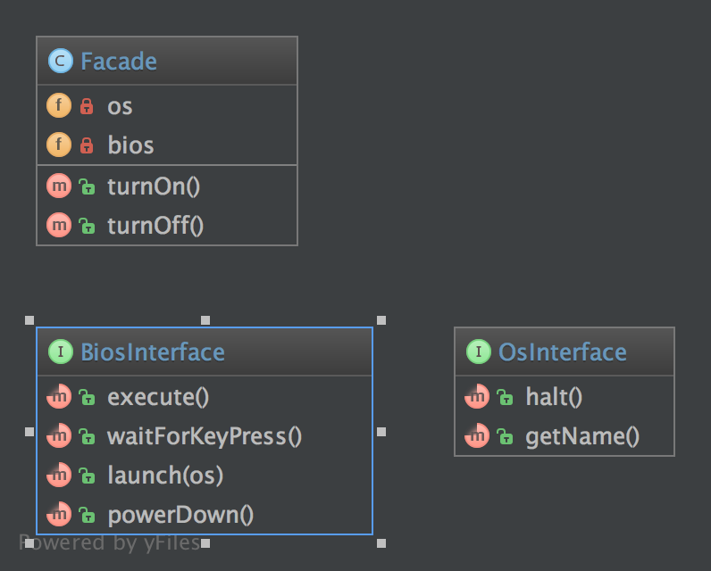

**2.7.1. 目的**
门面模式的最初目的并不是为了避免让你阅读复杂的 API 文档，这只是一个附带作用。其实它的本意是为了降低耦合性并且遵循 Demeter 定律。

一个门面旨在通过嵌入许多（但有时只有一个）接口来分离客户端和子系统。当然，也是为了降低复杂度。

门面不会禁止你访问子系统。
你可以（应该）有多个门面对应一个子系统。
这就是为什么一个好的门面里没有 new 的原因。如果每个方法都有多种创建，那并不是一个门面，而是一个构建器 [抽象的 | 静态的 | 简单的] 或是一个工厂 [方法] 。

最好的门面是没有 new 的，并且其构造函数带有接口类型提示的参数。 如果你需要创建新的实例，可以使用工厂作为变量。

**2.7.2. UML 图**



## 2.7.3. 代码

你也可以在 [GitHub](https://github.com/domnikl/DesignPatternsPHP/tree/master/Structural/Facade) 上查看此代码

Facade.php
```php
<?php

namespace DesignPatterns\Structural\Facade;

class Facade
{
    /**
    * @var OsInterface
    * 定义操作系统接口变量。
    */
    private $os;

    /**
    * @var BiosInterface
    * 定义基础输入输出系统接口变量。
    */
    private $bios;
    
    /**
    * @param BiosInterface $bios
    * @param OsInterface $os
    * 传入基础输入输出系统接口对象 $bios 。
    * 传入操作系统接口对象 $os 。
    */
    public function __construct(BiosInterface $bios, OsInterface $os)
    {
        $this->bios = $bios;
        $this->os = $os;
    }
    
    /**
    * 构建基础输入输出系统执行启动方法。
    */
    public function turnOn()
    {
        $this->bios->execute();
        $this->bios->waitForKeyPress();
        $this->bios->launch($this->os);
    }
    
    /**
    * 构建系统关闭方法。
    */
    public function turnOff()
    {
        $this->os->halt();
        $this->bios->powerDown();
    }
}
```
OsInterface.php
```php
<?php

namespace DesignPatterns\Structural\Facade;

/**
* 创建操作系统接口类 OsInterface 。
*/
interface OsInterface
{
    /**
    * 声明关机方法。
      */
      public function halt();

    /** 
    * 声明获取名称方法，返回字符串格式数据。
      */
      public function getName(): string;
}
```
BiosInterface.php
```php
<?php

namespace DesignPatterns\Structural\Facade;

/**
* 创建基础输入输出系统接口类 BiosInterface 。
*/
interface  BiosInterface
{
    /**
    * 声明执行方法。
      */
      public function execute();

    /**
    * 声明等待密码输入方法
      */
      public function waitForKeyPress();

    /**
    * 声明登录方法。
      */
      public function launch(OsInterface $os);

    /**
    * 声明关机方法。
      */
      public function powerDown();
}
```
**2.7.4. 测试**
Tests/FacadeTest.php
```php
<?php

namespace DesignPatterns\Structural\Facade\Tests;

use DesignPatterns\Structural\Facade\Facade;
use DesignPatterns\Structural\Facade\OsInterface;
use PHPUnit\Framework\TestCase;

/**
* 创建自动化测试单元 FacadeTest 。
*/
class FacadeTest extends TestCase
{
    public function testComputerOn()
    {
        /** @var OsInterface|\PHPUnit_Framework_MockObject_MockObject $os */
        $os = $this->createMock('DesignPatterns\Structural\Facade\OsInterface');

        $os->method('getName')
            ->will($this->returnValue('Linux'));
    
        $bios = $this->getMockBuilder('DesignPatterns\Structural\Facade\BiosInterface')
            ->setMethods(['launch', 'execute', 'waitForKeyPress'])
            ->disableAutoload()
            ->getMock();
    
        $bios->expects($this->once())
            ->method('launch')
            ->with($os);
    
        $facade = new Facade($bios, $os);
    
        // 门面接口很简单。
        $facade->turnOn();
    
        // 但你也可以访问底层组件。
        $this->assertEquals('Linux', $os->getName());
    }
}
```