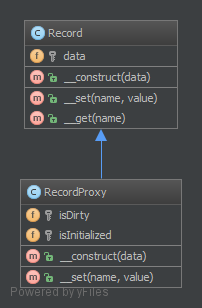

代理模式的定义：由于某些原因需要给某对象提供一个代理以控制对该对象的访问。这时，访问对象不适合或者不能直接引用目标对象，代理对象作为访问对象和目标对象之间的中介。

代理模式的主要优点有：

- 代理模式在客户端与目标对象之间起到一个中介作用和保护目标对象的作用；
- 代理对象可以扩展目标对象的功能；
- 代理模式能将客户端与目标对象分离，在一定程度上降低了系统的耦合度，增加了程序的可扩展性


其主要缺点是：

- 代理模式会造成系统设计中类的数量增加
- 在客户端和目标对象之间增加一个代理对象，会造成请求处理速度变慢；
- 增加了系统的复杂度；

模式的结构

代理模式的主要角色如下。

1. 抽象主题（Subject）类：通过接口或抽象类声明真实主题和代理对象实现的业务方法。
2. 真实主题（Real Subject）类：实现了抽象主题中的具体业务，是代理对象所代表的真实对象，是最终要引用的对象。
3. 代理（Proxy）类：提供了与真实主题相同的接口，其内部含有对真实主题的引用，它可以访问、控制或扩展真实主题的功能。

**2.10.1. 目的**
代理模式（Proxy）为其他对象提供一种代理以控制对这个对象的访问。使用代理模式创建代理对象，让代理对象控制目标对象的访问（目标对象可以是远程的对象、创建开销大的对象或需要安全控制的对象），并且可以在不改变目标对象的情况下添加一些额外的功能。

在某些情况下，一个客户不想或者不能直接引用另一个对象，而代理对象可以在客户端和目标对象之间起到中介的作用，并且可以通过代理对象去掉客户不能看到的内容和服务或者添加客户需要的额外服务。

经典例子就是网络代理，你想访问 Facebook 或者 Twitter ，如何绕过 GFW？找个代理网站。

**2.10.2. Examples**
Doctrine2 使用代理来实现框架的 “魔术”（例如：延迟加载），而用户仍然使用他们自己的实体类且不会使用到代理。
**2.10.3. UML 图**



## 2.10.4. 代码

源代码在这里： [GitHub](https://github.com/domnikl/DesignPatternsPHP/tree/master/Structural/Proxy)

Record.php
```php
<?php

namespace DesignPatterns\Structural\Proxy;

/**
 * @property 用户名
 */
class Record
{
    /**
     * @var string[]
     */
    private $data;

    /**
     * @param string[] $data
     */
    public function __construct(array $data = [])
    {
        $this->data = $data;
    }

    /**
     * @param string $name
     * @param string  $value
     */
    public function __set(string $name, string $value)
    {
        $this->data[$name] = $value;
    }

    public function __get(string $name): string
    {
        if (!isset($this->data[$name])) {
            throw new \OutOfRangeException('Invalid name given');
        }

        return $this->data[$name];
    }
}
```
RecordProxy.php
```php
<?php

namespace DesignPatterns\Structural\Proxy;

class RecordProxy extends Record
{
    /**
     * @var bool
     */
    private $isDirty = false;

    /**
     * @var bool
     */
    private $isInitialized = false;
    
    /**
     * @param array $data
     */
    public function __construct(array $data)
    {
        parent::__construct($data);
        // 当记录有数据的时候，将 initialized 标记为 true ，
        // 因为记录将保存我们的业务逻辑，我们不希望在 Record 类里面实现这个行为
        // 而是在继承了 Record 的代理类中去实现。
        if (count($data) > 0) {
            $this->isInitialized = true;
            $this->isDirty = true;
        }
    }
    
    /**
     * @param string $name
     * @param string  $value
     */
    public function __set(string $name, string $value)
    {
        $this->isDirty = true;
    
        parent::__set($name, $value);
    }
    
    public function isDirty(): bool
    {
        return $this->isDirty;
    }
}
```
**测试代码**

```php
<?php

    namespace DesignPatterns\Structural\Proxy\Tests;
    
    use DesignPatterns\Structural\Proxy\Record;
    use DesignPatterns\Structural\Proxy\RecordProxy;
    
    class ProxyTest extends \PHPUnit_Framework_TestCase
    {
        public function testSetAttribute(){
            $data = [];
            $proxy = new RecordProxy($data);
            $proxy->xyz = false;
            $this->assertTrue($proxy->xyz===false);
        }
    }
```