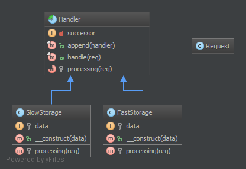

责任链（Chain of Responsibility）模式的定义：为了避免请求发送者与多个请求处理者耦合在一起，于是将所有请求的处理者通过前一对象记住其下一个对象的引用而连成一条链；当有请求发生时，可将请求沿着这条链传递，直到有对象处理它为止。

注意：责任链模式也叫职责链模式。

在责任链模式中，客户只需要将请求发送到责任链上即可，无须关心请求的处理细节和请求的传递过程，请求会自动进行传递。所以责任链将请求的发送者和请求的处理者解耦了。

责任链模式是一种对象行为型模式，其主要优点如下。

1. 降低了对象之间的耦合度。该模式使得一个对象无须知道到底是哪一个对象处理其请求以及链的结构，发送者和接收者也无须拥有对方的明确信息。
2. 增强了系统的可扩展性。可以根据需要增加新的请求处理类，满足开闭原则。
3. 增强了给对象指派职责的灵活性。当工作流程发生变化，可以动态地改变链内的成员或者调动它们的次序，也可动态地新增或者删除责任。
4. 责任链简化了对象之间的连接。每个对象只需保持一个指向其后继者的引用，不需保持其他所有处理者的引用，这避免了使用众多的 if 或者 if···else 语句。
5. 责任分担。每个类只需要处理自己该处理的工作，不该处理的传递给下一个对象完成，明确各类的责任范围，符合类的单一职责原则。


其主要缺点如下。

1. 不能保证每个请求一定被处理。由于一个请求没有明确的接收者，所以不能保证它一定会被处理，该请求可能一直传到链的末端都得不到处理。
2. 对比较长的职责链，请求的处理可能涉及多个处理对象，系统性能将受到一定影响。
3. 职责链建立的合理性要靠客户端来保证，增加了客户端的复杂性，可能会由于职责链的错误设置而导致系统出错，如可能会造成循环调用。

通常情况下，可以通过数据链表来实现职责链模式的[数据结构](http://c.biancheng.net/data_structure/)。

模式的结构

职责链模式主要包含以下角色。

1. 抽象处理者（Handler）角色：定义一个处理请求的接口，包含抽象处理方法和一个后继连接。
2. 具体处理者（Concrete Handler）角色：实现抽象处理者的处理方法，判断能否处理本次请求，如果可以处理请求则处理，否则将该请求转给它的后继者。
3. 客户类（Client）角色：创建处理链，并向链头的具体处理者对象提交请求，它不关心处理细节和请求的传递过程。


责任链模式的本质是解耦请求与处理，让请求在处理链中能进行传递与被处理；理解责任链模式应当理解其模式，而不是其具体实现。责任链模式的独到之处是将其节点处理者组合成了链式结构，并允许节点自身决定是否进行请求处理或转发，相当于让请求流动起来。


**3.1.1. 目的**
**建立一个对象链来按指定顺序处理调用。如果其中一个对象无法处理命令，它会委托这个调用给它的下一个对象来进行处理，以此类推。**

**3.1.2. 例子**
日志框架，每个链元素自主决定如何处理日志消息。
垃圾邮件过滤器。
缓存：例如第一个对象是一个 Memcached 接口实例，如果 “丢失” 它会委托数据库接口处理这个调用。
Yii 框架: CFilterChain 是一个控制器行为过滤器链。执行点会有链上的过滤器逐个传递，并且只有当所有的过滤器验证通过，这个行为最后才会被调用。
**3.1.3. UML 图**



## 3.1.4. 代码

你也可以在 [GitHub](https://github.com/domnikl/DesignPatternsPHP/tree/master/Behavioral/ChainOfResponsibilities) 上查看此代码

Handler.php
```php
<?php

namespace DesignPatterns\Behavioral\ChainOfResponsibilities;

use Psr\Http\Message\RequestInterface;
use Psr\Http\Message\ResponseInterface;

/**
 * 创建处理器抽象类 Handler 。
 */
abstract class Handler
{
    /**
     * @var Handler|null
     * 定义继承处理器
     */
    private $successor = null;

    /**
     * 输入集成处理器对象。
     */
    public function __construct(Handler $handler = null)
    {
        $this->successor = $handler;
    }

    /**
     * 通过使用模板方法模式这种方法可以确保每个子类不会忽略调用继
     * 承。
     *
     * @param RequestInterface $request
     * 定义处理请求方法。
     * 
     * @return string|null
     */
    final public function handle(RequestInterface $request)
    {
        $processed = $this->processing($request);

        if ($processed === null) {
            // 请求尚未被目前的处理器处理 => 传递到下一个处理器。
            if ($this->successor !== null) {
                $processed = $this->successor->handle($request);
            }
        }

        return $processed;
    }

    /**
     * 声明处理方法。
     */
    abstract protected function processing(RequestInterface $request);
}
```
Responsible/FastStorage.php
```php
<?php

namespace DesignPatterns\Behavioral\ChainOfResponsibilities\Responsible;

use DesignPatterns\Behavioral\ChainOfResponsibilities\Handler;
use Psr\Http\Message\RequestInterface;

/**
 * 创建 http 缓存处理类。
 */
class HttpInMemoryCacheHandler extends Handler
{
    /**
     * @var array
     */
    private $data;

    /**
     * @param array $data
     * 传入数据数组参数。
     * @param Handler|null $successor
     * 传入处理器类对象 $successor 。
     */
    public function __construct(array $data, Handler $successor = null)
    {
        parent::__construct($successor);

        $this->data = $data;
    }

    /**
     * @param RequestInterface $request
     * 传入请求类对象参数 $request 。
     * @return string|null
     * 
     * 返回缓存中对应路径存储的数据。
     */
    protected function processing(RequestInterface $request)
    {
        $key = sprintf(
            '%s?%s',
            $request->getUri()->getPath(),
            $request->getUri()->getQuery()
        );

        if ($request->getMethod() == 'GET' && isset($this->data[$key])) {
            return $this->data[$key];
        }

        return null;
    }
}
```
Responsible/SlowStorage.php
```php
<?php

namespace DesignPatterns\Behavioral\ChainOfResponsibilities\Responsible;

use DesignPatterns\Behavioral\ChainOfResponsibilities\Handler;
use Psr\Http\Message\RequestInterface;

/**
 * 创建数据库处理器。
 */
class SlowDatabaseHandler extends Handler
{
    /**
     * @param RequestInterface $request
     * 传入请求类对象 $request 。
     * 
     * @return string|null
     * 定义处理方法，下面应该是个数据库查询动作，但是简单化模拟，直接返回一个 'Hello World' 字符串作查询结果。
     */
    protected function processing(RequestInterface $request)
    {
        // 这是一个模拟输出， 在生产代码中你应该调用一个缓慢的 （相对于内存来说） 数据库查询结果。

        return 'Hello World!';
    }
}
```
**3.1.5. 测试**
Tests/ChainTest.php

```php
<?php

namespace DesignPatterns\Behavioral\ChainOfResponsibilities\Tests;

use DesignPatterns\Behavioral\ChainOfResponsibilities\Handler;
use DesignPatterns\Behavioral\ChainOfResponsibilities\Responsible\HttpInMemoryCacheHandler;
use DesignPatterns\Behavioral\ChainOfResponsibilities\Responsible\SlowDatabaseHandler;
use PHPUnit\Framework\TestCase;

/**
 * 创建一个自动化测试单元 ChainTest 。
 */
class ChainTest extends TestCase
{
    /**
     * @var Handler
     */
    private $chain;

    /**
     * 模拟设置缓存处理器的缓存数据。
     */
    protected function setUp()
    {
        $this->chain = new HttpInMemoryCacheHandler(
            ['/foo/bar?index=1' => 'Hello In Memory!'],
            new SlowDatabaseHandler()
        );
    }

    /**
     * 模拟从缓存中拉取数据。
     */
    public function testCanRequestKeyInFastStorage()
    {
        $uri = $this->createMock('Psr\Http\Message\UriInterface');
        $uri->method('getPath')->willReturn('/foo/bar');
        $uri->method('getQuery')->willReturn('index=1');

        $request = $this->createMock('Psr\Http\Message\RequestInterface');
        $request->method('getMethod')
            ->willReturn('GET');
        $request->method('getUri')->willReturn($uri);

        $this->assertEquals('Hello In Memory!', $this->chain->handle($request));
    }

    /**
     * 模拟从数据库中拉取数据。
     */
    public function testCanRequestKeyInSlowStorage()
    {
        $uri = $this->createMock('Psr\Http\Message\UriInterface');
        $uri->method('getPath')->willReturn('/foo/baz');
        $uri->method('getQuery')->willReturn('');

        $request = $this->createMock('Psr\Http\Message\RequestInterface');
        $request->method('getMethod')
            ->willReturn('GET');
        $request->method('getUri')->willReturn($uri);

        $this->assertEquals('Hello World!', $this->chain->handle($request));
    }
}
```