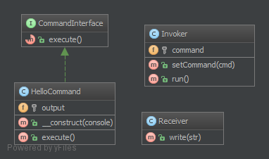

命令（Command）模式的定义如下：将一个请求封装为一个对象，使发出请求的责任和执行请求的责任分割开。这样两者之间通过命令对象进行沟通，这样方便将命令对象进行储存、传递、调用、增加与管理。

命令模式的主要优点如下。

1. 通过引入中间件（抽象接口）降低系统的耦合度。
2. 扩展性良好，增加或删除命令非常方便。采用命令模式增加与删除命令不会影响其他类，且满足“开闭原则”。
3. 可以实现宏命令。命令模式可以与[组合模式](http://c.biancheng.net/view/1373.html)结合，将多个命令装配成一个组合命令，即宏命令。
4. 方便实现 Undo 和 Redo 操作。命令模式可以与后面介绍的[备忘录模式](http://c.biancheng.net/view/1400.html)结合，实现命令的撤销与恢复。
5. 可以在现有命令的基础上，增加额外功能。比如日志记录，结合装饰器模式会更加灵活。


其缺点是：

1. 可能产生大量具体的命令类。因为每一个具体操作都需要设计一个具体命令类，这会增加系统的复杂性。
2. 命令模式的结果其实就是接收方的执行结果，但是为了以命令的形式进行架构、解耦请求与实现，引入了额外类型结构（引入了请求方与抽象命令接口），增加了理解上的困难。不过这也是[设计模式](http://c.biancheng.net/design_pattern/)的通病，抽象必然会额外增加类的数量，代码抽离肯定比代码聚合更加难理解。

可以将系统中的相关操作抽象成命令，使调用者与实现者相关分离，其结构如下。

模式的结构

命令模式包含以下主要角色。

1. 抽象命令类（Command）角色：声明执行命令的接口，拥有执行命令的抽象方法 execute()。
2. 具体命令类（Concrete Command）角色：是抽象命令类的具体实现类，它拥有接收者对象，并通过调用接收者的功能来完成命令要执行的操作。
3. 实现者/接收者（Receiver）角色：执行命令功能的相关操作，是具体命令对象业务的真正实现者。
4. 调用者/请求者（Invoker）角色：是请求的发送者，它通常拥有很多的命令对象，并通过访问命令对象来执行相关请求，它不直接访问接收者。

**3.2.1. 目的**
为了封装调用和解耦。

我们有一个调用程序和一个接收器。 这种模式使用「命令行」将方法调用委托给接收器并且呈现相同的「执行」方法。 因此，调用程序只知道调用「执行」去处理客户端的命令。接收器会从调用程序中分离出来。

这个模式的另一面是取消方法的 execute ()，也就是 undo () 。命令行也可以通过最小量的复制粘贴和依赖组合（不是继承）被聚合，从而组合成更复杂的命令集。

**3.2.2. 例子**
文本编辑器：所有事件都是可以被解除、堆放，保存的命令。
Symfony2：SF2 命令可以从 CLI 运行，它的建立只需考虑到命令行模式。
大型 CLI 工具使用子程序来分发不同的任务并将它们封装在「模型」中，每个模块都可以通过命令行模式实现（例如：vagrant）。
**3.2.3. UML 图**



## 3.2.4. Code

你也可以在 GitHub 上查看 [源码](https://github.com/domnikl/DesignPatternsPHP/tree/master/Behavioral/Command)

CommandInterface.php
```php
<?php

namespace DesignPatterns\Behavioral\Command;

interface CommandInterface
{
    /**
     * 这是在命令行模式中很重要的方法，
     * 这个接收者会被载入构造器
     */
    public function execute();
}
```
HelloCommand.php
```php
<?php

namespace DesignPatterns\Behavioral\Command;

/**
 * 这个具体命令，在接收器上调用 "print" ，
 *  但是外部调用者只知道，这个是否可以执行。
 */
class HelloCommand implements CommandInterface
{
    /**
     * @var Receiver
     */
    private $output;

    /**
     * 每个具体的命令都来自于不同的接收者。
     * 这个可以是一个或者多个接收者，但是参数里必须是可以被执行的命令。
     *
     * @param Receiver $console
     */
    public function __construct(Receiver $console)
    {
        $this->output = $console;
    }

    /**
     * 执行和输出 "Hello World".
     */
    public function execute()
    {
        // 有时候，这里没有接收者，并且这个命令执行所有工作。
        $this->output->write('Hello World');
    }
}
```
Receiver.php
```php
<?php

namespace DesignPatterns\Behavioral\Command;

/**
 * 接收方是特定的服务，有自己的 contract ，只能是具体的实例。
 */
class Receiver
{
    /**
     * @var bool
     */
    private $enableDate = false;

    /**
     * @var string[]
     */
    private $output = [];

    /**
     * @param string $str
     */
    public function write(string $str)
    {
        if ($this->enableDate) {
            $str .= ' ['.date('Y-m-d').']';
        }

        $this->output[] = $str;
    }

    public function getOutput(): string
    {
        return join("\n", $this->output);
    }

    /**
     * 可以显示消息的时间
     */
    public function enableDate()
    {
        $this->enableDate = true;
    }

    /**
     * 禁止显示消息的时间
     */
    public function disableDate()
    {
        $this->enableDate = false;
    }
}
```
Invoker.php
```php
<?php

namespace DesignPatterns\Behavioral\Command;

/**
 *调用者使用这种命令。
 * 比例 : 一个在 SF2 中的应用
 */
class Invoker
{
    /**
     * @var CommandInterface
     */
    private $command;

    /**
     * 在这种调用者中，我们发现，订阅命令也是这种方法
     * 还包括：堆栈、列表、集合等等
     *
     * @param CommandInterface $cmd
     */
    public function setCommand(CommandInterface $cmd)
    {
        $this->command = $cmd;
    }

    /**
     * 执行这个命令；
     * 调用者也是用这个命令。
     */
    public function run()
    {
        $this->command->execute();
    }
}
```
**3.2.5. Test**
Tests/CommandTest.php

```php
<?php

namespace DesignPatterns\Behavioral\Command\Tests;

use DesignPatterns\Behavioral\Command\HelloCommand;
use DesignPatterns\Behavioral\Command\Invoker;
use DesignPatterns\Behavioral\Command\Receiver;
use PHPUnit\Framework\TestCase;

class CommandTest extends TestCase
{
    public function testInvocation()
    {
        $invoker = new Invoker();
        $receiver = new Receiver();

        $invoker->setCommand(new HelloCommand($receiver));
        $invoker->run();
        $this->assertEquals('Hello World', $receiver->getOutput());
    }
}
```