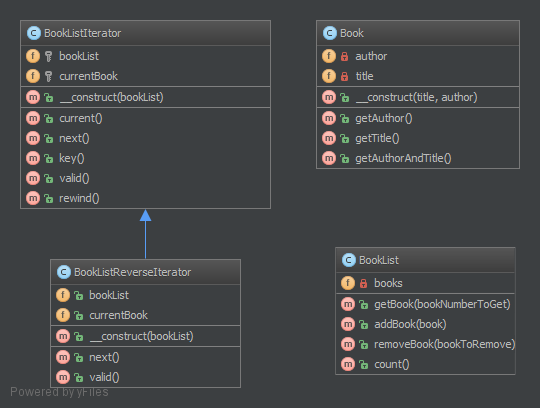

迭代器（Iterator）模式的定义：提供一个对象来顺序访问聚合对象中的一系列数据，而不暴露聚合对象的内部表示。迭代器模式是一种对象行为型模式，其主要优点如下。

1. 访问一个聚合对象的内容而无须暴露它的内部表示。
2. 遍历任务交由迭代器完成，这简化了聚合类。
3. 它支持以不同方式遍历一个聚合，甚至可以自定义迭代器的子类以支持新的遍历。
4. 增加新的聚合类和迭代器类都很方便，无须修改原有代码。
5. 封装性良好，为遍历不同的聚合结构提供一个统一的接口。


其主要缺点是：增加了类的个数，这在一定程度上增加了系统的复杂性。

在日常开发中，我们几乎不会自己写迭代器。除非需要定制一个自己实现的数据结构对应的迭代器，否则，开源框架提供的 API 完全够用。

迭代器模式是通过将聚合对象的遍历行为分离出来，抽象成迭代器类来实现的，其目的是在不暴露聚合对象的内部结构的情况下，让外部代码透明地访问聚合的内部数据。现在我们来分析其基本结构与实现方法。

模式的结构

迭代器模式主要包含以下角色。

1. 抽象聚合（Aggregate）角色：定义存储、添加、删除聚合对象以及创建迭代器对象的接口。
2. 具体聚合（ConcreteAggregate）角色：实现抽象聚合类，返回一个具体迭代器的实例。
3. 抽象迭代器（Iterator）角色：定义访问和遍历聚合元素的接口，通常包含 hasNext()、first()、next() 等方法。
4. 具体迭代器（Concretelterator）角色：实现抽象迭代器接口中所定义的方法，完成对聚合对象的遍历，记录遍历的当前位置。

**3.3.1. 目的**
让对象变得可迭代并表现得像对象集合。

**3.3.2. 例子**
在文件中的所有行（对象表示形式的）上逐行处理文件（也是对象）
**3.3.3. 注意**
PHP 标准库 (SPL) 定义了一个最适合此模式的接口迭代器！往往也需要实现 Countable 接口，允许在迭代器对象上使用  count($object)  方法。

**3.3.4. UML 类图**



## 3.3.5. 代码

你可以在 [GitHub](https://github.com/domnikl/DesignPatternsPHP/tree/master/Behavioral/Iterator) 上找到这些代码

Book.php
```php
<?php

namespace DesignPatterns\Behavioral\Iterator;

class Book
{
    /**
     * @var string
     */
    private $author;

    /**
     * @var string
     */
    private $title;
    
    public function __construct(string $title, string $author)
    {
        $this->author = $author;
        $this->title = $title;
    }
    
    public function getAuthor(): string
    {
        return $this->author;
    }
    
    public function getTitle(): string
    {
        return $this->title;
    }
    
    public function getAuthorAndTitle(): string
    {
        return $this->getTitle().' by '.$this->getAuthor();
    }
}
```
BookList.php
```php
<?php

namespace DesignPatterns\Behavioral\Iterator;

class BookList implements \Countable, \Iterator
{
    /**
     * @var Book[]
     */
    private $books = [];

    /**
     * @var int
     */
    private $currentIndex = 0;
    
    public function addBook(Book $book)
    {
        $this->books[] = $book;
    }
    
    public function removeBook(Book $bookToRemove)
    {
        foreach ($this->books as $key => $book) {
            if ($book->getAuthorAndTitle() === $bookToRemove->getAuthorAndTitle()) {
                unset($this->books[$key]);
            }
        }
    
        $this->books = array_values($this->books);
    }
    
    public function count(): int
    {
        return count($this->books);
    }
    
    public function current(): Book
    {
        return $this->books[$this->currentIndex];
    }
    
    public function key(): int
    {
        return $this->currentIndex;
    }
    
    public function next()
    {
        $this->currentIndex++;
    }
    
    public function rewind()
    {
        $this->currentIndex = 0;
    }
    
    public function valid(): bool
    {
        return isset($this->books[$this->currentIndex]);
    }
}
```
**3.3.6. 测试**
Tests/IteratorTest.php
```php
<?php

namespace DesignPatterns\Behavioral\Iterator\Tests;

use DesignPatterns\Behavioral\Iterator\Book;
use DesignPatterns\Behavioral\Iterator\BookList;
use DesignPatterns\Behavioral\Iterator\BookListIterator;
use DesignPatterns\Behavioral\Iterator\BookListReverseIterator;
use PHPUnit\Framework\TestCase;

class IteratorTest extends TestCase
{
    public function testCanIterateOverBookList()
    {
        $bookList = new BookList();
        $bookList->addBook(new Book('Learning PHP Design Patterns', 'William Sanders'));
        $bookList->addBook(new Book('Professional Php Design Patterns', 'Aaron Saray'));
        $bookList->addBook(new Book('Clean Code', 'Robert C. Martin'));

        $books = [];
    
        foreach ($bookList as $book) {
            $books[] = $book->getAuthorAndTitle();
        }
    
        $this->assertEquals(
            [
                'Learning PHP Design Patterns by William Sanders',
                'Professional Php Design Patterns by Aaron Saray',
                'Clean Code by Robert C. Martin',
            ],
            $books
        );
    }
    
    public function testCanIterateOverBookListAfterRemovingBook()
    {
        $book = new Book('Clean Code', 'Robert C. Martin');
        $book2 = new Book('Professional Php Design Patterns', 'Aaron Saray');
    
        $bookList = new BookList();
        $bookList->addBook($book);
        $bookList->addBook($book2);
        $bookList->removeBook($book);
    
        $books = [];
        foreach ($bookList as $book) {
            $books[] = $book->getAuthorAndTitle();
        }
    
        $this->assertEquals(
            ['Professional Php Design Patterns by Aaron Saray'],
            $books
        );
    }
    
    public function testCanAddBookToList()
    {
        $book = new Book('Clean Code', 'Robert C. Martin');
    
        $bookList = new BookList();
        $bookList->addBook($book);
    
        $this->assertCount(1, $bookList);
    }
    
    public function testCanRemoveBookFromList()
    {
        $book = new Book('Clean Code', 'Robert C. Martin');
    
        $bookList = new BookList();
        $bookList->addBook($book);
        $bookList->removeBook($book);
    
        $this->assertCount(0, $bookList);
    }
}
```