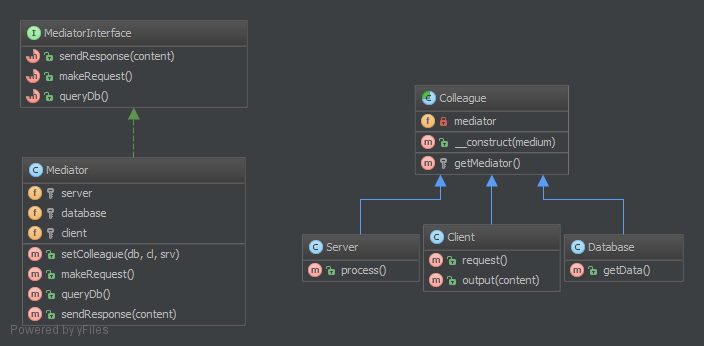

中介者（Mediator）模式的**定义**：定义一个中介对象来封装一系列对象之间的交互，使原有对象之间的耦合松散，且可以独立地改变它们之间的交互。中介者模式又叫调停模式，它是**迪米特法则**的典型应用。

中介者模式是一种对象行为型模式，其主要优点如下。

1. 类之间各司其职，符合迪米特法则。
2. 降低了对象之间的耦合性，使得对象易于独立地被复用。
3. 将对象间的一对多关联转变为一对一的关联，提高系统的灵活性，使得系统易于维护和扩展。


其主要缺点是：中介者模式将原本多个对象直接的相互依赖变成了中介者和多个同事类的依赖关系。当同事类越多时，中介者就会越臃肿，变得复杂且难以维护。

模式的结构与实现

中介者模式实现的关键是找出“中介者”，下面对它的结构和实现进行分析。

模式的结构

中介者模式包含以下主要角色。

1. 抽象中介者（Mediator）角色：它是中介者的接口，提供了同事对象注册与转发同事对象信息的抽象方法。
2. 具体中介者（Concrete Mediator）角色：实现中介者接口，定义一个 List 来管理同事对象，协调各个同事角色之间的交互关系，因此它依赖于同事角色。
3. 抽象同事类（Colleague）角色：定义同事类的接口，保存中介者对象，提供同事对象交互的抽象方法，实现所有相互影响的同事类的公共功能。
4. 具体同事类（Concrete Colleague）角色：是抽象同事类的实现者，当需要与其他同事对象交互时，由中介者对象负责后续的交互。


**3.4.1. 目的**
本模式提供了一种轻松的多组件之间弱耦合的协同方式。如果你有个 “情报中心”，观察者模式也是个好选择，类似于控制器（并非 MVC 意义上的控制器）。

所有关联协同的组件（称作 Colleague）仅与 MediatorInterface 接口建立耦合，面向对象编程中这是好事，一个良友胜于有多个朋友。这是该模式的重要特性。

**3.4.2. UML 图**



## 3.4.3. 代码

代码查看 [GitHub](https://github.com/domnikl/DesignPatternsPHP/tree/master/Behavioral/Mediator)

MediatorInterface.php
```php
<?php

namespace DesignPatterns\Behavioral\Mediator;

/**
 * MediatorInterface 接口为 Mediator 类建立契约
 * 该接口虽非强制，但优于 Liskov 替换原则。
 */
interface MediatorInterface
{
    /**
     * 发出响应
     *
     * @param string $content
     */
    public function sendResponse($content);

    /**
     * 做出请求
     */
    public function makeRequest();

    /**
     * 查询数据库
     */
    public function queryDb();
}
```
Mediator.php
```php
<?php

namespace DesignPatterns\Behavioral\Mediator;

/**
 * Mediator 是用于访设计模式的中介者模式的实体
 *
 * 本示例中，我用中介者模式做了一个 “Hello World” 的响应
 */
class Mediator implements MediatorInterface
{
    /**
     * @var Subsystem\Server
     */
    private $server;

    /**
     * @var Subsystem\Database
     */
    private $database;

    /**
     * @var Subsystem\Client
     */
    private $client;

    /**
     * @param Subsystem\Database $database
     * @param Subsystem\Client $client
     * @param Subsystem\Server $server
     */
    public function __construct(Subsystem\Database $database, Subsystem\Client $client, Subsystem\Server $server)
    {
        $this->database = $database;
        $this->server = $server;
        $this->client = $client;

        $this->database->setMediator($this);
        $this->server->setMediator($this);
        $this->client->setMediator($this);
    }

    public function makeRequest()
    {
        $this->server->process();
    }

    public function queryDb(): string
    {
        return $this->database->getData();
    }

    /**
     * @param string $content
     */
    public function sendResponse($content)
    {
        $this->client->output($content);
    }
}
```
Colleague.php
```php
<?php

namespace DesignPatterns\Behavioral\Mediator;

/**
 * Colleague 是个抽象类，该类对象虽彼此协同却不知彼此，只知中介者 Mediator 类
 */
abstract class Colleague
{
    /**
     * 确保子类不变化。
     *
     * @var MediatorInterface
     */
    protected $mediator;

    /**
     * @param MediatorInterface $mediator
     */
    public function setMediator(MediatorInterface $mediator)
    {
        $this->mediator = $mediator;
    }
}
```
Subsystem/Client.php
```php
<?php

namespace DesignPatterns\Behavioral\Mediator\Subsystem;

use DesignPatterns\Behavioral\Mediator\Colleague;

/**
 * Client 类是一个发出请求并获得响应的客户端。
 */
class Client extends Colleague
{
    public function request()
    {
        $this->mediator->makeRequest();
    }

    public function output(string $content)
    {
        echo $content;
    }
}
```
Subsystem/Database.php
```php
<?php

namespace DesignPatterns\Behavioral\Mediator\Subsystem;

use DesignPatterns\Behavioral\Mediator\Colleague;

class Database extends Colleague
{
    public function getData(): string
    {
        return 'World';
    }
}
```
Subsystem/Server.php
```php
<?php

namespace DesignPatterns\Behavioral\Mediator\Subsystem;

use DesignPatterns\Behavioral\Mediator\Colleague;

class Server extends Colleague
{
    public function process()
    {
        $data = $this->mediator->queryDb();
        $this->mediator->sendResponse(sprintf("Hello %s", $data));
    }
}
```
**3.4.4. 测试**
Tests/MediatorTest.php
```php
<?php

namespace DesignPatterns\Tests\Mediator\Tests;

use DesignPatterns\Behavioral\Mediator\Mediator;
use DesignPatterns\Behavioral\Mediator\Subsystem\Client;
use DesignPatterns\Behavioral\Mediator\Subsystem\Database;
use DesignPatterns\Behavioral\Mediator\Subsystem\Server;
use PHPUnit\Framework\TestCase;

class MediatorTest extends TestCase
{
    public function testOutputHelloWorld()
    {
        $client = new Client();
        new Mediator(new Database(), $client, new Server());

        $this->expectOutputString('Hello World');
        $client->request();
    }
}
```