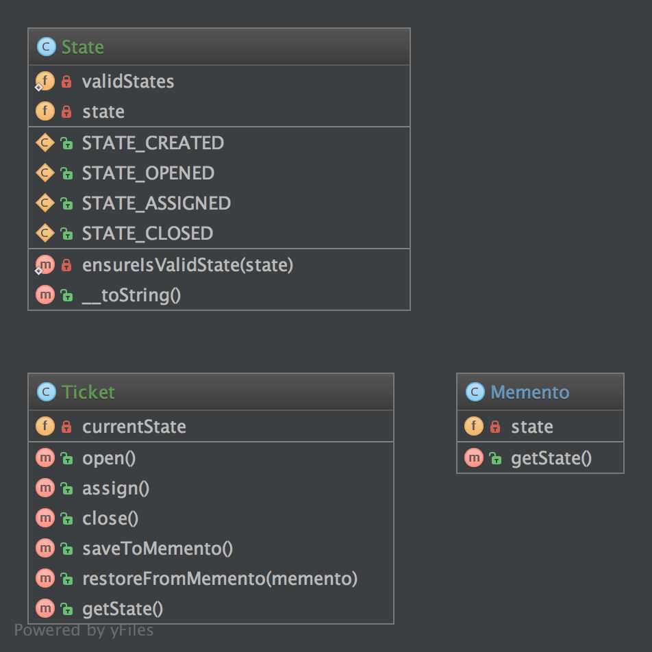

备忘录（Memento）模式的定义：在不破坏封装性的前提下，捕获一个对象的内部状态，并在该对象之外保存这个状态，以便以后当需要时能将该对象恢复到原先保存的状态。该模式又叫快照模式。

备忘录模式是一种对象行为型模式，其主要优点如下。

- 提供了一种可以恢复状态的机制。当用户需要时能够比较方便地将数据恢复到某个历史的状态。
- 实现了内部状态的封装。除了创建它的发起人之外，其他对象都不能够访问这些状态信息。
- 简化了发起人类。发起人不需要管理和保存其内部状态的各个备份，所有状态信息都保存在备忘录中，并由管理者进行管理，这符合单一职责原则。


其主要缺点是：资源消耗大。如果要保存的内部状态信息过多或者特别频繁，将会占用比较大的内存资源。

备忘录模式的核心是设计备忘录类以及用于管理备忘录的管理者类，现在我们来学习其结构与实现。

模式的结构

备忘录模式的主要角色如下。

1. 发起人（Originator）角色：记录当前时刻的内部状态信息，提供创建备忘录和恢复备忘录数据的功能，实现其他业务功能，它可以访问备忘录里的所有信息。
2. 备忘录（Memento）角色：负责存储发起人的内部状态，在需要的时候提供这些内部状态给发起人。
3. 管理者（Caretaker）角色：对备忘录进行管理，提供保存与获取备忘录的功能，但其不能对备忘录的内容进行访问与修改。

**3.5.1. 目的**
它提供了在不破坏封装（对象不需要具有返回当前状态的函数）的情况下恢复到之前状态（使用回滚）或者获取对象的内部状态。

备忘录模式使用 3 个类来实现：Originator，Caretaker 和 Memento。

Memento —— 负责存储 Originator 的 唯一内部状态 ，它可以包含： string，number， array，类的实例等等。Memento 「不是公开的类」（任何人都不应该且不能更改它），并防止 Originator 以外的对象访问它，它提供 2 个接口：Caretaker 只能看到备忘录的窄接口，他只能将备忘录传递给其他对象。Originator 却可看到备忘录的宽接口，允许它访问返回到先前状态所需要的所有数据。

Originator —— 它负责创建 Memento  ，并记录 外部对象当前时刻的状态， 并可使用 Memento 恢复内部状态。Originator 可根据需要决定 Memento 存储 Originator 的哪些内部状态。 Originator 也许（不是应该）有自己的方法（methods）。 但是，他们 不能更改已保存对象的当前状态。

Caretaker —— 负责保存 Memento。 它可以修改一个对象；决定 Originator 中对象当前时刻的状态； 从 Originator 获取对象的当前状态； 或者回滚 Originator 中对象的状态。

为了方便大家理解，以上翻译跟原文有少许出入

**3.5.2. 例子**
发送一个随机数
并将这个随机数存在时序机中
保存之前控制  ORM Model  中的状态
**3.5.3. UML 图**



## 3.5.4. 代码

你可以在 [GitHub](https://github.com/domnikl/DesignPatternsPHP/tree/master/Behavioral/Memento) 查看这段代码。

Memento.php
```php
<?php

namespace DesignPatterns\Behavioral\Memento;

class Memento
{
    /**
     * @var State
     */
    private $state;

    /**
     * @param State $stateToSave
     */
    public function __construct(State $stateToSave)
    {
        $this->state = $stateToSave;
    }
    
    /**
     * @return State
     */
    public function getState()
    {
        return $this->state;
    }
}
```
State.php
```php
<?php

namespace DesignPatterns\Behavioral\Memento;

class State
{
    const STATE_CREATED = 'created';
    const STATE_OPENED = 'opened';
    const STATE_ASSIGNED = 'assigned';
    const STATE_CLOSED = 'closed';

    /**
     * @var string
     */
    private $state;
    
    /**
     * @var string[]
     */
    private static $validStates = [
        self::STATE_CREATED,
        self::STATE_OPENED,
        self::STATE_ASSIGNED,
        self::STATE_CLOSED,
    ];
    
    /**
     * @param string $state
     */
    public function __construct(string $state)
    {
        self::ensureIsValidState($state);
    
        $this->state = $state;
    }
    
    private static function ensureIsValidState(string $state)
    {
        if (!in_array($state, self::$validStates)) {
            throw new \InvalidArgumentException('Invalid state given');
        }
    }
    
    public function __toString(): string
    {
        return $this->state;
    }
}
```
Ticket.php
```php
<?php

namespace DesignPatterns\Behavioral\Memento;

/**
 * Ticket 是  Originator  的原始副本
 */
class Ticket
{
    /**
     * @var State
     */
    private $currentState;

    public function __construct()
    {
        $this->currentState = new State(State::STATE_CREATED);
    }

    public function open()
    {
        $this->currentState = new State(State::STATE_OPENED);
    }

    public function assign()
    {
        $this->currentState = new State(State::STATE_ASSIGNED);
    }

    public function close()
    {
        $this->currentState = new State(State::STATE_CLOSED);
    }

    public function saveToMemento(): Memento
    {
        return new Memento(clone $this->currentState);
    }

    public function restoreFromMemento(Memento $memento)
    {
        $this->currentState = $memento->getState();
    }

    public function getState(): State
    {
        return $this->currentState;
    }
}
```
**3.5.5. 测试**
Tests/MementoTest.php
```php
<?php

namespace DesignPatterns\Behavioral\Memento\Tests;

use DesignPatterns\Behavioral\Memento\State;
use DesignPatterns\Behavioral\Memento\Ticket;
use PHPUnit\Framework\TestCase;

class MementoTest extends TestCase
{
    public function testOpenTicketAssignAndSetBackToOpen()
    {
        $ticket = new Ticket();

        // 打开 ticket
        $ticket->open();
        $openedState = $ticket->getState();
        $this->assertEquals(State::STATE_OPENED, (string) $ticket->getState());
    
        $memento = $ticket->saveToMemento();
    
        // 分配 ticket
        $ticket->assign();
        $this->assertEquals(State::STATE_ASSIGNED, (string) $ticket->getState());
    
        // 现在已经恢复到已打开的状态，但需要验证是否已经克隆了当前状态作为副本
        $ticket->restoreFromMemento($memento);
    
        $this->assertEquals(State::STATE_OPENED, (string) $ticket->getState());
        $this->assertNotSame($openedState, $ticket->getState());
    }
}
```