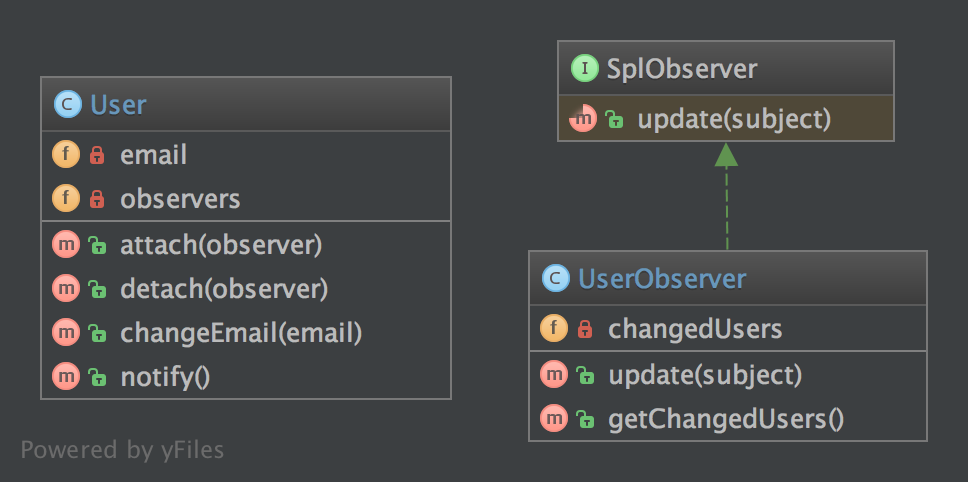
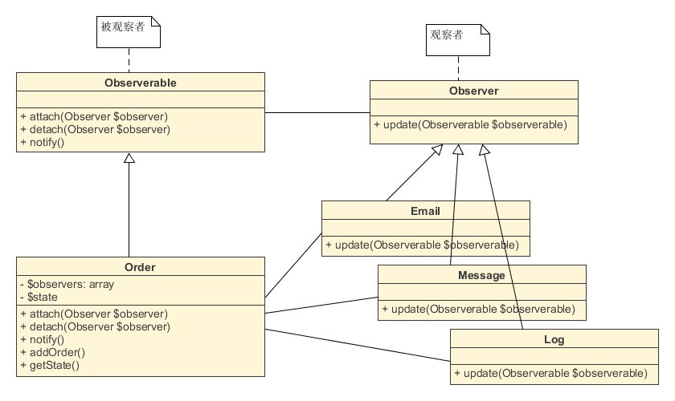

观察者（Observer）模式的定义：指多个对象间存在一对多的依赖关系，当一个对象的状态发生改变时，所有依赖于它的对象都得到通知并被自动更新。这种模式有时又称作发布-订阅模式、模型-视图模式，它是对象行为型模式。

观察者模式是一种对象行为型模式，其主要优点如下。

1. 降低了目标与观察者之间的耦合关系，两者之间是抽象耦合关系。符合依赖倒置原则。
2. 目标与观察者之间建立了一套触发机制。


它的主要缺点如下。

1. 目标与观察者之间的依赖关系并没有完全解除，而且有可能出现循环引用。
2. 当观察者对象很多时，通知的发布会花费很多时间，影响程序的效率。

实现观察者模式时要注意具体目标对象和具体观察者对象之间不能直接调用，否则将使两者之间紧密耦合起来，这违反了面向对象的设计原则。

模式的结构

观察者模式的主要角色如下。

1. 抽象主题（Subject）角色：也叫抽象目标类，它提供了一个用于保存观察者对象的聚集类和增加、删除观察者对象的方法，以及通知所有观察者的抽象方法。
2. 具体主题（Concrete Subject）角色：也叫具体目标类，它实现抽象目标中的通知方法，当具体主题的内部状态发生改变时，通知所有注册过的观察者对象。
3. 抽象观察者（Observer）角色：它是一个抽象类或接口，它包含了一个更新自己的抽象方法，当接到具体主题的更改通知时被调用。
4. 具体观察者（Concrete Observer）角色：实现抽象观察者中定义的抽象方法，以便在得到目标的更改通知时更新自身的状态。

**3.7.1. 目的**
**当对象的状态发生变化时，所有依赖于它的对象都得到通知并被自动更新。它使用的是低耦合的方式。**

**3.7.2. 例子**
使用观察者模式观察消息队列在 GUI 中的运行情况。
**3.7.3. 注意**
PHP 已经定义了 2 个接口用于快速实现观察者模式：SplObserver 和 SplSubject。

**3.7.4. UML 图**



## 3.7.5. 代码

你可以在  [GitHub](https://github.com/domnikl/DesignPatternsPHP/tree/master/Behavioral/Observer) 查看这段代码。

User.php
```php
<?php

namespace DesignPatterns\Behavioral\Observer;

/**
 * User 实现观察者模式 (称为主体)，它维护一个观察者列表，
 * 当对象发生变化时通知  User。
 */
class User implements \SplSubject
{
    /**
 * @var string
 */
    private $email;

    /**
 * @var \SplObjectStorage
 */
    private $observers;

    public function __construct()
    {
        $this->observers = new \SplObjectStorage();
    }

    public function attach(\SplObserver $observer)
    {
        $this->observers->attach($observer);
    }

    public function detach(\SplObserver $observer)
    {
        $this->observers->detach($observer);
    }

    public function changeEmail(string $email)
    {
        $this->email = $email;
        $this->notify();
    }

    public function notify()
    {
        /** @var \SplObserver $observer */
        foreach ($this->observers as $observer) {
            $observer->update($this);
        }
    }
}
```
UserObserver.php
```php
<?php

namespace DesignPatterns\Behavioral\Observer;

class UserObserver implements \SplObserver
{
    /**
 * @var User[]
 */
    private $changedUsers = [];

    /**
 * 它通常使用  SplSubject::notify()  通知主体
 *
 * @param \SplSubject $subject
 */
    public function update(\SplSubject $subject)
    {
        $this->changedUsers[] = clone $subject;
    }

    /**
 * @return User[]
 */
    public function getChangedUsers(): array
    {
        return $this->changedUsers;
    }
}
```
**3.7.6. 测试**
Tests/ObserverTest.php
```php
<?php

namespace DesignPatterns\Behavioral\Observer\Tests;

use DesignPatterns\Behavioral\Observer\User;
use DesignPatterns\Behavioral\Observer\UserObserver;
use PHPUnit\Framework\TestCase;

class ObserverTest extends TestCase
{
    public function testChangeInUserLeadsToUserObserverBeingNotified()
    {
        $observer = new UserObserver();

        $user = new User();
        $user->attach($observer);
    
        $user->changeEmail('foo@bar.com');
        $this->assertCount(1, $observer->getChangedUsers());
    }
}
```


观察者模式，也称发布-订阅模式，定义了一个被观察者和多个观察者的、一对多的对象关系。
在被观察者状态发生变化的时候，它的所有观察者都会收到通知，并自动更新。
观察者模式通常用在实时事件处理系统、组件间解耦、数据库驱动的消息队列系统，同时也是MVC设计模式中的重要组成部分。
以下我们以订单创建为例。
当订单创建后，系统会发送邮件和短信，并保存日志记录。


## 1 问题


在没有用观察者模式的时候，如下：

```php
<?php
class Order
{
    // 订单状态
    private $state = 0;
    // 订单状态有变化时发送通知
    public function addOrder()
    {
        $this->state = 1;
        // 发送邮件
        Email::update($this->state);
        // 短信通知
        Message::update($this->state);
        // 记录日志
        Log::update();
        // 其他更多通知
    }
}
```

代码中，在Order类中调用各类的方法来实现通知。当在客户端创建订单：
```
$order = new Order();
$order->addOrder();
```

就会同时产生三个通知：发送邮件、发送短信和记录日志。
在系统小的时候，这是非常快捷有效的方式。
可是，当系统变大的时候，这种方法马上面临难以扩展的问题，并且容易出错：

1. 如果订单不需要某种通知，比如不需要记录日志，则必须修改Order类，做状态的判断；
 2. 如果再加一种通知方式，如系统消息通知，则除了增加新类，同时还需要修改Order类和客户端。
这两条都不符合面向对象中的开闭原则，会让系统越来越难维护。


## 2 解决

接下来我们用观察者模式解决这个问题。

### 2.1 被观察者

被观察者是一些具体的实例，比如订单管理、用户登陆、评论回复、状态审核等等。
别的功能会依赖于它们的状态进行各种动作。

```php
<?php
/**
 * 被观察者接口
 */
interface Observable
{
    // 添加/注册观察者
    public function attach(Observer $observer);
    // 删除观察者
    public function detach(Observer $observer);
    // 触发通知
    public function notify();
}
/**
 * 被观察者
 * 职责：添加观察者到$observers属性中，
 * 有变动时通过notify()方法运行通知
 */
class Order implements Observable
{
    // 保存观察者
    private $observers = array();
    // 订单状态
    private $state = 0;
    // 添加（注册）观察者
    public function attach(Observer $observer)
    {
        $key = array_search($observer, $this->observers);
        if ($key === false) {
            $this->observers[] = $observer;
        }
    }
    // 移除观察者
    public function detach(Observer $observer)
    {
        $key = array_search($observer, $this->observers);
        if ($key !== false) {
            unset($this->observers[$key]);
        }
    }
    // 遍历调用观察者的update()方法进行通知，不关心其具体实现方式
    public function notify()
    {
        foreach ($this->observers as $observer) {
            // 把本类对象传给观察者，以便观察者获取当前类对象的信息
            $observer->update($this);
        }
    }
    // 订单状态有变化时发送通知
    public function addOrder()
    {
        $this->state = 1;
        $this->notify();
    }
    // 获取提供给观察者的状态
    public function getState()
    {
        return $this->state;
    }
}
```

被观察者至少要实现attach()、detach()、notify()三个方法，用以添加、删除和通知观察者。
通知的方式是，在类中的其他方法（如：创建订单）调用notify()方法。
另外，观察者可能用到被观察者的一些状态信息。
所以，要在notify()中把当前对象作为参数传给观察者，方便其通过提供的public方法获得被观察者的状态信息。
本例用getState()方法供给观察者获取状态信息。


### 2.2 观察者


观察者可能有多个，但每个观察者都必须实现Observer接口规定的update()方法，这是接收被观察者通知的唯一渠道。

```php
<?php
/**
 * 观察者接口
 */
interface Observer
{
    // 接收到通知的处理方法
    public function update(Observable $observable);
}
/**
 * 观察者1：发送邮件
 */
class Email implements Observer
{
    public function update(Observable $observable)
    {
        $state = $observable->getState();
        if ($state) {
            echo '发送邮件：您已经成功下单。';
        } else {
            echo '发送邮件：下单失败，请重试。';
        }
    }
}
/**
 * 观察者2：短信通知
 */
class Message implements Observer
{
    public function update(Observable $observable)
    {
    $state = $observable->getState();
    if ($state) {
        echo '短信通知：您已下单成功。';
    } else {
        echo '短信通知：下单失败，请重试。';
    }
    }
}
/**
 * 观察者3：记录日志
 */
class Log implements Observer
{
    public function update(Observable $observable)
    {
        echo '记录日志：生成了一个订单记录。';
    }
}
```

这里有三个观察者：发送邮件、短信通知和记录日志，它们都实现了update()方法。
其中，发送邮件和短信依赖于订单、也就是被观察者的状态，来决定发送消息的内容，记录日志则不需要订单的状态。


### 2.3 客户端


然后我们创建一个客户端，内容：

```php
<?php
// 创建观察者对象
$email = new Email();
$message = new Message();
$log = new Log();
// 创建订单对象
$order = new Order();
// 向订单对象中注册3个观察者：发送邮件、短信通知、记录日志
$order->attach($email);
$order->attach($message);
$order->attach($log);
// 添加订单，添加时会自动发送通知给观察者
$order->addOrder();
echo '<br />';
// 删除记录日志观察者
$order->detach($log);
// 添加另一个订单，会再次发送通知给观察着
$order->addOrder();
```

执行应用后，会输出这样的消息：
发送邮件：您已经成功下单。添加日志：生成了一个订单记录。系统消息：您已下单成功。
发送邮件：您已经成功下单。添加日志：生成了一个订单记录。对于不需要通知的观察者，用detach()移出观察者列表即可。
这种情况就解开了类之间的耦合。


### 2.4 新增观察者


如果再需要新增一个观察者，如下，只需要添加观察者类本身，实现update()方法。

```php
<?php
/**
 * 观察者4：系统消息
 */
class Alert implements Observer
{
    public function update(Observable $observable)
    {
        echo '系统消息：您的订单有更新了~~~';
    }
}
//再到客户端中注册Alert类到观察者列表中：
// 创建“系统消息”观察者
$alert = new Alert();
// 注册观察者到订单对象中
$order->attach($alert);
//就能订阅被观察者的通知。
```

## 3 特点


在观察者模式中，被观察者完全不需要关心观察者，在自身状态有变化是，遍历执行观察者update()方法即完成通知。
在观察者模式中，被观察者通过添加attach()方法，提供给观察者注册，使自己变得可见。
当被观察者改变时，给注册的观察者发送通知。至于观察者如何处理通知，被观察者不需要关心。
这是一种良好的设计，对象之间不必相互理解，同样能够相互通信。
UML如下：



面向对象编程中，任何对象的状态都非常重要，它们是对象间交互的桥梁。
当一个对象的改变需要被其他对象关注时，观察者模式就派上用场了。

参考资料：
\1. [Design Patterns: The Observer Pattern](https://code.tutsplus.com/tutorials/design-patterns-the-observer-pattern--cms-22975)
\2. [php面向对象设计模式 之 观察者模式](https://segmentfault.com/a/1190000000723382)
\3. [PHP设计模式系列 - 观察者模式](http://blog.csdn.net/initphp/article/details/7708006)
\4. [PHP版观察者模式](http://www.tuliang.org/php-observer-pattern/)
\5. [Understanding the Observer Pattern](https://www.sitepoint.com/understanding-the-observer-pattern/)
\6. [Five common PHP design patterns](https://www.ibm.com/developerworks/library/os-php-designptrns/)
\7. [观察者模式](https://zh.wikipedia.org/wiki/观察者模式)

