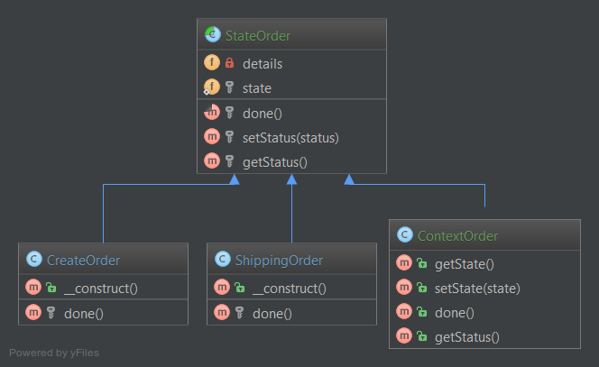

状态（State）模式的定义：对有状态的对象，把复杂的“判断逻辑”提取到不同的状态对象中，允许状态对象在其内部状态发生改变时改变其行为。

状态模式是一种对象行为型模式，其主要优点如下。

1. 结构清晰，状态模式将与特定状态相关的行为局部化到一个状态中，并且将不同状态的行为分割开来，满足“单一职责原则”。
2. 将状态转换显示化，减少对象间的相互依赖。将不同的状态引入独立的对象中会使得状态转换变得更加明确，且减少对象间的相互依赖。
3. 状态类职责明确，有利于程序的扩展。通过定义新的子类很容易地增加新的状态和转换。


状态模式的主要缺点如下。

1. 状态模式的使用必然会增加系统的类与对象的个数。
2. 状态模式的结构与实现都较为复杂，如果使用不当会导致程序结构和代码的混乱。
3. 状态模式对开闭原则的支持并不太好，对于可以切换状态的状态模式，增加新的状态类需要修改那些负责状态转换的源码，否则无法切换到新增状态，而且修改某个状态类的行为也需要修改对应类的源码。

状态模式把受环境改变的对象行为包装在不同的状态对象里，其意图是让一个对象在其内部状态改变的时候，其行为也随之改变。现在我们来分析其基本结构和实现方法。

模式的结构

状态模式包含以下主要角色。

1. 环境类（Context）角色：也称为上下文，它定义了客户端需要的接口，内部维护一个当前状态，并负责具体状态的切换。
2. 抽象状态（State）角色：定义一个接口，用以封装环境对象中的特定状态所对应的行为，可以有一个或多个行为。
3. 具体状态（Concrete State）角色：实现抽象状态所对应的行为，并且在需要的情况下进行状态切换。

#### 3.9.1. 目的

状态模式可以基于一个对象的同种事务而封装出不同的行为。它提供一种简洁的方式使得对象在运行时可以改变自身行为，而不必借助单一庞大的条件判断语句。

#### 3.9.2. UML 类图



## 3.9.3. 代码

你可以在  [GitHub](https://github.com/domnikl/DesignPatternsPHP/tree/master/Behavioral/State) 上找到这些代码

ContextOrder.php
```php
<?php

namespace DesignPatterns\Behavioral\State;

class ContextOrder extends StateOrder
{
    public function getState():StateOrder
    {
        return static::$state;
    }

    public function setState(StateOrder $state)
    {
        static::$state = $state;
    }
    
    public function done()
    {
        static::$state->done();
    }
    
    public function getStatus(): string
    {
        return static::$state->getStatus();
    }
}
```
StateOrder.php
```php
<?php

namespace DesignPatterns\Behavioral\State;

abstract class StateOrder
{
    /**
     * @var array
     */
    private $details;

    /**
     * @var StateOrder $state
     */
    protected static $state;
    
    /**
     * @return mixed
     */
    abstract protected function done();
    
    protected function setStatus(string $status)
    {
        $this->details['status'] = $status;
        $this->details['updatedTime'] = time();
    }
    
    protected function getStatus(): string
    {
        return $this->details['status'];
    }
}
```
ShippingOrder.php
```php
<?php

namespace DesignPatterns\Behavioral\State;

class ShippingOrder extends StateOrder
{
    public function __construct()
    {
        $this->setStatus('shipping');
    }

    protected function done()
    {
        $this->setStatus('completed');
    }
}
```
CreateOrder.php
```php
<?php

namespace DesignPatterns\Behavioral\State;

class CreateOrder extends StateOrder
{
    public function __construct()
    {
        $this->setStatus('created');
    }

    protected function done()
    {
        static::$state = new ShippingOrder();
    }
}
```
**3.9.4. 测试**
Tests/StateTest.php
```php
<?php

namespace DesignPatterns\Behavioral\State\Tests;

use DesignPatterns\Behavioral\State\ContextOrder;
use DesignPatterns\Behavioral\State\CreateOrder;
use PHPUnit\Framework\TestCase;

class StateTest extends TestCase
{
    public function testCanShipCreatedOrder()
    {
        $order = new CreateOrder();
        $contextOrder = new ContextOrder();
        $contextOrder->setState($order);
        $contextOrder->done();

        $this->assertEquals('shipping', $contextOrder->getStatus());
    }
    
    public function testCanCompleteShippedOrder()
    {
        $order = new ShippingOrder();
        $contextOrder = new ContextOrder();
        $contextOrder->setState($order);
        $contextOrder->done();
    
        $this->assertEquals('completed', $contextOrder->getStatus());
    }
}
```