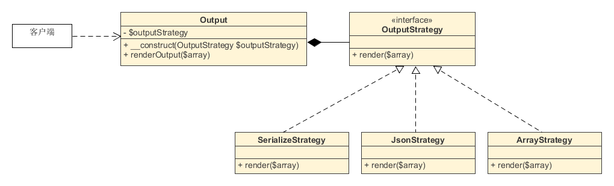

**3.10.1. 术语：**
上下文
策略
具体策略
**3.10.2. 目的**
分离「策略」并使他们之间能互相快速切换。此外，这种模式是一种不错的继承替代方案（替代使用扩展抽象类的方式）。

**3.10.3. 例子**
对一个对象列表进行排序，一种按照日期，一种按照 id
简化版的的单元测试：例如，在使用文件存储和内存存储之间互相切换
**3.10.4. UML 类图**


## 3.10.5. 代码

你可以在 [GitHub](https://github.com/domnikl/DesignPatternsPHP/tree/master/Behavioral/Strategy) 上找到这个代码。

Context.php
```php
<?php

namespace DesignPatterns\Behavioral\Strategy;

class Context
{
    /**
     * @var ComparatorInterface
     */
    private $comparator;

    public function __construct(ComparatorInterface $comparator)
    {
        $this->comparator = $comparator;
    }
    
    public function executeStrategy(array $elements) : array
    {
        uasort($elements, [$this->comparator, 'compare']);
    
        return $elements;
    }
}
```
ComparatorInterface.php
```php
<?php

namespace DesignPatterns\Behavioral\Strategy;

interface ComparatorInterface
{
    /**
     * @param mixed $a
     * @param mixed $b
     *
     * @return int
     */
    public function compare($a, $b): int;
}
```
DateComparator.php
```php
<?php

namespace DesignPatterns\Behavioral\Strategy;

class DateComparator implements ComparatorInterface
{
    /**
     * @param mixed $a
     * @param mixed $b
     *
     * @return int
     */
    public function compare($a, $b): int
    {
        $aDate = new \DateTime($a['date']);
        $bDate = new \DateTime($b['date']);

        return $aDate <=> $bDate;
    }
}
```
IdComparator.php
```php
<?php

namespace DesignPatterns\Behavioral\Strategy;

class IdComparator implements ComparatorInterface
{
    /**
     * @param mixed $a
     * @param mixed $b
     *
     * @return int
     */
    public function compare($a, $b): int
    {
        return $a['id'] <=> $b['id'];
    }
}
```
**3.10.6. 测试**
Tests/StrategyTest.php
```php
<?php

namespace DesignPatterns\Behavioral\Strategy\Tests;

use DesignPatterns\Behavioral\Strategy\Context;
use DesignPatterns\Behavioral\Strategy\DateComparator;
use DesignPatterns\Behavioral\Strategy\IdComparator;
use PHPUnit\Framework\TestCase;

class StrategyTest extends TestCase
{
    public function provideIntegers()
    {
        return [
            [
                [['id' => 2], ['id' => 1], ['id' => 3]],
                ['id' => 1],
            ],
            [
                [['id' => 3], ['id' => 2], ['id' => 1]],
                ['id' => 1],
            ],
        ];
    }

    public function provideDates()
    {
        return [
            [
                [['date' => '2014-03-03'], ['date' => '2015-03-02'], ['date' => '2013-03-01']],
                ['date' => '2013-03-01'],
            ],
            [
                [['date' => '2014-02-03'], ['date' => '2013-02-01'], ['date' => '2015-02-02']],
                ['date' => '2013-02-01'],
            ],
        ];
    }
    
    /**
     * @dataProvider provideIntegers
     *
     * @param array $collection
     * @param array $expected
     */
    public function testIdComparator($collection, $expected)
    {
        $obj = new Context(new IdComparator());
        $elements = $obj->executeStrategy($collection);
    
        $firstElement = array_shift($elements);
        $this->assertEquals($expected, $firstElement);
    }
    
    /**
     * @dataProvider provideDates
     *
     * @param array $collection
     * @param array $expected
     */
    public function testDateComparator($collection, $expected)
    {
        $obj = new Context(new DateComparator());
        $elements = $obj->executeStrategy($collection);
    
        $firstElement = array_shift($elements);
        $this->assertEquals($expected, $firstElement);
    }
}
```


策略模式：（Strategy pattern）

**适用场景**：当我们使用的类比较简单，但是又相互不关联，只是在特定行为上有所差异的场景下，策略模式就十分有用。

策略模式定义了一组相同类型的算法，算法之间独立封装，并且可以互换代替。
这些算法是同一类型问题的多种处理方式，他们具体行为有差别。
每一个算法、或说每一种处理方式称为一个策略。
在应用中，就可以根据环境的不同，选择不同的策略来处理问题。
 
以数组输出为例。
数组的输出有序列化输出、JSON字符串输出和数组格式输出等方式。
每种输出方式都可以独立封装起来，作为一个策略。
应用时，如要把数组保存到数据库中，可以用序列化方式输出。
要提供给APP作接口，可以用JSON字符串输出。
其他程序调用，则直接输出数组格式。


## 1 问题


在没有设计模式的情况，我们用一个类集中处理数组输出，如下：
/**
\* 根据给定类型，将数组转换后输出
*/
class Output
{
public function render($array, $type = '')
{
if ($type === 'serialize') {
return serialize($array);
} elseif ($type === 'json') {
return json_encode($array);
} else {
return $array;
}
}
}
客户端直接使用这个类来处理数组，就能达到效果：
/**
\* 客户端代码
*/
$test = ['a', 'b', 'c'];

// 实例化输出类
$output = new Output();

// 直接返回数组
$data = $output->render($test, 'array');

// 返回JSON字符串
$data = $output->render($test, 'json');这种方法的优点是简单、快捷，在小方案中使用非常合适。
但是，如果是一个复杂方案，包括大量的处理逻辑需要封装，或者处理方式变动较大，则就显得混乱。
当需要添加一种算法，就必须修改Output类，影响原有代码，可扩展性差。
如果输出方式很多，if-else或switch-case语句也会很多，代码混乱难以维护。


## 2 解决


那如何用策略模式解决这个问题呢？
策略模式将各种方案分离开来，让操作者根据具体的需求，动态地选择不同的策略方案。


### 2.1 策略类


首先，定义一系列的策略类，它们独立封装，并且遵循统一的接口。
/**
\* 策略接口
*/
interface OutputStrategy
{
public function render($array);
}

/**
\* 策略类1：返回序列化字符串
*/
class SerializeStrategy implements OutputStrategy
{
public function render($array)
{
return serialize($array);
}
}

/**
\* 策略类2：返回JSON编码后的字符串
*/
class JsonStrategy implements OutputStrategy
{
public function render($array)
{
return json_encode($array);
}
}

/**
\* 策略类3：直接返回数组
*/
class ArrayStrategy implements OutputStrategy
{
public function render($array)
{
return $array;
}
}以后的维护过程中，以上代码都不需修改了。
如果需要增加输出方式，重新建一个类就可以了。
（根据FIG-PSR规范，一个类就是一个独立的PHP文件。）


### 2.2 环境类


环境角色用来管理策略，实现不同策略的切换功能。
同样，一旦写好，环境角色类以后也不需要修改了。
/**
\* 环境角色类
*/
class Output
{
private $outputStrategy;

// 传入的参数必须是策略接口的子类或子类的实例
public function __construct(OutputStrategy $outputStrategy)
{
$this->outputStrategy = $outputStrategy;
}

public function renderOutput($array)
{
return $this->outputStrategy->render($array);
}
}

### 2.3 客户端代码


在客户端中，策略模式通过给予不同的具体策略，来获取不同的结果。
/**
\* 客户端代码
*/
$test = ['a', 'b', 'c'];

// 需要返回数组
$output = new Output(new ArrayStrategy());
$data = $output->renderOutput($test);

// 需要返回JSON
$output = new Output(new JsonStrategy());
$data = $output->renderOutput($test);对于较为复杂的业务逻辑显得更为直观，扩展也更为方便。


## 3 特点


策略模式主要用来分离算法，根据相同的行为抽象来做不同的具体策略实现。
策略模式结构清晰明了、使用简单直观。并且耦合度相对而言较低，扩展方便。同时操作封装也更为彻底，数据更为安全。
当然策略模式也有缺点，就是随着策略的增加，子类也会变得繁多。
但缺点并不会影响系统运行，所以在复杂业务中应该考虑使用。
策略模式UML图：



参考资料：
\1. [Design Patterns ： Strategy](http://www.phptherightway.com/pages/Design-Patterns.html#strategy)
\2. [策略模式 - 维基百科](https://zh.wikipedia.org/wiki/策略模式)
\3. [Android设计模式源码解析之策略模式](https://github.com/simple-android-framework/android_design_patterns_analysis/tree/master/strategy/gkerison)
\4. [PHP设计模式笔记：使用PHP实现策略模式](http://www.phppan.com/2010/07/php-design-pattern-12-strategy/)
\5. [Design Patterns: The Strategy Pattern](https://code.tutsplus.com/tutorials/design-patterns-the-strategy-pattern--cms-22796)