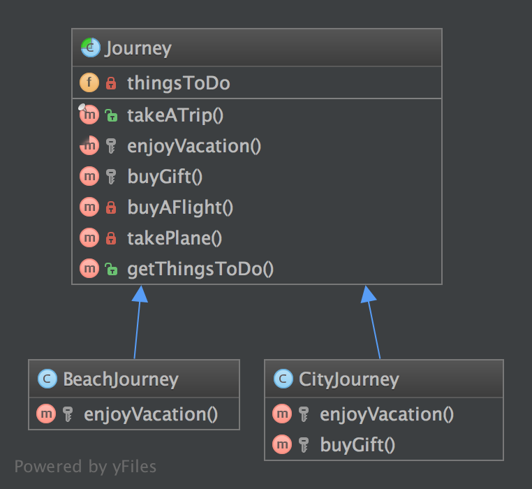

模板方法（Template Method）模式的定义如下：定义一个操作中的算法骨架，而将算法的一些步骤延迟到子类中，使得子类可以不改变该算法结构的情况下重定义该算法的某些特定步骤。它是一种类行为型模式。

该模式的主要优点如下。

1. 它封装了不变部分，扩展可变部分。它把认为是不变部分的算法封装到父类中实现，而把可变部分算法由子类继承实现，便于子类继续扩展。
2. 它在父类中提取了公共的部分代码，便于代码复用。
3. 部分方法是由子类实现的，因此子类可以通过扩展方式增加相应的功能，符合开闭原则。


该模式的主要缺点如下。

1. 对每个不同的实现都需要定义一个子类，这会导致类的个数增加，系统更加庞大，设计也更加抽象，间接地增加了系统实现的复杂度。
2. 父类中的抽象方法由子类实现，子类执行的结果会影响父类的结果，这导致一种反向的控制结构，它提高了代码阅读的难度。
3. 由于继承关系自身的缺点，如果父类添加新的抽象方法，则所有子类都要改一遍。

模板方法模式需要注意抽象类与具体子类之间的协作。它用到了虚函数的多态性技术以及“不用调用我，让我来调用你”的反向控制技术。现在来介绍它们的基本结构。

模式的结构

模板方法模式包含以下主要角色。

1）抽象类/抽象模板（Abstract Class）

抽象模板类，负责给出一个算法的轮廓和骨架。它由一个模板方法和若干个基本方法构成。这些方法的定义如下。

① 模板方法：定义了算法的骨架，按某种顺序调用其包含的基本方法。

② 基本方法：是整个算法中的一个步骤，包含以下几种类型。

- 抽象方法：在抽象类中声明，由具体子类实现。
- 具体方法：在抽象类中已经实现，在具体子类中可以继承或重写它。
- 钩子方法：在抽象类中已经实现，包括用于判断的逻辑方法和需要子类重写的空方法两种。

2）具体子类/具体实现（Concrete Class）

具体实现类，实现抽象类中所定义的抽象方法和钩子方法，它们是一个顶级逻辑的一个组成步骤。

**3.11.1. Purpose**
模板方法模式是一种行为型的设计模式。

可能你已经见过这种模式很多次了。它是一种让抽象模板的子类「完成」一系列算法的行为策略。

众所周知的「好莱坞原则」：「不要打电话给我们，我们会打电话给你」。这个类不是由子类调用的，而是以相反的方式。怎么做？当然很抽象啦！

换而言之，它是一种非常适合框架库的算法骨架。用户只需要实现子类的一种方法，其父类便可去搞定这项工作了。

这是一种分离具体类的简单办法，且可以减少复制粘贴，这也是它常见的原因。

**3.11.2. UML 类图**



## 3.11.3. 代码

你可以在 [GitHub](https://github.com/domnikl/DesignPatternsPHP/tree/master/Behavioral/TemplateMethod) 上找到这些代码

Journey.php
```php
<?php

namespace DesignPatterns\Behavioral\TemplateMethod;

abstract class Journey
{
    /**
     * @var string[]
     */
    private $thingsToDo = [];

    /**
     * 这是当前类及其子类提供的公共服务
     * 注意，它「冻结」了全局的算法行为
     * 如果你想重写这个契约，只需要实现一个包含 takeATrip() 方法的接口
     */
    final public function takeATrip()
    {
        $this->thingsToDo[] = $this->buyAFlight();
        $this->thingsToDo[] = $this->takePlane();
        $this->thingsToDo[] = $this->enjoyVacation();
        $buyGift = $this->buyGift();
    
        if ($buyGift !== null) {
            $this->thingsToDo[] = $buyGift;
        }
    
        $this->thingsToDo[] = $this->takePlane();
    }
    
    /**
     * 这个方法必须要实现，它是这个模式的关键点
     */
    abstract protected function enjoyVacation(): string;
    
    /**
     * 这个方法是可选的，也可能作为算法的一部分
     * 如果需要的话你可以重写它
     *
     * @return null|string
     */
    protected function buyGift()
    {
        return null;
    }
    
    private function buyAFlight(): string
    {
        return 'Buy a flight ticket';
    }
    
    private function takePlane(): string
    {
        return 'Taking the plane';
    }
    
    /**
     * @return string[]
     */
    public function getThingsToDo(): array
    {
        return $this->thingsToDo;
    }
}
```
BeachJourney.php
```php
<?php

namespace DesignPatterns\Behavioral\TemplateMethod;

class BeachJourney extends Journey
{
    protected function enjoyVacation(): string
    {
        return "Swimming and sun-bathing";
    }
}
```
CityJourney.php
```php
<?php

namespace DesignPatterns\Behavioral\TemplateMethod;

class CityJourney extends Journey
{
    protected function enjoyVacation(): string
    {
        return "Eat, drink, take photos and sleep";
    }

    protected function buyGift(): string
    {
        return "Buy a gift";
    }
}
```
**3.11.4. Test**
Tests/JourneyTest.php
```php
<?php

namespace DesignPatterns\Behavioral\TemplateMethod\Tests;

use DesignPatterns\Behavioral\TemplateMethod;
use PHPUnit\Framework\TestCase;

class JourneyTest extends TestCase
{
    public function testCanGetOnVacationOnTheBeach()
    {
        $beachJourney = new TemplateMethod\BeachJourney();
        $beachJourney->takeATrip();

        $this->assertEquals(
            ['Buy a flight ticket', 'Taking the plane', 'Swimming and sun-bathing', 'Taking the plane'],
            $beachJourney->getThingsToDo()
        );
    }
    
    public function testCanGetOnAJourneyToACity()
    {
        $cityJourney = new TemplateMethod\CityJourney();
        $cityJourney->takeATrip();
    
        $this->assertEquals(
            [
                'Buy a flight ticket',
                'Taking the plane',
                'Eat, drink, take photos and sleep',
                'Buy a gift',
                'Taking the plane'
            ],
            $cityJourney->getThingsToDo()
        );
    }
}
```