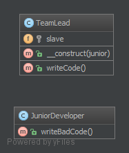

**4.1.1. 目的**
在委托模式的示例里，一个对象将它要执行的任务委派给与之关联的帮助对象去执行。在示例中，「组长」声明了 writeCode 方法并使用它，其实「组长」把 writeCode 委托给「菜鸟开发者」的 writeBadCode 方法做了。这种反转责任的做法隐藏了其内部执行 writeBadCode 的细节。

**4.1.2. 例子**
请阅读 JuniorDeveloper.php，TeamLead.php 中的代码，然后在 Usage.php 中结合在一起。

**4.1.3. UML 类图**



## 4.1.4. 代码

你可以在 [GitHub](https://github.com/domnikl/DesignPatternsPHP/tree/master/More/Delegation) 上找到这些代码

TeamLead.php
```php
<?php

namespace DesignPatterns\More\Delegation;

class TeamLead
{
    /**
     * @var JuniorDeveloper
     */
    private $junior;

    /**
     * @param JuniorDeveloper $junior
     */
    public function __construct(JuniorDeveloper $junior)
    {
        $this->junior = $junior;
    }
    
    public function writeCode(): string
    {
        return $this->junior->writeBadCode();
    }
}
```
JuniorDeveloper.php
```
<?php

namespace DesignPatterns\More\Delegation;

class JuniorDeveloper
{
    public function writeBadCode(): string
    {
        return 'Some junior developer generated code...';
    }
}
```
**4.1.5. 测试**
Tests/DelegationTest.php
```php
<?php

namespace DesignPatterns\More\Delegation\Tests;

use DesignPatterns\More\Delegation;
use PHPUnit\Framework\TestCase;

class DelegationTest extends TestCase
{
    public function testHowTeamLeadWriteCode()
    {
        $junior = new Delegation\JuniorDeveloper();
        $teamLead = new Delegation\TeamLead($junior);

        $this->assertEquals($junior->writeBadCode(), $teamLead->writeCode());
    }
}
```