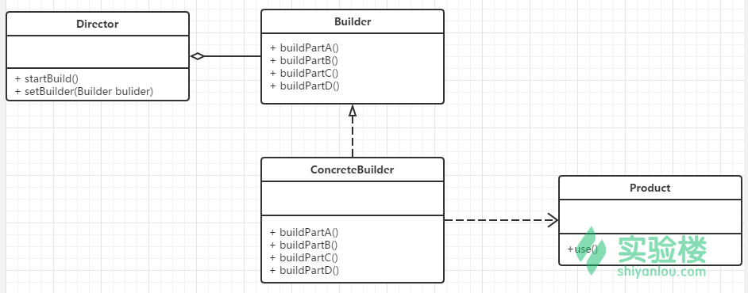

模式
这些模式可以分为三个大类。

1. 创建型
在软件工程中，创建型设计模式是处理对象创建机制的设计模式，试图以适当的方式来创建对象。对象创建的基本形式可能会带来设计问题，亦或增加了设计的复杂度。创建型设计模式通过控制这个对象的创建方式来解决此问题。

2. 结构型#
在软件工程中，结构型设计模式是通过识别实体之间关系来简化设计的设计模式。

3. 行为型
在软件工程中，行为设计模式是识别对象之间的通用通信模式并实现这些模式的设计模式。 通过这样做，这些模式增加了执行此通信的灵活性。

转载于 https://learnku.com/docs/php-design-patterns/2018


**除了以上的模式，还有常用的一般是渗透到应用当中，如MVC模式和ORM模式。**

# 建造者模式


又名：生成器模式，是一种对象构建模式。它可以将复杂对象的建造过程抽象出来（抽象类别），使这个抽象过程的不同实现方法可以构造出不同表现（属性）的对象。
建造者模式是一步一步创建一个复杂的对象，它允许用户只通过指定复杂对象的类型和内容就可以构建它们，用户不需要知道内部的具体构建细节。例如，一辆汽车由轮子，发动机以及其他零件组成，对于普通人而言，我们使用的只是一辆完整的车，这时，我们需要加入一个构造者，让他帮我们把这些组件按序组装成为一辆完整的车。
角色：
• Builder：抽象构造者类，为创建一个Product对象的各个部件指定抽象接口。
• ConcreteBuilder：具体构造者类，实现Builder的接口以构造和装配该产品的各个部件。定义并明确它所创建的表示。提供一个检索产品的接口
• Director：指挥者，构造一个使用Builder接口的对象。
• Product：表示被构造的复杂对象。ConcreateBuilder创建该产品的内部表示并定义它的装配过程。
包含定义组成部件的类，包括将这些部件装配成最终产品的接口。
UML类图：



此处输入图片的描述示例代码：

```php
<?php 
/**
* chouxiang builer
*/
abstract class Builder
{
 protected $car;
 abstract public function buildPartA();
 abstract public function buildPartB();
 abstract public function buildPartC();
 abstract public function getResult();
}
class CarBuilder extends Builder
{
 function __construct()
 {
 $this->car = new Car();
 }
 public function buildPartA(){
 $this->car->setPartA('发动机');
 }
 public function buildPartB(){
 $this->car->setPartB('轮子');
 }
 public function buildPartC(){
 $this->car->setPartC('其他零件');
 }
 public function getResult(){
 return $this->car;
 }
}
class Car
{
 protected $partA;
 protected $partB;
 protected $partC;
 public function setPartA($str){
 $this->partA = $str;
 }
 public function setPartB($str){
 $this->partB = $str;
 }
 public function setPartC($str){
 $this->partC = $str;
 }
 public function show()
 {
 echo "这辆车由：".$this->partA.','.$this->partB.',和'.$this->partC.'组成';
 }
}
class Director
{
 public $myBuilder;
 public function startBuild()
 {
 $this->myBuilder->buildPartA();
 $this->myBuilder->buildPartB();
 $this->myBuilder->buildPartC();
 return $this->myBuilder->getResult();
 }
 public function setBuilder(Builder $builder)
 {
 $this->myBuilder = $builder;
 }
}
$carBuilder = new CarBuilder();
$director = new Director();
$director->setBuilder($carBuilder);
$newCar = $director->startBuild();
$newCar->show();
```

