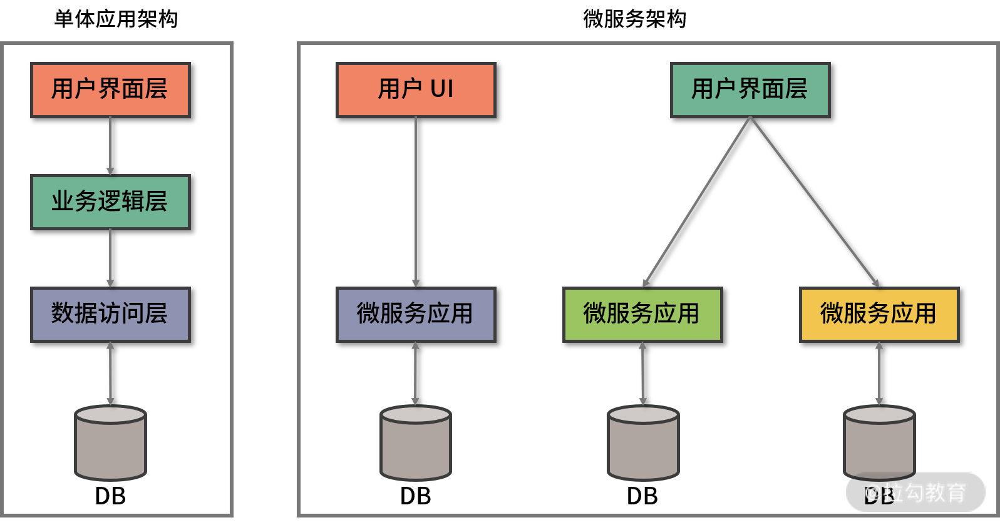
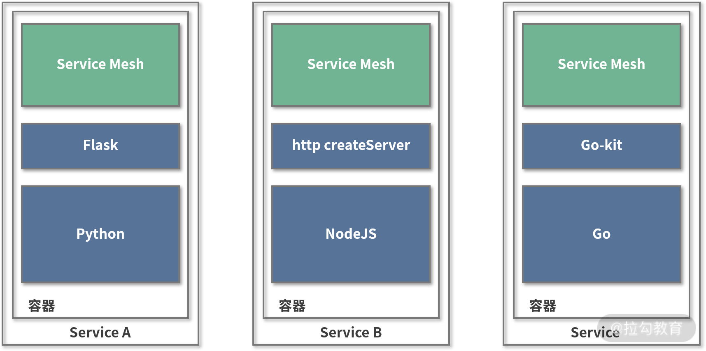
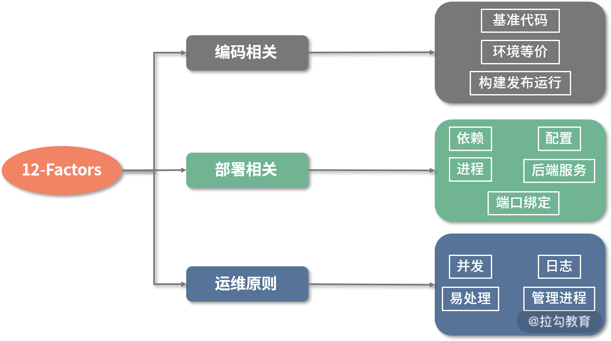

在前一篇文章中，我们讲解了**云原生（Cloud Native）** 的相关概念，以及它是如何重构互联网产品开发模式的。我们知道云原生不是某个单独的技术，而是技术与管理方法的合集。为便于你在正式了解实践云原生架构的方法之前能有一个系统性的思维，今天我们将继续“云原生”这个话题，介绍云原生基础架构的组成部分，以及构建出来的云原生应用的特征。

## 云原生的基础架构

云原生中既有指导云原生开发的方法论，也包含实践的具体技术。上一篇文章中我们介绍过CNCF 给出的云原生定义中包括**微服务、容器、服务网格、不可变基础设施和声明式 API** 等代表技术，构建云原生应用就主要靠这些关键技术。下面我们就来具体介绍下这 5 个关键技术。

#### 微服务

单体应用开发简单，但随着业务复杂度的提升，单体应用的弊端逐渐显现，开发效率和系统应用的可扩展性等方面出现严重问题。微服务架构的出现就解决了这个问题，它根据领域模型将巨大的单体分成界限清晰的微服务，并保持每个服务独立可以迭代（如下图）。

单体应用架构 VS 微服务架构

相比传统的单体应用架构，微服务架构具有服务高度自治、高效迭代、易于扩展和支持多语言编程等优点。

但是从另一个角度来看，微服务架构的灵活、开发的敏捷也带来了一些新的问题，如数量众多的微服务运维、分布式系统固有的复杂性，以及分布式事务、服务之间的调用等。单体应用可能只需部署至“**一个**”应用服务器集群，而微服务架构则需要开发维护“**很多个**”独立的服务，并且还可能需要支持多种语言和环境，这当中的构建、测试、部署和运行成本提高了不少。

#### 容器
为了解决微服务架构下大量应用部署的问题，由此引入了**容器**。容器是一种轻量级的虚拟化技术，能够在单一主机上提供多个隔离的操作系统环境，通过一系列的命名空间隔离进程，每个容器都有唯一的可写文件系统和资源配额。

容器化功能比较强大，不仅能解决虚拟机所能够解决的问题，同时也能够解决虚拟机由于资源要求过高而无法解决的问题。它具有的特点主要包括：隔离应用依赖、创建应用镜像并进行复制、创建容易分发的即启即用的应用、支持实例简单、快速地扩展等。

Docker 是当前流行的开源应用容器引擎，基于 Docker 容器化技术，用户可以将微服务及其所需的所有配置、依赖关系和环境变量打包成容器镜像，并轻松移植到全新的安装了 Docker 的服务器节点上，运维人员无须关心底层操作系统，且无须重新配置环境，这使得容器成为部署单个微服务的最理想工具。

但仅仅有容器还是不够的，毕竟人肉部署成本高且易出错。

因此容器技术又被分为了**运行**和**编排**两层。运行层主要是指容器的基础设施，包括存储、网络、CPU 等。编排层主要是容器集群的管理，包括容器调度、服务注册与发现、资源的管理等；其相关工具有 Kubernetes 、Swarm 等，用以解决容器的管理和调度问题。其中，由 Google 开源的 Kubernetes 目前基本算是统一了容器编排的市场，实现了容器集群的自动化部署、扩缩容和维护等功能。

就这样 Kubernetes 与 Docker 相互配合、相辅相成，其中 Docker 是作为 Kubernetes 内部使用的低级别组件，而 Kubernetes 又可以高效管理调度 Docker 集群。

#### 服务网格
微服务架构实践主要有侵入式架构和非侵入式架构两种实现形式。侵入式架构是指服务框架嵌入程序代码，开发者组合各种组件，如 RPC、负载均衡、熔断等，实现微服务架构。非侵入式架构则是以代理的形式与应用程序部署在一起，代理接管应用程序的网络且对应用程序透明，这时开发者只需要关注自身业务即可，这种方式以服务网格（Service Mesh） 为代表。

服务网格产品的存在和具体工作模式，对运行于其上的云原生应用来说是透明无感知的，但是在运行时这些能力都动态赋能给了应用，从而帮助应用在轻量化的同时依然可以继续提供原有的功能（如下图所示）。

服务网格的一般架构

服务网格提供了分布式环境中几大核心问题的解决方案，比如服务间通信、限流、统一认证等功能，使得微服务的开发者更加关注业务，降低了微服务的门槛。

服务网格目前的发展也比较火热，有多款开源软件，Linkerd 最早加入 CNCF，其他还有 Istio、Envoy、Dubbo Mesh 等。同时，为了让服务网格有更好的底层支撑，我们又将其运行在 Kubernetes 上。Kubernetes 对于资源的动态调度有极强的能力，用户可以快速编排出复杂环境、复杂依赖关系的应用程序，同时开发者又无须过分关心应用程序的监控、扩展性、服务发现和分布式追踪这些烦琐的事情，从而更专注于程序开发。

#### 不可变基础设施与 DevOps
Chad Fowler 于 2013 年提出了不可变基础设施（Immutable Infrastructure） 的构想，主要强调基础设施的状态性质。具体来说：一旦创建基础设施的实例，其将会变成只读状态，如果后续需要修改和升级，则需要使用新的实例替换旧实例。这种模式使得 DevOps 更加容易实践，可以为运维人员减少配置管理的负担。

而 DevOps 是一组过程、方法与系统的统称，用于促进开发、技术运营和质量保障（QA）部门之间的沟通、协作与整合。DevOps 在一定程度上可以解决开发者与运维人员之间的协作问题，增强开发团队与运维部门之间的沟通和交流。

DevOps 是开发、运维和 QA 三者的交集

你可能对精益软件开发中的敏捷、Scrum 不陌生，Scrum 是敏捷的一种具体实践，而 DevOps 则很好地补充了敏捷。DevOps 的目标是缩短开发周期，增加部署频率，更可靠地发布升级系统应用。DevOps 和云原生架构的结合能够实现精益产品开发流程，帮助软件产品及其开发持续改进，适应快速变化的市场，从而为企业提供更小的试错成本。

 #### 声明式 API
**声明式设计（Declarative）** 是指通过向工具描述自己想要让事物达到的目标状态，然后由这个工具自己内部去计算如何令这个事物达到目标状态。简言之，声明式设计中，描述的是目标状态，即 How；与之相对的是**过程式设计（Imperative）**，所描述的是一系列的动作，即 What。这一系列的动作如果被正确执行，最终结果就是这个事物达到了你期望的目标状态。

声明式 API 和命令式 API 是两种不同的编程方式：在声明式 API 中，你声明了系统要执行的操作，然后系统将不断向该状态驱动；而在命令式 API 中，你可以直接发出服务器要执行的命令，如 “运行实例”“停止实例”等。**SQL 就是一种常见的声明式编程语言**，开发者可以自行指定获取所需的数据。在声明式语言中，描述一般为“创建三个 Web 实例的集群”，而不是把创建 Web 实例的命令运行三次组成一个集群。

声明式设计是一种设计理念，同时也是一种工作模式，它使得你的系统更加健壮。分布式系统环境可能会出现各种不确定的故障，面对这些组件故障，如果使用声明式 API ，查看对应组件的 API 服务器状态，再确定需要执行的操作即可；而使用命令式 API 时，恢复组件则会变得比较困难。

### 云原生应用的特征：云原生与“12 因素”
Heroku于 2012 年提出“**12因素**”（[12-Factors](https://12factor.net/)）的云应用设计理念，（HeroKu 曾于2009 年推出公有云 PaaS），这些设计理念**指导开发者利用云平台来开发易于维护、更具可靠性和扩展性的云原生应用**。

 #### 方法论和核心思想
“12 因素”适用于任何语言开发的后端应用，并提供了很好的方法论和核心思想。“12 因素”为构建 SaaS 应用提供了如下的方法论：

- 使用声明式格式来搭建自动化，从而使新的开发者花费最少的学习成本来加入这个项目；

- 和底层操作系统保持简洁的契约，在各个系统中提供最大的可移植性；

- 适合在现代的云平台上部署，避免对服务器和系统管理的额外需求；

- 最小化开发和生产之间的分歧，持续部署以实现最大灵活性；

- 可以在工具、架构和开发实践不发生重大变化的前提下实现扩展。

#### 编码、部署和运维原则
“12 因素”理论适用于以任意语言编写，并使用任意后端服务（数据库、消息队列、缓存等）的应用程序，它是关于如何编码、部署和运维的原则。这些是软件交付生命周期里最常见的场景，为多数开发者和 DevOps 整合团队所熟知（如下图）。

“12 因素”的内容

- 编码有关：基准代码、构建发布运行、开发/生产环境等价 ，与源码管理相关；

- 部署有关：显式依赖、配置、独立进程、后端服务、端口绑定，与微服务该如何部署以及如何处理依赖相关；

- 运维原则：并发、易处理、日志、管理进程，与如何简化微服务的运维相关。

#### 具体内容
12 因素的具体内容如下所示。

- Codebase：基准代码。一份基准代码，多份部署。在统一的代码库中为代码配置、测试和脚本部署建立独立的项目和模块。

- Dependencies：显式声明依赖关系。通过 Bundler、NPM 等工具隔离依赖性，不依赖于部署环境。

- Config：在环境中存储配置。通过操作系统级的环境变量将配置信息或其他可能存在的不同信息（如开发环境、预生产环境、生产环境）应用到各个部署环境中。

- Backing services：把后端服务当作附加资源。数据库、缓存等均被作为附加资源在不同环境中被同等调用，每个不同的后端服务都是一份资源。

- Build, release, run：严格分离构建和运行。基准代码进行部署需要三个步骤，构建阶段，将代码仓库转化为可执行包的过程；发布阶段，将构建的结果和当前部署所需的配置相结合，并能够立刻在运行环境中投入使用；运行阶段，是指针对选定的发布版本在执行环境中启动一系列应用程序的进程。

- Processes：进程。以一个或多个无状态进程运行应用。

- Port binding：通过端口绑定提供服务。互联网应用可以通过端口绑定来提供服务并随时监听所有发送至该端口的请求。

- Concurrency：并发。通过进程模型进行扩展。

- Disposability：易处理、快速启动和优雅终止可最大化健壮性。

- Dev/prod parity：开发环境与生产环境等价。保持开发、预发布、线上环境的相似性来实现持续交付与部署。

- Logs：日志。把日志当作事件流，允许执行环境通过集中式服务来收集、聚合、检索和分析日志。

- Admin processes：管理进程。后台管理任务当作一次性进程运行，如数据库迁移。

“12因素”对于构建 Web 应用程序或 SaaS 平台具有指导作用。虽说提出之后已有八年之久，可能有些细节跟不上最新的体系架构，但“12 因素”依旧是目前最为系统的云原生应用开发指南。你在开发时可以依旧参考它，但也不用拘泥于教条规则。

**小结**
本节课我们主要介绍了云原生基础架构的组成：微服务、容器、服务网格、不可变基础设施和声明式 API ，这五大主要技术可以帮助你构建云原生应用；随后我们又介绍了“12 因素”的具体内容以及云原生应用具有的基本特征，它可以指导你如何去构建云原生应用。

工欲善其事必先利其器，从本节课的介绍你可以知道，学习云原生不是一蹴而就的事，不仅需要你掌握相关的方法论，而且还需要大量的实践。这五大代表技术，展开来还有更加详细的知识体系，通过本节课你先有个整体的把握后，在后面的学习中才能够有侧重点，更加得心应手。

