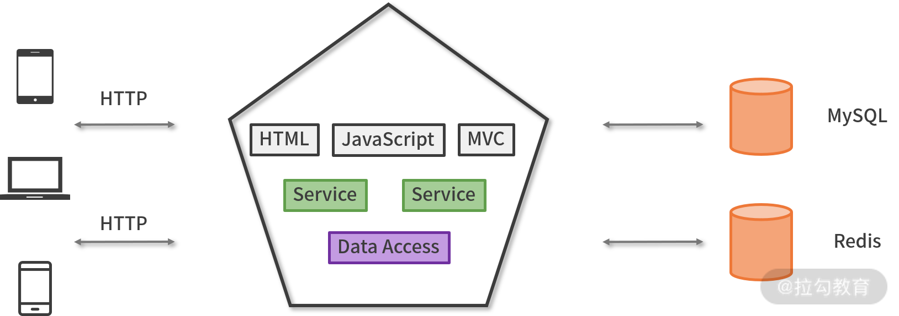
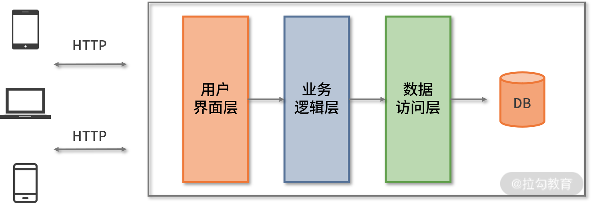
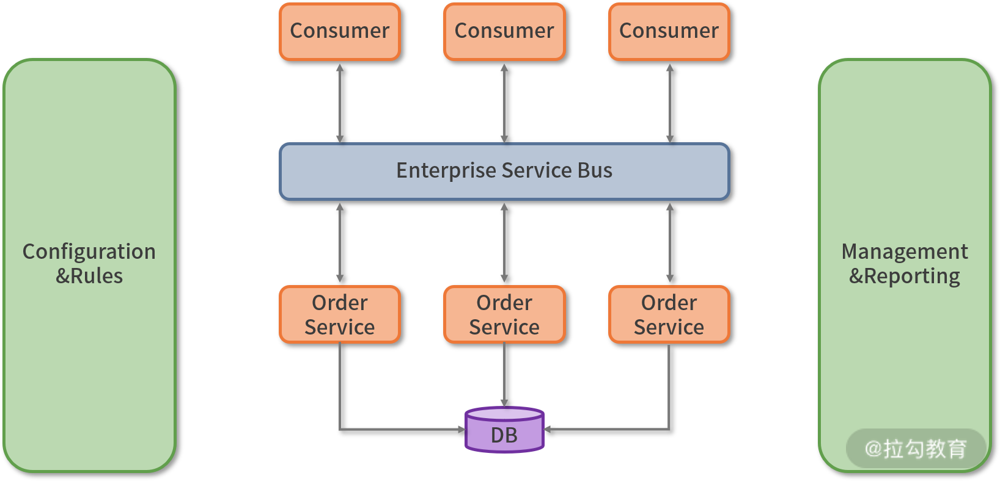
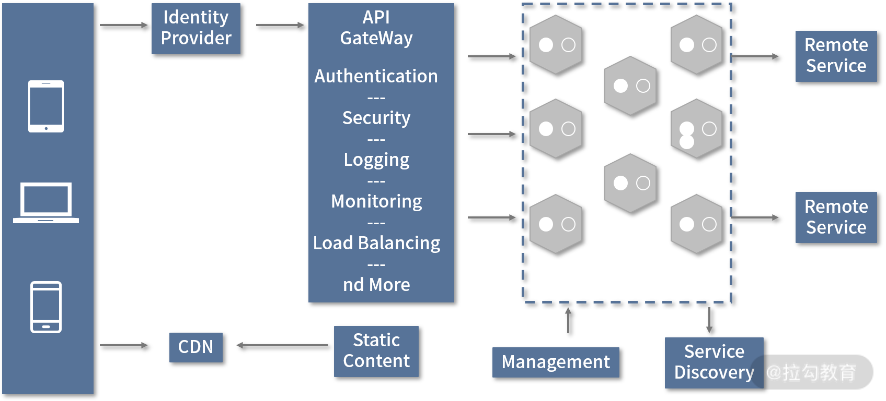
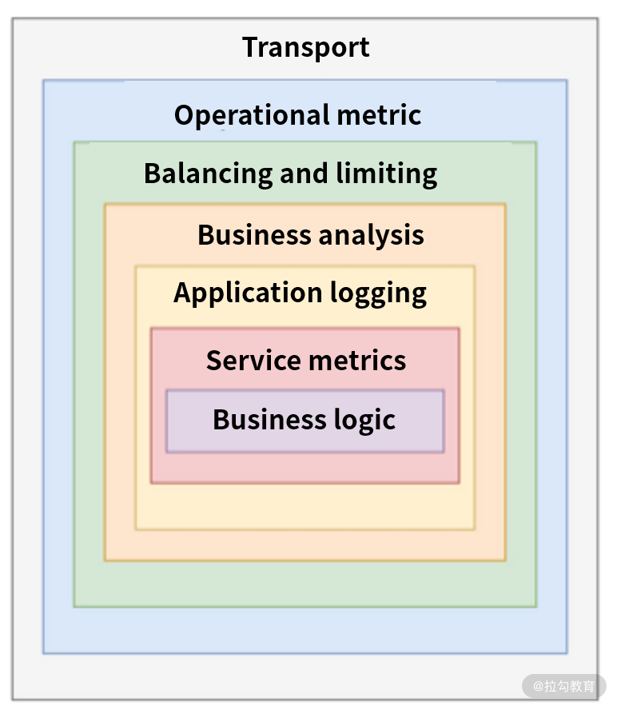
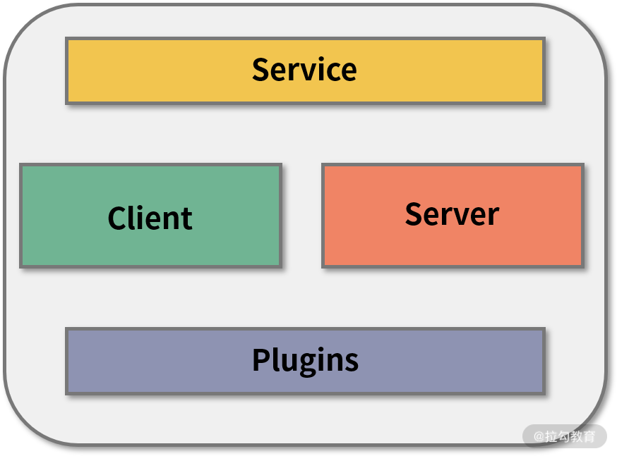

微服务架构是当前流行的架构方式，在本课时我们将会首先介绍服务端架构的发展，如何由单体一步步演进到微服务架构；随后介绍 Go 语言微服务架构的选型，确定本课程的基本框架；最后，在学习完云原生和微服务的相关知识，我们再回顾一下云原生架构与微服务架构之间到底是什么关系。

## 服务端架构的演进
事情总在发展，大型软件系统架构也随着软件开发技术、基础配套设备和硬件性能等因素的改变而不断演化着。一般来说，早期的软件大多数是**单体架构**，接着使用分层技术演化为**垂直架构**，然后 **SOA 面向服务架构**和**微服务架构**相继登场，最终随着云技术的应用和推广而孕育出**云原生架构**的思想。下面我们就来一一介绍这些架构设计的基础理念和优缺点。

### 单体架构
在 Web 应用程序发展的早期，大部分工程是将所有的服务端功能模块打包成单个巨石型（Monolith）应用，譬如很多企业的 Java 应用程序打包为 war 包，最终会形成如下图所示的架构。

单体架构的应用程序

单体架构的应用开发简单，技术单一，测试、部署相对简单明了。但其缺陷也是非常明显的，进行局部改动就需要重新部署，而且编译时间过长。除此之外，单体架构的技术栈也不易扩展，只能不断地在原有基础上进行局部优化，比如说应用的某一场景需要处理高并发，使用 Go 语言较为合适，但是单体架构并不支持多语言技术栈，这时也就只好作罢。

### 垂直分层架构
单体架构在系统用户访问量逐渐增大的情况下，若仅仅依靠扩展物理机配置或者增加机器来优化系统的性能，往往收效甚微。单体架构中不同业务模块的差异就会显现，比如有些模块是 IO 密集型，有些是计算密集型。这些模块所需要的机器数量和性能各有差异，这时为了提升机器利用率和性能，垂直分层架构就诞生了。

垂直分层架构是将大应用拆分成一个个单体结构的应用。换句话说，垂直架构就是彼此存在依赖关系的组件组成的架构，比如分层——用户界面层依赖业务逻辑，而业务逻辑依赖数据库访问（如下图所示）。垂直分层是一个典型的对复杂系统进行结构化思考和抽象聚合的通用性方法。

垂直分层架构的应用程序

这样处理后，垂直分层架构就解决了很多问题：将系统拆分实现了流量分担，解决了部分并发问题；拆分之后，服务间相互独立；性能方面，可以针对单个服务模块进行优化；易于水平扩展，多实例提升容错率。

但其缺点也是明显的，垂直分层架构的系统拆分，使得集群搭建变得复杂；涉及的服务间调用，服务之间耦合度变高，调用关系错综复杂，难以维护调用关系。

### SOA 面向服务架构
当垂直架构拆分的应用越来越多时，就会出现多个应用都依赖的业务逻辑组件，并且各个应用进行交互的需要也越来越频繁。此时，就需要将部分通用的业务组件独立出来，并定义好服务间交互的接口，向外提供能力，让其他服务调用。SOA 面向服务架构这就“应运而生”了。

SOA 面向服务架构是一种软件体系结构，它将应用程序的不同服务通过定义良好的接口和契约联系起来，这些接口独立定义，不依赖实现服务的编程语言、操作系统。应用程序的不同组件通过网络上的通信协议向其他组件提供服务。通信可以是简单的数据传递，也可以是两个或多个服务彼此协调连接。

SOA 面向服务架构

SOA 面向服务架构中主要有两个角色：服务提供者和使用者。如上图所示，服务消费者可以通过发送消息来调用订单、购买、账号的服务，这些消息由服务总线转换后发送给对应的服务，实现 SOA 服务之间的交互通信。

SOA 面向服务架构主要适用于大型软件服务企业对外提供服务的场景，至于一般业务场景就并不适用了，因为其服务的定义、注册和调用都需要较为烦琐的编码或者配置实现，并且业务总线也容易导致系统的单点风险并拖累整体性能。

### 微服务架构
随着互联网浪潮的来临，越来越多的中小微企业推出面向普通大众的网站或者应用。这些企业不同于大型软件服务企业，没有能力也无须构建 SOA 所依赖的 ESB 企业服务总线。于是继承 SOA 众多优点和理念的微服务架构于 2014 年由 Matrin Fowler 提出，其理念是将业务系统彻底地组件化和服务化，形成多个可以独立开发、部署和维护的服务或者应用的集合，以应对更快的需求变更和更短的开发迭代周期。

微服务也是一种架构风格，它提倡将大型复杂软件应用划分成多个微服务，这些服务之间互相协调、配合，可独立部署；服务之间松耦合，每个服务代表着一个小的业务能力（如下图所示）。

常见的微服务架构图

总体来说，微服务架构有如下的特点：

- 微服务遵循单一原则，每个微服务负责一个独立上下文边界；

- 微服务架构提供的服务之间采用 RESTful 等轻量协议传输，相比 ESB 更轻量；

- 每个服务都有自己独立的业务开发活动和周期；

- 微服务一般使用容器技术独立部署，运行在自己的独立进程中，合理分配其所需的系统资源，这样开发者就可以更加方便地制定每个服务的优化方案，提高系统可维护性。

但是，微服务架构也会遇到这样或那样的问题。比如，微服务架构拆分的服务实例过多的话，服务治理成本将会极大升高，不利于系统维护；服务之间相互依赖，有可能形成复杂的依赖链条，往往单个服务异常，其他服务都会受到影响，出现服务雪崩效应；服务实例之间交互需要处理分布式事务、调用幂等性和重试等问题，开发成本高，对团队挑战大。

## 微服务框架的选型

近几年，随着微服务架构的火热，也诞生了很多微服务框架，如 Java 语言的 Spring Cloud、Go 语言的 Go Kit 和 Go Micro 以及 Node.js 的 Seneca。几乎每一种语言都有其对应的微服务框架，这充分说明了微服务架构的火热态势。

虽然微服务架构的实践落地独立于编程语言，但是 Go 语言在微服务架构的落地中仍有其独特的优势。因此，Go 语言的微服务框架也相继涌现，各方面都较为优秀的有 Go Kit 和 Go Micro 等。

### Go 语言的独特优势
Go 语言十分轻量，运行效率极高，原生支持并发编程，相较其他语言主要有以下优势：

- 语法简单，上手快。Go 提供的语法十分简洁，关键字只有 25 个，几乎支持大多数现代编程语言常见的特性。

- 原生支持并发，协程模型是非常优秀的服务端模型，可以充分利用多核。

- 丰富的标准库。Go 目前内置了大量的库，开箱即用，非常方便。

- 部署方便，编译包小，可直接编译成机器码，不依赖其他库。

简言之，用 Go 语言实现微服务，在性能、易用性和生态等方面都拥有优势。

### Go Kit框架
[Go Kit](https://kaiwu.lagou.com/course/gokit.io) 是 Go 语言工具包的集合，可帮助工程师构建强大、可靠和可维护的微服务。它提供了用于实现系统监控和弹性模式组件的库，例如日志记录、跟踪、限流和熔断等，这些库可以协助工程师提高微服务架构的性能和稳定性。Go Kit 框架分层如下图所示：

Go Kit 框架分层示意图

基于 Go Kit 的应用程序架构由三个主要部分组成：传输层、接口层和服务层。

- **传输层**用于网络通信，服务通常使用 HTTP 或 gRPC 等网络传输方式，或使用 NATS 等发布订阅系统相互通信。除此之外，Go Kit 还支持使用 AMQP 和 Thrift 等多种网络通信模式。

- **接口层**是服务器和客户端的基本构建块。在 Go Kit 中，服务中的每个对外提供的接口方法都会被定义为一个端点，以便在服务器和客户端之间进行网络通信。每个端点通过使用 HTTP 或 gRPC 等具体通信模式对外提供服务。

- **服务层**是具体的业务逻辑实现，包括核心业务逻辑。它不会也不应该进行 HTTP 或 gRPC 等具体网络传输，或者请求和响应消息类型的编码和解码。

Go Kit 在性能和扩展性等各方面表现优异。所以我们本课程介绍的大部分微服务组件，都将基于 Go Kit 框架进行实例讲解。

###  Go Micro 框架

Go Micro 是基于 Go 语言实现的插件化 RPC 微服务框架。它提供了服务发现、负载均衡、同步传输、异步通信以及事件驱动等机制，并尝试去简化分布式系统间的通信，让开发者可以专注于自身业务逻辑的开发。

Go Micro 框架的结构可以描述为三层堆栈，如下图所示：

Go Micro 三层堆栈

可以看到，Go Micro 框架模型的上层由 Service 和 Client-Server 模型抽象组成。Server 服务器是用于编写服务的构建块；Client 客户端提供了向服务请求的接口；底层由代理、编解码器和注册表等类型的插件组成。Go Micro 是组件化的框架，每一个基础功能都有对应的接口抽象，方便扩展。

另外，Go Micro 具有可插拔的特点，其提供的组件可帮助我们快速构建应用系统，并且可以定制所需要的插件功能。（相关插件可在仓库 github.com/micro/go-plugins 中找到。）

### Go Kit 与 Go Micro 的对比

Go Kit 是一个微服务的标准库。它可以提供独立的包，通过这些包，开发者可以用来组建自己的应用程序。微服务架构意味着构建分布式系统，这带来了许多挑战，Go Kit 可以为多数业务场景下实施微服务软件架构提供指导和解决方案。

Go Micro 是一个面向微服务的可插拔 RPC 框架，可以快速启动微服务的开发。Go Micro 框架提供了许多功能，无须重新“造轮子”，所以开发者可以花更多的时间在需要关注的业务逻辑上。但是 Go Micro 在快速启动微服务开发的同时，也牺牲了灵活性，并且将 gRPC 强制为默认通信类型，更换组件不如 Go Kit 简便。

#### 云原生与微服务架构是什么关系

可能你会对云原生架构和微服务架构之间的关系比较疑惑，云原生架构是微服务架构的演进升级还是并列的关系呢？

其实从云原生的定义就可以知道，微服务架构是云原生的关键技术之一。而从本质上来说，云原生和微服务是两种不同维度的技术：云原生更侧重应用程序的运行环境，它是以 k8s 和容器为基础的云环境；而微服务架构则对应于应用程序的软件架构。

云原生不完全依赖微服务架构，你可以将单体应用程序打包到容器中，而不需要创建微服务。这种情况下，云原生架构对于单体式应用来说重要性可能会降低很多。所以很多云原生的工具都是针对微服务架构设计的。

云原生时代的微服务架构，能够发挥微服务在敏捷开发、小团队自治等方面的优势，同时云原生提供的强大基础设施支撑，使得软件产品能够快速迭代、快速恢复回滚和服务实例横向扩展。总之，云原生与微服务架构搭配，相得益彰，能够发挥二者最大的优势。

**小结**
微服务架构是云原生的关键技术之一，云原生时代的微服务架构，在开发管理复杂软件系统时，能够体现其优势。本课时我们主要介绍了服务端架构的演进，以及常见的微服务框架选型。最后我们还探讨了云原生与微服务架构的关系。总体来说，微服务架构并不适合所有人，所以在你决定采用何种技术架构时，需要提前审视目前团队的组织架构、规模情况以及未来的业务发展规划。