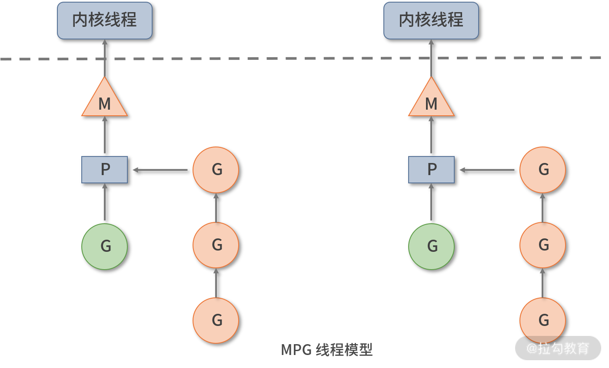
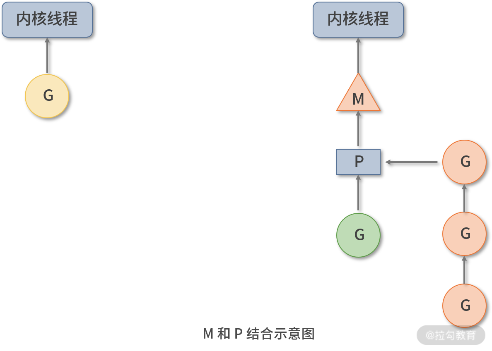

我们都知道计算机的核心为 CPU，它是计算机的运算和控制核心，承载了所有的计算任务。最近半个世纪以来，由于半导体技术的高速发展，集成电路中晶体管的数量也在大幅度增长，这大大提升了 CPU 的性能。著名的摩尔定律——“集成电路芯片上所集成的电路的数目，每隔18个月就翻一番”，描述的就是该种情形。

过于密集的晶体管虽然提高了 CPU 的处理性能，但也带来了单个芯片发热过高和成本过高的问题，与此同时，受限于材料技术的发展，芯片中晶体管数量密度的增加速度已经放缓。也就是说，程序已经无法简单地依赖硬件的提升而提升运行速度。这时，多核 CPU 的出现让我们看到了提升程序运行速度的另一个方向：将程序的执行过程分为多个可并行或并发执行的步骤，让它们分别在不同的 CPU 核心中同时执行，最后将各部分的执行结果进行合并得到最终结果。

并行和并发是计算机程序执行的常见概念，它们的区别在于：

- **并行**，指两个或多个程序在**同一个时刻**执行；
- **并发**，指两个或多个程序在**同一个时间段内**执行。

**并行执行的程序**，无论从宏观还是微观的角度观察，同一时刻内都有多个程序在 CPU 中执行。这就要求 CPU 提供多核计算能力，多个程序被分配到 CPU 的不同的核中被同时执行。

而**并发执行的程序**，仅需要在宏观角度观察到多个程序在 CPU 中同时执行。即使是单核 CPU 也可以通过分时复用的方式，给多个程序分配一定的执行时间片，让它们在 CPU 上被快速轮换执行，从而在宏观上模拟出多个程序同时执行的效果。但从微观角度来看，这些程序其实是在 CPU 中被串行执行。

### Go 的 MPG 线程模型

Go 被认为是一门高性能并发语言，得益于它在原生态支持**协程并发**。这里我们首先了解进程、线程和协程这三者的联系和区别。

在多道程序系统中，**进程**是一个具有独立功能的程序关于某个数据集合的一次动态执行过程，是操作系统进行资源分配和调度的基本单位，是应用程序运行的载体。

而**线程**则是程序执行过程中一个单一的顺序控制流程，是 CPU 调度和分派的基本单位。**线程是比进程更小的独立运行基本单位**，一个进程中可以拥有一个或者以上的线程，这些线程共享进程所持有的资源，在 CPU 中被调度执行，共同完成进程的执行任务。

在 Linux 系统中，根据资源访问权限的不同，操作系统会把内存空间分为内核空间和用户空间：内核空间的代码能够直接访问计算机的底层资源，如 CPU 资源、I/O 资源等，为用户空间的代码提供计算机底层资源访问能力；用户空间为上层应用程序的活动空间，无法直接访问计算机底层资源，需要借助“系统调用”“库函数”等方式调用内核空间提供的资源。

同样，线程也可以分为内核线程和用户线程。**内核线程**由操作系统管理和调度，是内核调度实体，它能够直接操作计算机底层资源，可以充分利用 CPU 多核并行计算的优势，但是线程切换时需要 CPU 切换到内核态，存在一定的开销，可创建的线程数量也受到操作系统的限制。**用户线程**由用户空间的代码创建、管理和调度，无法被操作系统感知。用户线程的数据保存在用户空间中，切换时无须切换到内核态，切换开销小且高效，可创建的线程数量理论上只与内存大小相关。

**协程是一种用户线程，属于轻量级线程**。协程的调度，完全由用户空间的代码控制；协程拥有自己的寄存器上下文和栈，并存储在用户空间；协程切换时无须切换到内核态访问内核空间，切换速度极快。但这也给开发人员带来较大的技术挑战：开发人员需要在用户空间处理协程切换时上下文信息的保存和恢复、栈空间大小的管理等问题。

Go 是为数不多在语言层次实现协程并发的语言，它采用了一种特殊的两级线程模型：MPG 线程模型（如下图）。



- M，即 machine，相当于内核线程在 Go 进程中的映射，它与内核线程一一对应，代表真正执行计算的资源。在 M 的生命周期内，它只会与一个内核线程关联。
- P，即 processor，代表 Go 代码片段执行所需的上下文环境。M 和 P 的结合能够为 G 提供有效的运行环境，它们之间的结合关系不是固定的。P 的最大数量决定了 Go 程序的并发规模，由 runtime.GOMAXPROCS 变量决定。
- G，即 goroutine，是一种轻量级的用户线程，是对代码片段的封装，拥有执行时的栈、状态和代码片段等信息。

在实际执行过程中，M 和 P 共同为 G 提供有效的运行环境（如下图），多个可执行的 G 顺序挂载在 P 的可执行 G 队列下面，等待调度和执行。当 G 中存在一些 I/O 系统调用阻塞了 M 时，P 将会断开与 M 的联系，从调度器空闲 M 队列中获取一个 M 或者创建一个新的 M 组合执行， 保证 P 中可执行 G 队列中其他 G 得到执行，且由于程序中并行执行的 M 数量没变，保证了程序 CPU 的高利用率。



当 G 中系统调用执行结束返回时，M 会为 G 捕获一个 P 上下文，如果捕获失败，就把 G 放到全局可执行 G 队列等待其他 P 的获取。新创建的 G 会被放置到全局可执行 G 队列中，等待调度器分发到合适的 P 的可执行 G 队列中。M 和 P 结合后，会从 P 的可执行 G 队列中无锁获取 G 执行。当 P 的可执行 G 队列为空时，P 才会加锁从全局可执行 G 队列获取 G。当全局可执行 G 队列中也没有 G 时，P 会尝试从其他 P 的可执行 G 队列中“剽窃” G 执行。

### goroutine 和 channel

并发程序中的多个线程同时在 CPU 执行，由于资源之间的相互依赖和竞态条件，需要一定的并发模型协作不同线程之间的任务执行。Go 中倡导使用 **CSP 并发模型**来控制线程之间的任务协作，CSP 倡导使用通信的方式来进行线程之间的内存共享。

Go 是通过 goroutine 和 channel 来实现 CSP 并发模型的：

- **goroutine，即协程**，Go 中的并发实体，是一种轻量级的用户线程，是消息的发送和接收方；
- **channel，即通道**， goroutine 使用通道发送和接收消息。

CSP 并发模型类似常用的同步队列，它更加关注消息的传输方式，解耦了发送消息的 goroutine 和接收消息的 goroutine，channel 可以独立创建和存取，在不同的 goroutine 中传递使用。

使用关键字 go 即可使用 goroutine 并发执行代码片段，形式如下：

复制

```
go expression
```

而 channel 作为一种引用类型，声明时需要指定传输数据类型，声明形式如下：

复制

```
var name chan T // 双向 channel
var name chan <- T // 只能发送消息的 channel
var name T <- chan // 只能接收消息的 channel 
```

其中，T 即为 channel 可传输的数据类型。channel 作为队列，遵循消息先进先出的顺序，同时保证同一时刻只能有一个 goroutine 发送或者接收消息。
使用 channel 发送和接收消息形式如下：

复制

```
channel <- val // 发送消息
val := <- channel // 接收消息
val, ok := <- channel // 非阻塞接收消息
```

goroutine 向已经填满信息的 channel 发送信息或从没有数据的 channel 接收信息会阻塞自身。goroutine 接收消息时可以使用非阻塞的方式，无论 channel 中是否存在消息都会立即返回，通过 ok 布尔值判断是否接收成功。

创建一个 channel 需要使用 make 函数对 channel 进行初始化，形式如下所示：

复制

```
ch := make(chan T, sizeOfChan)
```

初始化 channel 时可以指定 channel 的长度，表示 channel 最多可以缓存多少条信息。下面我们通过一个简单例子演示 goroutine 和 channel 的使用：

复制

```go
package main
import (
	"fmt"
	"time"
)
//生产者
func Producer(begin, end int, queue chan<- int) {
	for i:= begin ; i < end ; i++ {
		fmt.Println("produce:", i)
		queue <- i
	}
}
//消费者
func Consumer(queue <-chan int) {
	for val := range queue  { //当前的消费者循环消费
		fmt.Println("consume:", val)
	}
}
func main() {
	queue := make(chan int)
	defer close(queue)
	for i := 0; i < 3; i++ {
		go Producer(i * 5, (i+1) * 5, queue) //多个生产者
	}
	go Consumer(queue) //单个消费者
	time.Sleep(time.Second) // 避免主 goroutine 结束程序
}
```

这是一个简单的多生产者和单消费的代码例子，生产 goroutine 将生产的数字通过 channel 发送给消费 goroutine。上述例子中，消费 goroutine 使用 for:range 从 channel 中循环接收消息，只有当相应的 channel 被内置函数 close 后，该循环才会结束。channel 在关闭之后不可以再用于发送消息，但是可以继续用于接收消息，从关闭的 channel 中接收消息或者正在被阻塞的 goroutine 将会接收零值并返回。还有一个需要注意的点是，main 函数由主 goroutine 启动，当主 goroutine 即 main 函数执行结束，整个 Go 程序也会直接执行结束，无论是否存在其他未执行完的 goroutine。

#### 1. select 多路复用

当需要从多个 channel 中接收消息时，可以使用 Go 提供的 select 关键字，它提供类似多路复用的能力，使得 goroutine 可以同时等待多个 channel 的读写操作。select 的形式与 switch 类似，但是要求 case 语句后面必须为 channel 的收发操作，一个简单的例子如下：

复制

```go
package main
import (
	"fmt"
	"time"
)
func send(ch chan int, begin int )  {
	// 循环向 channel 发送消息
	for i :=begin ; i< begin + 10 ;i++{
		ch <- i
	}
}
func receive(ch <-chan int)  {
	val := <- ch
	fmt.Println("receive:", val)
}
func main()  {
	ch1 := make(chan int)
	ch2 := make(chan int)
	go send(ch1, 0)
	go receive(ch2)
	// 主 goroutine 休眠 1s，保证调度成功
	time.Sleep(time.Second)
	for {
		select {
		case val := <- ch1: // 从 ch1 读取数据
			fmt.Printf("get value %d from ch1\n", val)
		case ch2 <- 2 : // 使用 ch2 发送消息
			fmt.Println("send value by ch2")
		case <-time.After(2 * time.Second): // 超时设置
			fmt.Println("Time out")
			return
		}
	}
}
```

在上述例子中，我们使用 select 关键字同时从 ch1 中接收数据和使用 ch2 发送数据，输出的一种可能结果为：

复制

```
get value 0 from ch1
get value 1 from ch1
send value by ch2
receive: 2
get value 2 from ch1
get value 3 from ch1
get value 4 from ch1
get value 5 from ch1
get value 6 from ch1
get value 7 from ch1
get value 8 from ch1
get value 9 from ch1
Time out
```

由于 ch2 中的消息仅被接收一次，所以仅出现一次“send value by ch2”，后续消息的发送将被阻塞。select 语句分别从 3 个 case 中选取返回的 case 进行处理，当有多个 case 语句同时返回时，select 将会随机选择一个 case 进行处理。如果 select 语句的最后包含 default 语句，该 select 语句将会变为非阻塞型，即当其他所有的 case 语句都被阻塞无法返回时，select 语句将直接执行 default 语句返回结果。在上述例子中，我们在最后的 case 语句使用了 <-time.After(2 * time.Second) 的方式指定了定时返回的 channel，这是一种有效从阻塞的 channel 中超时返回的小技巧。

#### 2. Context 上下文

当需要在多个 goroutine 中传递上下文信息时，可以使用 Context 实现。Context 除了用来传递上下文信息，还可以用于传递终结执行子任务的相关信号，中止多个执行子任务的 goroutine。Context 中提供以下接口：

复制

```
type Context interface {
    Deadline() (deadline time.Time, ok bool)
    Done() <-chan struct{}
    Err() error
    Value(key interface{}) interface{}
}
```

- Deadline 方法，返回 Context 被取消的时间，也就是完成工作的截止日期；
- Done，返回一个 channel，这个 channel 会在当前工作完成或者上下文被取消之后关闭，多次调用 Done 方法会返回同一个 channel；
- Err 方法，返回 Context 结束的原因，它只会在 Done 返回的 channel 被关闭时才会返回非空的值，如果 Context 被取消，会返回 Canceled 错误；如果 Context 超时，会返回 DeadlineExceeded 错误。
- Value 方法，可用于从 Context 中获取传递的键值信息。

在 Web 请求的处理过程中，一个请求可能启动多个 goroutine 协同工作，这些 goroutine 之间可能需要共享请求的信息，且当请求被取消或者执行超时时，该请求对应的所有 goroutine 都需要快速结束，释放资源。Context 就是为了解决上述场景而开发的，我们通过下面一个例子来演示：

复制

```go
package main
import (
	"context"
	"fmt"
	"time"
)
const DB_ADDRESS  = "db_address"
const CALCULATE_VALUE  = "calculate_value"
func readDB(ctx context.Context, cost time.Duration)  {
	fmt.Println("db address is", ctx.Value(DB_ADDRESS))
	select {
	case <- time.After(cost): //  模拟数据库读取
		fmt.Println("read data from db")
	case <-ctx.Done():
		fmt.Println(ctx.Err()) // 任务取消的原因
		// 一些清理工作
	}
}
func calculate(ctx context.Context, cost time.Duration)  {
	fmt.Println("calculate value is", ctx.Value(CALCULATE_VALUE))
	select {
	case <- time.After(cost): //  模拟数据计算
		fmt.Println("calculate finish")
	case <-ctx.Done():
		fmt.Println(ctx.Err()) // 任务取消的原因
		// 一些清理工作
	}
}
func main()  {
	ctx := context.Background(); // 创建一个空的上下文
	// 添加上下文信息
	ctx = context.WithValue(ctx, DB_ADDRESS, "localhost:10086")
	ctx = context.WithValue(ctx, CALCULATE_VALUE, 1234)
	// 设定子 Context 2s 后执行超时返回
	ctx, cancel := context.WithTimeout(ctx, time.Second * 2)
	defer cancel()
	// 设定执行时间为 4 s
	go readDB(ctx, time.Second * 4)
	go calculate(ctx, time.Second * 4)
	
	// 充分执行
    time.Sleep(time.Second * 5)
}
```

在上述例子中，我们模拟了一个请求中同时进行数据库访问和逻辑计算的操作，在请求执行超时时，及时关闭尚未执行结束 goroutine。我们首先通过 context.WithValue 方法为 context 添加上下文信息，Context 在多个 goroutine 中是并发安全的，可以安全地在多个 goroutine 中对 Context 中的上下文数据进行读取。接着使用 context.WithTimeout 方法设定了 Context 的超时时间为 2s，并传递给 readDB 和 calculate 两个 goroutine 执行子任务。在 readDB 和 calculate 方法中，使用 select 语句对 Context 的 Done 通道进行监控。由于我们设定了子 Context 将在 2s 之后超时，所以它将在 2s 之后关闭 Done 通道；然而预设的子任务执行时间为 4s，对应的 case 语句尚未返回，执行被取消，进入到清理工作的 case 语句中，结束掉当前的 goroutine 所执行的任务。预期的输出结果如下：

复制

```
calculate value is 1234
db address is localhost:10086
context deadline exceeded
context deadline exceeded
```

使用 Context，能够有效地在一组 goroutine 中传递共享值、取消信号、deadline 等信息，及时关闭不需要的 goroutine。

### 小结

本节课我们介绍了 Go 语言并发特性，主要包含：

- Go 的 MPG 线程模型；
- goroutine 和 channel；
- select 多路复用；
- Context 上下文。

除了支持 CSP 的并发模型，Go 同样支持传统的线程与锁并发模型，提供了互斥锁、读写锁、并发等待组、同步等待条件等一系列同步工具，这些同步工具的结构体位于 sync 包中，与其他语言的同步工具使用方式相差无几。Go 在语言层次支持协程并发，在并发性能上表现卓越，能够充分挖掘多核 CPU 的运算性能。希望本节课的学习，能够有效提升你对 Go 并发设计和编程的认知。