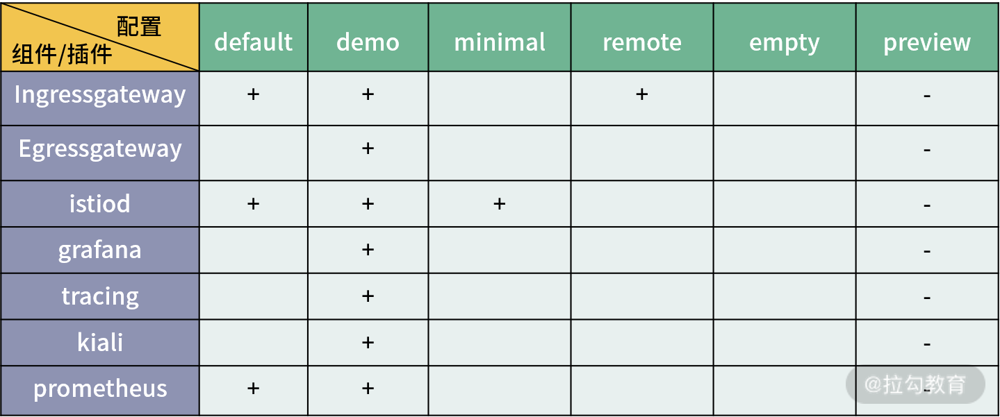
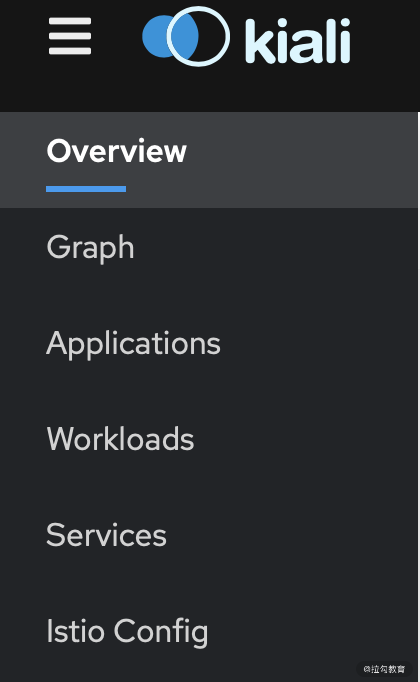
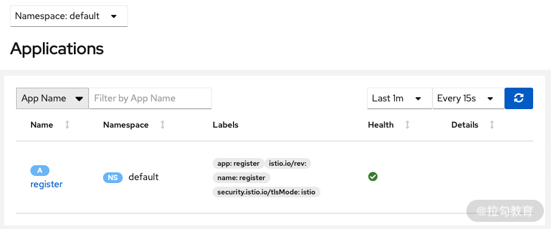
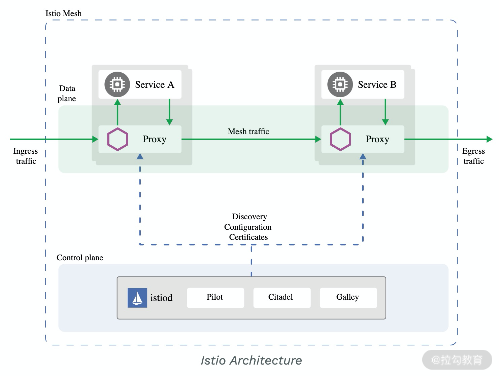

在上一课时中，我们基于搭建好的 Consul 集群，通过 Consul 中提供的 HTTP API 实现了 register 的服务注册与发现功能。我们采用手动构造 HTTP 请求的方式，在服务启动时发送服务实例数据到 Consul 中完成服务注册，在服务关闭时向 Consul 请求服务注销，并通过 Consul 提供的服务发现接口根据服务名获取可用的服务实例信息列表。

在本课时，我们将使用 Go-kit 提供的服务注册与发现工具包完成服务注册与发现，并介绍 Service Mesh 中 Istio 是如何进行服务注册与发现的。

### 使用 Go-kit 服务注册与发现工具包
自主开发服务注册与发现客户端固然能够加深我们对微服务和服务注册与发现中心交互流程的理解，但同样会增加开发人员的理解成本，比如要了解服务注册与发现中心对外提供的接口、提交数据的具体细节，以及在服务注册与发现中心版本升级迭代或者 API 发生更新时，还需要持续维护客户端代码以避免不可用情况的发生，等等。

Go-kit 作为一套微服务工具集，意在帮助开发人员解决微服务开发中遇到的绝大数问题，让他们更专注于业务开发。

Go-kit 提供了诸多服务注册与发现组件的客户端实现，支持包括 Consul、Etcd、ZooKeeper和 Eureka 在内的多种服务注册与发现中心。下面我们以 Consul 为例，实践如何使用 Go-kit 的 sd 包简化微服务服务注册与发现的实现。

sd 包中提供如下注册和注销接口，代码如下所示：

```go
type Registrar interface { 
	Register() // 服务注册 
	Deregister() // 服务注销 
} 
```

在 Go-kit 中，我们根据选定的服务注册和发现组件，实例化 Registrar 接口对应的结构体实现，即可使用同样的接口进行服务注册和服务注销。接下来我们实例化 sd/consul 包下的 Registrar 用于完成与 Consul 的交互，实例化代码如下：

```go
func NewDiscoveryClient(host string, port int, registration *api.AgentServiceRegistration) (*DiscoveryClient, error) { 
	config := api.DefaultConfig() 
	config.Address = host + ":" + strconv.Itoa(port) 
	// 生成 hashicorp client 
	client, err := api.NewClient(config) 
	if err != nil{ 
		return nil, err 
	} 
	// 使用 hashicorp client 生成 sd consul client 
	sdClient := consul.NewClient(client) 
	return &DiscoveryClient{ 
		client: sdClient, 
		config: config, 
		registration: registration, 
		register: consul.NewRegistrar(sdClient, registration, log.NewLogfmtLogger(os.Stderr)), 
	}, nil 
}
```

DiscoveryClient.register 即最终实例化的 Consul 注册器。从实例化的过程可以发现 Consul Registrar 的实现依赖于 sd.consul.Client，而 sd.consul.Client 实现依赖于 hashicorp client，即 Consul 的官方实现客户端。深入 hashicorp client 客户端中的服务注册与发现的实现，会发现它也是通过请求 Consul Agent 提供的 HTTP API 完成的，实现的方式与我们在上一课时中的实践大同小异。api.AgentServiceRegistration 结构体即需要提交到 Consul 中的服务实例信息，包含服务名、服务实例 ID、服务地址和服务端口等基本信息。

然后我们的服务注册和服务注销实现就可以委托给 Register 执行，如下所示：

```go
func (consulClient *DiscoveryClient) Register(ctx context.Context) { 
	consulClient.register.Register() 
} 
func (consulClient *DiscoveryClient) Deregister(ctx context.Context) { 
	consulClient.register.Deregister() 
}
```

服务发现的实现也是直接调用 sd.consul.Client 提供的相关方法。通过使用 Go-kit 提供的 Consul 工具包，可以在不了解微服务与 Consul 具体交互逻辑的基础上，通过简单调用包中提供的方法即可完成服务注册与发现，大大减轻业务人员的开发工作。

### Service Mesh 中 Istio 服务注册与发现
Service Mesh 作为下一代的微服务架构，它将服务间的通信从基础设施中抽离出来，达到交付更可靠的应用请求、监控和控制流量的目的。Service Mesh 一般与应用程序一同部署，作为“数据平面”代理网络以及“控制平面”代替应用与其他代理交互。Service Mesh 的出现让业务开发人员从基础架构的底层细节中解放出来，从而把更多的精力放在业务开发上，提高需求迭代的效率。

Istio 作为 Service Mesh 的落地产品之一，依托 Kubernetes 快速发展，已经成为最受欢迎的 Service Mesh 之一。Istio 在逻辑上分为数据平面和控制平面。

- 数据平面，由一组高性能的智能代理（基于 Envoy 改进的 istio-proxy）组成，它们控制和协调了被代理服务的所有网络通信，同时也负责收集和上报相关的监控数据。

- 控制平面，负责制定应用策略来控制网络流量的路由。

- Istio 由多个组件组成，核心组件及其作用为如下：

- Ingressgateway，控制外部流量访问 Istio 内部的服务。

- Egressgateway，控制 Istio 内部访问外部服务的流量。

- Pilot，负责管理服务网格内部的服务和流量策略。它将服务信息和流量控制的高级路由规则在运行时传播给 Proxy，并将特定平台的服务发现机制抽象为 Proxy 可使用的标准格式。

- Citadel，提供身份认证和凭证管理。

- Galley，负责验证、提取、处理和分发配置。

- Proxy，作为服务代理，调节所有 Service Mesh 单元的入口和出口流量。


这其中 Proxy 属于数据平面，以 Sidecar 的方式与应用程序一同部署到 Pod 中，而 Pilot、Citadel 和 Galley 属于控制平面。除此之外，Istio 中还提供一些额外的插件，如 grafana、istio-tracing、kiali 和 prometheus，用于进行可视化的数据查看、流量监控和链路追踪等。

Istio 默认提供了以下几种安装 profile 形式，它们开启的组件配置如下表所示（+ 表示开启，空白表示未开启，- 表示未知）：



这其中，istiod 组件封装了 Pilot、Citadel 和 Galley 等控制平面组件，将它们进行统一打包部署，降低多组件维护和管理的困难性。从上表可以看出，demo profile 是功能最全的配置清单，适合于学习和功能演示。preview profile 将可能使用一些开发阶段的测试组件，开启的组件不定。官方推荐使用 default profile 进行安装，因为它在核心组件和插件上做到了最优的选择，比如组件只开启了 Ingressgateway 和 istiod，插件只开启了 prometheus。

当然我们也可以根据实践的需求选择合适的 profile 进行安装启动，比如下面的安装命令我们使用的是 demo profile：

```
istioctl manifest apply --set profile=demo
```

上述命令以 demo profile 部署 Istio，该配置下的 Istio 能够通过可视化界面监控 Istio 中应用的方方面面。Istio 以 Sidecar 的方式在应用程序运行的 Pod 中注入 Proxy，全面接管应用程序的网络流入流出。我们可以通过标记 Kubernetes 命名空间的方式，让 Sidecar 注入器自动将 Proxy 注入在该命名空间下启动的 Pod 中，开启标记的命令如下：

```
kubectl label namespace default istio-injection=enabled
```

上述命令中，我们将 default 命名空间标记为 istio-injection。如果不想开启命令空间的标记，也可以通过 istioctl kube-inject 为 Pod 注入 Proxy Sidecar 容器。接下来，我们就为 register 服务所在的 Pod 注入 Proxy，启动命令如下：

```
istioctl kube-inject -f register-service.yaml | kubectl apply -f -
```

register 服务的 yaml 配置如下：

```
apiVersion: apps/v1 
kind: Deployment 
metadata: 
  name: register 
  labels: 
    name: register 
spec: 
  selector: 
    matchLabels: 
      name: register 
  replicas: 1 
  template: 
    metadata: 
      name: register 
      labels: 
        name: register 
        app: register  # 添加 app 标签 
    spec: 
      containers: 
        - name: register 
          image: register 
          ports: 
            - containerPort: 12312 
          imagePullPolicy: IfNotPresent 
          # ... 省略环境配置 
--- 
# 添加 Service 资源 
apiVersion: v1 
kind: Service 
metadata: 
  name: register-service 
  labels: 
    name: register-service 
spec: 
  selector: 
    name: register 
  ports: 
    - protocol: TCP 
      port: 12312 
      targetPort: 12312 
      name: register-service-http
```

这主要的改动有：为 register 服务添加 Deployment Controller，添加了新的标签 app，以及为 register 添加相应的 Service 资源。如果在部署 Istio 时启动了 kiali 插件，即可在 kiali 平台中查看到 register 服务的相关信息，通过以下命令即可打开 kiali 控制面板，默认账户和密码都为 admin：

```
istioctl dashboard kiali
```



kiali 控制台

从上图可以看出在 kiali 控制台中存在多个维度查看 Istio 中部署的应用：

- Overview，网格概述，展示 Istio 内具有服务的所有命名空间；

- Graph，服务拓扑图；

- Applications，应用维度，识别设置了 app 标签的应用；

- Workloads，负载维度，检测 Kubernetes 中的资源，包括 Deployment、Job、DaemonSet 等，无论这些资源有没有加入 Istio 中都能检测到；

- Services，服务维度，检测 Kubernetes 的 Service；

- Istio Config，配置维度，查看 Istio 相关配置类信息。


register 服务启动后，我们在 Applications、Workloads、Services 维度中均可查看到 register 的身影，如下 Applications 维度图所示：



kiali Applications 维度下的 register

Istio 依托 Kubernetes 的快速发展和推广，对 Kubernetes 有着极强的依赖性，其服务注册与发现的实现也主要依赖于 Kubernetes 的 Service 管理。我们可以通过以下这张图理解 Istio 的服务注册与发现。



Istio 服务注册与发现逻辑图

通过该逻辑图，我们可以看到 Istio 服务注册与发现主要有以下模块参与。

ConfigController：负责管理配置数据，包括用户配置的流量管理和路由规则。

ServiceController：负责加载各类 ServiceRegistry，从 ServiceRegistry 中同步需要在网格中管理的服务。主要包含：①KubeServiceRegistry，从 Kubernetes 同步 Service 和 Endpoint 到 Istio；②ConsulServiceRegistry，从 Consul 中同步服务信息到 Istio；③ExternalServiceRegistry，监听 ConfigController 中的配置变化，获取 ServiceEntry 和 WorkloadEntry 资源并封装成服务数据提供给 ServiceController。

DiscoveryServer：负责将 ConfigController 中的路由配置信息和 ServiceController 中的服务信息封装成 Proxy 可以理解的标准格式，并下发到 Proxy 中。

Pilot 组件会从各个 Service Registry，比如 Kubernetes 中的 Service 和 Consul 中注册的服务，采集可用的服务数据到 Istio 中，并将这些服务转换为 Proxy 可理解的标准服务格式，下发到 Proxy，同时下发的还有用户预先配置的路由规则和流量控制策略。在被代理的应用根据服务标识发起 HTTP 通信时，Proxy 将会从拦截的网络请求中根据服务标识获取对应的服务数据，并根据下发的路由规则选择合适的实例转发请求。

基于 Kubernetes 迅速发展的 Istio 在服务注册与发现组件上支持最完善的自然也为 Kubernetes，这依托于 Kubernetes 对 Pod、Service 等资源的监控，为服务之间的调用提供弹性、负载均衡、重试、熔断和限流等诸多保障。

而对第三方服务注册与发现组件的集成和支持，比如 Consul 等，Istio 官方的实现仅仅是基本可用的级别，在性能和易用性方面仍需要不断进行打磨和测试。因此，**在 Istio 的落地实践中，建议是与 Kubernetes 强绑定使用，以达到功能的最优化发挥**。

**小结**
服务注册与发现是微服务架构落地实践的基石之一，因为有中心化的服务注册与发现中心管理大量动态变化的服务实例，使得应用服务可以在无太大压力的条件下进行微服务拆分和横向扩展，大大提升了微服务架构的灵活性和伸缩性。