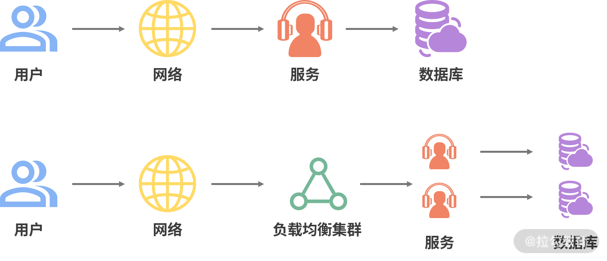
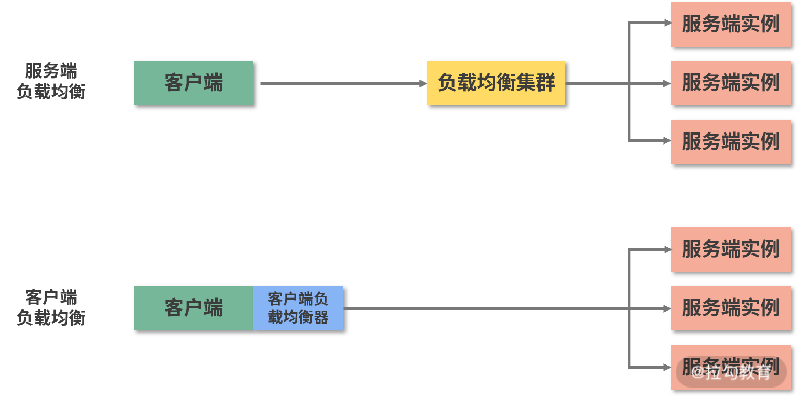

### 负载均衡概念

一般来说，互联网应用在其发展初期，往往采用单实例部署，用户通过网络请求某个固定IP地址的服务实例，这在用户量不大时是可行的。随着用户量的提升，单机单实例的服务已经无法应对用户的请求，并且单机单实例存在单点错误问题，一旦该实例出现问题，就会导致系统不可用，影响应用可用性。

所以，如下图所示，服务会进行多实例部署，由负载均衡集群将用户请求分发给不同的服务实例，既提高了系统整体的吞吐量，也避免了因为单一服务实例宕机导致整个系统不可用的情况。



负载均衡示意图

负载均衡往往有多种实现方式和分类标准，**最为常见的分类方式为软件负载均衡和硬件负载均衡，其中软件负载均衡又分为客户端负载均衡和服务端负载均衡**。下面，我们就来一一介绍它们的具体区别和优缺点。

**软件负载均衡**，顾名思义，就是使用独立的负载均衡软件来实现请求的分发。它配置较为简单并且使用成本不高，能够满足大多数的负载均衡要求。但是软件所部署服务器的性能会成为整个系统吞吐量的瓶颈，并且还会产生单点错误。

**硬件负载均衡**则是依赖于特殊的负载均衡硬件设备来分发请求到不同的服务实例。相比于软件负载均衡，它能够提供更高的性能、更加多样化的负载均衡策略和更加细粒度的流量管理，更好地满足整体系统所需的负载均衡要求，但是成本极高，需要专门的硬件设备，整体投入费用较高。

主流的硬件负载均衡有 F5 负载均衡器等，而较为常见的软件负载均衡软件有 Nginx 和 LVS等。此外，基于 DNS 负载均衡和反向代理负载均衡也是较为主流的软件负载均衡方案。DNS负载均衡方案需要为相同的域名地址配置多个不同服务器的 IP 地址，客户端解析 DNS 地址时会根据负载均衡返回不同的 IP 地址，从而达到将请求负载到不同服务器的目的；而反向代理负载均衡使用代理服务器，客户端向同一IP地址发送请求，代理服务器将请求按照一定的规则分发到下游的服务器集群进行处理，最常见的方式即服务网关。

在软件负载均衡类别中，大家**最为熟悉、最为常见的负载均衡方案还是反向代理负载均衡**，几乎所有的主流Web服务器都支持基于反向代理的负载均衡。Web服务器实现反向代理负载均衡的核心机制就是转发HTTP请求到不同的服务实例。

上述方案都是服务端负载均衡，除此之外，还有客户端负载均衡，比如 Spring Cloud 的 Ribbon 组件。客户端负载均衡和服务端负载均衡的核心差异在于谁感知可用服务列表，进行负载均衡操作，客户端进行上述操作的就是客户端负载均衡，反之则是服务端负载均衡。

在客户端负载均衡中，客户端实例都有一份自己要访问的可用服务端地址列表数据，这些列表可从服务注册与发现中心获取，然后根据负载均衡算法选择一个实例，使用其 IP 地址来发送请求。而在服务端负载均衡中，可用服务端地址列表数据只存在于负载均衡集群中，客户端往往只能通过固定IP地址来进行调用。二者的区别如下图所示：



服务端和客户端负载均衡对比示意图

因为客户端负载均衡的计算执行过程是由客户端完成的，所以减轻了服务端的计算压力，并且可以根据客户端和服务端的地理或网络区域等因素进行更加优化的算法选择。但是因为客户端只是缓存了可用服务实例列表，更新并不实时，所以导致客户端可能会访问到已经宕机或者不可用的服务实例，影响用户的正常使用。而服务端负载均衡则可以更加敏锐地应对服务实例的上线、下线或变更，提供更高的稳定性和可用性。

### 负载均衡算法简介

负载均衡算法定义了如何将请求分散到服务实例的规则，优秀的负载均衡算法能够有效提高系统的吞吐量，使服务集群中各服务的负载处于高效稳定的状态。常见的负载均衡算法有以下四种。

1. **随机法**。该算法是随机从可用服务列表中选取一个服务实例来分发请求。它的实现非常简单，一定程度上保证了请求的分散性，但是无法顾及请求分配是否与服务实例的负载能力相符合，并且存在偶发的突然分发大量请求到同一服务实例的毛刺问题。
2. **轮询法或者加权轮询法**。该算法将请求轮流分配给现有可用服务列表中的每一个服务实例，适用于集群中服务实例的负载能力大致相同且请求处理能力差异不大的场景。而改进的加权轮询则会根据各个服务实例的权重，额外分配给权重较大者相适应的更多请求，例如服务A权重为1，服务器B的权重为2，服务器C的权重为3，则使用加权轮询算法进行负载分配的过程可能为A-B-B-C-C-C-A-B-B-C-C-C。
3. **Hash 法或者一致性 Hash 法**。该算法根据请求的某些属性（比如说userId），使用Hash算法将其分散到不同服务实例中，这样保证了相同属性的请求会被转发到相同的服务实例中，可以更好地利用缓存，提高系统的整体性能。改进型的一致性Hash法则基于虚拟节点，在某一个服务实例宕机或不可用后能将请求平摊到其他服务节点，避免请求分发的目标实例发生剧烈的变化，影响系统的整体处理性能。


Hash 算法示意图

4.**最小连接数法**。该算法将请求分配到当前可用服务列表中正在处理最少请求的服务实例上。该算法需要负载均衡服务器和各个服务实例之间进行一定量的信息交互，负载均衡服务器还需要了解集群中各个服务的负载情况，这样可以动态地根据服务的负载数据，更好地调控分配比例，提升系统整体性能。

### 负载均衡算法实现

了解了以上这些常见的负载均衡算法后，为便于你更好地理解和应用，下面我们就来动手实现两个较为主流的负载均衡算法：**完全随机算法**和**带权重的平滑轮询算法**。

#### 1. 完全随机算法

完全随机算法的实现极其简单，可以定义自己算法专属的**SelectService 方法**。其中SelectService 方法使用 rand.Intn 接口来获取随机数，然后根据随机数从可用服务列表中选出 ServiceInstance 实例作为返回值，具体代码如下：

```go
// 随机负载均衡
func (loadBalance RandomLoadBalance) SelectService(services []common.ServiceInstance) (*common.ServiceInstance, error) {
  
  if services == nil || len(services) == 0 {
      return nil, errors.New("service instances are not exist")
  }
  return services[rand.Intn(len(services))], nil
}
```

完全随机策略可以把请求完全分发到不同的服务实例上，大致可以将所有流量平均分给各个实例。但是由于不同服务实例运行的服务器资源不同，导致不同服务实例的请求处理能力也不同，所以往往需要根据服务实例的负载能力，分发相匹配的请求数量。带权重的平滑轮询算法就是这样一种负载均衡策略。

#### 2. 带权重的平滑轮询算法

带权重的平滑轮询算法是前面介绍的带权重的轮询算法的优化版本，它会根据各个服务实例的权重比例，将请求**平滑地**分配到各个服务实例中。而不是像权重轮询算法那样，会连续地将请求分发给相同的服务实例。

带权重的平滑轮询算法会根据服务实例结构体（ServiceInstance）中的权重值**Weight**和当前权重值**CurWeight**这两个属性值进行计算，这两个权重的具体定义是这样的：

- Weight是配置的服务实例权重，固定不变；
- CurWeight是服务实例目前的动态权重，一开始为0，之后会动态调整。

每次当请求到来，选取服务实例时，该策略会遍历服务实例队列中的所有服务实例。对于每个服务实例，让它的CurWeight 值加上 Weight 值；同时累加所有服务实例的Weight 值，将其保存为Total。

遍历完所有服务实例之后，如果某个服务实例的CurWeight最大，就选择这个服务实例处理本次请求，最后把该服务实例的 CurWeight 减去 Total 值。其具体实现如下所示：

```go
// 权重平滑负载均衡
func (loadBalance WeightRoundRobinLoadBalance) SelectService(services []common.ServiceInstance) (best *common.ServiceInstance, err error) {
  if services == nil || len(services) == 0 {
      return nil, errors.New("service instances are not exist")
  }
  total := 0
  for i := 0; i < len(services); i++ {
      w := services[i]
      if w == nil {
          continue
      }
      w.CurWeight += w.Weight
      total += w.Weight
      if best == nil || w.CurWeight > best.CurWeight {
          best = w
      }
  }
  if best == nil {
      return nil, nil
  }
  best.CurWeight -= total
  return best, nil
}
```

比如说A、B、C三个服务实例的权重Weight分别为3、2、1，初始CurWeight全为0，我们以此演示一下这个计算过程：处理第一个请求时，每个服务实例的 CurWeight 值都加上各自 Weight 值，所以它们的 CurWeight 值变成 3、2 和 1；然后由于实例 A 的CurWeight 最大，所以就选择它出来，但是它的 CurWeight 要减去三个服务实例 Weight 的总和，也就是要减去 6；最终，三个服务实例的 CurWeight 就为 -3，2 和 1。本策略的完整计算过程如下表所示：


通过上述过程，可以得到以下结论：

- 6个请求中，A、B、C实例分别被选到3、2、1次，符合它们的权重值。
- 6个请求中，A、B、C实例被选取的顺序为A、B、A、C、B、A，分布均匀，权重大的服务实例A并没有被连续选取。
- 每经过6个请求后，A、B、C实例的CurWeight值会回到初始值0，因此上述流程会不断循环。

### 小结

本课时我们介绍了负载均衡产生的背景和相关概念，然后介绍了负载均衡的分类和具体算法，最后我们还提供了两种常见负载均衡算法的具体实现。

当系统面临大量的用户访问、负载过高的情况时，通常会使用增加服务实例的方法来进行横向扩展，多个服务实例的负载需要均衡，以避免服务实例负载不均匀的情况出现。通过负载均衡，使得集群中服务实例的负载保持在稳定高效的状态，从而提高了整个系统的处理能力。