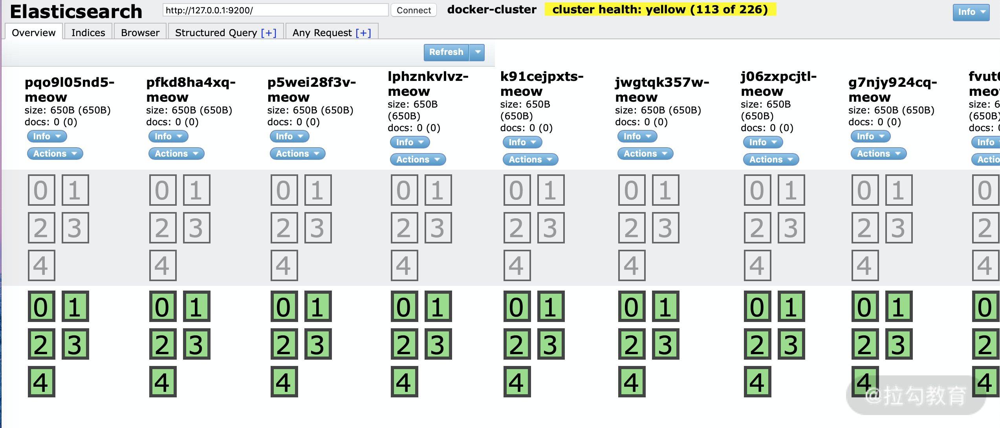
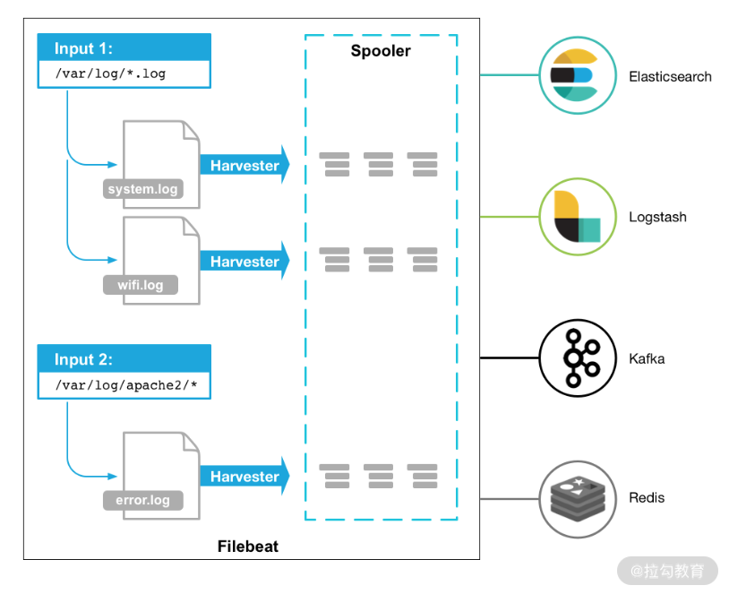
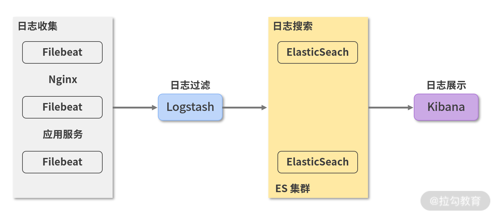
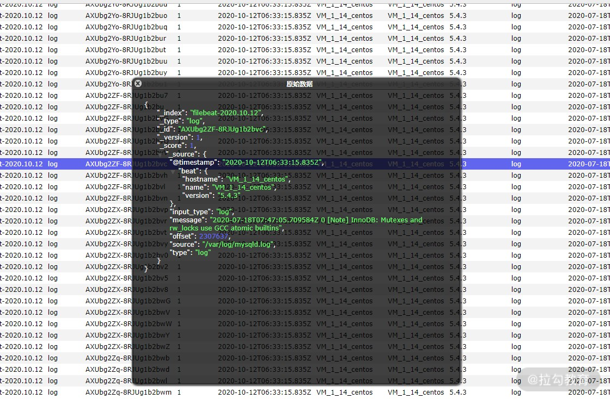
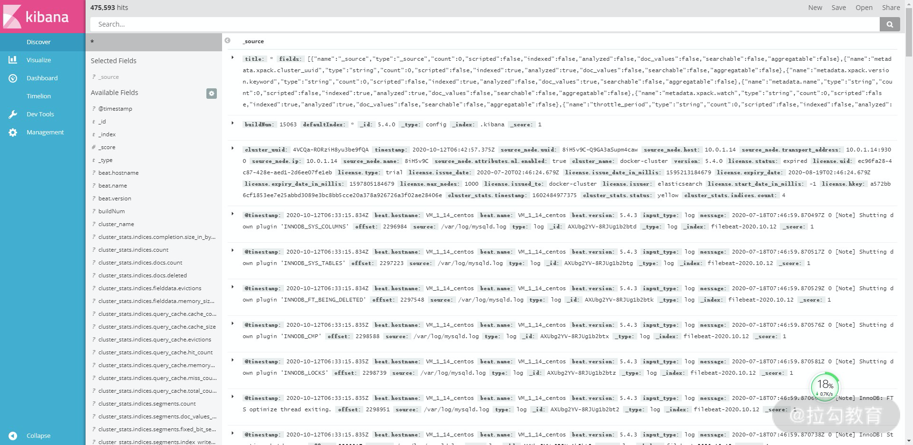

本课时将重点介绍**微服务架构中的日志收集方案 ELK**（ELK 是 Elasticsearch、Logstash 和 Kibana 的简称），准确地说是 ELKB，即 ELK + Filebeat，其中 Filebeat 是用于转发和集中日志数据的轻量级传送工具。

### 为什么需要分布式日志系统

在以前的项目中，如果想要在生产环境中通过日志定位业务服务的 Bug 或者性能问题，则需要运维人员使用命令挨个服务实例去查询日志文件，这样导致的结果就是：排查问题的效率非常低。

在微服务架构中，服务多实例部署在不同的物理机上，各个微服务的日志也被分散储存在不同的物理机。集群足够大的话，使用上述传统的方式查阅日志就变得非常不合适。因此需要集中化管理分布式系统中的日志，其中有开源的组件如 Syslog，用于将所有服务器上的日志收集汇总。

然而集中化日志文件之后，我们面临的是对这些日志文件进行统计和检索，比如哪些服务有报警和异常，这些都需要有详细的统计。所以，在以前出现线上故障时，经常会看到开发和运维人员下载服务的日志，并基于 Linux 下的一些命令（如 grep、awk 和 wc 等）进行检索和统计。这样的方式不仅工作量大、效率低，而且对于要求更高的查询、排序和统计等操作，以及庞大的机器数量，难免会有点“力不从心”，无法很好地胜任。

### ELKB 分布式日志系统

**ELKB 是一个完整的分布式日志收集系统**，很好地解决了上述提到的日志收集难、检索和分析难的问题。

ELKB 分别是指 Elasticsearch、Logstash、Kibana 和 Filebeat。Elastic 提供的一整套组件可以看作是 MVC 模型：Logstash 对应逻辑控制 Controller 层，Elasticsearch 是一个数据模型 Model 层，而 Kibana 则是视图 View 层。Logstash 和 Elasticsearch 是基于 Java 编写实现的，Kibana 则使用的是 Node.js 框架。


ELKB 日志采集系统

下面我们就来依次介绍这几个组件的功能，以及它们在日志采集系统中的作用。

#### Elasticsearch 的安装与使用

**Elasticsearch 是分布式系统中的实时搜索分析引擎**，使用 Java 语言实现，基于 Apache Lucene 搜索引擎库构建，可以用来进行全文检索、结构化搜索、分析以及这三个功能的组合。Elasticsearch 支持数百个节点的扩展，能够存储 PB 级别的数据。

另外，Elasticsearch 是面向文档的，它可以存储和搜索整个对象或文档。在 Elasticsearch 中，你可以对整个文档进行索引、检索、排序和过滤，这不同于传统的关系型数据库对行列数据进行操作。

为了方便，我们直接使用 Docker 安装 Elasticsearch：

```
$ docker run -d --name elasticsearch  docker.elastic.co/elasticsearch/elasticsearch:5.4.0
```

需要注意的是，Elasticsearch 启动之后需要进行简单的设置，xpack.security.enabled 默认是开启的，但我们为了方便测试，就取消登录认证，将该配置设置为 false。登入容器内部，执行如下的命令：

```
# 进入启动好的容器
$ docker exec -it elasticsearch bash
# 编辑配置文件
$ vim config/elasticsearch.yml
cluster.name: "docker-cluster"
network.host: 0.0.0.0
http.cors.enabled: true
http.cors.allow-origin: "*"
xpack.security.enabled: false
# minimum_master_nodes need to be explicitly set when bound on a public IP
# set to 1 to allow single node clusters
# Details: https://github.com/elastic/elasticsearch/pull/17288
discovery.zen.minimum_master_nodes: 1
```

修改好配置文件之后，退出容器，再重启容器即可完成配置。我们为了后面使用时能够保留配置，就需要从该容器创建一个新的镜像。首先获取到该容器对应的 ContainerId，然后基于该容器提交成一个新的镜像。

```
$ docker commit -a "add config" -m "dev" a404c6c174a2  es:latest
sha256:5cb8c995ca819765323e76cccea8f55b423a6fa2eecd9c1048b2787818c1a994
```

这样我们就得到了一个新的镜像 es:latest。我们运行新的镜像：

```
docker run -d --name es -p 9200:9200 -p 9300:9300   -e "discovery.type=single-node" es:latest
```

通过访问 Elasticsearch 提供的内置端点，我们检查 Elasticsearch 是否安装成功。

```
$ curl 'http://localhost:9200/_nodes/http?pretty'
{
  "_nodes" : {
    "total" : 1,
    "successful" : 1,
    "failed" : 0
  }, # 集群大小
  "cluster_name" : "docker-cluster", # 设置的集群名称
  "nodes" : { # 节点的详细信息
    "8iH5v9C-Q9GA3aSupm4caw" : {
      "name" : "8iH5v9C",
      "transport_address" : "10.0.1.14:9300",
      "host" : "10.0.1.14",
      "ip" : "10.0.1.14",
      "version" : "5.4.0",
      "build_hash" : "780f8c4",
      "roles" : [
        "master",
        "data",
        "ingest"
      ],
      "attributes" : {
        "ml.enabled" : "true"
      },
      "http" : { # 绑定的 http 端口
        "bound_address" : [
          "[::]:9200"
        ],
        "publish_address" : "10.0.1.14:9200",
        "max_content_length_in_bytes" : 104857600
      }
    }
  }
}
```

可以看到，我们成功安装了 Elasticsearch。另外，为了方便查看数据，我们需要安装 Elasticsearch 的可视化工具：elasticsearch-head。这个安装方法就很简单了：

```
$ docker run -p 9100:9100 mobz/elasticsearch-head:5
```

elasticsearch-head 是一款 Elasticsearch 可视化工具，能够显示 Elasticsearch 状态，除了数据可视化，还可以执行增、删、改、查等操作。

安装之后的界面如下所示：



elasticsearch-head 界面

#### Logstash 的安装与使用

Logstash 是一个数据分析软件，主要用于分析 Log 日志。其工作原理如下所示：


Logstash 工作原理图

数据源首先将数据传给 Logstash（这里我们使用的是 Filebeat 传输日志数据），它主要包括 Input 数据输入、Filter 数据源过滤和 Output 数据输出三部分。

Logstash 可以对数据进行处理，包括数据的过滤和格式化，之后发送到 Elasticsearch 存储，并在 Elasticsearch 中建立相应的索引。

下面我们就来安装和使用 Logstash。首先，下载并解压 Logstash：

```
# 下载 logstash
$ wget https://artifacts.elastic.co/downloads/logstash/logstash-5.4.3.tar.gz
# 解压 logstash
$ tar -zxvf logstash-5.4.3.tar.gz
```

下载速度可能比较慢，如果你想速度稍微快点，可以选择国内的镜像源。解压成功之后，我们需要配置 Logstash，主要就是我们前面所提到的输入、过滤和输出。

```
$ vi logstash-5.4.3/client.conf
input {  # 输入的设置，使用 filebeat
    beats {
        port => 5044
        codec => "json"
    }
}
output { #输出到 ES 中
    elasticsearch {
        hosts => ["127.0.0.1:9200"]
        index => "logstash-app-error-%{+YYYY.MM.dd}"
    }
    stdout {codec => rubydebug}
}
```

**输入**支持文件、Syslog 和 Beats，我们在配置时只能选择其中一种。这里我们配置了 Filebeats 方式。

**过滤**则用于处理一些特定的行为，如匹配特定规则的事件流。常见的 filters 有：geoip 添加地理信息、drop 丢弃部分事件和 mutate 修改文档等。如下是一个 filter 使用的示例：

```
filter {
  #定义客户端的 IP 是哪个字段
  geoip {
    source => "clientIp"
  }
}
```

**输出**支持 Elasticsearch、File、Graphite 和 StatsD，默认情况下将过滤的数据输出到 Elasticsearch，当我们不需要输出到 Elasticsearch 时就需要特别声明输出的方式是哪一种。Logstash 支持同时配置多个输出源。

我们在配置中，将日志信息输出到 Elasticsearch。配置文件搞定之后，我们开始启动 Logstash：

```
$ bin/logstash  -f client.conf
Sending Logstash's logs to /elk/logstash-5.4.3/logs which is now configured via log4j2.properties
[2020-10-12T14:12:26,056][INFO ][logstash.outputs.elasticsearch] Elasticsearch pool URLs updated {:changes=>{:removed=>[], :added=>[http://127.0.0.1:9200/]}}
[2020-10-12T14:12:26,062][INFO ][logstash.outputs.elasticsearch] Running health check to see if an Elasticsearch connection is working {:healthcheck_url=>http://127.0.0.1:9200/, :path=>"/"}
log4j:WARN No appenders could be found for logger (org.apache.http.client.protocol.RequestAuthCache).
log4j:WARN Please initialize the log4j system properly.
log4j:WARN See http://logging.apache.org/log4j/1.2/faq.html#noconfig for more info.
[2020-10-12T14:12:26,209][WARN ][logstash.outputs.elasticsearch] Restored connection to ES instance {:url=>#<URI::HTTP:0x1abac0 URL:http://127.0.0.1:9200/>}[2020-10-12T14:12:26,225][INFO ][logstash.outputs.elasticsearch] Using mapping template from {:path=>nil}
[2020-10-12T14:12:26,288][INFO ][logstash.outputs.elasticsearch] Attempting to install template {:manage_template=>{"template"=>"logstash-*", "version"=>50001, "settings"=>{"index.refresh_interval"=>"5s"}, "mappings"=>{"_default_"=>{"_all"=>{"enabled"=>true, "norms"=>false}, "dynamic_templates"=>[{"message_field"=>{"path_match"=>"message", "match_mapping_type"=>"string", "mapping"=>{"type"=>"text", "norms"=>false}}}, {"string_fields"=>{"match"=>"*", "match_mapping_type"=>"string", "mapping"=>{"type"=>"text", "norms"=>false, "fields"=>{"keyword"=>{"type"=>"keyword"}}}}}], "properties"=>{"@timestamp"=>{"type"=>"date", "include_in_all"=>false}, "@version"=>{"type"=>"keyword", "include_in_all"=>false}, "geoip"=>{"dynamic"=>true, "properties"=>{"ip"=>{"type"=>"ip"}, "location"=>{"type"=>"geo_point"}, "latitude"=>{"type"=>"half_float"}, "longitude"=>{"type"=>"half_float"}}}}}}}}
[2020-10-12T14:12:26,304][INFO ][logstash.outputs.elasticsearch] New Elasticsearch output {:class=>"LogStash::Outputs::ElasticSearch", :hosts=>[#<URI::Generic:0x2fec3fe6 URL://127.0.0.1:9200>]}
[2020-10-12T14:12:26,312][INFO ][logstash.pipeline        ] Starting pipeline {"id"=>"main", "pipeline.workers"=>4, "pipeline.batch.size"=>125, "pipeline.batch.delay"=>5, "pipeline.max_inflight"=>500}
[2020-10-12T14:12:27,226][INFO ][logstash.inputs.beats    ] Beats inputs: Starting input listener {:address=>"0.0.0.0:5044"}
[2020-10-12T14:12:27,319][INFO ][logstash.pipeline        ] Pipeline main started
[2020-10-12T14:12:27,422][INFO ][logstash.agent           ] Successfully started Logstash API endpoint {:port=>9600}
```

根据控制台输出的日志，我们知道 Logstash 已经正常启动。Elasticsearch 的数据实现可视化就需要结合 Kibana 提供前端的页面视图，你可以在 Kibana 页面进行搜索，使得结果变成图表可视化。

#### Kibana 的安装与使用

介绍完 Elasticsearch 和 Logstash，下面我们再来了解下 Kibana 的相关概念。Kibana 用于搜索、分析和可视化存储在 Elasticsearch 指标中的日志数据，是一个 Web 网页。Kibana 利用 Elasticsearch 的 REST 接口来检索数据，调用 Elasticsearch 存储的数据，将其可视化。它不仅允许用户自定义视图，还支持以特殊的方式查询和过滤数据。

Kibana 的安装比较简单，基于 Docker 安装即可：

```
docker run --name kibana -e ELASTICSEARCH_URL=http://127.0.0.1:9200 -p 5601:5601 -d kibana:5.6.9
```

我们在启动命令中指定了 ELASTICSEARCH 的环境变量，就是本地的`127.0.0.1:9200`。

#### Filebeat 的安装与使用

ELKB 中的 Filebeat 是最后研发的，并剥离出 Logstash 的数据转发功能。**Filebeat 基于 Go 语言开发，是用于转发和集中日志数据的轻量级传送工具**。通过配置 Filebeat，我们可以监听日志文件或位置、收集日志事件，并将这些文件转发到 Logstash、Kafka、Redis 等，当然也可以直接转发到 Elasticsearch 进行索引。



Filebeat 工作原理图

下面我们就按照如下命令开始安装和配置 Filebeat：

```
# 下载 filebeat
$ wget https://artifacts.elastic.co/downloads/beats/filebeat/filebeat-5.4.3-linux-x86_64.tar.gz
$ tar -zxvf filebeat-5.4.3-linux-x86_64.tar.gz
$ mv filebeat-5.4.3-linux-x86_64 filebeat
# 进入目录
$ cd filebeat
# 配置 filebeat
$ vi filebeat/client.yml
filebeat.prospectors:
- input_type: log
  paths:
    - /var/log/*.log
output.logstash:
  hosts: ["localhost:5044"]
```

在 Filebeat 的配置中，input_type 支持从 Log、Syslog、Stdin、Redis、UDP、Docker、TCP、NetFlow 输入。上述命令配置了从 Log 中读取日志信息，并且配置了只输入 /var/log/ 目录下的日志文件；output 将 Filebeat 配置为使用 Logstash 作为输出，并且使用 Logstash 对 Filebeat 收集的数据执行过滤等处理。

配置好之后，我们启动 Filebeat：

```
$ ./filebeat  -e  -c client.yml
2020/10/12 06:46:31.764391 beat.go:285: INFO Home path: [/elk/filebeat] Config path: [/elk/filebeat] Data path: [/elk/filebeat/data] Logs path: [/elk/filebeat/logs]
2020/10/12 06:46:31.764426 beat.go:186: INFO Setup Beat: filebeat; Version: 5.4.3
2020/10/12 06:46:31.764522 logstash.go:90: INFO Max Retries set to: 3
2020/10/12 06:46:31.764588 outputs.go:108: INFO Activated logstash as output plugin.
2020/10/12 06:46:31.764586 metrics.go:23: INFO Metrics logging every 30s
2020/10/12 06:46:31.764664 publish.go:295: INFO Publisher name: VM_1_14_centos
2020/10/12 06:46:31.765299 async.go:63: INFO Flush Interval set to: 1s
2020/10/12 06:46:31.765315 async.go:64: INFO Max Bulk Size set to: 2048
2020/10/12 06:46:31.765563 beat.go:221: INFO filebeat start running.
2020/10/12 06:46:31.765592 registrar.go:85: INFO Registry file set to: /elk/filebeat/data/registry
2020/10/12 06:46:31.765630 registrar.go:106: INFO Loading registrar data from /elk/filebeat/data/registry
2020/10/12 06:46:31.766100 registrar.go:123: INFO States Loaded from registrar: 6
2020/10/12 06:46:31.766136 crawler.go:38: INFO Loading Prospectors: 1
2020/10/12 06:46:31.766209 registrar.go:236: INFO Starting Registrar
2020/10/12 06:46:31.766256 sync.go:41: INFO Start sending events to output
2020/10/12 06:46:31.766291 prospector_log.go:65: INFO Prospector with previous states loaded: 0
2020/10/12 06:46:31.766390 prospector.go:124: INFO Starting prospector of type: log; id: 2536729917787673381
2020/10/12 06:46:31.766422 crawler.go:58: INFO Loading and starting Prospectors completed. Enabled prospectors: 1
2020/10/12 06:46:31.766430 spooler.go:63: INFO Starting spooler: spool_size: 2048; idle_timeout: 5s
2020/10/12 06:47:01.764888 metrics.go:34: INFO No non-zero metrics in the last 30s
2020/10/12 06:47:31.764929 metrics.go:34: INFO No non-zero metrics in the last 30s
2020/10/12 06:48:01.765134 metrics.go:34: INFO No non-zero metrics in the last 30s
```

Filebeat 将启动一个或多个输入日志或文件位置，这些输入将在日志数据指定的位置中查找。除此之外，Filebeat 还会将监听到的数据发送到其预先配置好的指定输出源。

### ELKB 的使用实践

安装好 ELKB 组件之后，我们开始整合这些组件。首先看下 ELKB 收集日志的流程：



ELKB 收集日志的流程图

Filebeat 监听应用的日志文件，随后将数据发送给 Logstash；Logstash 会对数据进行过滤和格式化，如 JSON 格式化，之后将处理好的日志数据发送给 Elasticsearch；Elasticsearch 存储并建立搜索的索引；Kibana 则会调用 Elasticsearch 的存储，为用户提供可视化的视图页面。

我们运行所有的组件之后，首先看下 elasticsearch-head 中的索引变化：


elasticsearch-head 中的索引界面

可以看到多了一个`filebeat-2020.10.12`的索引，这说明 ELKB 分布式日志收集框架搭建成功。访问 http://localhost:9100，我们来具体看下索引中的具体数据：



日志信息截图

从上面截图可以看到，/var/log/ 目录下的 mysqld.log 文件中产生了新的日志数据，这些数据非常多，我们在生产环境中需要根据实际的业务进行过滤，并处理相应的日志格式。



Kibana 日志界面

elasticsearch-head 仅仅是一个简单的 Elasticsearch 客户端，为了更加完整地统计和搜索需求，就需要借助于 Kibana，Kibana 具有很强大的分析能力。上面的 Kibana（访问 [http://localhost:5601](http://localhost:5601/)）运行截图展示了 Filebeat 监听到的 mysql 日志，图中可以看到这些日志信息。

基于 Elasticsearch，Kibana 可以友好地展示海量日志的统计视图，并根据结果生成折线图、直方图和饼图等，这里就不一一展示了。

### 小结

本课时主要介绍了分布式日志采集系统 ELKB。日志主要用来记录离散的事件，包含程序执行到某一点或某一阶段的详细信息。ELKB 很好地解决了微服务架构下，服务实例众多且分散、日志难以收集和分析的问题。限于篇幅，本课时只介绍了 ELKB 的安装和使用，其实 Go 微服务中一般使用日志框架（如 logrus、zap 等），按照一定的格式将日志输出到指定的位置，这里就交给你自行构建一个微服务进行实践了。