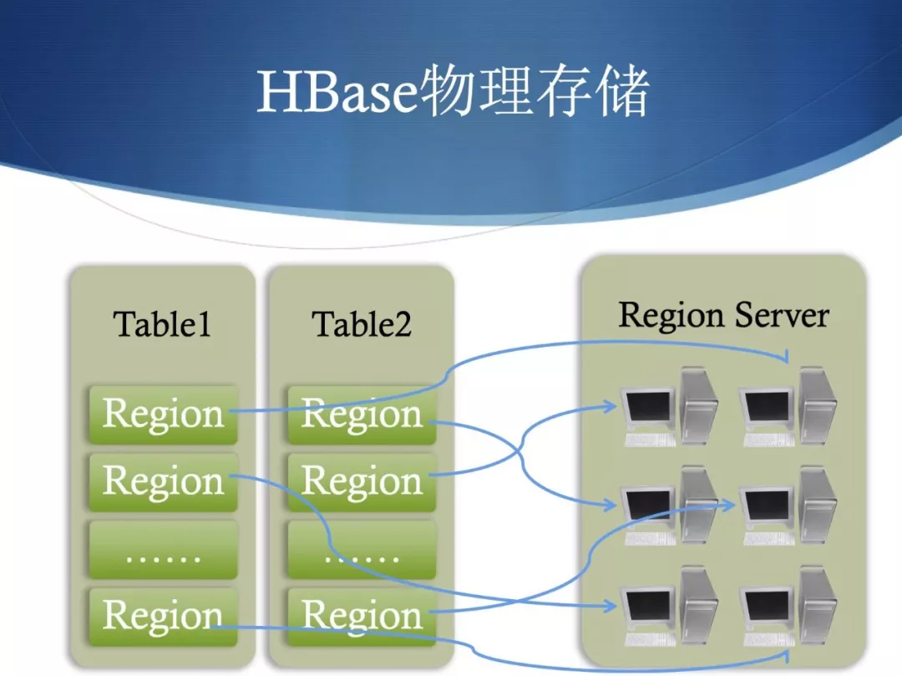

**一、 HBase 简介**

HBase 名称的由来是由于其作为 Hadoop Database 存在的，用来存储非结构化、半结构化数据。

要想知道 HBase 的用途，就需要看一看其在 Apache 的 Hadoop 生态系统中的位置，可以看到 HBase 是构建在 HDFS 之上的，这是由于 HBase 内部管理的文件全部都是存储在 HDFS 当中的。同时，MapReduce 这个计算框架在 HBase 之上又提供了高性能的计算能力来处理海量数据。此外还有一些像 Pig、Hive 用来提供高层语言的支持。还有 Sqoop 用来完成传统数据库到 HBase 之间的数据迁移。类似衍生出来的新技术还有很多，有兴趣的同学可以自己去了解一下。

Google 的三架马车 BigTable、GFS、MapReduce 现在在开源社区中都能找到对应的实现。HBase 就是 Bigtable 的开源实现，当然这句话不是完全正确，因为两者之间还是有些差异的。但是主要还是基于 BigTable 这个数据模型开发的，因此也是具有 Key-Value 特征的，同时也就具有 Bigtable 稀疏的、面向列的这些特性。

也是由于 HBase 利用 HDFS 作为它的文件系统，因此它也具有 HDFS 的高可靠性和可伸缩性。和 Hadoop 一样，HBase 也是依照横向扩展，通过不断地通过添加廉价的服务器来增加计算和存储的能力。BigTable 利用 Chubby 来进行协同服务，HBase 则是利用 Zookeeper 来对整个分布式系统进行协调服务。正是因为通过HDFS 的高可靠可伸缩性，以及应用了 Bigtable 的稀疏的面向列的这些高效的数据组织形式。所以 HBase 才能如此地适合大数据随机和实时读写。

**二、 HBase 基本概念**

这里介绍一下 HBase 的一些基本概念：

RowKey（行键），顾名思义也就是我们在关系型数据库中常见的主键，它是Unique 的，在 HBase 中这个主键可以是任意的字符串，其最大长度是64K，在内部存储中会被存储为字节数组，HBase 表中的数据是按照 RowKey 的字典序排列的，例如很多索引的实现，包括地理空间索引很大程度就是依赖这个特性。

不过也要注意一个点，现实当中期望排序是1、2、3、4...10，而在 HBase 中1 后面紧跟的会是10。因此，在设计行键的时候一定要充分地利用字典序这个特性，将一下经常读取的行存储到一起或者靠近，减少Scan 的耗时，提高读取的效率。这里一定要说的一点是，行键设计真的很重要，例如做组合行键时将时间排前面，导致写热点（曾经踩过的坑，记忆犹新）。

Column Family（列族），它是由若干列构成，是表 Schema 的一部分，所以需要在创建表的时候就指定好。但也不是所表创建完之后就不能更改列族，只是成本会比较大，因此不建议更改。HBase 中可允许定义的列族个数最多就20多个。列族不仅仅能够帮助我们构建数据的语义边界，还能有助于我们设置某些特性，比如可以指定某个列族内数据的压缩形式。一个列族包含的所有列在物理存储上都是在同一个底层的存储文件当中。

Column （列），一般都是从属于某个列族，跟列族不一样，列的数量一般的没有强限制的，一个列族当中可以有数百万个列，而且这些列都可以动态添加的。这也是我们常说的 HBase 面向列的优点，不像传统的关系型数据库，调整一下 Schema 都需要担心对于生产的影响。

Version Number（版本号），HBase 中每一列的值或者说是每个单元格的值都是具有版本号的，默认使用的系统当前的时间戳，精确到毫秒。当然也可以是用户自己显式地设置，我们是通过时间戳来识别不同的版本，因此如果要自己设置的话，也要保证版本号的唯一性。用户也可以指定保存指定单元格的最后 N 个版本，或者某个时间段的版本，这个是可以在配置中配置的。一个单元格里面是数据是按照版本号降序的。也就是说最后写入的值会被最先读取。

Cell（单元格），一个单元格就是由前面说的行键、列标示、版本号唯一确定的，这里说的列标示包括列族和列名。Cell 中的数据是没有类型的，全部都是字节码。

**三、HBase 表逻辑视图**

由于 HBase 表的一个单元格是由多维决定的，我这里尝试用一个二维的电子表格来展示。可以结合前面说的 HBase 的基本概念来理解。可以看到通过二维表格来展示一个成绩表，中间有很多单元格是空的，整体看起来很稀疏，需要说明的是在 HBase 的实际存储中这些空的单元格并不占存储。

**四、HBase 表物理视图**

物理视图比较复杂，下面以图来展示一个 HBase 表从宏观到微观到物理存储。尽量以最简单到方式展示物理视图的几个层次。

- 表的横向切分（Table➝Region）

Region 的分裂

Region 的分布

 Region 的存储结构

一个 Region 是由一个或多个 Store 组成。每一个 Store 其实就是一个列族。每个

Store 又是由一个 memStore 和 0 个或者多个 storeFile 组成。memStore 是存储在内存中，storeFile 是存储在 HDFS 中，有时候也称作 HFile。数据都会先写入memStore，一旦 memStore 超过给的的最大值之后，HBase 就会将memStore 持久化为 storeFile。

**五、HBase 集群结构**

一个 HBase 集群一般由一个 Master 和多个 RegionServer 组成。

- 客户端库：可以通过 HBase 提供的各式语言API 库访问集群。API 库也会维护一个本地缓存来加快对 HBase 对访问，比如缓存中记录着 Region 的位置信息。
- Maste 节点：主要为各个 RegionServer 分配 Region，负责 RegionServer 对负载均衡，管理用户对于 Table 对 CRUD 操作。
- RegionServer：维护 Region，处理对这些 Region 对IO 请求，负责切分在运行过程中变过大的 Region。