\1. 对查询进行优化，应尽量避免全表扫描，首先应考虑在where及order by所涉及的列上建立索引
\2. 应尽量避免在where子句中对字段进行null值判断、使用!=或<>操作符，否则将导致引擎放弃使用索引而进行全表扫描。
\3. 应尽量避免在where子句中使用or来连接条件，如果一个字段有索引一个字段没有索引，将导致引擎放弃使用索引而进行全表扫描。可以使用union all来连接
\4. in 和 not in 也要慎用，否则会导致全表扫描，如果为连续的数值，尽量使用between代替
\5. 尽量避免此种模糊查询 like '%abc%'
\6. 避免在where子句中对字段进行表达式操作，如：
select id from t where num/2=100
应改为:
select id from t where num=100*2
7.索引并不是越多越好，索引固然可以提高相应的 select 的效率，但同时也降低了 insert 及 update 的效率，因为 insert 或 update 时有可能会重建索引，所以怎样建索引需要慎重考虑，视具体情况而定。一个表的索引数最好不要超过6个，若太多则应考虑一些不常使用到的列上建的索引是否有必要。
8.尽量使用数字型字段，若只含数值信息的字段尽量不要设计为字符型，这会降低查询和连接的性能，并会增加存储开销。这是因为引擎在处理查询和连接时会逐个比较字符串中每一个字符，而对于数字型而言只需要比较一次就够了。
9.尽可能的使用 varchar 代替 char ，因为首先变长字段存储空间小，可以节省存储空间，其次对于查询来说，在一个相对较小的字段内搜索效率显然要高些。
10.任何地方都不要使用 select * from t ，用具体的字段列表代替“*”，不要返回用不到的任何字段。
11.避免频繁创建和删除临时表，以减少系统表资源的消耗。
12.临时表并不是不可使用，适当地使用它们可以使某些例程更有效，例如，当需要重复引用大型表或常用表中的某个数据集时。但是，对于一次性事件，最好使用导出表。
13.在新建临时表时，如果一次性插入数据量很大，那么可以使用 select into 代替 create table，避免造成大量 log ，以提高速度；如果数据量不大，为了缓和系统表的资源，应先create table，然后insert
14.如果使用到了临时表，在存储过程的最后务必将所有的临时表显式删除，先 truncate table ，然后 drop table ，这样可以避免系统表的较长时间锁定。
15.尽量避免使用游标，因为游标的效率较差，如果游标操作的数据超过1万行，那么就应该考虑改写。
16.使用基于游标的方法或临时表方法之前，应先寻找基于集的解决方案来解决问题，基于集的方法通常更有效。
17.与临时表一样，游标并不是不可使用。对小型数据集使用 FAST_FORWARD 游标通常要优于其他逐行处理方法，尤其是在必须引用几个表才能获得所需的数据时。
18.尽量避免大事务操作，提高系统并发能力。
19.尽量避免向客户端返回大数据量，若数据量过大，应该考虑相应需求是否合理。
20.在使用索引字段作为条件时，如果该索引是复合索引，那么必须使用到该索引中的第一个字段作为条件时才能保证系统使用该索引，否则该索引将不会被使用，并且应尽可能的让字段顺序与索引顺序相一致。

网上关于SQL优化的教程很多，但是比较杂乱。近日有空整理了一下，写出来跟大家分享一下，其中有错误和不足的地方，还请大家纠正补充。
这篇文章我花费了大量的时间查找资料、修改、排版，希望大家阅读之后，感觉好的话推荐给更多的人，让更多的人看到、纠正以及补充。
 
1.对查询进行优化，要尽量避免全表扫描，首先应考虑在 where 及 order by 涉及的列上建立索引。

2.应尽量避免在 where 子句中对字段进行 null 值判断，否则将导致引擎放弃使用索引而进行全表扫描，如：
select id from t where num is null最好不要给数据库留NULL，尽可能的使用 NOT NULL填充数据库.
备注、描述、评论之类的可以设置为 NULL，其他的，最好不要使用NULL。
不要以为 NULL 不需要空间，比如：char(100) 型，在字段建立时，空间就固定了， 不管是否插入值（NULL也包含在内），都是占用 100个字符的空间的，如果是varchar这样的变长字段， null 不占用空间。

可以在num上设置默认值0，确保表中num列没有null值，然后这样查询：
select id from t where num = **0**
3.应尽量避免在 where 子句中使用 != 或 <> 操作符，否则将引擎放弃使用索引而进行全表扫描。

4.应尽量避免在 where 子句中使用 or 来连接条件，如果一个字段有索引，一个字段没有索引，将导致引擎放弃使用索引而进行全表扫描，如：
select id from t where num=**10** or Name = 'admin'可以这样查询：
select id from t where num = **10**
union all
select id from t where Name = 'admin'
5.in 和 not in 也要慎用，否则会导致全表扫描，如：
select id from t where num in(**1**,**2**,**3**)对于连续的数值，能用 between 就不要用 in 了：
select id from t where num between **1** and **3**很多时候用 exists 代替 in 是一个好的选择：
select num from a where num in(select num from b)用下面的语句替换：
select num from a where exists(select **1** from b where num=a.num) 
6.下面的查询也将导致全表扫描：
select id from t where name like ‘%abc%’若要提高效率，可以考虑全文检索。

7.如果在 where 子句中使用参数，也会导致全表扫描。因为SQL只有在运行时才会解析局部变量，但优化程序不能将访问计划的选择推迟到运行时；它必须在编译时进行选择。然 而，如果在编译时建立访问计划，变量的值还是未知的，因而无法作为索引选择的输入项。如下面语句将进行全表扫描：
select id from t where num = @num可以改为强制查询使用索引：
select id from t with(index(索引名)) where num = @num.应尽量避免在 where 子句中对字段进行表达式操作，这将导致引擎放弃使用索引而进行全表扫描。如：
select id from t where num/**2** = **100**应改为:
select id from t where num = **100*****2**
9.应尽量避免在where子句中对字段进行函数操作，这将导致引擎放弃使用索引而进行全表扫描。如：
select id from t where substring(name,**1**,**3**) = ’abc’ -–name以abc开头的id
select id from t where datediff(day,createdate,’**2005**-**11**-**30**′) = **0 -**–‘**2005**-**11**-**30**’ --生成的id应改为:
select id from t where name like 'abc%'
select id from t where createdate >= '2005-11-30' and createdate < '2005-12-1'
10.不要在 where 子句中的“=”左边进行函数、算术运算或其他表达式运算，否则系统将可能无法正确使用索引。

11.在使用索引字段作为条件时，如果该索引是复合索引，那么必须使用到该索引中的第一个字段作为条件时才能保证系统使用该索引，否则该索引将不会被使用，并且应尽可能的让字段顺序与索引顺序相一致。

12.不要写一些没有意义的查询，如需要生成一个空表结构：
select col1,col2 into #t from t where **1**=**0**这类代码不会返回任何结果集，但是会消耗系统资源的，应改成这样：
create table #t(…)
13.Update 语句，如果只更改1、2个字段，不要Update全部字段，否则频繁调用会引起明显的性能消耗，同时带来大量日志。

14.对于多张大数据量（这里几百条就算大了）的表JOIN，要先分页再JOIN，否则逻辑读会很高，性能很差。

15.select count(*) from table；这样不带任何条件的count会引起全表扫描，并且没有任何业务意义，是一定要杜绝的。

16.索引并不是越多越好，索引固然可以提高相应的 select 的效率，但同时也降低了 insert 及 update 的效率，因为 insert 或 update 时有可能会重建索引，所以怎样建索引需要慎重考虑，视具体情况而定。一个表的索引数最好不要超过6个，若太多则应考虑一些不常使用到的列上建的索引是否有 必要。

17.应尽可能的避免更新 clustered 索引数据列，因为 clustered 索引数据列的顺序就是表记录的物理存储顺序，一旦该列值改变将导致整个表记录的顺序的调整，会耗费相当大的资源。若应用系统需要频繁更新 clustered 索引数据列，那么需要考虑是否应将该索引建为 clustered 索引。

18.尽量使用数字型字段，若只含数值信息的字段尽量不要设计为字符型，这会降低查询和连接的性能，并会增加存储开销。这是因为引擎在处理查询和连 接时会逐个比较字符串中每一个字符，而对于数字型而言只需要比较一次就够了。

19.尽可能的使用 varchar/nvarchar 代替 char/nchar ，因为首先变长字段存储空间小，可以节省存储空间，其次对于查询来说，在一个相对较小的字段内搜索效率显然要高些。

20.任何地方都不要使用 select * from t ，用具体的字段列表代替“*”，不要返回用不到的任何字段。

21.尽量使用表变量来代替临时表。如果表变量包含大量数据，请注意索引非常有限（只有主键索引）。

\22. 避免频繁创建和删除临时表，以减少系统表资源的消耗。临时表并不是不可使用，适当地使用它们可以使某些例程更有效，例如，当需要重复引用大型表或常用表中的某个数据集时。但是，对于一次性事件， 最好使用导出表。

23.在新建临时表时，如果一次性插入数据量很大，那么可以使用 select into 代替 create table，避免造成大量 log ，以提高速度；如果数据量不大，为了缓和系统表的资源，应先create table，然后insert。

24.如果使用到了临时表，在存储过程的最后务必将所有的临时表显式删除，先 truncate table ，然后 drop table ，这样可以避免系统表的较长时间锁定。

25.尽量避免使用游标，因为游标的效率较差，如果游标操作的数据超过1万行，那么就应该考虑改写。

26.使用基于游标的方法或临时表方法之前，应先寻找基于集的解决方案来解决问题，基于集的方法通常更有效。

27.与临时表一样，游标并不是不可使用。对小型数据集使用 FAST_FORWARD 游标通常要优于其他逐行处理方法，尤其是在必须引用几个表才能获得所需的数据时。在结果集中包括“合计”的例程通常要比使用游标执行的速度快。如果开发时 间允许，基于游标的方法和基于集的方法都可以尝试一下，看哪一种方法的效果更好。

28.在所有的存储过程和触发器的开始处设置 SET NOCOUNT ON ，在结束时设置 SET NOCOUNT OFF 。无需在执行存储过程和触发器的每个语句后向客户端发送 DONE_IN_PROC 消息。

29.尽量避免大事务操作，提高系统并发能力。

30.尽量避免向客户端返回大数据量，若数据量过大，应该考虑相应需求是否合理。
 
实际案例分析：拆分大的 DELETE 或INSERT 语句，批量提交SQL语句
　　如果你需要在一个在线的网站上去执行一个大的 DELETE 或 INSERT 查询，你需要非常小心，要避免你的操作让你的整个网站停止相应。因为这两个操作是会锁表的，表一锁住了，别的操作都进不来了。
　　Apache 会有很多的子进程或线程。所以，其工作起来相当有效率，而我们的服务器也不希望有太多的子进程，线程和数据库链接，这是极大的占服务器资源的事情，尤其是内存。
　　如果你把你的表锁上一段时间，比如30秒钟，那么对于一个有很高访问量的站点来说，这30秒所积累的访问进程/线程，数据库链接，打开的文件数，可能不仅仅会让你的WEB服务崩溃，还可能会让你的整台服务器马上挂了。
　　所以，如果你有一个大的处理，你一定把其拆分，使用 LIMIT oracle(rownum),sqlserver(top)条件是一个好的方法。下面是一个mysql示例：

while(1){

　　//每次只做1000条

　　 mysql_query(“delete from logs where log_date <= ’2012-11-01’ limit 1000”);

　　if(mysql_affected_rows() == 0){

　　 　　//删除完成，退出！
　　 　　break；
　　}

//每次暂停一段时间，释放表让其他进程/线程访问。
usleep(50000)

}

**二、数据库访问性能优化**
**
**

特别说明：
1、 本文只是面对数据库应用开发的程序员，不适合专业DBA，DBA在数据库性能优化方面需要了解更多的知识；
2、 本文许多示例及概念是基于Oracle数据库描述，对于其它关系型数据库也可以参考，但许多观点不适合于KV数据库或内存数据库或者是基于SSD技术的数据库；
3、 本文未深入数据库优化中最核心的执行计划分析技术。

读者对像：
开发人员：如果你是做数据库开发，那本文的内容非常适合，因为本文是从程序员的角度来谈数据库性能优化。
架构师：如果你已经是数据库应用的架构师，那本文的知识你应该清楚90%，否则你可能是一个喜欢折腾的架构师。
DBA（数据库管理员）：大型数据库优化的知识非常复杂，本文只是从程序员的角度来谈性能优化，DBA除了需要了解这些知识外，还需要深入数据库的内部体系架构来解决问题。

   在网上有很多文章介绍数据库优化知识，但是大部份文章只是对某个一个方面进行说明，而对于我们程序员来说这种介绍并不能很好的掌握优化知识，因为很多介绍只是对一些特定的场景优化的，所以反而有时会产生误导或让程序员感觉不明白其中的奥妙而对数据库优化感觉很神秘。
   很多程序员总是问如何学习数据库优化，有没有好的教材之类的问题。在书店也看到了许多数据库优化的专业书籍，但是感觉更多是面向DBA或者是PL/SQL开发方面的知识，个人感觉不太适合普通程序员。而要想做到数据库优化的高手，不是花几周，几个月就能达到的，这并不是因为数据库优化有多高深，而是因为要做好优化一方面需要有非常好的技术功底，对操作系统、存储硬件网络、数据库原理等方面有比较扎实的基础知识，另一方面是需要花大量时间对特定的数据库进行实践测试与总结。
   作为一个程序员，我们也许不清楚线上正式的服务器硬件配置，我们不可能像DBA那样专业的对数据库进行各种实践测试与总结，但我们都应该非常了解我们SQL的业务逻辑，我们清楚SQL中访问表及字段的数据情况，我们其实只关心我们的SQL是否能尽快返回结果。那程序员如何利用已知的知识进行数据库优化？如何能快速定位SQL性能问题并找到正确的优化方向？
面对这些问题，笔者总结了一些面向程序员的基本优化法则，本文将结合实例来坦述数据库开发的优化知识。
   要正确的优化SQL，我们需要快速定位能性的瓶颈点，也就是说快速找到我们SQL主要的开销在哪里？而大多数情况性能最慢的设备会是瓶颈点，如下载时网络速度可能会是瓶颈点，本地复制文件时硬盘可能会是瓶颈点，为什么这些一般的工作我们能快速确认瓶颈点呢，因为我们对这些慢速设备的性能数据有一些基本的认识，如网络带宽是2Mbps，硬盘是每分钟7200转等等。因此，为了快速找到SQL的性能瓶颈点，我们也需要了解我们计算机系统的硬件基本性能指标，下图展示的当前主流计算机性能指标数据。

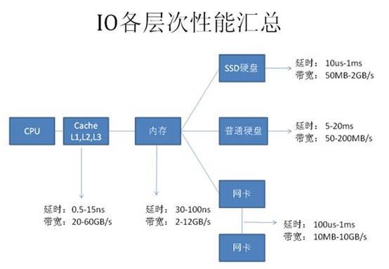

从图上可以看到基本上每种设备都有两个指标：
延时（响应时间）：表示硬件的突发处理能力；
带宽（吞吐量）：代表硬件持续处理能力。

从上图可以看出，计算机系统硬件性能从高到代依次为：
CPU——Cache(L1-L2-L3)——内存——SSD硬盘——网络——硬盘
由于SSD硬盘还处于快速发展阶段，所以本文的内容不涉及SSD相关应用系统。
根据数据库知识，我们可以列出每种硬件主要的工作内容：
CPU及内存：缓存数据访问、比较、排序、事务检测、SQL解析、函数或逻辑运算；
网络：结果数据传输、SQL请求、远程数据库访问（dblink）；
硬盘：数据访问、数据写入、日志记录、大数据量排序、大表连接。

根据当前计算机硬件的基本性能指标及其在数据库中主要操作内容，可以整理出如下图所示的性能基本优化法则：

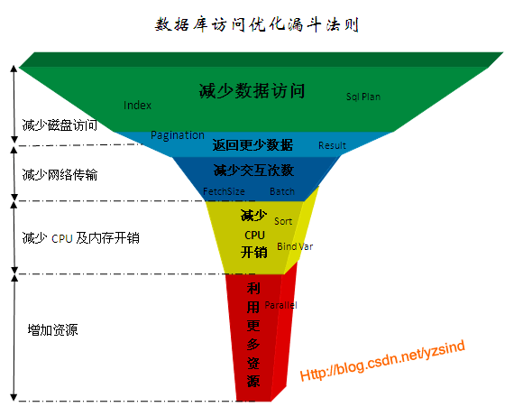

这个优化法则归纳为5个层次：
1、 减少数据访问（减少磁盘访问）
2、 返回更少数据（减少网络传输或磁盘访问）
3、 减少交互次数（减少网络传输）
4、 减少服务器CPU开销（减少CPU及内存开销）
5、 利用更多资源（增加资源）
 
由于每一层优化法则都是解决其对应硬件的性能问题，所以带来的性能提升比例也不一样。传统数据库系统设计是也是尽可能对低速设备提供优化方法，因此针对低速设备问题的可优化手段也更多，优化成本也更低。我们任何一个SQL的性能优化都应该按这个规则由上到下来诊断问题并提出解决方案，而不应该首先想到的是增加资源解决问题。
以下是每个优化法则层级对应优化效果及成本经验参考：
 

| 点击这里          | 点击这里     | 点击这里 |
| :---------------- | :----------- | :------- |
| 优化法则          | 性能提升效果 | 优化成本 |
| 减少数据访问      | 1~1000       | 低       |
| 返回更少数据      | 1~100        | 低       |
| 减少交互次数      | 1~20         | 低       |
| 减少服务器CPU开销 | 1~5          | 低       |
| 利用更多资源      | @~10         | 高       |

 
接下来，我们针对5种优化法则列举常用的优化手段并结合实例分析。

接下来，我们针对5种优化法则列举常用的优化手段并结合实例分析。
 

# 二、oracle数据库两个基本概念

数据块是数据库中数据在磁盘中存储的最小单位，也是一次IO访问的最小单位，一个数据块通常可以存储多条记录，数据块大小是DBA在创建数据库或表空间时指定，可指定为2K、4K、8K、16K或32K字节。下图是一个Oracle数据库典型的物理结构，一个数据库可以包括多个数据文件，一个数据文件内又包含多个数据块；

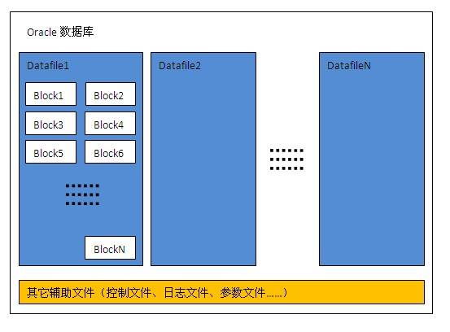

ROWID是每条记录在数据库中的唯一标识，通过ROWID可以直接定位记录到对应的文件号及数据块位置。ROWID内容包括文件号、对像号、数据块号、记录槽号，如下图所示：

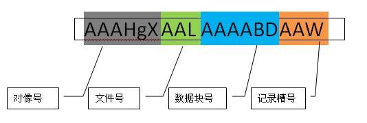

三、数据库访问优化法则详解

## 减少数据访问

### 创建并使用正确的索引

数据库索引的原理非常简单，但在复杂的表中真正能正确使用索引的人很少，即使是专业的DBA也不一定能完全做到最优。
索引会大大增加表记录的DML(INSERT,UPDATE,DELETE)开销，正确的索引可以让性能提升100，1000倍以上，不合理的索引也可能会让性能下降100倍，因此在一个表中创建什么样的索引需要平衡各种业务需求。
索引常见问题：
**索引有哪些种类？**
常见的索引有B-TREE索引、位图索引、全文索引，位图索引一般用于数据仓库应用，全文索引由于使用较少，这里不深入介绍。B-TREE索引包括很多扩展类型，如组合索引、反向索引、函数索引等等，以下是B-TREE索引的简单介绍：
B-TREE索引也称为平衡树索引(Balance Tree)，它是一种按字段排好序的树形目录结构，主要用于提升查询性能和唯一约束支持。B-TREE索引的内容包括根节点、分支节点、叶子节点。
**叶子节点内容：**索引字段内容+表记录ROWID
**根节点，分支节点内容：**当一个数据块中不能放下所有索引字段数据时，就会形成树形的根节点或分支节点，根节点与分支节点保存了索引树的顺序及各层级间的引用关系。
     一个普通的BTREE索引结构示意图如下所示：

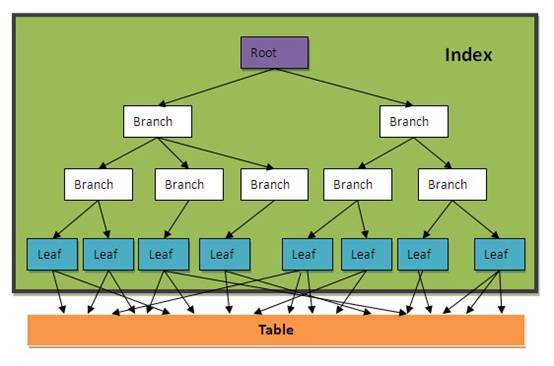

如果我们把一个表的内容认为是一本字典，那索引就相当于字典的目录，如下图所示：

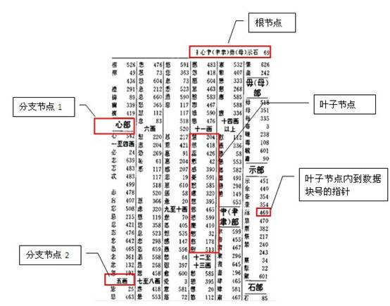

图中是一个字典按部首+笔划数的目录，相当于给字典建了一个按部首+笔划的组合索引。
一个表中可以建多个索引，就如一本字典可以建多个目录一样（按拼音、笔划、部首等等）。
一个索引也可以由多个字段组成，称为组合索引，如上图就是一个按部首+笔划的组合目录。
**SQL什么条件会使用索引？**
当字段上建有索引时，通常以下情况会使用索引：
INDEX_COLUMN = ?
INDEX_COLUMN > ?
INDEX_COLUMN >= ?
INDEX_COLUMN < ?
INDEX_COLUMN <= ?
INDEX_COLUMN between ? and ?
INDEX_COLUMN in (?,?,...,?)
INDEX_COLUMN like ?||'%'（后导模糊查询）
T1. INDEX_COLUMN=T2. COLUMN1（两个表通过索引字段关联）
 
**SQL什么条件不会使用索引？**
 
 

| 点击这里                                                     | 点击这里                                                     |
| :----------------------------------------------------------- | :----------------------------------------------------------- |
| 查询条件                                                     | 不能使用索引原因                                             |
| INDEX_COLUMN <> ? INDEX_COLUMN not in (?,?,...,?)            | 不等于操作不能使用索引                                       |
| function(INDEX_COLUMN) = ? INDEX_COLUMN + 1 = ? INDEX_COLUMN \|\| 'a' = ? | 经过普通运算或函数运算后的索引字段不能使用索引               |
| INDEX_COLUMN like '%'\|\|? INDEX_COLUMN like '%'\|\|?\|\|'%' | 含前导模糊查询的Like语法不能使用索引                         |
| INDEX_COLUMN is null                                         | B-TREE索引里不保存字段为NULL值记录，因此IS NULL不能使用索引  |
| NUMBER_INDEX_COLUMN='12345' CHAR_INDEX_COLUMN=12345          | Oracle在做数值比较时需要将两边的数据转换成同一种数据类型，如果两边数据类型不同时会对字段值隐式转换，相当于加了一层函数处理，所以不能使用索引。 |
| a.INDEX_COLUMN=a.COLUMN_1                                    | 给索引查询的值应是已知数据，不能是未知字段值。               |
| 注： 经过函数运算字段的字段要使用可以使用函数索引，这种需求建议与DBA沟通。 有时候我们会使用多个字段的组合索引，如果查询条件中第一个字段不能使用索引，那整个查询也不能使用索引 如：我们company表建了一个id+name的组合索引，以下SQL是不能使用索引的 Select * from company where name=? Oracle9i后引入了一种index skip scan的索引方式来解决类似的问题，但是通过index skip scan提高性能的条件比较特殊，使用不好反而性能会更差。 |                                                              |

 
**我们一般在什么字段上建索引？**
这是一个非常复杂的话题，需要对业务及数据充分分析后再能得出结果。主键及外键通常都要有索引，其它需要建索引的字段应满足以下条件：
1、字段出现在查询条件中，并且查询条件可以使用索引；
2、语句执行频率高，一天会有几千次以上；
3、通过字段条件可筛选的记录集很小，那数据筛选比例是多少才适合？
这个没有固定值，需要根据表数据量来评估，以下是经验公式，可用于快速评估：
**小表(记录数小于10000行的表)：筛选比例<10%；**
**大表：(筛选返回记录数)<(表总记录数\*单条记录长度)/10000/16**
   **单条记录长度≈字段平均内容长度之和+字段数\*2**
 
以下是一些字段是否需要建B-TREE索引的经验分类：
 
 

| 点击这里                                        | 点击这里                 | 点击这里                                                 |
| :---------------------------------------------- | :----------------------- | :------------------------------------------------------- |
|                                                 | 字段类型                 | 常见字段名                                               |
| 需要建索引的字段                                | 主键                     | ID,PK                                                    |
|                                                 | 外键                     | PRODUCT_ID,COMPANY_ID,MEMBER_ID,ORDER_ID,TRADE_ID,PAY_ID |
|                                                 | 有对像或身份标识意义字段 | HASH_CODE,USERNAME,IDCARD_NO,EMAIL,TEL_NO,IM_NO          |
| 索引慎用字段,需要进行数据分布及使用场景详细评估 | 日期                     | GMT_CREATE,GMT_MODIFIED                                  |
|                                                 | 年月                     | YEAR,MONTH                                               |
|                                                 | 状态标志                 | PRODUCT_STATUS,ORDER_STATUS,IS_DELETE,VIP_FLAG           |
|                                                 | 类型                     | ORDER_TYPE,IMAGE_TYPE,GENDER,CURRENCY_TYPE               |
|                                                 | 区域                     | COUNTRY,PROVINCE,CITY                                    |
|                                                 | 操作人员                 | CREATOR,AUDITOR                                          |
|                                                 | 数值                     | LEVEL,AMOUNT,SCORE                                       |
|                                                 | 长字符                   | ADDRESS,COMPANY_NAME,SUMMARY,SUBJECT                     |
| 不适合建索引的字段                              | 描述备注                 | DESCRIPTION,REMARK,MEMO,DETAIL                           |
|                                                 | 大字段                   | FILE_CONTENT,EMAIL_CONTENT                               |

 
 
**如何知道SQL是否使用了正确的索引？**
简单SQL可以根据索引使用语法规则判断，复杂的SQL不好办，判断SQL的响应时间是一种策略，但是这会受到数据量、主机负载及缓存等因素的影响，有时数据全在缓存里，可能全表访问的时间比索引访问时间还少。要准确知道索引是否正确使用，需要到数据库中查看SQL真实的执行计划，这个话题比较复杂，详见SQL执行计划专题介绍。
 
**索引对DML(INSERT,UPDATE,DELETE)附加的开销有多少？**
这个没有固定的比例，与每个表记录的大小及索引字段大小密切相关，以下是一个普通表测试数据，仅供参考：
索引对于Insert性能降低56%
索引对于Update性能降低47%
索引对于Delete性能降低29%
因此对于写IO压力比较大的系统，表的索引需要仔细评估必要性，另外索引也会占用一定的存储空间。
 

### 1.2、只通过索引访问数据

有些时候，我们只是访问表中的几个字段，并且字段内容较少，我们可以为这几个字段单独建立一个组合索引，这样就可以直接只通过访问索引就能得到数据，一般索引占用的磁盘空间比表小很多，所以这种方式可以大大减少磁盘IO开销。
如：select id,name from company where type='2';
如果这个SQL经常使用，我们可以在type,id,name上创建组合索引
create index my_comb_index on company(type,id,name);
有了这个组合索引后，SQL就可以直接通过my_comb_index索引返回数据，不需要访问company表。
还是拿字典举例：有一个需求，需要查询一本汉语字典中所有汉字的个数，如果我们的字典没有目录索引，那我们只能从字典内容里一个一个字计数，最后返回结果。如果我们有一个拼音目录，那就可以只访问拼音目录的汉字进行计数。如果一本字典有1000页，拼音目录有20页，那我们的数据访问成本相当于全表访问的50分之一。
**切记，性能优化是无止境的，当性能可以满足需求时即可，不要过度优化。**在实际数据库中我们不可能把每个SQL请求的字段都建在索引里，所以这种只通过索引访问数据的方法一般只用于核心应用，也就是那种对核心表访问量最高且查询字段数据量很少的查询。

### 1.3、优化SQL执行计划

SQL执行计划是关系型数据库最核心的技术之一，它表示SQL执行时的数据访问算法。由于业务需求越来越复杂，表数据量也越来越大，程序员越来越懒惰，SQL也需要支持非常复杂的业务逻辑，但SQL的性能还需要提高，因此，优秀的关系型数据库除了需要支持复杂的SQL语法及更多函数外，还需要有一套优秀的算法库来提高SQL性能。
目前ORACLE有SQL执行计划的算法约300种，而且一直在增加，所以SQL执行计划是一个非常复杂的课题，一个普通DBA能掌握50种就很不错了，就算是资深DBA也不可能把每个执行计划的算法描述清楚。虽然有这么多种算法，但并不表示我们无法优化执行计划，因为我们常用的SQL执行计划算法也就十几个，如果一个程序员能把这十几个算法搞清楚，那就掌握了80%的SQL执行计划调优知识。
由于篇幅的原因，SQL执行计划需要专题介绍，在这里就不多说了。
 

## 2、返回更少的数据

### 2.1、数据分页处理

一般数据分页方式有：

### 2.1.1、客户端(应用程序或浏览器)分页

将数据从应用服务器全部下载到本地应用程序或浏览器，在应用程序或浏览器内部通过本地代码进行分页处理
优点：编码简单，减少客户端与应用服务器网络交互次数
缺点：首次交互时间长，占用客户端内存
适应场景：客户端与应用服务器网络延时较大，但要求后续操作流畅，如手机GPRS，超远程访问（跨国）等等。

### 2.1.2、应用服务器分页

将数据从数据库服务器全部下载到应用服务器，在应用服务器内部再进行数据筛选。以下是一个应用服务器端Java程序分页的示例：
List list=executeQuery(“select * from employee order by id”);
Int count= list.size();
List subList= list.subList(10, 20);
 
优点：编码简单，只需要一次SQL交互，总数据与分页数据差不多时性能较好。
缺点：总数据量较多时性能较差。
适应场景：数据库系统不支持分页处理，数据量较小并且可控。
 

### 2.1.3、数据库SQL分页

采用数据库SQL分页需要两次SQL完成
一个SQL计算总数量
一个SQL返回分页后的数据
优点：性能好
缺点：编码复杂，各种数据库语法不同，需要两次SQL交互。
 
oracle数据库一般采用rownum来进行分页，常用分页语法有如下两种：
 
**直接通过rownum分页：**
select * from (
     select a.*,rownum rn from
          (select * from product a where company_id=? order by status) a
     where rownum<=20)
where rn>10;
数据访问开销=索引IO+索引全部记录结果对应的表数据IO
 
**采用rowid分页语法**
优化原理是通过纯索引找出分页记录的ROWID，再通过ROWID回表返回数据，要求内层查询和排序字段全在索引里。
create index myindex on product(company_id,status);
 
select b.* from (
     select * from (
          select a.*,rownum rn from
              (select rowid rid,status from product a where company_id=? order by status) a
          where rownum<=20)
     where rn>10) a, product b
where a.rid=b.rowid;
数据访问开销=索引IO+索引分页结果对应的表数据IO
 
实例：
一个公司产品有1000条记录，要分页取其中20个产品，假设访问公司索引需要50个IO，2条记录需要1个表数据IO。
那么按第一种ROWNUM分页写法，需要550(50+1000/2)个IO，按第二种ROWID分页写法，只需要60个IO(50+20/2);
 

### 2.2、只返回需要的字段

通过去除不必要的返回字段可以提高性能，例：
调整前：select * from product where company_id=?;
调整后：select id,name from product where company_id=?;
 
优点：
1、减少数据在网络上传输开销
2、减少服务器数据处理开销
3、减少客户端内存占用
4、字段变更时提前发现问题，减少程序BUG
5、如果访问的所有字段刚好在一个索引里面，则可以使用纯索引访问提高性能。
缺点：增加编码工作量
由于会增加一些编码工作量，所以一般需求通过开发规范来要求程序员这么做，否则等项目上线后再整改工作量更大。
如果你的查询表中有大字段或内容较多的字段，如备注信息、文件内容等等，那在查询表时一定要注意这方面的问题，否则可能会带来严重的性能问题。如果表经常要查询并且请求大内容字段的概率很低，我们可以采用分表处理，将一个大表分拆成两个一对一的关系表，将不常用的大内容字段放在一张单独的表中。如一张存储上传文件的表：
T_FILE（ID,FILE_NAME,FILE_SIZE,FILE_TYPE,FILE_CONTENT）
我们可以分拆成两张一对一的关系表：
T_FILE（ID,FILE_NAME,FILE_SIZE,FILE_TYPE）
T_FILECONTENT（ID, FILE_CONTENT）
     通过这种分拆，可以大大提少T_FILE表的单条记录及总大小，这样在查询T_FILE时性能会更好，当需要查询FILE_CONTENT字段内容时再访问T_FILECONTENT表。
 

## 3、减少交互次数

### 3.1、batch DML

数据库访问框架一般都提供了批量提交的接口，jdbc支持batch的提交处理方法，当你一次性要往一个表中插入1000万条数据时，如果采用普通的executeUpdate处理，那么和服务器交互次数为1000万次，按每秒钟可以向数据库服务器提交10000次估算，要完成所有工作需要1000秒。如果采用批量提交模式，1000条提交一次，那么和服务器交互次数为1万次，交互次数大大减少。采用batch操作一般不会减少很多数据库服务器的物理IO，但是会大大减少客户端与服务端的交互次数，从而减少了多次发起的网络延时开销，同时也会降低数据库的CPU开销。
 
假设要向一个普通表插入1000万数据，每条记录大小为1K字节，表上没有任何索引，客户端与数据库服务器网络是100Mbps，以下是根据现在一般计算机能力估算的各种batch大小性能对比值：
 
 

| 点击这里             | 点击这里 | 点击这里 | 点击这里  | 点击这里   | 点击这里    |
| :------------------- | :------- | :------- | :-------- | :--------- | :---------- |
| 单位：ms             | No batch | Batch=10 | Batch=100 | Batch=1000 | Batch=10000 |
| 服务器事务处理时间   | 0.1      | 0.1      | 0.1       | 0.1        | 0.1         |
| 服务器IO处理时间     | 0.02     | 0.2      | 2         | 20         | 200         |
| 网络交互发起时间     | 0.1      | 0.1      | 0.1       | 0.1        | 0.1         |
| 网络数据传输时间     | 0.01     | 0.1      | 1         | 10         | 100         |
| 小计                 | 0.23     | 0.5      | 3.2       | 30.2       | 300.2       |
| 平均每条记录处理时间 | 0.23     | 0.05     | 0.032     | 0.0302     | 0.03002     |

 
 
从上可以看出，Insert操作加大Batch可以对性能提高近8倍性能，一般根据主键的Update或Delete操作也可能提高2-3倍性能，但不如Insert明显，因为Update及Delete操作可能有比较大的开销在物理IO访问。以上仅是理论计算值，实际情况需要根据具体环境测量。
 

### 3.2、In List

很多时候我们需要按一些ID查询数据库记录，我们可以采用一个ID一个请求发给数据库，如下所示：
for :var in ids[] do begin
 select * from mytable where id=:var;
end;
 
我们也可以做一个小的优化， 如下所示，用ID INLIST的这种方式写SQL：
select * from mytable where id in(:id1,id2,...,idn);
 
通过这样处理可以大大减少SQL请求的数量，从而提高性能。那如果有10000个ID，那是不是全部放在一条SQL里处理呢？答案肯定是否定的。首先大部份数据库都会有SQL长度和IN里个数的限制，如**ORACLE的IN里就不允许超过1000个值**。
另外当前数据库一般都是采用基于成本的优化规则，当IN数量达到一定值时有可能改变SQL执行计划，从索引访问变成全表访问，这将使性能急剧变化。随着SQL中IN的里面的值个数增加，SQL的执行计划会更复杂，占用的内存将会变大，这将会增加服务器CPU及内存成本。
评估在IN里面一次放多少个值还需要考虑应用服务器本地内存的开销，有并发访问时要计算本地数据使用周期内的并发上限，否则可能会导致内存溢出。
综合考虑，一般IN里面的值个数超过20个以后性能基本没什么太大变化，也特别说明不要超过100，超过后可能会引起执行计划的不稳定性及增加数据库CPU及内存成本，这个需要专业DBA评估。
 

### 3.3、设置Fetch Size

当我们采用select从数据库查询数据时，数据默认并不是一条一条返回给客户端的，也不是一次全部返回客户端的，而是根据客户端fetch_size参数处理，每次只返回fetch_size条记录，当客户端游标遍历到尾部时再从服务端取数据，直到最后全部传送完成。所以如果我们要从服务端一次取大量数据时，可以加大fetch_size，这样可以减少结果数据传输的交互次数及服务器数据准备时间，提高性能。
 
以下是jdbc测试的代码，采用本地数据库，表缓存在数据库CACHE中，因此没有网络连接及磁盘IO开销，客户端只遍历游标，不做任何处理，这样更能体现fetch参数的影响：
String vsql ="select * from t_employee";
PreparedStatement pstmt = conn.prepareStatement(vsql,ResultSet.TYPE_FORWARD_ONLY,ResultSet.CONCUR_READ_ONLY);
pstmt.setFetchSize(1000);
ResultSet rs = pstmt.executeQuery(vsql);
int cnt = rs.getMetaData().getColumnCount();
Object o;
while (rs.next()) {
  for (int i = 1; i <= cnt; i++) {
    o = rs.getObject(i);
  }
}
 
测试示例中的employee表有100000条记录，每条记录平均长度135字节
 
以下是测试结果，对每种fetchsize测试5次再取平均值：
 

| 点击这里  | 点击这里         |
| :-------- | :--------------- |
| fetchsize | elapse_time（s） |
| 1         | 20.516           |
| 2         | 11.34            |
| 4         | 6.894            |
| 8         | 4.65             |
| 16        | 3.584            |
| 32        | 2.865            |
| 64        | 2.656            |
| 128       | 2.44             |
| 256       | 2.765            |
| 512       | 3.075            |
| 1024      | 2.862            |
| 2048      | 2.722            |
| 4096      | 2.681            |
| 8192      | 2.715            |

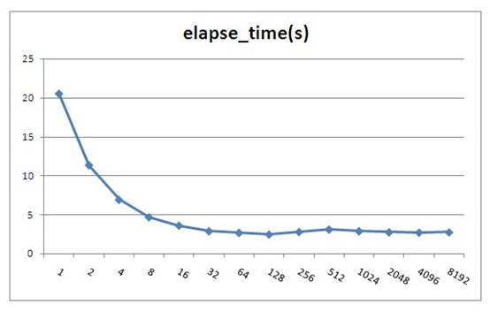

Oracle jdbc fetchsize默认值为10，由上测试可以看出fetchsize对性能影响还是比较大的，但是当fetchsize大于100时就基本上没有影响了。fetchsize并不会存在一个最优的固定值，因为整体性能与记录集大小及硬件平台有关。根据测试结果建议当一次性要取大量数据时这个值设置为100左右，不要小于40。注意，fetchsize不能设置太大，如果一次取出的数据大于JVM的内存会导致内存溢出，所以建议不要超过1000，太大了也没什么性能提高，反而可能会增加内存溢出的危险。
注：图中fetchsize在128以后会有一些小的波动，这并不是测试误差，而是由于resultset填充到具体对像时间不同的原因，由于resultset已经到本地内存里了，所以估计是由于CPU的L1,L2 Cache命中率变化造成，由于变化不大，所以笔者也未深入分析原因。
 
iBatis的SqlMapping配置文件可以对每个SQL语句指定fetchsize大小，如下所示：
 
<select id="getAllProduct" resultMap="HashMap" **fetchSize="1000"****>**
select * from employee
</select>
 

### 3.4、使用存储过程

大型数据库一般都支持存储过程，合理的利用存储过程也可以提高系统性能。如你有一个业务需要将A表的数据做一些加工然后更新到B表中，但是又不可能一条SQL完成，这时你需要如下3步操作：
a：将A表数据全部取出到客户端；
b：计算出要更新的数据；
c：将计算结果更新到B表。
 
如果采用存储过程你可以将整个业务逻辑封装在存储过程里，然后在客户端直接调用存储过程处理，这样可以减少网络交互的成本。
当然，存储过程也并不是十全十美，存储过程有以下缺点：
a、不可移植性，每种数据库的内部编程语法都不太相同，当你的系统需要兼容多种数据库时最好不要用存储过程。
b、学习成本高，DBA一般都擅长写存储过程，但并不是每个程序员都能写好存储过程，除非你的团队有较多的开发人员熟悉写存储过程，否则后期系统维护会产生问题。
c、业务逻辑多处存在，采用存储过程后也就意味着你的系统有一些业务逻辑不是在应用程序里处理，这种架构会增加一些系统维护和调试成本。
d、存储过程和常用应用程序语言不一样，它支持的函数及语法有可能不能满足需求，有些逻辑就只能通过应用程序处理。
e、如果存储过程中有复杂运算的话，会增加一些数据库服务端的处理成本，对于集中式数据库可能会导致系统可扩展性问题。
f、为了提高性能，数据库会把存储过程代码编译成中间运行代码(类似于java的class文件)，所以更像静态语言。当存储过程引用的对像(表、视图等等)结构改变后，存储过程需要重新编译才能生效，在24*7高并发应用场景，一般都是在线变更结构的，所以在变更的瞬间要同时编译存储过程，这可能会导致数据库瞬间压力上升引起故障(Oracle数据库就存在这样的问题)。
 
个人观点：普通业务逻辑尽量不要使用存储过程，定时性的ETL任务或报表统计函数可以根据团队资源情况采用存储过程处理。
 

### 3.5、优化业务逻辑

要通过优化业务逻辑来提高性能是比较困难的，这需要程序员对所访问的数据及业务流程非常清楚。
举一个案例：
某移动公司推出优惠套参，活动对像为VIP会员并且2010年1，2，3月平均话费20元以上的客户。
那我们的检测逻辑为：
select avg(money) as avg_money from bill where phone_no='13988888888' and date between '201001' and '201003';
select vip_flag from member where phone_no='13988888888';
if avg_money>20 and vip_flag=true then
begin
 执行套参();
end;
 
如果我们修改业务逻辑为:
select avg(money) as avg_money from bill where phone_no='13988888888' and date between '201001' and '201003';
if avg_money>20 then
begin
 select vip_flag from member where phone_no='13988888888';
 if vip_flag=true then
 begin
  执行套参();
 end;
end;
通过这样可以减少一些判断vip_flag的开销，平均话费20元以下的用户就不需要再检测是否VIP了。
 
如果程序员分析业务，VIP会员比例为1%，平均话费20元以上的用户比例为90%，那我们改成如下：
select vip_flag from member where phone_no='13988888888';
if vip_flag=true then
begin
 select avg(money) as avg_money from bill where phone_no='13988888888' and date between '201001' and '201003';
 if avg_money>20 then
 begin
  执行套参();
 end;
end;
这样就只有1%的VIP会员才会做检测平均话费，最终大大减少了SQL的交互次数。
 
以上只是一个简单的示例，实际的业务总是比这复杂得多，所以一般只是高级程序员更容易做出优化的逻辑，但是我们需要有这样一种成本优化的意识。
 

### 3.6、使用ResultSet游标处理记录

现在大部分Java框架都是通过jdbc从数据库取出数据，然后装载到一个list里再处理，list里可能是业务Object，也可能是hashmap。
由于JVM内存一般都小于4G，所以不可能一次通过sql把大量数据装载到list里。为了完成功能，很多程序员喜欢采用分页的方法处理，如一次从数据库取1000条记录，通过多次循环搞定，保证不会引起JVM Out of memory问题。
 
以下是实现此功能的代码示例，t_employee表有10万条记录，设置分页大小为1000：
 
d1 = Calendar.getInstance().getTime();
vsql = "select count(*) cnt from t_employee";
pstmt = conn.prepareStatement(vsql);
ResultSet rs = pstmt.executeQuery();
Integer cnt = 0;
while (rs.next()) {
     cnt = rs.getInt("cnt");
}
Integer lastid=0;
Integer pagesize=1000;
System.out.println("cnt:" + cnt);
String vsql = "select count(*) cnt from t_employee";
PreparedStatement pstmt = conn.prepareStatement(vsql);
ResultSet rs = pstmt.executeQuery();
Integer cnt = 0;
while (rs.next()) {
     cnt = rs.getInt("cnt");
}
Integer lastid = 0;
Integer pagesize = 1000;
System.out.println("cnt:" + cnt);
for (int i = 0; i <= cnt / pagesize; i++) {
     vsql = "select * from (select * from t_employee where id>? order by id) where rownum<=?";
     pstmt = conn.prepareStatement(vsql);
     pstmt.setFetchSize(1000);
     pstmt.setInt(1, lastid);
     pstmt.setInt(2, pagesize);
     rs = pstmt.executeQuery();
     int col_cnt = rs.getMetaData().getColumnCount();
     Object o;
     while (rs.next()) {
          for (int j = 1; j <= col_cnt; j++) {
              o = rs.getObject(j);
          }
          lastid = rs.getInt("id");
     }
     rs.close();
     pstmt.close();
}
 
以上代码实际执行时间为6.516秒
 
很多持久层框架为了尽量让程序员使用方便，封装了jdbc通过statement执行数据返回到resultset的细节，导致程序员会想采用分页的方式处理问题。实际上如果我们采用jdbc原始的resultset游标处理记录，在resultset循环读取的过程中处理记录，这样就可以一次从数据库取出所有记录。显著提高性能。
这里需要注意的是，采用resultset游标处理记录时，应该将游标的打开方式设置为FORWARD_READONLY模式(ResultSet.TYPE_FORWARD_ONLY,ResultSet.CONCUR_READ_ONLY)，否则会把结果缓存在JVM里，造成JVM Out of memory问题。
 
代码示例：
 
String vsql ="select * from t_employee";
PreparedStatement pstmt = conn.prepareStatement(vsql,ResultSet.TYPE_FORWARD_ONLY,ResultSet.CONCUR_READ_ONLY);
pstmt.setFetchSize(100);
ResultSet rs = pstmt.executeQuery(vsql);
int col_cnt = rs.getMetaData().getColumnCount();
Object o;
while (rs.next()) {
     for (int j = 1; j <= col_cnt; j++) {
          o = rs.getObject(j);
     }
}
调整后的代码实际执行时间为3.156秒
 
从测试结果可以看出性能提高了1倍多，如果采用分页模式数据库每次还需发生磁盘IO的话那性能可以提高更多。
iBatis等持久层框架考虑到会有这种需求，所以也有相应的解决方案，在iBatis里我们不能采用queryForList的方法，而应用该采用queryWithRowHandler加回调事件的方式处理，如下所示：
 
MyRowHandler myrh=**new** **MyRowHandler();**
sqlmap.queryWithRowHandler("getAllEmployee", myrh);
 
**class** **MyRowHandler** **implements** **RowHandler {**
  **public** **void** **handleRow(Object o) {**
    //todo something
  }
}
 
iBatis的queryWithRowHandler很好的封装了resultset遍历的事件处理，效果及性能与resultset遍历一样，也不会产生JVM内存溢出。
 

## 4、减少数据库服务器CPU运算

### 4.1、使用绑定变量

绑定变量是指SQL中对变化的值采用变量参数的形式提交，而不是在SQL中直接拼写对应的值。
非绑定变量写法：Select * from employee where id=1234567
绑定变量写法：
Select * from employee where id=?
Preparestatement.setInt(1,1234567)
 
Java中Preparestatement就是为处理绑定变量提供的对像，绑定变量有以下优点：
1、防止SQL注入
2、提高SQL可读性
3、提高SQL解析性能，不使用绑定变更我们一般称为硬解析，使用绑定变量我们称为软解析。
第1和第2点很好理解，做编码的人应该都清楚，这里不详细说明。关于第3点，到底能提高多少性能呢，下面举一个例子说明：
 
假设有这个这样的一个数据库主机：
2个4核CPU 
100块磁盘，每个磁盘支持IOPS为160
业务应用的SQL如下：
select * from table where pk=?
这个SQL平均4个IO（3个索引IO+1个数据IO）
IO缓存命中率75%（索引全在内存中，数据需要访问磁盘）
SQL硬解析CPU消耗：1ms （常用经验值）
SQL软解析CPU消耗：0.02ms（常用经验值）
 
假设CPU每核性能是线性增长，访问内存Cache中的IO时间忽略，要求计算系统对如上应用采用硬解析与采用软解析支持的每秒最大并发数：
 
 

| 点击这里         | 点击这里             | 点击这里             |
| :--------------- | :------------------- | :------------------- |
| 是否使用绑定变量 | CPU支持最大并发数    | 磁盘IO支持最大并发数 |
| 不使用           | 2*4*1000=8000        | 100*160=16000        |
| 使用             | 2*4*1000/0.02=400000 | 100*160=16000        |

从以上计算可以看出，不使用绑定变量的系统当并发达到8000时会在CPU上产生瓶颈，当使用绑定变量的系统当并行达到16000时会在磁盘IO上产生瓶颈。所以如果你的系统CPU有瓶颈时请先检查是否存在大量的硬解析操作。

使用绑定变量为何会提高SQL解析性能，这个需要从数据库SQL执行原理说明，一条SQL在Oracle数据库中的执行过程如下图所示：

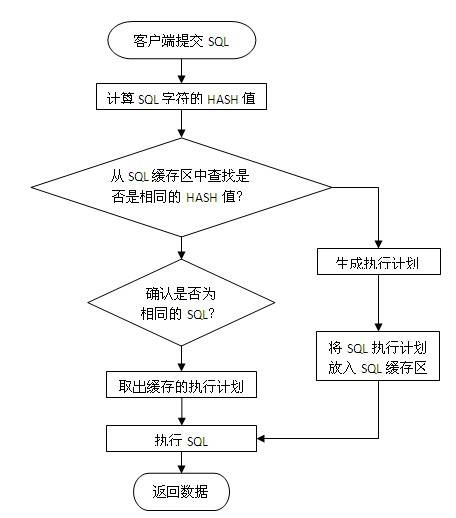

当一条SQL发送给数据库服务器后，系统首先会将SQL字符串进行hash运算，得到hash值后再从服务器内存里的SQL缓存区中进行检索，如果有相同的SQL字符，并且确认是同一逻辑的SQL语句，则从共享池缓存中取出SQL对应的执行计划，根据执行计划读取数据并返回结果给客户端。
如果在共享池中未发现相同的SQL则根据SQL逻辑生成一条新的执行计划并保存在SQL缓存区中，然后根据执行计划读取数据并返回结果给客户端。
为了更快的检索SQL是否在缓存区中，首先进行的是SQL字符串hash值对比，如果未找到则认为没有缓存，如果存在再进行下一步的准确对比，所以要命中SQL缓存区应保证SQL字符是完全一致，中间有大小写或空格都会认为是不同的SQL。
如果我们不采用绑定变量，采用字符串拼接的模式生成SQL,那么每条SQL都会产生执行计划，这样会导致共享池耗尽，缓存命中率也很低。
 
一些不使用绑定变量的场景：
a、数据仓库应用，这种应用一般并发不高，但是每个SQL执行时间很长，SQL解析的时间相比SQL执行时间比较小，绑定变量对性能提高不明显。数据仓库一般都是内部分析应用，所以也不太会发生SQL注入的安全问题。
b、数据分布不均匀的特殊逻辑，如产品表，记录有1亿，有一产品状态字段，上面建有索引，有审核中，审核通过，审核未通过3种状态，其中审核通过9500万，审核中1万，审核不通过499万。
要做这样一个查询：
select count(*) from product where status=?
采用绑定变量的话，那么只会有一个执行计划，如果走索引访问，那么对于审核中查询很快，对审核通过和审核不通过会很慢；如果不走索引，那么对于审核中与审核通过和审核不通过时间基本一样；
对于这种情况应该不使用绑定变量，而直接采用字符拼接的方式生成SQL，这样可以为每个SQL生成不同的执行计划，如下所示。
select count(*) from product where status='approved'; //不使用索引
select count(*) from product where status='tbd'; //不使用索引
**select count(\*) from product where status='auditing';//使用索引**
 

### 4.2、合理使用排序

Oracle的排序算法一直在优化，但是总体时间复杂度约等于nLog(n)。普通OLTP系统排序操作一般都是在内存里进行的，对于数据库来说是一种CPU的消耗，曾在PC机做过测试，单核普通CPU在1秒钟可以完成100万条记录的全内存排序操作，所以说由于现在CPU的性能增强，对于普通的几十条或上百条记录排序对系统的影响也不会很大。但是当你的记录集增加到上万条以上时，你需要注意是否一定要这么做了，大记录集排序不仅增加了CPU开销，而且可能会由于内存不足发生硬盘排序的现象，当发生硬盘排序时性能会急剧下降，这种需求需要与DBA沟通再决定，取决于你的需求和数据，所以只有你自己最清楚，而不要被别人说排序很慢就吓倒。
以下列出了可能会发生排序操作的SQL语法：
Order by
Group by
Distinct
Exists子查询
Not Exists子查询
In子查询
Not In子查询
Union（并集），Union All也是一种并集操作，但是不会发生排序，如果你确认两个数据集不需要执行去除重复数据操作，那请使用Union All 代替Union。
Minus（差集）
Intersect（交集）
Create Index
Merge Join，这是一种两个表连接的内部算法，执行时会把两个表先排序好再连接，应用于两个大表连接的操作。如果你的两个表连接的条件都是等值运算，那可以采用Hash Join来提高性能，因为Hash Join使用Hash 运算来代替排序的操作。具体原理及设置参考SQL执行计划优化专题。
 

### 4.3、减少比较操作

我们SQL的业务逻辑经常会包含一些比较操作，如a=b，a<b之类的操作，对于这些比较操作数据库都体现得很好，但是如果有以下操作，我们需要保持警惕：
**Like模糊查询，如下所示：**
a like ‘%abc%’
 
Like模糊查询对于数据库来说不是很擅长，特别是你需要模糊检查的记录有上万条以上时，性能比较糟糕，这种情况一般可以采用专用Search或者采用全文索引方案来提高性能。
**不能使用索引定位的大量In List，如下所示：**
a in (:1,:2,:3,…,:n)  ----n>20
如果这里的a字段不能通过索引比较，那数据库会将字段与in里面的每个值都进行比较运算，如果记录数有上万以上，会明显感觉到SQL的CPU开销加大，这个情况有两种解决方式：
a、 将in列表里面的数据放入一张中间小表，采用两个表Hash Join关联的方式处理；
b、 采用**str2varList**方法将字段串列表转换一个临时表处理，关于**str2varList**方法可以在网上直接查询，这里不详细介绍。
 
以上两种解决方案都需要与中间表Hash Join的方式才能提高性能，如果采用了Nested Loop的连接方式性能会更差。
如果发现我们的系统IO没问题但是CPU负载很高，就有可能是上面的原因，这种情况不太常见，如果遇到了最好能和DBA沟通并确认准确的原因。
 

### 4.4、大量复杂运算在客户端处理

什么是复杂运算，一般我认为是一秒钟CPU只能做10万次以内的运算。如含小数的对数及指数运算、三角函数、3DES及BASE64数据加密算法等等。
如果有大量这类函数运算，尽量放在客户端处理，一般CPU每秒中也只能处理1万-10万次这样的函数运算，放在数据库内不利于高并发处理。
 

## 5、利用更多的资源

### 5.1、客户端多进程并行访问

多进程并行访问是指在客户端创建多个进程(线程)，每个进程建立一个与数据库的连接，然后同时向数据库提交访问请求。当数据库主机资源有空闲时，我们可以采用客户端多进程并行访问的方法来提高性能。如果数据库主机已经很忙时，采用多进程并行访问性能不会提高，反而可能会更慢。所以使用这种方式最好与DBA或系统管理员进行沟通后再决定是否采用。
 
例如：
我们有10000个产品ID，现在需要根据ID取出产品的详细信息，如果单线程访问，按每个IO要5ms计算，忽略主机CPU运算及网络传输时间，我们需要50s才能完成任务。如果采用5个并行访问，每个进程访问2000个ID，那么10s就有可能完成任务。
那是不是并行数越多越好呢，开1000个并行是否只要50ms就搞定，答案肯定是否定的，当并行数超过服务器主机资源的上限时性能就不会再提高，如果再增加反而会增加主机的进程间调度成本和进程冲突机率。
 
以下是一些如何设置并行数的基本建议：
如果瓶颈在服务器主机，但是主机还有空闲资源，那么最大并行数取主机CPU核数和主机提供数据服务的磁盘数两个参数中的最小值，同时要保证主机有资源做其它任务。
如果瓶颈在客户端处理，但是客户端还有空闲资源，那建议不要增加SQL的并行，而是用一个进程取回数据后在客户端起多个进程处理即可，进程数根据客户端CPU核数计算。
如果瓶颈在客户端网络，那建议做数据压缩或者增加多个客户端，采用map reduce的架构处理。
如果瓶颈在服务器网络，那需要增加服务器的网络带宽或者在服务端将数据压缩后再处理了。
 

### 5.2、数据库并行处理

数据库并行处理是指客户端一条SQL的请求，数据库内部自动分解成多个进程并行处理，如下图所示：

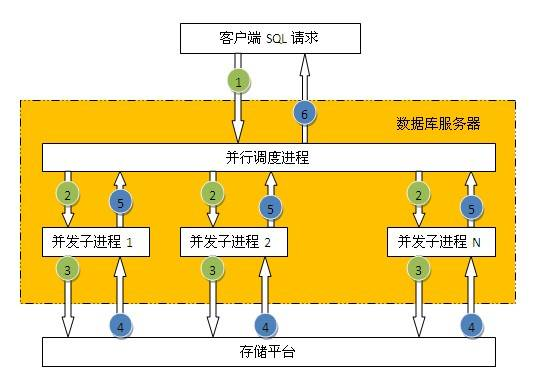

并不是所有的SQL都可以使用并行处理，一般只有对表或索引进行全部访问时才可以使用并行。数据库表默认是不打开并行访问，所以需要指定SQL并行的提示，如下所示：
select /*+parallel(a,4)*/ * from employee;

并行的优点：
使用多进程处理，充分利用数据库主机资源（CPU,IO），提高性能。
并行的缺点：
1、单个会话占用大量资源，影响其它会话，所以只适合在主机负载低时期使用；
2、只能采用直接IO访问，不能利用缓存数据，所以执行前会触发将脏缓存数据写入磁盘操作。

注：
1、并行处理在OLTP类系统中慎用，使用不当会导致一个会话把主机资源全部占用，而正常事务得不到及时响应，所以一般只是用于数据仓库平台。
2、一般对于百万级记录以下的小表采用并行访问性能并不能提高，反而可能会让性能更差。

**使用mysql慢查询日志监控sql执行效率**
show variables like ‘slow_query_log’;
show varialbes like ‘%log%’;
set global slow_query_log_file='/home/mysql/sql_log/mysql-slow.log';
set global log_queries_not_using_indexes=on;
set global long_query_time=1;

**慢查询日志分析工具**
mysqldumpslow
pt-query-digest

**找到慢查询sql后使用分析语句**
explain
table:查询的表
type:重点，显示使用了那种类型进行的查询，最好的查询类型由好到坏依次为：const eq_reg ref range index all
const: 为主键或者唯一索引查找
eq_reg: 范围查找（主键、唯一索引）
ref:常见为连接查询中，基于某一个表索引
range：基于索引的范围查找
index：对索引的扫描
all：表扫描
possible_keys:显示可能应用在这张表中的索引，如果为空，没有可用的索引
key：实际使用的索引，如果为null，则没有使用索引
key_len：实际使用索引长度，在不损失精确性的情况下，长度越短越好
ref：显示索引的哪一列被使用了，如果可能的话，是一个常数
rows：mysql认为必须检查的用来返回请求数据的行数
extra列需要注意的返回值
using filesort： mysql需要进行额外的步骤来发现如何对返回的行排序。它根据连接类型以及存储排序键值和匹配条件的全部行指针来排序全部行（就是使用文件操作）
using temporary：mysql需要创建一个临时表来存储结果，这通常发生在对不同结果集进行order by上，而不是group by上
注：如果出现以上两个，则需要对sql进行优化

**count()和max()的优化方法**
对max()查询的字段添加索引方式
count(*)和count(某一列)的区别
count(*):会查询统计所有记录条数，而count(某一列)时，如果记录中有NULL的值，则不被统计到总数中
分列统计数据sql：select count(col='xxx' or NULL) as ‘col1’,count(col2='xxx' or NULL) as ‘col2’from table;
**子查询优化**
通常情况下，需要把子查询优化为join查询，但在优化是需要注意关联键是否有一对多关系，需要注意重复数据的出现
如果出现重复可使用distinct来去除重复数据
**group by优化**
容易出现临时表查询状态，需要根据实际sql使用inner join方式来查询，如果存在where条件尽量条件放到子查询中，不放到外部筛选
**limit优化**
limit常用语分页处理，时常伴随order by从句使用，因此大多时候会使用filesort方式查询，导致造成大量io问题
优化步骤1：使用主键或索引列进行order by操作
优化步骤2：记录上一次返回的主键，在下次查询时使用主键过滤（避免数据量大时扫描过多记录，使用前提是主键为连续的，否则将出现数据条数不一问题）

**索引优化**
如何建立合适的索引
1、在where从句，group by从句，order by从句，on从句出现的列
2、索引字段越小越好
3、离散度大的列放到联合索引的前面
select * from table where id=2 and c_id=584;
是index(id,c_id)好？还是index(c_id,id)好？
如何判断离散度：
select count(distinct c_id),count(id) from table;
使用列统计数大的值放在联合索引前
索引的维护及优化----重复及冗余索引
重复索引是指相同的列以相同的顺序建立的同类型的索引，如：一个表id声明了primary key ，又加了一个index(id),或者index(id,name)
使用工具查看表冗余索引
pt-duplicate-key-checker 使用方式：pt-duplicate-key-checker -h localhost -u root -p
索引的维护及优化----删除不用索引
目前mysql中还没有记录索引的使用的情况，但是在perconmysql和mariadb中可以使用INDEX_STATISTICS表来查看哪些索引未使用，在mysql中只能通过慢查询日志配合pt-index-usage工具来进行索引使用情况的分析 pt-index-usage -u root -p mysql-slow.log
如果mysql为主从搭建方式需要收集所有日记来分析

**表结构优化**
选择合适的数据类型
数据类型的选择，重点在于适合二字
1、使用可以存下数据的最小数据类型
2、使用简单的数据类型，int要比varcha类型在mysql处理上简单
3、尽可能使用not null定义字段
4、尽量少用text类型，费用不可时最好考虑分表
使用int来存储日期时间，利用FROM_UNIXTIME()：int时间戳转日期 UNIX_TIMESTAMP()：日期转int时间戳 两个函数进行转换
使用bigint来存储ip地址，利用INET_ATON(),INET_NTOA()两个函数进行转换，好处是只是用八个字节存储，varchar是15个字节左右

表范式化和反范式化

表的垂直拆分
所谓垂直拆分，就是把原来一个有很多列的表拆分成多个表，解决了表宽度问题，拆分原则：
1、把不常用的字段单独存放到一个表中
2、把大字段独立放到一个表中
3、把经常一起使用的字段放到一起
表的水平拆分
表的水平拆分主要是为了解决单表数据量过大的问题，水平拆分的表每一个结构都是一致的
拆分方法：
1、对id或某一唯一字段进行hash运算，如果要拆分成5个表则使用mod(id,5)取出0-4个值
2、针对不同的hashID把数据存到不同的表中
水平拆分导致的问题：
1、跨分区表进行查询
2、统计及后台报表操作
注：可使用前后台数据表分离模式，前台使用分区表查询，后端使用一个总表做统计

**操作系统配置优化**
数据库是基于操作系统的，目前大多数mysql都是安装在linux系统上，所以对于操作系统的一些参数配置也会影响到mysql的性能
网络方面的配置，要修改/etc/sysctl.conf文件
\#增加tcp支持的队列数
net.ipv4.tcp_max_syn_backlog=65535
\#减少断开连接时，资源回收
net.ipv4.tcp_max_tw_buckets=8000
net.ipv4.tcp_tw_resue=1
net.ipv4.tcp_tw_recycle=1
net.ipv4.tcp_fin_timeout=10
打开文件数限制，可以使用ulimit -a 查看目录的各位限制，可以修改/etc/security/limits.conf文件，增加以下内容可以修改打开文件数量的限制
\* soft nofile 65535
*hard nofile 65535
除此之外最好在mysql服务器上关闭iptables,selinux等防火墙软件

mysql配置文件
mysql可以通过启动时指定配置参数和使用配置文件两种方法进行配置，在大多情况下配置文件位于/etc/my.conf或是/etc/mysql/my.conf,在windows系统配置文件可以是位于C:/windows/my.ini文件，mysql查找配置文件的顺序可以通过下面命令获取
/usr/sbin/mysqld --verbose --help | grep -A 1 ‘Default options’
注意：如果在多个位置存在配置文件，则后面的会覆盖前面的

常见参数说明：
innodb_buffer_pool_size
非常重要的一个参数，用于配置Innodb的缓冲池，如果数据库中只有Innodb表，则推荐配置量为总内存的75%
SELECT ENGINE,ROUND(SUM(data_length + index_lenght)/1024/1024,1) AS ‘Total MB’FROM INFORMATIOIN_SCHEMA.TABLES WHERE table_schema not in("information_schema","performance_schema") GROUP BY ENGINE;
innodb_buffer_pool_instances
mysql5.5中新增加的参数，可以控制缓冲池的个数，默认情况下只有一个缓冲池
innodb_log_buffer_size
innodb log 缓冲的大小，由于日志最长每秒钟都会刷新，所以一般不用太大
innodb_flush_log_at_trx_commit
关键参数，对innodb的IO效率影响很大。默认值为1，可以取0,1,2三个值，一般建议设置为2，但如果对数据安全性要求比较高则使用默认值1
innodb_read_io_threads
innodb_write_io_threads
以上两个参数决定了Innodb读写的IO进程数，默认为4
Innodb_file_per_table
关键参数，控制Innodb每一个表使用独立的表，默认OFF，也就是所有表都会建立在共享表空间中（设为ON增加并发读写效率）
innodb_stats_on_metadata
决定了mysql在什么情况下会刷新innodb表的统计信息（设置为OFF，禁止mysql在使用show status、show create tables、查询系统表等操作时重新统计表信息；选择合适的时间段来刷新统计信息）

第三方配置工具
Percon Configuration Wizard https//tools.percona.com/wizard

硬件优化
1、如何选择cpu
思考：是选择单核更快的cpu还是选择核数更多的cpu？
1、mysql有一些工作只能使用到单核cpu，如：replicate复制，sql执行
2、mysql对cpu核数的支持并不是越多越快，mysql5.5使用的服务器不要超过32核
2、disk IO优化
常用RAID级别简介
RAID0：也称为条带，就是把多个磁盘链接成一个磁盘使用，这个级别IO最好
RAID1：也称为镜像，要求至少有两个磁盘，每组磁盘存储的数据相同
RAID5：也是吧多个（最少3个）硬盘合并称一个逻辑盘使用，数据读写是会建立奇偶校验信息，并且奇偶校验信息和相对应的数据分别存储于不同的磁盘上。当RAID5的一个磁盘数据发生损坏候，利用剩下的数据和相应的奇偶校验信息去恢复损坏的数据
RAID1+0：就是RAID1和RAID0的结合，同时具备两个级别的有缺点。一般建议数据库使用这个级别。
3、SNA和NAT是否适合数据库？
1、常用于高可用解决方案
2、顺序读写效率很高，但随机读写不如人意
3、数据库随机读写比率很高

本文实例总结了常用SQL语句优化技巧。分享给大家供大家参考，具体如下：

除了建立索引之外，保持良好的SQL语句编写习惯将会降低SQL性能问题发生。

①通过变量的方式来设置参数

好：
stringsql = "select * from people p where p.id = ? ";
坏：
stringsql = "select * from people p where p.id = "+id;
数据库的SQL文解析和执行计划会保存在缓存中，但是SQL文只要有变化，就得重新解析。

“…where p.id = ”+id的方式在id值发生改变时需要重新解析，这会耗费时间。

②不要使用select *

好：
stringsql = "select people_name,pepole_age from people ";
坏：
stringsql = "select * from people ";
使用select *的话会增加解析的时间，另外会把不需要的数据也给查询出来，数据传输也是耗费时间的，

比如text类型的字段通常用来保存一些内容比较繁杂的东西，如果使用select *则会把该字段也查询出来。

③谨慎使用模糊查询

好：
stringsql = "select * from people p where p.id like 'parm1%' ";
坏：
stringsql = "select * from people p where p.id like '%parm1%' ";
当模糊匹配以%开头时，该列索引将失效，若不以%开头，该列索引有效。

④不要使用列号

好：
stringsql = "select people_name,pepole_age from people order by name,age";
坏：
stringsql = "select people_name,pepole_age from people order by 6,8";
使用列号的话，将会增加不必要的解析时间。

⑤优先使用UNION ALL，避免使用UNION

好：
stringsql = "select name from student union all select name from teacher";
坏：
stringsql = "select name from student union select name from teacher";
UNION 因为会将各查询子集的记录做比较，故比起UNION ALL ，通常速度都会慢上许多。一般来说，如果使用UNION ALL能满足要求的话，务必使用UNION ALL。还有一种情况，如果业务上能够确保不会出现重复记录。

⑥在where语句或者order by语句中避免对索引字段进行计算操作

好：
stringsql = "select people_name,pepole_age from people where create_date=date1 ";
坏：
stringsql = "select people_name,pepole_age from people where trunc(create_date)=date1";
当在索引列上进行操作之后，索引将会失效。正确做法应该是将值计算好再传入进来。

⑦使用not exist代替not in

好：
stringsql = "select * from orders where customer_name not exist (select customer_name from customer)";
坏：
stringsql = "select * from orders where customer_name not in(select customer_name from customer)";
如果查询语句使用了not in 那么内外表都进行全表扫描，没有用到索引；而not extsts 的子查询依然能用到表上的索引。

⑧ exist和in的区别

in 是把外表和内表作hash 连接，而exists是对外表作loop循环，每次loop循环再对内表进行查询。因此，in用到的是外表的索引， exists用到的是内表的索引。

如果查询的两个表大小相当，那么用in和exists差别不大。

如果两个表中一个较小，一个是大表，则子查询表大的用exists，子查询表小的用in：

例如：表A（小表），表B（大表）

1：
select * from A where cc in (select cc from B)
效率低，用到了A表上cc列的索引；

select * from A where exists(select cc from B where cc=A.cc)
效率高，用到了B表上cc列的索引。

2：
select * from B where cc in (select cc from A)
效率高，用到了B表上cc列的索引；

select * from B where exists(select cc from A where cc=B.cc)
效率低，用到了A表上cc列的索引。

⑨避免在索引列上做如下操作：

◆避免在索引字段上使用<>，!=
◆避免在索引列上使用IS NULL和IS NOT NULL
◆避免在索引列上出现数据类型转换（比如某字段是String类型，参数传入时是int类型）

当在索引列上使用如上操作时，索引将会失效，造成全表扫描。

⑩复杂操作可以考虑适当拆成几步

有时候会有通过一个SQL语句来实现复杂业务的例子出现，为了实现复杂的业务，嵌套多级子查询。造成SQL性能问题。对于这种情况可以考虑拆分SQL，通过多个SQL语句实现，或者把部分程序能完成的工作交给程序完成。

#MySQL优化原理

说起MySQL的查询优化，相信大家积累一堆技巧：不能使用`SELECT *`、不使用NULL字段、合理创建索引、为字段选择合适的数据类型….. 你是否真的理解这些优化技巧？是否理解其背后的工作原理？在实际场景下性能真有提升吗？我想未必。因而理解这些优化建议背后的原理就尤为重要，希望本文能让你重新审视这些优化建议，并在实际业务场景下合理的运用。

## MySQL逻辑架构

如果能在头脑中构建一幅MySQL各组件之间如何协同工作的架构图，有助于深入理解MySQL服务器。下图展示了MySQL的逻辑架构图。

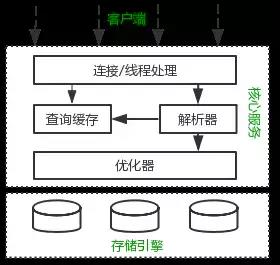

MySQL逻辑架构整体分为三层，最上层为客户端层，并非MySQL所独有，诸如：连接处理、授权认证、安全等功能均在这一层处理。

MySQL大多数核心服务均在中间这一层，包括查询解析、分析、优化、缓存、内置函数(比如：时间、数学、加密等函数)。所有的跨存储引擎的功能也在这一层实现：存储过程、触发器、视图等。

最下层为存储引擎，其负责MySQL中的数据存储和提取。和Linux下的文件系统类似，每种存储引擎都有其优势和劣势。中间的服务层通过API与存储引擎通信，这些API接口屏蔽了不同存储引擎间的差异。

## MySQL查询过程

我们总是希望MySQL能够获得更高的查询性能，最好的办法是弄清楚MySQL是如何优化和执行查询的。一旦理解了这一点，就会发现：**很多的查询优化工作实际上就是遵循一些原则让MySQL的优化器能够按照预想的合理方式运行而已。**

当向MySQL发送一个请求的时候，MySQL到底做了些什么呢？

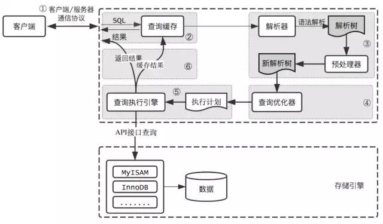

### 客户端/服务端通信协议

MySQL客户端/服务端通信协议是“半双工”的：在任一时刻，要么是服务器向客户端发送数据，要么是客户端向服务器发送数据，这两个动作不能同时发生。一旦一端开始发送消息，另一端要接收完整个消息才能响应它，所以我们无法也无须将一个消息切成小块独立发送，也没有办法进行流量控制。

客户端用一个单独的数据包将查询请求发送给服务器，所以当查询语句很长的时候，需要设置`max_allowed_packet`参数。但是需要注意的是，如果查询实在是太大，服务端会拒绝接收更多数据并抛出异常。

与之相反的是，服务器响应给用户的数据通常会很多，由多个数据包组成。但是当服务器响应客户端请求时，客户端必须完整的接收整个返回结果，而不能简单的只取前面几条结果，然后让服务器停止发送。因而在实际开发中，尽量保持查询简单且只返回必需的数据，减小通信间数据包的大小和数量是一个非常好的习惯，这也是查询中尽量避免使用`SELECT *`以及加上LIMIT限制的原因之一。

### 查询缓存

在解析一个查询语句前，如果查询缓存是打开的，那么MySQL会检查这个查询语句是否命中查询缓存中的数据。如果当前查询恰好命中查询缓存，在检查一次用户权限后直接返回缓存中的结果。这种情况下，查询不会被解析，也不会生成执行计划，更不会执行。

MySQL将缓存存放在一个引用表（不要理解成table，可以认为是类似于HashMap的数据结构），通过一个哈希值索引，这个哈希值通过查询本身、当前要查询的数据库、客户端协议版本号等一些可能影响结果的信息计算得来。所以两个查询在任何字符上的不同（例如：空格、注释），都会导致缓存不会命中。

如果查询中包含任何用户自定义函数、存储函数、用户变量、临时表、mysql库中的系统表，其查询结果都不会被缓存。比如函数`NOW()`或者`CURRENT_DATE()`会因为不同的查询时间，返回不同的查询结果，再比如包含`CURRENT_USER`或者`CONNECION_ID()`的查询语句会因为不同的用户而返回不同的结果，将这样的查询结果缓存起来没有任何的意义。

**既然是缓存，就会失效，那查询缓存何时失效呢？**MySQL的查询缓存系统会跟踪查询中涉及的每个表，如果这些表（数据或结构）发生变化，那么和这张表相关的所有缓存数据都将失效。正因为如此，在任何的写操作时，MySQL必须将对应表的所有缓存都设置为失效。如果查询缓存非常大或者碎片很多，这个操作就可能带来很大的系统消耗，甚至导致系统僵死一会儿。而且查询缓存对系统的额外消耗也不仅仅在写操作，读操作也不例外：

- 任何的查询语句在开始之前都必须经过检查，即使这条SQL语句永远不会命中缓存
- 如果查询结果可以被缓存，那么执行完成后，会将结果存入缓存，也会带来额外的系统消耗

基于此，我们要知道并不是什么情况下查询缓存都会提高系统性能，缓存和失效都会带来额外消耗，只有当缓存带来的资源节约大于其本身消耗的资源时，才会给系统带来性能提升。但要如何评估打开缓存是否能够带来性能提升是一件非常困难的事情，也不在本文讨论的范畴内。如果系统确实存在一些性能问题，可以尝试打开查询缓存，并在数据库设计上做一些优化，比如：

- 用多个小表代替一个大表，注意不要过度设计
- 批量插入代替循环单条插入
- 合理控制缓存空间大小，一般来说其大小设置为几十兆比较合适
- 可以通过`SQL_CACHE`和`SQL_NO_CACHE`来控制某个查询语句是否需要进行缓存

最后的忠告是不要轻易打开查询缓存，特别是写密集型应用。如果你实在是忍不住，可以将`query_cache_type`设置为DEMAND，这时只有加入`SQL_CACHE`的查询才会走缓存，其他查询则不会，这样可以非常自由地控制哪些查询需要被缓存。

当然查询缓存系统本身是非常复杂的，这里讨论的也只是很小的一部分，其他更深入的话题，比如：缓存是如何使用内存的？如何控制内存的碎片化？事务对查询缓存有何影响等等，读者可以自行阅读相关资料，这里权当抛砖引玉吧。

### 语法解析和预处理

MySQL通过关键字将SQL语句进行解析，并生成一颗对应的解析树。这个过程解析器主要通过语法规则来验证和解析。比如SQL中是否使用了错误的关键字或者关键字的顺序是否正确等等。预处理则会根据MySQL规则进一步检查解析树是否合法。比如检查要查询的数据表和数据列是否存在等等。

### 查询优化

经过前面的步骤生成的语法树被认为是合法的了，并且由优化器将其转化成查询计划。多数情况下，一条查询可以有很多种执行方式，最后都返回相应的结果。优化器的作用就是找到这其中最好的执行计划。

MySQL使用基于成本的优化器，它尝试预测一个查询使用某种执行计划时的成本，并选择其中成本最小的一个。在MySQL可以通过查询当前会话的`last_query_cost`的值来得到其计算当前查询的成本。

Mysql代码

mysql> select * from t_message limit 10; 
...省略结果集 

mysql> show status like 'last_query_cost'; 
+-----------------+-------------+ 
| Variable_name  | Value    | 
+-----------------+-------------+ 
| Last_query_cost | 6391.799000 | 
+-----------------+-------------+ 

示例中的结果表示优化器认为大概需要做6391个数据页的随机查找才能完成上面的查询。这个结果是根据一些列的统计信息计算得来的，这些统计信息包括：每张表或者索引的页面个数、索引的基数、索引和数据行的长度、索引的分布情况等等。

有非常多的原因会导致MySQL选择错误的执行计划，比如统计信息不准确、不会考虑不受其控制的操作成本（用户自定义函数、存储过程）、MySQL认为的最优跟我们想的不一样（我们希望执行时间尽可能短，但MySQL值选择它认为成本小的，但成本小并不意味着执行时间短）等等。

MySQL的查询优化器是一个非常复杂的部件，它使用了非常多的优化策略来生成一个最优的执行计划：

- 重新定义表的关联顺序（多张表关联查询时，并不一定按照SQL中指定的顺序进行，但有一些技巧可以指定关联顺序）
- 优化`MIN()`和`MAX()`函数（找某列的最小值，如果该列有索引，只需要查找B+Tree索引最左端，反之则可以找到最大值，具体原理见下文）
- 提前终止查询（比如：使用Limit时，查找到满足数量的结果集后会立即终止查询）
- 优化排序（在老版本MySQL会使用两次传输排序，即先读取行指针和需要排序的字段在内存中对其排序，然后再根据排序结果去读取数据行，而新版本采用的是单次传输排序，也就是一次读取所有的数据行，然后根据给定的列排序。对于I/O密集型应用，效率会高很多）

随着MySQL的不断发展，优化器使用的优化策略也在不断的进化，这里仅仅介绍几个非常常用且容易理解的优化策略，其他的优化策略，大家自行查阅吧。

### 查询执行引擎

在完成解析和优化阶段以后，MySQL会生成对应的执行计划，查询执行引擎根据执行计划给出的指令逐步执行得出结果。整个执行过程的大部分操作均是通过调用存储引擎实现的接口来完成，这些接口被称为handlerAPI。查询过程中的每一张表由一个handler实例表示。实际上，MySQL在查询优化阶段就为每一张表创建了一个handler实例，优化器可以根据这些实例的接口来获取表的相关信息，包括表的所有列名、索引统计信息等。存储引擎接口提供了非常丰富的功能，但其底层仅有几十个接口，这些接口像搭积木一样完成了一次查询的大部分操作。

### 返回结果给客户端

查询执行的最后一个阶段就是将结果返回给客户端。即使查询不到数据，MySQL仍然会返回这个查询的相关信息，比如改查询影响到的行数以及执行时间等等。

如果查询缓存被打开且这个查询可以被缓存，MySQL也会将结果存放到缓存中。

结果集返回客户端是一个增量且逐步返回的过程。有可能MySQL在生成第一条结果时，就开始向客户端逐步返回结果集了。这样服务端就无须存储太多结果而消耗过多内存，也可以让客户端第一时间获得返回结果。需要注意的是，结果集中的每一行都会以一个满足①中所描述的通信协议的数据包发送，再通过TCP协议进行传输，在传输过程中，可能对MySQL的数据包进行缓存然后批量发送。

回头总结一下MySQL整个查询执行过程，总的来说分为5个步骤：

- 客户端向MySQL服务器发送一条查询请求
- 服务器首先检查查询缓存，如果命中缓存，则立刻返回存储在缓存中的结果。否则进入下一阶段
- 服务器进行SQL解析、预处理、再由优化器生成对应的执行计划
- MySQL根据执行计划，调用存储引擎的API来执行查询
- 将结果返回给客户端，同时缓存查询结果

------

## 性能优化建议

看了这么多，你可能会期待给出一些优化手段，是的，下面会从3个不同方面给出一些优化建议。但请等等，还有一句忠告要先送给你：不要听信你看到的关于优化的“绝对真理”，包括本文所讨论的内容，而应该是在实际的业务场景下通过测试来验证你关于执行计划以及响应时间的假设。

### Scheme设计与数据类型优化

选择数据类型只要遵循小而简单的原则就好，越小的数据类型通常会更快，占用更少的磁盘、内存，处理时需要的CPU周期也更少。越简单的数据类型在计算时需要更少的CPU周期，比如，整型就比字符操作代价低，因而会使用整型来存储ip地址，使用DATETIME来存储时间，而不是使用字符串。

这里总结几个可能容易理解错误的技巧：

- 通常来说把可为`NULL`的列改为`NOT NULL`不会对性能提升有多少帮助，只是如果计划在列上创建索引，就应该将该列设置为NOT NULL。
- 对整数类型指定宽度，比如`INT(11)`，没有任何卵用。INT使用16为存储空间，那么它的表示范围已经确定，所以`INT(1)`和`INT(20)`对于存储和计算是相同的。
- `UNSIGNED`表示不允许负值，大致可以使正数的上限提高一倍。比如`TINYINT`存储范围是通常来讲，没有太大的必要使用`DECIMAL`数据类型。即使是在需要存储财务数据时，仍然可以使用BIGINT。比如需要精确到万分之一，那么可以将数据乘以一百万然后使用`TIMESTAMP`使用4个字节存储空间，`DATETIME`使用8个字节存储空间。因而，`TIMESTAMP`只能表示1970 - 2038年，比`DATETIME`表示的范围小得多，而且`TIMESTAMP`的值因时区不同而不同。
- 大多数情况下没有使用枚举类型的必要，其中一个缺点是枚举的字符串列表是固定的，添加和删除字符串（枚举选项）必须使用`ALTER TABLE`（如果只只是在列表末尾追加元素，不需要重建表）。
- schema的列不要太多。原因是存储引擎的API工作时需要在服务器层和存储引擎层之间通过行缓冲格式拷贝数据，然后在服务器层将缓冲内容解码成各个列，这个转换过程的代价是非常高的。如果列太多而实际使用的列又很少的话，有可能会导致CPU占用过高。
- 大表`ALTER TABLE`非常耗时，MySQL执行大部分修改表结果操作的方法是用新的结构创建一个张空表，从旧表中查出所有的数据插入新表，然后再删除旧表。尤其当内存不足而表又很大，而且还有很大索引的情况下，耗时更久。当然有一些奇淫技巧可以解决这个问题，有兴趣可自行查阅。

### 创建高性能索引

索引是提高MySQL查询性能的一个重要途径，但过多的索引可能会导致过高的磁盘使用率以及过高的内存占用，从而影响应用程序的整体性能。应当尽量避免事后才想起添加索引，因为事后可能需要监控大量的SQL才能定位到问题所在，而且添加索引的时间肯定是远大于初始添加索引所需要的时间，可见索引的添加也是非常有技术含量的。

接下来将向你展示一系列创建高性能索引的策略，以及每条策略其背后的工作原理。但在此之前，先了解与索引相关的一些算法和数据结构，将有助于更好的理解后文的内容。

### 索引相关的数据结构和算法

通常我们所说的索引是指`B-Tree`索引，它是目前关系型数据库中查找数据最为常用和有效的索引，大多数存储引擎都支持这种索引。使用`B-Tree`这个术语，是因为MySQL在`CREATE TABLE`或其它语句中使用了这个关键字，但实际上不同的存储引擎可能使用不同的数据结构，比如InnoDB就是使用的`B+Tree`。

`B+Tree`中的B是指balance，意为平衡。需要注意的是，B+树索引并不能找到一个给定键值的具体行，它找到的只是被查找数据行所在的页，接着数据库会把页读入到内存，再在内存中进行查找，最后得到要查找的数据。

在介绍`B+Tree`前，先了解一下二叉查找树，它是一种经典的数据结构，其左子树的值总是小于根的值，右子树的值总是大于根的值，如下图①。如果要在这课树中查找值为5的记录，其大致流程：先找到根，其值为6，大于5，所以查找左子树，找到3，而5大于3，接着找3的右子树，总共找了3次。同样的方法，如果查找值为8的记录，也需要查找3次。所以二叉查找树的平均查找次数为`(3 + 3 + 3 + 2 + 2 + 1) / 6 = 2.3`次，而顺序查找的话，查找值为2的记录，仅需要1次，但查找值为8的记录则需要6次，所以顺序查找的平均查找次数为：`(1 + 2 + 3 + 4 + 5 + 6) / 6 = 3.3`次，因为大多数情况下二叉查找树的平均查找速度比顺序查找要快。

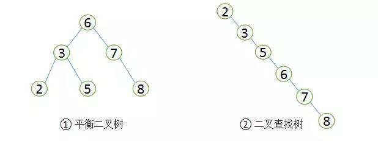

二叉查找树和平衡二叉树

由于二叉查找树可以任意构造，同样的值，可以构造出如图②的二叉查找树，显然这棵二叉树的查询效率和顺序查找差不多。若想二叉查找数的查询性能最高，需要这棵二叉查找树是平衡的，也即平衡二叉树（AVL树）。

平衡二叉树首先需要符合二叉查找树的定义，其次必须满足任何节点的两个子树的高度差不能大于1。显然图②不满足平衡二叉树的定义，而图①是一课平衡二叉树。平衡二叉树的查找性能是比较高的（性能最好的是最优二叉树），查询性能越好，维护的成本就越大。比如图①的平衡二叉树，当用户需要插入一个新的值9的节点时，就需要做出如下变动。

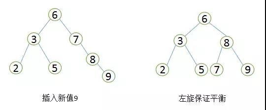

平衡二叉树旋转

通过一次左旋操作就将插入后的树重新变为平衡二叉树是最简单的情况了，实际应用场景中可能需要旋转多次。至此我们可以考虑一个问题，平衡二叉树的查找效率还不错，实现也非常简单，相应的维护成本还能接受，为什么MySQL索引不直接使用平衡二叉树？

随着数据库中数据的增加，索引本身大小随之增加，不可能全部存储在内存中，因此索引往往以索引文件的形式存储的磁盘上。这样的话，索引查找过程中就要产生磁盘I/O消耗，相对于内存存取，I/O存取的消耗要高几个数量级。可以想象一下一棵几百万节点的二叉树的深度是多少？如果将这么大深度的一颗二叉树放磁盘上，每读取一个节点，需要一次磁盘的I/O读取，整个查找的耗时显然是不能够接受的。那么如何减少查找过程中的I/O存取次数？

一种行之有效的解决方法是减少树的深度，将二叉树变为m叉树（多路搜索树），而`B+Tree`就是一种多路搜索树。理解B+Tree时，只需要理解其最重要的两个特征即可：第一，所有的关键字（可以理解为数据）都存储在叶子节点（`Leaf Page`），非叶子节点（`Index Page`）并不存储真正的数据，所有记录节点都是按键值大小顺序存放在同一层叶子节点上。其次，所有的叶子节点由指针连接。如下图为高度为2的简化了的B+Tree。

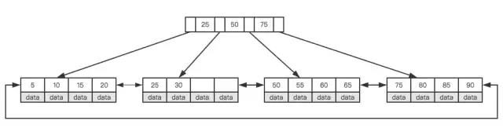

简化B+Tree

怎么理解这两个特征？MySQL将每个节点的大小设置为一个页的整数倍（原因下文会介绍），也就是在节点空间大小一定的情况下，每个节点可以存储更多的内结点，这样每个结点能索引的范围更大更精确。所有的叶子节点使用指针链接的好处是可以进行区间访问，比如上图中，如果查找大于20而小于30的记录，只需要找到节点20，就可以遍历指针依次找到25、30。如果没有链接指针的话，就无法进行区间查找。这也是MySQL使用B+Tree作为索引存储结构的重要原因。

MySQL为何将节点大小设置为页的整数倍，这就需要理解磁盘的存储原理。磁盘本身存取就比主存慢很多，在加上机械运动损耗（特别是普通的机械硬盘），磁盘的存取速度往往是主存的几百万分之一，为了尽量减少磁盘I/O，磁盘往往不是严格按需读取，而是每次都会预读，即使只需要一个字节，磁盘也会从这个位置开始，顺序向后读取一定长度的数据放入内存，预读的长度一般为页的整数倍。

> 页是计算机管理存储器的逻辑块，硬件及OS往往将主存和磁盘存储区分割为连续的大小相等的块，每个存储块称为一页（许多OS中，页的大小通常为4K）。主存和磁盘以页为单位交换数据。当程序要读取的数据不在主存中时，会触发一个缺页异常，此时系统会向磁盘发出读盘信号，磁盘会找到数据的起始位置并向后连续读取一页或几页载入内存中，然后异常返回，程序继续运行。

MySQL巧妙利用了磁盘预读原理，将一个节点的大小设为等于一个页，这样每个节点只需要一次I/O就可以完全载入。为了达到这个目的，每次新建节点时，直接申请一个页的空间，这样就保证一个节点物理上也存储在一个页里，加之计算机存储分配都是按页对齐的，就实现了读取一个节点只需一次I/O。假设B+Tree的高度为h，一次检索最多需要`h-1I/O`（根节点常驻内存），复杂度`O(h)=O(logMN)`。实际应用场景中，M通常较大，常常超过100，因此树的高度一般都比较小，通常不超过3。

最后简单了解下`B+Tree`节点的操作，在整体上对索引的维护有一个大概的了解，虽然索引可以大大提高查询效率，但维护索引仍要花费很大的代价，因此合理的创建索引也就尤为重要。

仍以上面的树为例，我们假设每个节点只能存储4个内节点。首先要插入第一个节点28，如下图所示。

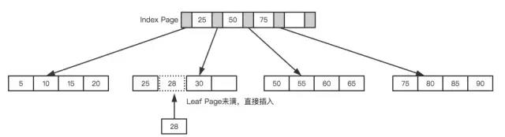

leaf page和index page都没有满

接着插入下一个节点70，在`Index Page`中查询后得知应该插入到`50 - 70`之间的叶子节点，但叶子节点已满，这时候就需要进行也分裂的操作，当前的叶子节点起点为50，所以根据中间值来拆分叶子节点，如下图所示。

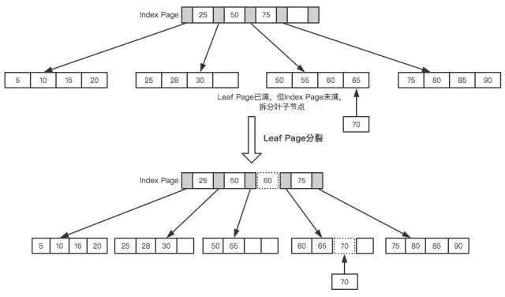

Leaf Page拆分

最后插入一个节点95，这时候`Index Page`和`Leaf Page`都满了，就需要做两次拆分，如下图所示。

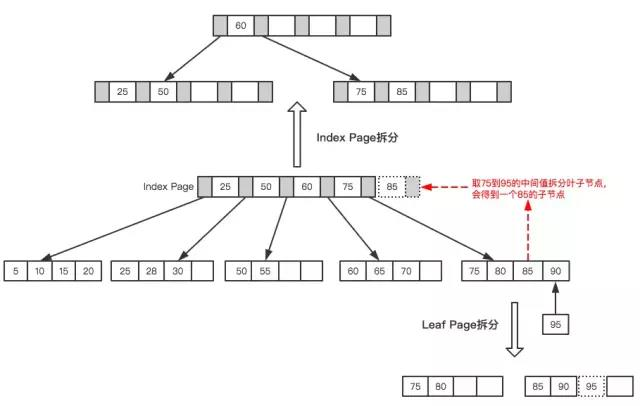

Leaf Page与Index Page拆分

拆分后最终形成了这样一颗树。

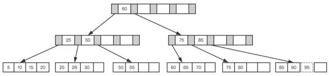

`B+Tree`为了保持平衡，对于新插入的值需要做大量的拆分页操作，而页的拆分需要I/O操作，为了尽可能的减少页的拆分操作，`B+Tree`也提供了类似于平衡二叉树的旋转功能。当`LeafPage`已满但其左右兄弟节点没有满的情况下，`B+Tree`并不急于去做拆分操作，而是将记录移到当前所在页的兄弟节点上。通常情况下，左兄弟会被先检查用来做旋转操作。就比如上面第二个示例，当插入70的时候，并不会去做页拆分，而是左旋操作。

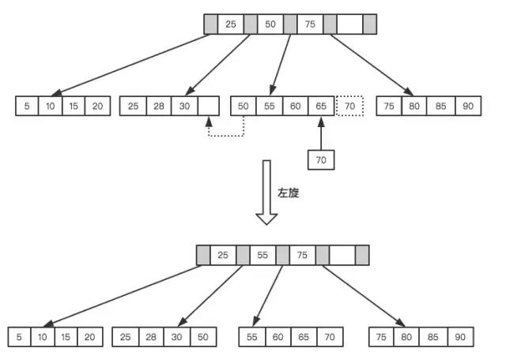

左旋操作

通过旋转操作可以最大限度的减少页分裂，从而减少索引维护过程中的磁盘的I/O操作，也提高索引维护效率。需要注意的是，删除节点跟插入节点类型，仍然需要旋转和拆分操作，这里就不再说明。

### 高性能策略

通过上文，相信你对B+Tree的数据结构已经有了大致的了解，但MySQL中索引是如何组织数据的存储呢？以一个简单的示例来说明，假如有如下数据表：

Mysql代码

CREATE TABLE People( 
  last_name varchar(50) not null, 
  first_name varchar(50) not null, 
  dob date not null, 
  gender enum(`m`,`f`) not null, 
  key(last_name,first_name,dob) 
); 

对于表中每一行数据，索引中包含了`last_name、first_name`、`dob`列的值，下图展示了索引是如何组织数据存储的。

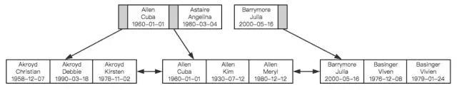

索引如何组织数据存储，来自：高性能MySQL

可以看到，索引首先根据第一个字段来排列顺序，当名字相同时，则根据第三个字段，即出生日期来排序，正是因为这个原因，才有了索引的“最左原则”。

### 1、MySQL不会使用索引的情况：非独立的列

“独立的列”是指索引列不能是表达式的一部分，也不能是函数的参数。比如：

select * from where id + 1 = 5

我们很容易看出其等价于 `id = 4`，但是MySQL无法自动解析这个表达式，使用函数是同样的道理。

### 2、前缀索引

如果列很长，通常可以索引开始的部分字符，这样可以有效节约索引空间，从而提高索引效率。

### 3、多列索引和索引顺序

在多数情况下，在多个列上建立独立的索引并不能提高查询性能。理由非常简单，MySQL不知道选择哪个索引的查询效率更好，所以在老版本，比如MySQL5.0之前就会随便选择一个列的索引，而新的版本会采用合并索引的策略。举个简单的例子，在一张电影演员表中，在`actor_id`和`film_id`两个列上都建立了独立的索引，然后有如下查询：

select film_id,actor_id from film_actor where actor_id = 1 or film_id = 1

老版本的MySQL会随机选择一个索引，但新版本做如下的优化：

select film_id,actor_id from film_actor where actor_id = 1 
union all 
select film_id,actor_id from film_actor where film_id = 1 and actor_id <> 1

 

- 当出现多个索引做相交操作时（多个AND条件），通常来说一个包含所有相关列的索引要优于多个独立索引。
- 当出现多个索引做联合操作时（多个OR条件），对结果集的合并、排序等操作需要耗费大量的CPU和内存资源，特别是当其中的某些索引的选择性不高，需要返回合并大量数据时，查询成本更高。所以这种情况下还不如走全表扫描。

因此`explain`时如果发现有索引合并（Extra字段出现`Using union`），应该好好检查一下查询和表结构是不是已经是最优的，如果查询和表都没有问题，那只能说明索引建的非常糟糕，应当慎重考虑索引是否合适，有可能一个包含所有相关列的多列索引更适合。

前面我们提到过索引如何组织数据存储的，从图中可以看到多列索引时，索引的顺序对于查询是至关重要的，很明显应该把选择性更高的字段放到索引的前面，这样通过第一个字段就可以过滤掉大多数不符合条件的数据。

索引选择性是指不重复的索引值和数据表的总记录数的比值，选择性越高查询效率越高，因为选择性越高的索引可以让MySQL在查询时过滤掉更多的行。唯一索引的选择性是1，这是最好的索引选择性，性能也是最好的。

理解索引选择性的概念后，就不难确定哪个字段的选择性较高了，查一下就知道了，比如：

SELECT * FROM payment where staff_id = 2 and customer_id = 584

是应该创建(`staff_id,customer_id`)的索引还是应该颠倒一下顺序？执行下面的查询，哪个字段的选择性更接近1就把哪个字段索引前面就好。

select count(distinct staff_id)/count(*) as staff_id_selectivity,
    count(distinct customer_id)/count(*) as customer_id_selectivity,
    count(*) from payment

多数情况下使用这个原则没有任何问题，但仍然注意你的数据中是否存在一些特殊情况。举个简单的例子，比如要查询某个用户组下有过交易的用户信息：

select user_id from trade where user_group_id = 1 and trade_amount > 0

 

MySQL为这个查询选择了索引(`user_group_id,trade_amount`)，如果不考虑特殊情况，这看起来没有任何问题，但实际情况是这张表的大多数数据都是从老系统中迁移过来的，由于新老系统的数据不兼容，所以就给老系统迁移过来的数据赋予了一个默认的用户组。这种情况下，通过索引扫描的行数跟全表扫描基本没什么区别，索引也就起不到任何作用。

推广开来说，经验法则和推论在多数情况下是有用的，可以指导我们开发和设计，但实际情况往往会更复杂，实际业务场景下的某些特殊情况可能会摧毁你的整个设计。

### 4、避免多个范围条件

实际开发中，我们会经常使用多个范围条件，比如想查询某个时间段内登录过的用户：

select user.* from user where login_time > '2017-04-01' and age between 18 and 30;

这个查询有一个问题：它有两个范围条件，`login_time`列和`age`列，MySQL可以使用`login_time`列的索引或者age列的索引，但无法同时使用它们。

### 5、覆盖索引

如果一个索引包含或者说覆盖所有需要查询的字段的值，那么就没有必要再回表查询，这就称为覆盖索引。覆盖索引是非常有用的工具，可以极大的提高性能，因为查询只需要扫描索引会带来许多好处：

- 索引条目远小于数据行大小，如果只读取索引，极大减少数据访问量
- 索引是有按照列值顺序存储的，对于I/O密集型的范围查询要比随机从磁盘读取每一行数据的IO要少的多

### 6、使用索引扫描来排序

MySQL有两种方式可以生产有序的结果集，其一是对结果集进行排序的操作，其二是按照索引顺序扫描得出的结果自然是有序的。如果`explain`的结果中`type`列的值为`index`表示使用了索引扫描来做排序。

扫描索引本身很快，因为只需要从一条索引记录移动到相邻的下一条记录。但如果索引本身不能覆盖所有需要查询的列，那么就不得不每扫描一条索引记录就回表查询一次对应的行。这个读取操作基本上是随机I/O，因此按照索引顺序读取数据的速度通常要比顺序地全表扫描要慢。

在设计索引时，如果一个索引既能够满足排序，又满足查询，是最好的。

只有当索引的列顺序和`ORDER BY`子句的顺序完全一致，并且所有列的排序方向也一样时，才能够使用索引来对结果做排序。如果查询需要关联多张表，则只有`ORDER BY`子句引用的字段全部为第一张表时，才能使用索引做排序。`ORDER BY`子句和查询的限制是一样的，都要满足最左前缀的要求（有一种情况例外，就是最左的列被指定为常数，下面是一个简单的示例），其他情况下都需要执行排序操作，而无法利用索引排序。

// 最左列为常数，索引：(date,staff_id,customer_id)
select staff_id,customer_id from demo where date = '2015-06-01'
order by staff_id,customer_id

### 7、冗余和重复索引

冗余索引是指在相同的列上按照相同的顺序创建的相同类型的索引，应当尽量避免这种索引，发现后立即删除。比如有一个索引`(A,B)`，再创建索引`(A)`就是冗余索引。冗余索引经常发生在为表添加新索引时，比如有人新建了索引`(A,B)`，但这个索引不是扩展已有的索引`(A)`。

大多数情况下都应该尽量扩展已有的索引而不是创建新索引。但有极少情况下出现性能方面的考虑需要冗余索引，比如扩展已有索引而导致其变得过大，从而影响到其他使用该索引的查询。

### 8、删除长期未使用的索引

定期删除一些长时间未使用过的索引是一个非常好的习惯。

关于索引这个话题打算就此打住，最后要说一句，索引并不总是最好的工具，只有当索引帮助提高查询速度带来的好处大于其带来的额外工作时，索引才是有效的。对于非常小的表，简单的全表扫描更高效。对于中到大型的表，索引就非常有效。对于超大型的表，建立和维护索引的代价随之增长，这时候其他技术也许更有效，比如分区表。最后的最后，`explain`后再提测是一种美德。

## 特定类型查询优化

### 优化COUNT()查询

`COUNT()`可能是被大家误解最多的函数了，它有两种不同的作用，其一是统计某个列值的数量，其二是统计行数。统计列值时，要求列值是非空的，它不会统计NULL。如果确认括号中的表达式不可能为空时，实际上就是在统计行数。最简单的就是当使用`COUNT(*)`时，并不是我们所想象的那样扩展成所有的列，实际上，它会忽略所有的列而直接统计行数。

我们最常见的误解也就在这儿，在括号内指定了一列却希望统计结果是行数，而且还常常误以为前者的性能会更好。但实际并非这样，如果要统计行数，直接使用`COUNT(*)`，意义清晰，且性能更好。

有时候某些业务场景并不需要完全精确的`COUNT`值，可以用近似值来代替，`EXPLAIN`出来的行数就是一个不错的近似值，而且执行`EXPLAIN`并不需要真正地去执行查询，所以成本非常低。通常来说，执行`COUNT()`都需要扫描大量的行才能获取到精确的数据，因此很难优化，MySQL层面还能做得也就只有覆盖索引了。如果不还能解决问题，只有从架构层面解决了，比如添加汇总表，或者使用redis这样的外部缓存系统。

### 优化关联查询

在大数据场景下，表与表之间通过一个冗余字段来关联，要比直接使用JOIN有更好的性能。如果确实需要使用关联查询的情况下，需要特别注意的是：

- 确保ON和USING字句中的列上有索引。在创建索引的时候就要考虑到关联的顺序。当表A和表B用列c关联的时候，如果优化器关联的顺序是A、B，那么就不需要在A表的对应列上创建索引。没有用到的索引会带来额外的负担，一般来说，除非有其他理由，只需要在关联顺序中的第二张表的相应列上创建索引（具体原因下文分析）。
- 确保任何的`GROUP BY`和`ORDER BY`中的表达式只涉及到一个表中的列，这样MySQL才有可能使用索引来优化。

要理解优化关联查询的第一个技巧，就需要理解MySQL是如何执行关联查询的。当前MySQL关联执行的策略非常简单，它对任何的关联都执行嵌套循环关联操作，即先在一个表中循环取出单条数据，然后在嵌套循环到下一个表中寻找匹配的行，依次下去，直到找到所有表中匹配的行为为止。然后根据各个表匹配的行，返回查询中需要的各个列。

太抽象了？以上面的示例来说明，比如有这样的一个查询：

SELECT A.xx,B.yy
FROM A INNER JOIN B USING(c)
WHERE A.xx IN (5,6)

假设MySQL按照查询中的关联顺序A、B来进行关联操作，那么可以用下面的伪代码表示MySQL如何完成这个查询：

outer_iterator = SELECT A.xx,A.c FROM A WHERE A.xx IN (5,6);
outer_row = outer_iterator.next;
while(outer_row) {
inner_iterator = SELECT B.yy FROM B WHERE B.c = outer_row.c;
inner_row = inner_iterator.next;
while(inner_row) {
output[inner_row.yy,outer_row.xx];
inner_row = inner_iterator.next;
}
outer_row = outer_iterator.next;
}

可以看到，最外层的查询是根据`A.xx`列来查询的，`A.c`上如果有索引的话，整个关联查询也不会使用。再看内层的查询，很明显`B.c`上如果有索引的话，能够加速查询，因此只需要在关联顺序中的第二张表的相应列上创建索引即可。

### 优化LIMIT分页

当需要分页操作时，通常会使用LIMIT加上偏移量的办法实现，同时加上合适的`ORDER BY`字句。如果有对应的索引，通常效率会不错，否则，MySQL需要做大量的文件排序操作。

一个常见的问题是当偏移量非常大的时候，比如：`LIMIT 10000 20`这样的查询，MySQL需要查询10020条记录然后只返回20条记录，前面的10000条都将被抛弃，这样的代价非常高。

优化这种查询一个最简单的办法就是尽可能的使用覆盖索引扫描，而不是查询所有的列。然后根据需要做一次关联查询再返回所有的列。对于偏移量很大时，这样做的效率会提升非常大。考虑下面的查询：

SELECT film_id,description FROM film ORDER BY title LIMIT 50,5;

如果这张表非常大，那么这个查询最好改成下面的样子：

SELECT film.film_id,film.description
FROM film INNER JOIN (
SELECT film_id FROM film ORDER BY title LIMIT 50,5
) AS tmp USING(film_id);

这里的延迟关联将大大提升查询效率，让MySQL扫描尽可能少的页面，获取需要访问的记录后在根据关联列回原表查询所需要的列。

有时候如果可以使用书签记录上次取数据的位置，那么下次就可以直接从该书签记录的位置开始扫描，这样就可以避免使用`OFFSET`，比如下面的查询：

SELECT id FROM t LIMIT 10000, 10;

改为：

SELECT id FROM t WHERE id > 10000 LIMIT 10;

其他优化的办法还包括使用预先计算的汇总表，或者关联到一个冗余表，冗余表中只包含主键列和需要做排序的列。

### 优化UNION

MySQL处理`UNION`的策略是先创建临时表，然后再把各个查询结果插入到临时表中，最后再来做查询。因此很多优化策略在`UNION`查询中都没有办法很好的时候。经常需要手动将`WHERE、LIMIT、ORDER BY`等字句“下推”到各个子查询中，以便优化器可以充分利用这些条件先优化。

除非确实需要服务器去重，否则就一定要使用`UNION ALL`，如果没有ALL关键字，MySQL会给临时表加上`DISTINCT`选项，这会导致整个临时表的数据做唯一性检查，这样做的代价非常高。当然即使使用`ALL`关键字，MySQL总是将结果放入临时表，然后再读出，再返回给客户端。虽然很多时候没有这个必要，比如有时候可以直接把每个子查询的结果返回给客户端。

## 结语

理解查询是如何执行以及时间都消耗在哪些地方，再加上一些优化过程的知识，可以帮助大家更好的理解MySQL，理解常见优化技巧背后的原理。希望本文中的原理、示例能够帮助大家更好的将理论和实践联系起来，更多的将理论知识运用到实践中。

其他也没啥说的了，给大家留两个思考题吧，可以在脑袋里想想答案，这也是大家经常挂在嘴边的，但很少有人会思考为什么？

- 有非常多的程序员在分享时都会抛出这样一个观点：尽可能不要使用存储过程，存储过程非常不容易维护，也会增加使用成本，应该把业务逻辑放到客户端。既然客户端都能干这些事，那为什么还要存储过程？
- `JOIN`本身也挺方便的，直接查询就好了，为什么还需要视图呢？

## 参考资料

> [1] 姜承尧 著；MySQL技术内幕-InnoDB存储引擎；机械工业出版社，2013
> [2] Baron Scbwartz 等著；宁海元 周振兴等译；高性能MySQL（第三版）; 电子工业出版社， 2013
> [3] 由 B-/B+树看 MySQL索引结构