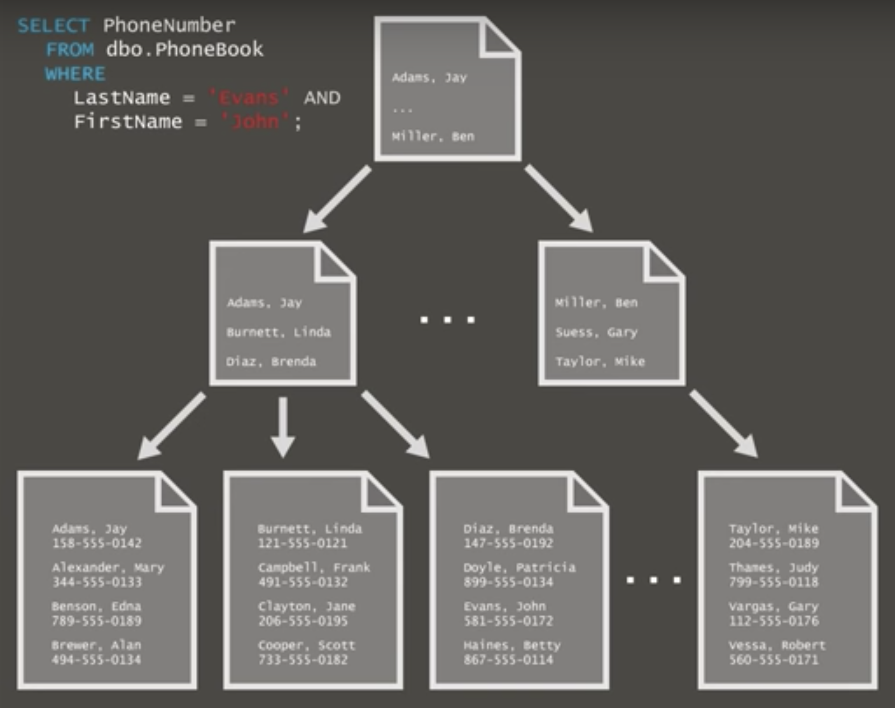

#### 聚簇索引 和 非聚簇索引 区别

聚簇索引（clustered index） 一般是树状的，最底下一层（叶子结点）直接就是数据，因为和存储相关，一张表只能建一个。

非聚簇索引也可以是树状的，但不会影响数据存储，是通过指针连接到具体的数据行的。

聚簇索引的叶节点就是数据节点，而非聚簇索引的叶节点仍然是索引节点，并保留一个链接指向对应数据块。
聚簇索引主键的插入速度要比非聚簇索引主键的插入速度慢很多。
相比之下，聚簇索引适合排序，专非聚簇索引不适合用在排序的场合。因为聚簇索引本身已经是按照物理顺序放置的，排序很快。属非聚簇索引则没有按序存放，需要额外消耗资源来排序。
当你需要取出一定范围内的数据时，用聚簇索引也比用非聚簇索引好。

#### Myisam索引和Innodb索引的区别

myisam 堆表 ：

- 堆就是无序数据的集合,索引就是将数据变得有序,在索引中键值有序,数据还是无序的
- 数据存放在数据里面,索引存放在索引里
- 堆表中,主键索引和普通索引一样的,叶子节点存放的是指向堆表中数据的指针（可以是一个页编号加偏移量）,指向物理地址,没有回表的说法
- 堆表中,主键和普通索引基本上没区别,和非空的唯一索引没区别
- mysql 的 myisam 引擎，oracle pg 都支持的是堆表

 

innodb 索引组织表：

- innodb 引擎支持的就是索引组织表
- 对于主键的索引,页子节点存放了一整行所有数据,其他索引称为辅助索引(二级索引),它的页子节点只是存放了键值和主键值
- 主键索引包含了一张表的所有数据,因为主键索引的页子节点中保存了每一行的完整记录,包括所有列。如果没有主键,MySQL会自动帮你加一个主键,但是对用户不可见
- innodb中数据存放在聚集索引中,换言之,按照主键的方式来组织数据的
- 其他索引(唯一索引,普通索引)的页子节点存放该索引列的键值和主键值
- 不管是什么索引非页子节点存放的存放的就是键值和指针,不存数据,这个指针在innodb中是6个bit,键值就看数据大小了

# MyISAM 和 InnoDB 索引的区别

## 一 MyISAM索引实现

### 1. 主键索引

MyISAM引擎使用B+树作为索引结果，叶节点的data域存放的是数据记录的地址。下图为MyISAM表的主索引，Col1为主键。

### 2. 辅助索引

**在MyISAM中，主索引和辅助索引在结构上没有任何区别，只是主索引要求key是唯一的，而辅助索引的key可以重复。**下图在Col2上建立一个辅助索引

同样也是一颗B+Tree，data域保存数据记录的地址。因此，**MyISAM中索引检索的算法为首先按照B+Tree搜索算法搜索索引，如果指定的Key存在，则取出其data域的值，然后以data域的值为地址，读取相应数据记录。**

MyISAM的索引方式也叫做“非聚集”的，之所以这么称呼是为了与InnoDB的聚集索引区分。

## 二 InnoDB索引实现

### **1 主键索引**

同样是B+树，实现方式却完全不同。InnoDB表数据文件本身就是一个索引结构，树的叶节点data域保存了完整的数据记录，这种索引叫做**聚集索引**。

因为InnoDB的数据文件本身要按主键聚集，所以InnoDB要求表必须有主键(MyISAM可以没有)，如果没有显式指定，则mysql会自动选择一个可以唯一标识数据记录的列作为主键。如果不存在这种列，则mysql自动为InnoDB表生成一个隐含字段作为主键，这个字段长度为6个字节，类型为长整型。

 

### **2 辅助索引**

 InnoDB的所有辅助索引都引用主键作为data域。下图为定义在Col3上的一个辅助索引

因此InnoDB 的索引能提供一种非常快速的主键查找性能。不过，它的辅助索引也会包含主键列，所以如果主键定义的比较大，其他索引也将很大。InnoDB 不会压缩索引。

**聚集索引这种实现方式使得按主键的搜索十分高效，但是辅助索引搜索需要检索两遍索引：首先检索辅助索引获得主键，然后用主键到主索引中检索获得记录。**

不同存储引擎的索引实现方式对于正确使用和优化索引都非常有帮助，例如知道了InnoDB的索引实现后，就很容易明白为什么不建议使用过长的字段作为主键，因为所有辅助索引都引用主索引，过长的主索引会令辅助索引变得过大。再例如，用非单调的字段作为主键在InnoDB中不是个好主意，因为InnoDB数据文件本身是一颗B+Tree，非单调的主键会造成在插入新记录时数据文件为了维持B+Tree的特性而频繁的分裂调整，十分低效，而使用自增字段作为主键则是一个很好的选择。

## 三、 **InnoDB索引**和**MyISAM索引**的区别

### 1 存储结构（主索引／辅助索引）

InnoDB的数据文件本身就是主索引文件。而MyISAM的主索引和数据是分开的。

InnoDB的辅助索引data域存储相应记录主键的值而不是地址。而MyISAM的辅助索引和主索引没有多大区别。

innoDB是聚簇索引，数据挂在主键索引之下。

### 2 锁

MyISAM使用的是表锁

InnoDB使用行锁

### 3 事务

MyISAM没有事务支持和MVCC

InnoDB支持事务和MVCC

### 4 全文索引

MyISAM支持FULLTEXT类型的全文索引

InnoDB不支持FULLTEXT类型的全文索引，但是InnoDB可以使用sphinx插件支持全文索引，并且效果更好

### 5 主键

MyISAM允许没有任何索引和主键的表存在，索引都是保存行的地址

InnoDB如果没有设定主键或非空唯一索引，就会自动生成一个6字节的主键，数据是主索引的一部分，附加索引保存的是主索引的值

### 6 外键

 MyISAM不支持

InnoDB支持

事务和外键
InnoDB
InnoDB具有事务，支持4个事务隔离级别，回滚，崩溃修复能力和多版本并发的事务安全，包括ACID。如果应用中需要执行大量的insert和update操作，则应该使用InnoDB,这样可以提高多用户并发操作性能。

InnoDB不支持全文索引，如果一定要用的话，最好使用sphinx等搜索引擎。

MyISAM
MyISAM管理非事务表。它提供高速存储和检索，以及全文搜索能力。如果应用中需要执行大量的select查询,那么MyISAM是更好的选择。

mysql中的锁
MySQL支持三种锁定级别：行级、页级、表级。
myisam支持表级锁定，提供与Oracle类型一致的不加锁读取。

innodb支持行级锁，innodb表的行锁也不是绝对的，如果在执行一个sql语句时MySQL不能确定要扫描范围，innodb表同样会锁全表，注意间隙锁的影响。

存储
myisam在磁盘上存储成三个文件，第一个文件的名字以表的名字开始，扩展名指出文件类型，frm文件存储表定义，数据文件的扩展名为.MYD，索引文件的扩展名是.MYI。

innodb基于磁盘的资源是Innodb表空间数据文件和它的日志文件，innodb表的大小只受损于操作系统文件的大小。

注意：myisam是保存成文件的形式，在跨平台的数据转移中使用myisam存储会省去不少的麻烦。

索引
innodb使用的聚簇索引、索引就是数据顺序存储，因此能缓存索引，也能缓存数据。

myisam使用的是非聚簇索引、索引和文件分开，随机存储，只能缓存索引。

并发
myisam读写互相阻塞，不仅会在写入的时候阻塞读取，myisa还会在读取的时候阻塞写入，但读本并不会阻塞另外的读。

innodb读写阻塞与事务的隔离级别有关。

两个选择的场景
MyISAM

不需要事务的支持（不支持事务）
并发相对较低（锁定机制问题）
数据修改相对较少（阻塞问题），以读为主
数据一致性要求不高
1.尽量索引（缓存机制）
2.调整读写优先级，根据实际需求确保重要操作更优先
3.启用延迟插入改善大批量写入性能
4.尽量顺序操作让insert数据都写入到尾部，减少阻塞
5.分解大的操作，降低单个操作的阻塞时间
6.降低并发数，某些高并发场景通过应用来进行排队机制
7.对于相对静态的数据，充分利用Query Cache可以极大的提高访问效率
8.MyISAM的Count只有在全表扫描的时候特别高效，带有其他条件的count都需要进行实际的数据访问

InnoDB

需要事务支持（具有较好的事务特性）
行级锁定对高并发有很好的适应能力，但需要确保查询是通过索引完成
数据更新较为频繁的场景。
数据一致性较高
硬件设备内存较大，可以利用innodb较好的缓存能力来提高内存利用率，尽可能减少磁盘IO
1.主键尽可能小，避免给Secondary index带来过大的空间负担
2.避免全表扫描，因为会使用表锁
3.尽可能缓存所有的索引和数据，提高响应速度
4.在大批量小插入的时候，尽量自己控制事务而不要使用autocommit自动提交
5.合理设置innodb_flush_log_at_trx_commit参数值，不要过度追求安全性
6.避免主键更新，因为这会带来大量的数据移动

其它细节
1）InnoDB 中不保存表的具体行数，注意的是，当count(*)语句包含 where条件时，两种表的操作是一样的

2）对于AUTO_INCREMENT类型的字段，InnoDB中必须包含只有该字段的索引，但是在MyISAM表中，可以和其他字段一起建立联合索引， 如果你为一个表指定AUTO_INCREMENT列，在数据词典里的InnoDB表句柄包含一个名为自动增长计数器的计数器，它被用在为该列赋新值。自动增长计数器仅被存储在主内存中，而不是存在磁盘

3）DELETE FROM table时，InnoDB不会重新建立表，而是一行一行的删除

4）LOAD TABLE FROM MASTER操作对InnoDB是不起作用的，解决方法是首先把InnoDB表改成MyISAM表，导入数据后再改成InnoDB表，但是对于使用的额外的InnoDB特性(例如外键)的表不适用

5）如果执行大量的SELECT，MyISAM是更好的选择，如果你的数据执行大量的INSERT或UPDATE，出于性能方面的考虑，应该使用InnoDB表

为什么MyISAM会比Innodb 的查询速度快
InnoDB 在做SELECT的时候，要维护的东西比MYISAM引擎多很多；

1）InnoDB 要缓存数据和索引，MyISAM只缓存索引块，这中间还有换进换出的减少

2）innodb寻址要映射到块，再到行，MyISAM记录的直接是文件的OFFSET，定位比INNODB要快

3）InnoDB 还需要维护MVCC一致；虽然你的场景没有，但他还是需要去检查和维护

MVCC ( Multi-Version Concurrency Control )多版本并发控制

InnoDB ：通过为每一行记录添加两个额外的隐藏的值来实现MVCC，这两个值一个记录这行数据何时被创建，另外一个记录这行数据何时过期（或者被删除）。但是InnoDB并不存储这些事件发生时的实际时间，相反它只存储这些事件发生时的系统版本号。这是一个随着事务的创建而不断增长的数字。每个事务在事务开始时会记录它自己的系统版本号。每个查询必须去检查每行数据的版本号与事务的版本号是否相同。让我们来看看当隔离级别是REPEATABLE READ时这种策略是如何应用到特定的操作的

SELECT InnoDB必须每行数据来保证它符合两个条件
1、InnoDB必须找到一个行的版本，它至少要和事务的版本一样老(也即它的版本号不大于事务的版本号)。这保证了不管是事务开始之前，或者事务创建时，或者修改了这行数据的时候，这行数据是存在的。

2、这行数据的删除版本必须是未定义的或者比事务版本要大。这可以保证在事务开始之前这行数据没有被删除。**总结**

在数据库开发中，了解不同存储引擎的所有实现方式对于正确使用和优化索引都非常有帮助。

比如：了解InnoDB的索引实现后，就很容易明白为什么不建议使用过长的字段作为主键，因为所有辅助索引都引用主索引，过长的主索引会另辅助索引变得过大。

#### MYSQL中主键与唯一索引的区别

主键是一种约束，唯一索引是一种索引，两者在本质上是不同的
主键创建后一定包含一个唯一性索引，唯一性索引并不一定就是主键
唯一性索引列允许空值，而主键列不允许为空值
主键列在创建时，已经默认为空值 + 唯一索引了
主键可以被其他表引用为外键，而唯一索引不能
一个表最多只能创建一个主键，但可以创建多个唯一索引
主键更适合那些不容易更改的唯一标识，如自动递增列、身份证号等
在 RBO 模式下，主键的执行计划优先级要高于唯一索引。 两者可以提高查询的速度
https://blog.csdn.net/baoqiangwang/article/details/4832814

#### 28、聚簇索引(聚集索引)与非聚簇索引的区别的区别？
> https://www.cnblogs.com/Alight/p/3967141.html
> 聚集索引: 
> 表数据按照索引的顺序来存储的，也就是说索引项的顺序与表中记录的物理顺序一致。对于聚集索引，叶子结点即存储了真实的数据行，不再有另外单独的数据页。 在一张表上最多只能创建一个聚集索引，因为真实数据的物理顺序只能有一种。
> 仅仅出现在innodb引擎的主键索引上。
> 聚簇：innodb的主键索引关键字，与 记录 是存储在一起的

> 导致的结果： 
> 记录依据主键顺序排序
> 记录的真实位置会改变。随着主键索引关键字的改变而改变
> 那么innodb表上的非主键索引（二级索引）：存储的是：关键字与主键值的对应关系（而不是关键字与记录位置的对应关系）
> 导致：innodb的非主键索引：都是二次查找。
> 1关键字确定主键值。
> 2主键值确定记录

> 在数据结构层面上：
> 在原来的B-Tree结构上，做了一定的改动，改动后的这个聚簇（聚集）结构称之为 B+Tree
> 非聚集索引: 
> 表数据存储顺序与索引顺序无关。对于非聚集索引，叶结点包含索引字段值及指向数据页数据行的逻辑指针，其行数量与数据表行数据量一致

> 更新表数据:
> 向表中插入新数据行
> 如果一张表没有聚集索引，那么它被称为“堆集”（Heap）。这样的表中的数据行没有特定的顺序，所有的新行将被添加到表的末尾位置。而建立了聚簇索引的数据表则不同：最简单的情况下，插入操作根据索引找到对应的数据页，然后通过挪动已有的记录为新数据腾出空间，最后插入数据。如果数据页已满，则需要拆分数据页，调整索引指针（且如果表还有非聚集索引，还需要更新这些索引指向新的数据页）。而类似于自增列为聚集索引的，数据库系统可能并不拆分数据页，而只是简单的新添数据页。
> 从表中删除数据行
> 对删除数据行来说：删除行将导致其下方的数据行向上移动以填充删除记录造成的空白。如果删除的行是该数据页中的最后一行，那么该数据页将被回收，相应的索引页中的记录将被删除。对于数据的删除操作，可能导致索引页中仅有一条记录，这时，该记录可能会被移至邻近的索引页中，原索引页将被回收，即所谓的“索引合并”。
> 聚集索引是一种稀疏索引，数据页上一级的索引页存储的是页指针，而不是行指针。而对于非聚集索引，则是密集索引，在数据页的上一级索引页它为每一个数据行存储一条索引记录

当两表连接查询时，如果连接字段都是varchar需要注意字段的排序规则，如果不相同则容易导致放弃索引转向全表扫描，8.0版本已修复此问题

#### 为什么要用覆盖索引？

在InnoDB中，表都是根据主键顺序以索引的形式存放，这种存储方式又叫索引组织表。

InnoDB使用了B+树索引模型，所以数据都是存储在B+树中的。

每一个索引在InnoDB里面对应一个B+树。

**主键索引和非主键索引的区别**

主键索引又叫聚簇索引，非主键索引又叫普通索引

**主键索引的叶子节点存放的是整行数据，非主键索引的叶子节点存放的是主键的值。**

例如：查询表中的非主键索引  age=10  操作，根据这个字段的普通索引树查找得到主键id值为20，因为age索引树没有存储这个记录的全部数据，就需要到主键索引上用查询到的id再次查询，然后返回数据，这种查询过程叫做**回表（回到主键索引树搜索的过程）**

**所以通过非主键索引的查询需要多扫描一颗索引树，应该尽量使用主键索引查询。**

select id from user where age=10；这种语句的执行就能在age字段直接取到id的值，不用再次查询主键，避免了回表

**innodb在没有用到索引的时候，用的是表级锁  IX   IS**

**innodb在用到索引的时候，用的是行级锁/Gap锁，Gap锁是走普通非唯一索引时用到**