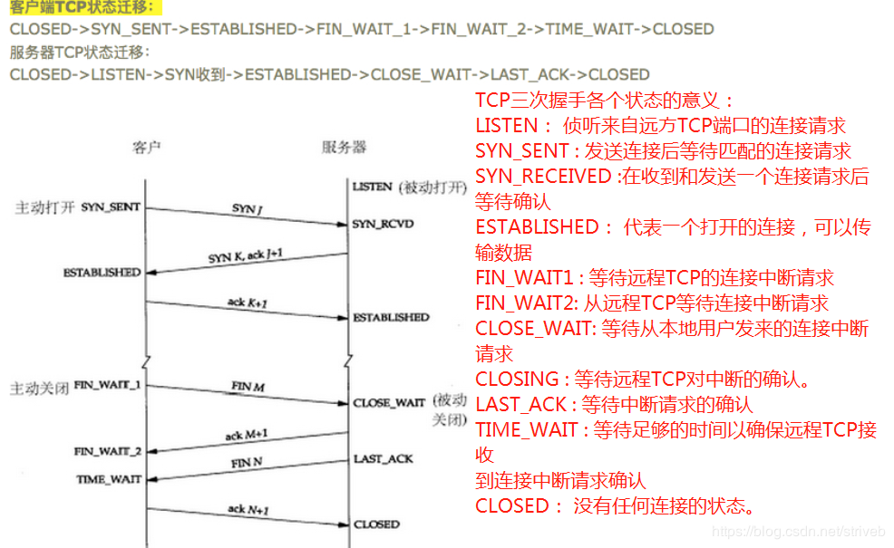
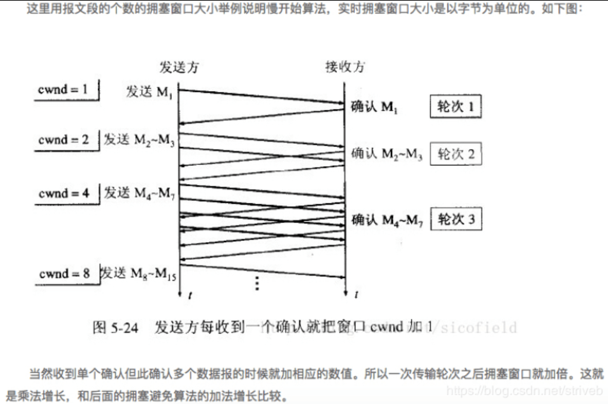
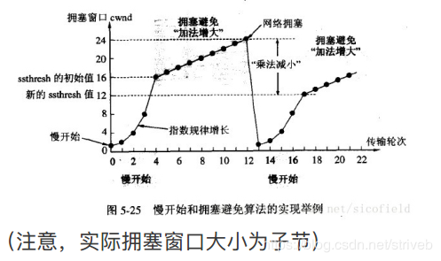

### TCP

**TCP（Transmission Control Protocol，传输控制协议）**是面向连接的协议，也就是说，在收发数据前，必须和对方建立可靠的连接。

 位于传输层， 提供可靠的字节流服务。

所谓的字节流服务（Byte Stream Service） 是指， 为了方便传输， 将大块数据分割成以报文段（segment） 为单位的数据包进行管理。 而可靠的传输服务是指， 能够把数据准确可靠地传给对方。 即TCP 协议为了更容易传送大数据才把数据分割， 而且 TCP 协议能够确认数据最终是否送达到对方。所以，TCP连接相当于两根管道（一个用于服务器到客户端，一个用于客户端到服务器），管道里面数据传输是通过字节码传输，传输是有序的，每个字节都是一个一个来传输。

1、三次握手：握手过程中使用了 TCP 的标志（flag） —— SYN（synchronize） 和ACK（acknowledgement） 。

第一次握手：建立连接时，客户端A发送SYN包（SYN=j）到服务器B，并进入SYN_SEND状态，等待服务器B确认。
第二次握手：服务器B收到SYN包，必须确认客户A的SYN（ACK=j+1），同时自己也发送一个SYN包（SYN=k），即SYN+ACK包，此时服务器B进入SYN_RECV状态。
第三次握手：客户端A收到服务器B的SYN＋ACK包，向服务器B发送确认包ACK（ACK=k+1），此包发送完毕，完成三次握手。

若在握手过程中某个阶段莫名中断， TCP 协议会再次以相同的顺序发送相同的数据包。

2、四次挥手：由于TCP连接是全双工的，因此每个方向都必须单独进行关闭。这个原则是当一方完成它的数据发送任务后就能发送一个FIN来终止这个方向的连接。收到一个 FIN只意味着这一方向上没有数据流动，一个TCP连接在收到一个FIN后仍能发送数据。先进行关闭的一方将执行主动关闭，而另一方被动关闭。

客户端A发送一个FIN，用来关闭客户A到服务器B的数据传送。
服务器B收到这个FIN，它发回一个ACK，确认序号为收到的序号加1。
服务器B关闭与客户端A的连接，发送一个FIN给客户端A。
客户端A发回ACK报文确认，并将确认序号设置为收到序号加1。
三次握手和四次挥手：在TCP连接中，服务器端的SYN和ACK向客户端发送是一次性发送的，而在断开连接的过程中， B端向A
端发送的ACK和FIN是分两次发送的。因为在B端接收到A端的FIN后， B端可能还有数据要传输，所以先发送ACK，等B端处理完自己的事情后就可以发送FIN断开连接了。

（3）、深入理解TCP连接： 

由于TCP是全双工的，因此在每一个方向都必须单独关闭。这原则是当一方完成它的数据发送任务后就能发送一个FIN来终止这个方向的连接。收到一个FIN只意味着这个方向上没有数据流动，一个TCP连接在接收到一个FIN后仍能发送数据。 首先进行关
闭的一方将执行主动关闭，而另一方执行被动关闭。
TCP协议的连接是全双工连接，一个TCP连接存在双向的读写通道。简单来说，是“先关读，再关写” ，总共需要4个阶段。以客户机发起关闭连接为例：1.服务器读通道关闭；2.客户端写通道关闭；3.客户端读通道关闭；4.服务器写通道关闭。
关闭行为是在发起方数据发送完毕之后，给对方发出一个FIN（finish）数据段，直到接收到对方发送的FIN,且对方收到了接收确认的ACK之后，双方的数据通信完全结束，过程中每次都需要返回确认数据段ACK。

（4）、TCP使用滑动窗口机制来进行流量控制。
建立连接时，各端分配一个缓冲区用来存储接收的数据，并将缓冲区的尺寸发送给另一端。接收方发送的确认消息中包含了自己剩余的缓冲区尺寸。剩余缓冲区空间的数量叫做窗口。其实就是建立连接的双虎互相知道彼此剩余的缓冲区大小。

（5）、拥塞控制

拥塞控制：防止过多的数据注入到网路中，这样可以使网络中的路由器或链路不至于阻塞。拥塞控制是一个全局性的过程，和流量控制不同，流量控制是点对点的控制。

1、慢开始：发送方维持一个叫做拥塞窗口cwnd（congestion window）的状态变量。拥塞窗口的大小取决于网络的拥塞程度，并且动态的变化。发送方让自己的发送窗口等于拥塞窗口，另外考虑到接收方的接收能力，发送窗口可能小于拥塞窗口。思路就是：不要一开始就发送大量的数据，先试探一下网络的拥塞程度，也就是说由小到大增加拥塞窗口的大小。

为了防止cwnd增长过大引起网络拥塞，还需要设置一个慢开始门限ssthresh状态变量。 ssthresh的方法如下：
当cwnd < ssthresh时，开始使用慢开始算法；当cwnd > ssthresh, 改用拥塞避免算法；当cwnd = ssthresh时，慢开始与拥塞算法任意。
 2.拥塞避免：

拥塞避免算法让拥塞窗口缓慢增长，即每经过一个往返时间RTT就把发送方的拥塞窗口cwnd加1，而不是加倍，这样拥塞窗口按照线性规律缓慢增长。无论是在慢开始阶段还是在拥塞避免阶段，只要发送方判断网络出现拥塞（其根据就是没有收到确认，虽然没有收到确认可能是其他原因的分组丢失，但是因为⽆法判定，所以都当作拥塞处理），就把慢开始门限设置为出现拥塞时的发送窗口的一半，然后把拥塞窗口设置为1，执行慢开始算法：

此外，还有快速重传和快速恢复，停止-等待协议，回退N帧协议，选择重传协议等。 

### UDP

**(User Data Protocol，用户数据报协议)**

无连接协议，也称透明协议，也位于传输层。

两者区别：

1） TCP提供面向连接的传输，通信前要先建立连接（三次握手机制）； UDP提供无连接的传输，通信前不需要建立连接。
2） TCP提供可靠的传输（有序，无差错，不丢失，不重复）； UDP提供不可靠的传输。
3） TCP面向字节流的传输，因此它能将信息分割成组，并在接收端将其重组； UDP是面向数据报的传输，没有分组开销。
4） TCP提供拥塞控制和流量控制机制； UDP不提供拥塞控制和流量控制机制。

### 长连接和短连接
​       HTTP的长连接和短连接本质上是TCP长连接和短连接。HTTP属于应用层协议，在传输层使用TCP协议，在网络层使用IP协议。 IP协议主要解决网络路由和寻址问题，TCP协议主要解决如何在IP层之上可靠地传递数据包，使得网络上接收端收到发送端所发出的所有包，并且顺序与发送顺序一致。TCP协议是可靠的、面向连接的。

在HTTP/1.0中默认使用短连接。也就是说，客户端和服务器每进行一次HTTP操作，就建立一次连接，任务结束就中断连接。当客户端浏览器访问的某个HTML或其他类型的Web页中包含有其他的Web资源（如JavaScript文件、图像文件、CSS文件等），每遇到这样一个Web资源，浏览器就会重新建立一个HTTP会话。

而从HTTP/1.1起，默认使用长连接，用以保持连接特性。使用长连接的HTTP协议，会在响应头加入这行代码：

Connection:keep-alive
在使用长连接的情况下，当一个网页打开完成后，客户端和服务器之间用于传输HTTP数据的TCP连接不会关闭，客户端再次访问这个服务器时，会继续使用这一条已经建立的连接。Keep-Alive不会永久保持连接，它有一个保持时间，可以在不同的服务器软件（如Apache）中设定这个时间。实现长连接需要客户端和服务端都支持长连接。

HTTP协议的长连接和短连接，实质上是TCP协议的长连接和短连接。