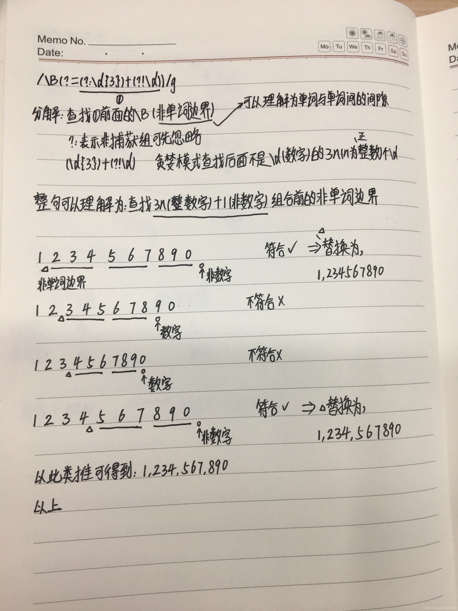

正则表达式——掌握正则表达式，让开发效率有一个质的飞跃。

```
正则表达式经常被用于字段或任意字符串的校验，比如下面这段校验基本日期格式的JavaScript代码：
var reg = /^(\\d{1,4})(-|\\/)(\\d{1,2})\\2(\\d{1,2})$/; 
var r = fieldValue.match(reg);       
if(r==null)alert('hi error!');

一：校验密码强度

密码的强度必须包含大小写字母和数字的组合，不能使用特殊字符，长度在8-10之间
^(?=.*\\d)(?=.*[a-z])(?=.*[A-Z]).{8,10}$

二：校验中文
字符串只能是中文
^[\\u4e00-\\u9fa5]{0,}$

三：由数字，26个英文字母或下划线组成的字符串
^\\w+$


四：校验E-Mail地址
[\\w!#$%&'*+/=?^_`{|}~-]+(?:\\.[\\w!#$%&'*+/=?^_`{|}~-]+)*@(?:[\\w](?:[\\w-]*[\\w])?\\.)+[\\w](?:[\\w-]*[\\w])?

五：校验身份证号码
15位：^[1-9]\\d{7}((0\\d)|(1[0-2]))(([0|1|2]\\d)|3[0-1])\\d{3}$
18位：^[1-9]\\d{5}[1-9]\\d{3}((0\\d)|(1[0-2]))(([0|1|2]\\d)|3[0-1])\\d{3}([0-9]|X)$

六：校验日期
“yyyy-mm-dd“ 格式的日期校验，已考虑平闰年
^(?:(?!0000)[0-9]{4}-(?:(?:0[1-9]|1[0-2])-(?:0[1-9]|1[0-9]|2[0-8])|(?:0[13-9]|1[0-2])-(?:29|30)|(?:0[13578]|1[02])-31)|(?:[0-9]{2}(?:0[48]|[2468][048]|[13579][26])|(?:0[48]|[2468][048]|[13579][26])00)-02-29)$

七：校验金额
金额校验，精确到2位小数
^[0-9]+(.[0-9]{2})?$

八：校验手机号
下面是国内 13、15、18开头的手机号正则表达式
^(13[0-9]|14[5|7]|15[0|1|2|3|5|6|7|8|9]|18[0|1|2|3|5|6|7|8|9])\\d{8}$

九：判断IE的版本
^.*MSIE [5-8](?:\\.[0-9]+)?(?!.*Trident\\/[5-9]\\.0).*$

十：校验IP-v4地址
\\b(?:(?:25[0-5]|2[0-4][0-9]|[01]?[0-9][0-9]?)\\.){3}(?:25[0-5]|2[0-4][0-9]|[01]?[0-9][0-9]?)\\b

十一：校验IP-v6地址
(([0-9a-fA-F]{1,4}:){7,7}[0-9a-fA-F]{1,4}|([0-9a-fA-F]{1,4}:){1,7}:|([0-9a-fA-F]{1,4}:){1,6}:[0-9a-fA-F]{1,4}|([0-9a-fA-F]{1,4}:){1,5}(:[0-9a-fA-F]{1,4}){1,2}|([0-9a-fA-F]{1,4}:){1,4}(:[0-9a-fA-F]{1,4}){1,3}|([0-9a-fA-F]{1,4}:){1,3}(:[0-9a-fA-F]{1,4}){1,4}|([0-9a-fA-F]{1,4}:){1,2}(:[0-9a-fA-F]{1,4}){1,5}|[0-9a-fA-F]{1,4}:((:[0-9a-fA-F]{1,4}){1,6})|:((:[0-9a-fA-F]{1,4}){1,7}|:)|fe80:(:[0-9a-fA-F]{0,4}){0,4}%[0-9a-zA-Z]{1,}|::(ffff(:0{1,4}){0,1}:){0,1}((25[0-5]|(2[0-4]|1{0,1}[0-9]){0,1}[0-9])\\.){3,3}(25[0-5]|(2[0-4]|1{0,1}[0-9]){0,1}[0-9])|([0-9a-fA-F]{1,4}:){1,4}:((25[0-5]|(2[0-4]|1{0,1}[0-9]){0,1}[0-9])\\.){3,3}(25[0-5]|(2[0-4]|1{0,1}[0-9]){0,1}[0-9]))

十二：检查URL的前缀
if (!s.match(/^[a-zA-Z]+:\\/\\//)){
  s = 'http://' + s;}

十三：提取URL链接
^(f|ht){1}(tp|tps):\\/\\/([\\w-]+\\.)+[\\w-]+(\\/[\\w- ./?%&=]*)?

十四：文件路径及扩展名校验
^([a-zA-Z]\\:|\\\\)\\\\([^\\\\]+\\\\)*[^\\/:*?"<>|]+\\.txt(l)?$

十五：提取Color Hex  Codes
^#([A-Fa-f0-9]{6}|[A-Fa-f0-9]{3})$

十六：提取网页图片
\\< *[img][^\\\\>]*[src] *= *[\\"\\']{0,1}([^\\"\\'\\ >]*)

十七：提取页面超链接
(<a\\s*(?!.*\\brel=)[^>]*)(href="https?:\\/\\/)((?!(?:(?:www\\.)?'.implode('|(?:www\\.)?', $follow_list).'))[^"]+)"((?!.*\\brel=)[^>]*)(?:[^>]*)>

十八：查找CSS属性
^\\s*[a-zA-Z\\-]+\\s*[:]{1}\\s[a-zA-Z0-9\\s.#]+[;]{1}

十九：抽取注释
<!--(.*?)-->

二十：匹配HTML标签
<\\/?\\w+((\\s+\\w+(\\s*=\\s*(?:".*?"|'.*?'|[\\^'">\\s]+))?)+\\s*|\\s*)\\/?>
```


##正则表达式中?=和?:和?!的理解

要理解?=和?!，首先需要理解前瞻，后顾，负前瞻，负后顾四个概念：

// 前瞻：
exp1(?=exp2) 查找exp2前面的exp1
// 后顾：
(?<=exp2)exp1 查找exp2后面的exp1
// 负前瞻：
exp1(?!exp2) 查找后面不是exp2的exp1
// 负后顾：
(?<!exp2)exp1 查找前面不是exp2的exp1

 

举例：

"中国人".replace(/(?<=中国)人/, "rr") // 匹配中国人中的人，将其替换为rr，结果为 中国rr

"法国人".replace(/(?<=中国)人/, "rr") // 结果为 法国人，因为人前面不是中国，所以无法匹配到

 

要理解?:则需要理解捕获分组和非捕获分组的概念：

()表示捕获分组，()会把每个分组里的匹配的值保存起来，使用$n(n是一个数字，表示第n个捕获组的内容)

(?:)表示非捕获分组，和捕获分组唯一的区别在于，非捕获分组匹配的值不会保存起来

 

举例：

// 数字格式化 1,123,000

"1234567890".replace(/\B(?=(?:\d{3})+(?!\d))/g,",") // 结果：1,234,567,890，匹配的是后面是3*n个数字的非单词边界(\B)

 

"1234567890".replace(/\B(?=(?:\d{3})+(?!\d))/g,",")




###PHP最常用的正则表达式的详解

**一、校验数字的表达式**
```
数字：^[0-9]*$
n位的数字：^\d{n}$
至少n位的数字：^\d{n,}$
m-n位的数字：^\d{m,n}$
零和非零开头的数字：^(0|[1-9][0-9]*)$
非零开头的最多带两位小数的数字：^([1-9][0-9]*)+(.[0-9]{1,2})?$
带1-2位小数的正数或负数：^(\-)?\d+(\.\d{1,2})?$
正数、负数、和小数：^(\-|\+)?\d+(\.\d+)?$
有两位小数的正实数：^[0-9]+(.[0-9]{2})?$
有1~3位小数的正实数：^[0-9]+(.[0-9]{1,3})?$
非零的正整数：^[1-9]\d*$ 或 ^([1-9][0-9]*){1,3}$ 或 ^\+?[1-9][0-9]*$
非零的负整数：^\-[1-9][]0-9″*$ 或 ^-[1-9]\d*$
非负整数：^\d+$ 或 ^[1-9]\d*|0$
非正整数：^-[1-9]\d*|0$ 或 ^((-\d+)|(0+))$
非负浮点数：^\d+(\.\d+)?$ 或 ^[1-9]\d*\.\d*|0\.\d*[1-9]\d*|0?\.0+|0$
非正浮点数：^((-\d+(\.\d+)?)|(0+(\.0+)?))$ 或 ^(-([1-9]\d*\.\d*|0\.\d*[1-9]\d*))|0?\.0+|0$
正浮点数：^[1-9]\d*\.\d*|0\.\d*[1-9]\d*$ 或 ^(([0-9]+\.[0-9]*[1-9][0-9]*)|([0-9]*[1-9][0-9]*\.[0-9]+)|([0-9]*[1-9][0-9]*))$
负浮点数：^-([1-9]\d*\.\d*|0\.\d*[1-9]\d*)$ 或 ^(-(([0-9]+\.[0-9]*[1-9][0-9]*)|([0-9]*[1-9][0-9]*\.[0-9]+)|([0-9]*[1-9][0-9]*)))$
浮点数：^(-?\d+)(\.\d+)?$ 或 ^-?([1-9]\d*\.\d*|0\.\d*[1-9]\d*|0?\.0+|0)$
```
**二、校验字符的表达式**
```
汉字：^[\u4e00-\u9fa5]{0,}$
英文和数字：^[A-Za-z0-9]+$ 或 ^[A-Za-z0-9]{4,40}$
长度为3-20的所有字符：^.{3,20}$
由26个英文字母组成的字符串：^[A-Za-z]+$
由26个大写英文字母组成的字符串：^[A-Z]+$
由26个小写英文字母组成的字符串：^[a-z]+$
由数字和26个英文字母组成的字符串：^[A-Za-z0-9]+$
由数字、26个英文字母或者下划线组成的字符串：^\w+$ 或 ^\w{3,20}$
中文、英文、数字包括下划线：^[\u4E00-\u9FA5A-Za-z0-9_]+$
中文、英文、数字但不包括下划线等符号：^[\u4E00-\u9FA5A-Za-z0-9]+$ 或 ^[\u4E00-\u9FA5A-Za-z0-9]{2,20}$
可以输入含有^%&',;=?$\”等字符：[^%&',;=?$\x22]+
禁止输入含有~的字符：[^~\x22]+
```
**三、特殊需求表达式**
```
Email地址：^\w+([-+.]\w+)*@\w+([-.]\w+)*\.\w+([-.]\w+)*$
域名：[a-zA-Z0-9][-a-zA-Z0-9]{0,62}(/.[a-zA-Z0-9][-a-zA-Z0-9]{0,62})+/.?
InternetURL：[a-zA-z]+://[^\s]* 或 ^http://([\w-]+\.)+[\w-]+(/[\w-./?%&=]*)?$
手机号码：^(13[0-9]|14[5|7]|15[0|1|2|3|5|6|7|8|9]|18[0|1|2|3|5|6|7|8|9])\d{8}$
电话号码(“XXX-XXXXXXX”、”XXXX-XXXXXXXX”、”XXX-XXXXXXX”、”XXX-XXXXXXXX”、”XXXXXXX”和”XXXXXXXX)：^($$\d{3,4}-)|\d{3.4}-)?\d{7,8}$
国内电话号码(0511-4405222、021-87888822)：\d{3}-\d{8}|\d{4}-\d{7}
身份证号(15位、18位数字)：^\d{15}|\d{18}$
短身份证号码(数字、字母x结尾)：^([0-9]){7,18}(x|X)?$ 或 ^\d{8,18}|[0-9x]{8,18}|[0-9X]{8,18}?$
帐号是否合法(字母开头，允许5-16字节，允许字母数字下划线)：^[a-zA-Z][a-zA-Z0-9_]{4,15}$
密码(以字母开头，长度在6~18之间，只能包含字母、数字和下划线)：^[a-zA-Z]\w{5,17}$
强密码(必须包含大小写字母和数字的组合，不能使用特殊字符，长度在8-10之间)：^(?=.*\d)(?=.*[a-z])(?=.*[A-Z]).{8,10}$
日期格式：^\d{4}-\d{1,2}-\d{1,2}
一年的12个月(01～09和1～12)：^(0?[1-9]|1[0-2])$
一个月的31天(01～09和1～31)：^((0?[1-9])|((1|2)[0-9])|30|31)$
```
**钱的输入格式：**
```
- 有四种钱的表示形式我们可以接受:”10000.00″ 和 “10,000.00″, 和没有 “分” 的 “10000″ 和 “10,000″：^[1-9][0-9]*$
- 这表示任意一个不以0开头的数字，但是，这也意味着一个字符”0″不通过，所以我们采用下面的形式：^(0|[1-9][0-9]*)$
- 一个0或者一个不以0开头的数字.我们还可以允许开头有一个负号：^(0|-?[1-9][0-9]*)$
- 这表示一个0或者一个可能为负的开头不为0的数字.让用户以0开头好了.把负号的也去掉，因为钱总不能是负的吧.下面我们要加的是说明可能的小数部分：^[0-9]+(.[0-9]+)?$
- 必须说明的是，小数点后面至少应该有1位数，所以”10.”是不通过的，但是 “10″ 和 “10.2″ 是通过的：^[0-9]+(.[0-9]{2})?$
- 这样我们规定小数点后面必须有两位，如果你认为太苛刻了，可以这样：^[0-9]+(.[0-9]{1,2})?$
- 这样就允许用户只写一位小数。下面我们该考虑数字中的逗号了，我们可以这样：^[0-9]{1,3}(,[0-9]{3})*(.[0-9]{1,2})?$
- 1到3个数字，后面跟着任意个 逗号+3个数字，逗号成为可选，而不是必须：^([0-9]+|[0-9]{1,3}(,[0-9]{3})*)(.[0-9]{1,2})?$
- 备注：这就是最终结果了，别忘了”+”可以用”*”替代。如果你觉得空字符串也可以接受的话(奇怪，为什么?)最后，别忘了在用函数时去掉去掉那个反斜杠，一般的错误都在这里

xml文件：^([a-zA-Z]+-?)+[a-zA-Z0-9]+\\.[x|X][m|M][l|L]$
中文字符的正则表达式：[\u4e00-\u9fa5]
双字节字符：[^\x00-\xff] (包括汉字在内，可以用来计算字符串的长度(一个双字节字符长度计2，ASCII字符计1))
空白行的正则表达式：\n\s*\r (可以用来删除空白行)
HTML标记的正则表达式：<(\S*?)[^>]*>.*?</\1>|<.*? /> (网上流传的版本太糟糕，上面这个也仅仅能部分，对于复杂的嵌套标记依旧无能为力)
首尾空白字符的正则表达式：^\s*|\s*$或(^\s*)|(\s*$) (可以用来删除行首行尾的空白字符(包括空格、制表符、换页符等等)，非常有用的表达式)
腾讯QQ号：[1-9][0-9]{4,} (腾讯QQ号从10000开始)
中国邮政编码：[1-9]\d{5}(?!\d) (中国邮政编码为6位数字)
IP地址：\d+\.\d+\.\d+\.\d+ (提取IP地址时有用)
```


##PHP 正则表达式特殊字符 [:alnum:] [:alpha:] 等

如果在"[]"中出现了"^"，代表本表达式不匹配"[]"内出现的字符，比如"/[^a-z]/"不匹配任何小写字母！并且正则表达式给出了几种"[]"的默认值，如下： 

'[:alnum:]' 匹配任何字母 
Alphanumeric characters: '[:alpha:]' and '[:digit:]'. 

'[:alpha:]' 匹配任何字母和数字 
Alphabetic characters: '[:lower:]' and '[:upper:]'. 

'[:blank:]' 
Blank characters: space and tab. 

'[:cntrl:]' 
Control characters. In ASCII, these characters have octal codes 000 through 037, and 177 ('DEL'). In other character sets, these are the equivalent characters, if any. 

'[:digit:]' 匹配任何数字 
Digits: '0 1 2 3 4 5 6 7 8 9'. 

'[:graph:]' 
Graphical characters: '[:alnum:]' and '[:punct:]'. 

'[:lower:]' 匹配任何小写字母 
Lower-case letters: 'a b c d e f g h i j k l m n o p q r s t u v w 
x y z'. 
'[:print:]' 
Printable characters: '[:alnum:]', '[:punct:]', and space. 

'[:punct:]' 匹配任何标点符号 
Punctuation characters: '! " # $ % & ' ( ) * + , - . / : ; < = > ? @ [ \ ] ^ _ ' { | } ~'. 

'[:space:]' 匹配空格符 
Space characters: tab, newline, vertical tab, form feed, carriage 
return, and space. 

'[:upper:]' 匹配任何大写字母 
Upper-case letters: 'A B C D E F G H I J K L M N O P Q R S T U V W 
X Y Z'. 

'[:xdigit:]' 匹配任何16进制数字 
Hexadecimal digits: '0 1 2 3 4 5 6 7 8 9 A B C D E F a b c d e f'. 

For example, '[[:alnum:]]' means '[0-9A-Za-z]', except the latter depends upon the 'C' locale and the ASCII character encoding, whereas the former is independent of locale and character set. (Note that the brackets in these class names are part of the symbolic names, and must 
be included in addition to the brackets delimiting the bracket expression.) 

[$]方括号内包含的是一个匹配字符范围，前面加上^,即是代表不匹配指定的字符范围。 
$ereg代表的是一个变量，即$是变量的标志，这个式子的整体意思就是： 
ereg代表的是一个具有以字母开头第二个是字母或数字的所有字符串。 

例子：

 

preg_replace("/([[:alnum:]]|[[:space:]]|[[:punct:]])+/U", '', $string);


###php匹配中文

if(!preg_match("/^[A-Za-z0-9]+$/",$str)){
   ts("不能包含中文和特殊字符！");
   exit();
}

 

 gb2312：if(!preg_match("/^[".chr(0xa1)."-".chr(0xff)."]+$/",$str)) 


utf-8 ：if(!preg_match("/^[\x{4e00}-\x{9fa5}]+$/u",$str))


## 正则匹配ip

 php正则匹配ip

preg_match('/^(?:25[0-5]|2[0-4]\d|1\d\d|[1-9]\d|\d)(?:[.](?:25[0-5]|2[0-4]\d|1\d\d|[1-9]\d|\d)){3}$/', $ipAddress);


<?php
/*
*@return Boolen
*@param String $ip 要匹配的ip地址
*@param String $pat 匹配的正则规则
*@param Boolen 匹配成功后返回的布尔值
*preg_match()
*0为不成功，1为成功
*/
function fun($ip){
 //0.0.0.0--- 255.255.255.255
 $pat = "/^(((1?\d{1,2})|(2[0-4]\d)|(25[0-5]))\.){3}((1?\d{1,2})|(2[0-4]\d)|(25[0-5]))$/";
 if(preg_match($pat,$ip)){
  $num = preg_match($pat,$ip);
  return $num;
 }else{
  $num = preg_match($pat,$ip);
  return $num;
 }
}
echo fun("255.255.255.255");


##正则表达式--环视

[深入理解正则表达式环视的概念与用法](http://www.cnblogs.com/tsql/p/5860889.html)
在《[深入理解正则表达式高级教程-环视](http://www.zjmainstay.cn/deep-regexp#概念四环视断言零宽断言)》中已经对环视做了简单的介绍，但是，可能还有一些读者比较迷惑，今天特意以专题的形式，深入探讨一下正则表达式的环视的概念与用法。

• [深入理解正则表达式环视的概念与用法](http://www.zjmainstay.cn/regexp-lookaround#深入理解正则表达式环视的概念与用法)• [一、环视的概念](http://www.zjmainstay.cn/regexp-lookaround#一环视的概念)• [（一）环视概念与匹配过程示例](http://www.zjmainstay.cn/regexp-lookaround#一环视概念与匹配过程示例)• [示例一：简单环视匹配过程](http://www.zjmainstay.cn/regexp-lookaround#示例一简单环视匹配过程)

• [（二）什么是消耗正则的匹配字符？](http://www.zjmainstay.cn/regexp-lookaround#二什么是消耗正则的匹配字符)• [示例二：一次匹配消耗匹配字符匹配过程](http://www.zjmainstay.cn/regexp-lookaround#示例二一次匹配消耗匹配字符匹配过程)
• [示例三：多次匹配消耗匹配字符匹配过程](http://www.zjmainstay.cn/regexp-lookaround#示例三多次匹配消耗匹配字符匹配过程)


• [二、环视的类型](http://www.zjmainstay.cn/regexp-lookaround#二环视的类型)• [（一）肯定和否定](http://www.zjmainstay.cn/regexp-lookaround#一肯定和否定)
• [（二）顺序和逆序](http://www.zjmainstay.cn/regexp-lookaround#二顺序和逆序)
• [· 两种类型名称组合](http://www.zjmainstay.cn/regexp-lookaround#两种类型名称组合)
• [· 四种组合的用法](http://www.zjmainstay.cn/regexp-lookaround#四种组合的用法)• [四种组合正则与环视的摆放位置](http://www.zjmainstay.cn/regexp-lookaround#四种组合正则与环视的摆放位置)
• [1、肯定顺序：(?=exp)](http://www.zjmainstay.cn/regexp-lookaround#1肯定顺序exp)• [（1）常规用法](http://www.zjmainstay.cn/regexp-lookaround#1常规用法)• [示例四：肯定顺序环视常规用法](http://www.zjmainstay.cn/regexp-lookaround#示例四肯定顺序环视常规用法)

• [（2）变种用法](http://www.zjmainstay.cn/regexp-lookaround#2变种用法)• [示例五：肯定顺序环视变种用法](http://www.zjmainstay.cn/regexp-lookaround#示例五肯定顺序环视变种用法)


• [2、否定顺序：(?!exp)](http://www.zjmainstay.cn/regexp-lookaround#2否定顺序exp)• • [示例六：否定顺序环视](http://www.zjmainstay.cn/regexp-lookaround#示例六否定顺序环视)


• [3、肯定逆序：(?<=exp)](http://www.zjmainstay.cn/regexp-lookaround#3肯定逆序exp)• [示例七：肯定逆序环视](http://www.zjmainstay.cn/regexp-lookaround#示例七肯定逆序环视)

• [4、否定逆序：(?• [示例八：否逆序环视](http://www.zjmainstay.cn/regexp-lookaround#示例八否逆序环视)


• [三、环视的应用](http://www.zjmainstay.cn/regexp-lookaround#三环视的应用)• [示例九：正则分块组合法-必须包含字母、数字、特殊字符](http://www.zjmainstay.cn/regexp-lookaround#示例九正则分块组合法-必须包含字母数字特殊字符)
• [示例十：正则逐步完善法-排除特定标签p/a/img，匹配html标签](http://www.zjmainstay.cn/regexp-lookaround#示例十正则逐步完善法-排除特定标签paimg匹配html标签)
• [示例十一：正则减除查错法-匹配异常原因查找](http://www.zjmainstay.cn/regexp-lookaround#示例十一正则减除查错法-匹配异常原因查找)

• [总结](http://www.zjmainstay.cn/regexp-lookaround#总结)

 


## 一、环视的概念


环视，在不同的地方又称之为零宽断言，简称断言。 
环视强调的是它所在的位置，前面或者后面，必须满足环视表达式中的匹配情况，才能匹配成功。 
环视可以认为是虚拟加入到它所在位置的附加判断条件，并不消耗正则的匹配字符。


### （一）环视概念与匹配过程示例


### 示例一：简单环视匹配过程


例如，对于源字符串ABC，正则(?=A)[A-Z]匹配的是： 
\1. (?=A)所在的位置，后面是A 
\2. 表达式[A-Z]匹配A-Z中任意一个字母 
根据两个的先后位置关系，组合在一起，那就是： 
(?=A)所在的位置，后面是A，而且是A-Z中任意一个字母，因此，上面正则表达式匹配一个大写字母A。
从例子可以看出，从左到右，正则分别匹配了环视(?=A)和[A-Z]，由于环视不消耗正则的匹配字符，因此，[A-Z]还能对A进行匹配，并得到结果。


### （二）什么是消耗正则的匹配字符？


在《深入理解正则表达式高级教程》里我们已经讲过，正则是按照单个字符来进行匹配的，一般情况下是从左到右，逐个匹配源字符串中的内容。


### 示例二：一次匹配消耗匹配字符匹配过程


例如，对于源字符串ABCAD，正则A[A-Z]匹配的过程是： 
\1. 正则A：因为没有位置限定，因此是从源字符串开始位置开始，也就是正则里的^，这个^是虚拟字符，表示匹配字符串开始位置，也就是源字符串ABCAD里的A前面的位置，因为正则A能够匹配源字符串A，匹配成功，匹配位置从源字符串^的位置后移一位，到达A后面，即此时源字符串ABCAD的A这个字符已经被消耗，接下来的正则匹配从A后面开始。 
\2. 正则[A-Z]：当前匹配位置为第一个A字母后面位置，正则[A-Z]对源字符串ABCAD里的B字母进行匹配，匹配成功，位置后移到B字母后面的位置。至此，由于正则已经匹配完成，因此，正则A[A-Z]匹配结果是AB。
我们知道，有些语言如js支持g模式修饰符，也就是全局匹配，那么，上面例子中，正则匹配1次成功之后，将会从匹配成功位置（B字母后面位置）开始，再从头进行匹配一次正则，直到源字符串全部消耗完为止。


### 示例三：多次匹配消耗匹配字符匹配过程


因此，全局匹配的过程补充如下： 
\3. 正则A：当前匹配位置为B字母后面位置，正则A去匹配源字符串中的C，匹配失败，匹配位置后移一位，此时C被消耗了。 
\4. 正则A：当前匹配位置为C字母后面位置，正则A去匹配源字符串中的第二个A字母，匹配成功，匹配位置后移一位，此时A被消耗了。 
\5. 正则[A-Z]：当前匹配位置为第二个A字母后面位置，正则[A-Z]对源字符串ABCAD里的D字母进行匹配，匹配成功，位置后移到D字母后面的位置，此时D被消耗了。 
\6. 由于正则里还有个源字符串结束位置，也就是正则里的$，这个$也是虚拟字符，因此，还要继续进行匹配： 
正则A：当前匹配位置为D字母后面的位置，正则A去匹配源字符串的结束位置，匹配失败，匹配结束。
最终匹配结果是AB和AD。


## 二、环视的类型


环视的类型有两类：


### （一）肯定和否定


1、肯定：(?=exp) 和 (?<=exp) 
2、否定：(?!exp) 和 (?<!exp)


### （二）顺序和逆序


1、顺序：(?=exp) 和 (?!exp) 
2、逆序：(?<=exp) 和 (?<!exp)


### · 两种类型名称组合


1、肯定顺序：(?=exp) 
2、否定顺序：(?!exp) 
3、肯定逆序：(?<=exp) 
4、否定逆序：(?<!exp)


### · 四种组合的用法


四种组合，根据正则与环视位置的不同，又可以组合出来8种不同的摆放方式。 
一般来说，顺序的环视，放在正则后面，认为是常规用法，而放在正则前面，对正则本身的匹配起到了限制，则认为是变种的用法。 
而逆序的环视，常规用法是环视放在正则前面，变种用法是放在正则后面。 
总结一句话就是：常规用法，环视不对正则本身做限制。 
但是，无论常规和变种，都是非常常见的用法。


### 四种组合正则与环视的摆放位置


 \1. 1、肯定顺序常规： [a-z]+(?=;) 字母序列后面跟着;
\2. 2、肯定顺序变种： (?=[a-z]+$).+$ 字母序列
\3. 3、肯定逆序常规： (?<=:)[0-9]+ :后面的数字
\4. 4、肯定逆序变种： \b[0-9]\b(?<=[13579]) 0-9中的奇数
\5. 5、否定顺序常规： [a-z]+\b(?!;) 不以;结尾的字母序列
\6. 6、否定顺序变种： (?!.*?[lo0])\b[a-z0-9]+\b 不包含l/o/0的字母数字系列
\7. 7、否定逆序常规： (?<!age)=([0-9]+) 参数名不为age的数据
\8. 8、否定逆序变种： \b[a-z]+(?<!z)\b 不以z结尾的单词
下面示例，仅对肯定顺序环视进行两种用法的讲解，其他组合都有类似用法，读者参考上面列举8种位置用法自行测试。


### 1、肯定顺序：(?=exp)


### （1）常规用法


所谓常规用法，主要指正则匹配部分位于肯定顺序环视左侧，如：test(?=\.php)，用于匹配后缀是.php的test文件。


### 示例四：肯定顺序环视常规用法


源字符串：
 \1. notexefile1.txt
\2. exefile1.exe
\3. exefile2.exe
\4. exefile3.exe
\5. notexefile2.php
\6. notexefile3.sh
需求：获取.exe后缀文件不含后缀的文件名 
正则：.+(?=\.exe) 
结果：
 \1. exefile1
\2. exefile2
\3. exefile3
示例中，因为要获取.exe后缀不含后缀的文件名，因此，在不使用分组进行捕获的时候，我们利用了肯定顺序型环视的限定，达到了既限定为.exe后缀又不被捕获进匹配结果的效果，充分展示了环视不占位的特性。


### （2）变种用法


所谓变种用法，主要指正则匹配部分位于肯定顺序环视右侧，匹配内容收到环视条件的限定，如：^(?=[a-z]+$).+，虽然后面用的是.+（.除了不能匹配换行，能匹配任意字符），但是，这个表达式只能匹配一个以上的a-z字母组合，因为它被前面的环视限制了匹配范围。


### 示例五：肯定顺序环视变种用法


需求：必须包含字母（不区分大小写）、数字，6-16位密码 
正则：^(?=.*?[a-zA-Z])(?=.*?[0-9])[a-zA-Z0-9]{6,16}$ 
测试用例：
 \1. #量词条件：
\2. 1. 小于6
\3. 2. 6-16（关注边界值）
\4. 3. 大于16
5.
\6. #字符条件：
\7. 1. 纯数字
\8. 2. 纯英文
\9. 3. 数字+英文
\10. 4. 英文+数字
\11. 5. 英文数字乱序混合
12.
\13. 注：每类字符条件都要考虑量词条件
示例中，使用(?=.*?[a-zA-Z])限定后面的字符中至少有一个字母，使用(?=.*?[0-9])限定后面的字符中至少有一个数字，最后通过实际匹配正则[a-zA-Z0-9]{6,16}限定量词。此示例，同样提现了环视不占位的特性，否则的话，第一个环视消耗完字符，会导致后面匹配失败，而实际并没有，因为环视不消耗匹配字符。


### 2、否定顺序：(?!exp)


### 示例六：否定顺序环视


源字符串：
 \1. notexefile1.txt
\2. exefile1.exe
\3. exefile2.exe
\4. exefile3.exe
\5. notexefile2.php
\6. notexefile3.sh
需求：获取不是.exe后缀文件不含后缀的文件名 
正则：(.+)(?!\.exe)\.[^.]+$ 
结果：
 \1. notexefile1
\2. notexefile2
首先，拿到这个需求，看过前面肯定顺序环视例子的写法，我们很可能一下子写出来.+(?!\.exe)，但是测试之后却发现，错了！为什么？一万个为什么飘过~~~ 
为什么匹配错误，这涉及到正则匹配的原理，匹配过程如下： 
为了解释方便，这里以多行模式进行讲解。 
正则.+：因为没有指定位置，从每行字符串开始位置开始匹配，.+是贪婪模式，尽可能多匹配，而且是匹配除了换行外的任意字符，因此，以第一行为例，.+匹配到notexefile1.txt，匹配位置移动到字符串最后。 
正则(?!\.exe)：匹配字符串结束位置，不是.exe，成功，匹配结束。 
匹配结果得到：notexefile1.txt 
其他几行匹配过程是类似的，我们发现每行它都匹配上了，这不是我们预期的结果。
为了得到预期的结果，我们需要在环视限定的条件下，把后缀部分消耗掉，同时利用否定顺序环视限定其不能是.exe后缀，然后用分组获取文件名，得到表达式：(.+)(?!\.exe)\.[^.]+$。这个表达式的匹配过程，跟上面其实是类似的，只不过因为表达式没有匹配完成，导致了回溯，回溯让出了后缀部分给\.[^.]+去匹配了。
在写这个正则的过程中，我们可以先写出(.+)\.[^.]+$这样的正则，然后在再后缀位置插入环视限定，从而得到目标正则(.+)(?!\.exe)\.[^.]+$。
由于回溯过程涉及步骤过多，这里就不做展开，后面有机会再写一个关于正则回溯的文章，现在大家可以打开这个[否定顺序匹配与回溯](https://regex101.com/r/hF3mU9/1)演示页，分别查看3个版本的debug情况。 
选择版本：在正则输入框上面的下拉菜单里 
查看debug：左侧TOOLS区域的Regex Debugger菜单。 
注：由于该站jquery引用自谷歌，因此需要FQ加载才可以打开
当然也可以用Regexbuddy的Debug功能，这个可以参考《[正则表达式工具RegexBuddy使用教程](http://www.zjmainstay.cn/regex-tool-regexbuddy)》查看Debug用法。
三个版本的正则都是(.+)(?!\.exe)\.[^.]+$ 
源字符串分别是： 
\1. 测试示例六，使用示例六源字符串 
\2. 测试匹配成功情况回溯，源字符串
notexefile1.txt
\3. 测试匹配失败情况回溯，源字符串
exefile1.exe


### 3、肯定逆序：(?<=exp)


（1）肯定逆序环视和否定逆序环视在一些语言中是不支持的，如JavaScript就不支持，大家在使用过程中需要注意一下。 
（2）很多语言不支持非确定长度的逆序环视。所谓非确定长度，是指逆序环视部分内容，不是固定长度的，如(?<=.*;)abc，这里用的.*就是不固定的长度。无论是分支情况还是什么，逆序环视部分需要固定长度。 
（3）有些语言里，支持特定范围的非确定长度，这个是指(?<=.{0，100};)abc这种，本来的.*使用0-100这样的限定最大长度为100的范围值。 
因此，大家使用过程中可以根据自己使用语言的差异，测试使用。


### 示例七：肯定逆序环视


源字符串：
 \1. name=Zjmainstay
\2. age=26
需求：获取name参数的值 
正则：(?<=name=).+
示例很直白，前面必须是name=，然后获取其后面的数据，由于环视不占位，因此并没有出现在匹配结果中。


### 4、否定逆序：(?<!exp)


### 示例八：否逆序环视


源字符串：
 \1. name=Zjmainstay
\2. age=26
需求：获取不是name参数的值 
正则：^[^=]+=(?<!name=)(.+)
跟否定顺序示例一样，我们不能直接用(?<!name=).+进行匹配，正则做法是先把参数部分匹配出来，再用否定逆序环视对它进行限定，限定它不能是name=，因此实现匹配。
讲到这里，你们是否能想到前面否定顺序示例六中，可以用否定逆序来做？ 
正则：(.+)\.[^.]+(?<!\.exe)$
因此，几个环视组合，由于正则所摆放的位置不同，可以产生等价的效果。


## 三、环视的应用


环视一直是正则表达式使用过程中的难题，主要体现在它的不占位（不消耗匹配字符）但起限定作用、肯定和否定、顺序和逆序区分、摆放位置不同如何理解等概念上。经过上面的讲解，相信读者已经对这几个概念有了深刻的理解，但是，理解概念跟灵活运用是两码事。 
接下来我们再举几个平时常用的例子，帮助大家理解并掌握，达到灵活运用的程度。


### 示例九：正则分块组合法-必须包含字母、数字、特殊字符


正则：^(?=.*?[a-z])(?=.*?\d)(?![a-z\d]+$).+$ 
解析： 
(?=.*?[a-z])限制必须有字母 
(?=.*?\d)限制必须有数字 
(?![a-z\d]+$)限制从开头到结尾不能全为数字和字母 
.+在没有限定的情况下可以是任意字符 
^和$ 限定字符串的开头和结尾 
组合起来就可以得到上面正则。


### 示例十：正则逐步完善法-排除特定标签p/a/img，匹配html标签

正则：</?(?!p|a|img)([^> /]+)[^>]*/?> 解析： 常见的标签格式有： 1. <p>...</p> //无属性值2. <p class="t"....>...</p> //有属性值3.  //有属性值自闭合4. <br/> //无属性值自闭合首先，从简单标签入手，对于</p>和<br/>，写出正则： </?[^>]*/?> 由于[^>]通配符的匹配访问太大，因此，实际上无论有没有属性值，都被上面表达式给匹配了，这个没关系，我们通过进一步细化匹配通配符，缩小匹配范围。 我们观察可得，标签名是这样得到的： 1. 无属性值：<p> <([^>]+)2. 有属性值：<p class <([^ ]+)3. 无属性值自闭合：<br/> <([^/]+)4. 闭合标签：</p> </([^>]+)>得到正则： 1. </?([^> /]+)用这部分代替前面通配正则的标签名部分，得到： </?([^> /]+)[^>]*/?> 最后，我们需要排除p/a/img标签，用否定顺序法，在标签名前面加入否定环视： </?(?!p|a|img)([^> /]+)[^>]*/?> 大功告成，这是我们要的结果！此示例的正则逐步完善法是正则书写过程中常用方法，倒推回去也是可行的，比如，假如我们拿到一段很长的正则，而它的匹配结果是错误的，我们该怎么做？ 我们可以用逐步截断的方法，一步步的减除掉右侧的一部分，直到它恢复匹配，我们就知道刚刚被减除掉的部分正则是有问题的，观察它为什么导致错误，修改正确，再逐步恢复后面减除的正则即可。 

### 示例十一：正则减除查错法-匹配异常原因查找

源字符串： 1. <ul>2. <li class="item">item1</li>3. <li class="item">item2</li>4. <li class="item bug">item3</li>5. <li class="item">item4</li>6. <li class="item">item5</li>7. </ul>正则：<li class="item">(.*?)</li> 减除排错过程： 例子比较简单，主要演示思路过程。 用上面的正则去匹配源字符串，我们发现，明明预期5个结果，但是却得到了4个，因此，我们开始进行减除正则排错。 1. 减除右侧</li>，此时正则<li class="item">(.*?) 匹配4个 2. 减除右侧(.*?)，此时正则<li class="item">，匹配4个 3. 减除"item">，此时正则<li class=，匹配5个 4. 恢复"item">，减除>，此时正则<li class="item"，匹配4个 5. 减除"，此时正则<li class="item，匹配5个 至此，观察发现item后面还有其他可能，补充兼容： 6. 修复得正则<li class="item[^"]*" 7. 逐步把前面减除的"后面部分补充回来，此时正则<li class="item[^"]*">(.*?)</li>，匹配5个 问题解决！