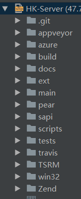
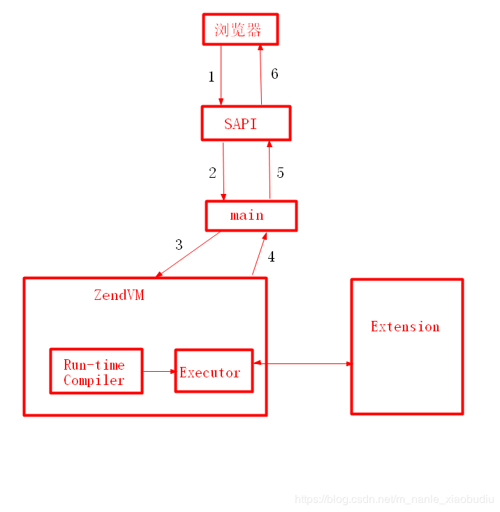

一、PHP开源源代码下载地址：

https://github.com/php/php-src.git

 

二、PHP的构成

1、目录结构

2、目录分析

（1）sapi目录是PHP的应用接口层。

（2）main为php的主要代码，主要是输入/输出、Web通信、PHP框架的初始化操作等，比如fastcgi协议的解析、扩展的加载、PHP配置的解析等工作都是在这里完成的。

（3）Zend目录是PHP解析器的主要实现，即ZendVM，它是PHP语言的核心实现，PHP代码的解释、执行都是由Zend完成的。

（4）ext目录是PHP的扩展目录，比如php的curl扩展，gd库扩展、pdo扩展等都是在这里。

（5）TSRM目录为线程安全相关的实现。

（6）PHP各组成部分之间关系图：

3、SAPI

（1）PHP是一个脚本解析器，提供脚本的解析与执行。它的输入是普通的文本，然后由PHP解析器按照预先定义好的语法规则进行解析执行。我们可以在不同环境中应用这个解析器，比如命令行下、Web环境下、嵌入其他应用中使用。为此，PHP提供了一个SAPI层以适配不同的应用环境，SAPI可以认为是PHP的宿主环境。

（2）SAPI也是整个PHP框架最外层的一部分，它主要负责PHP框架的初始化工作。SAPI代码位于PHP源码的 /sapi 目录下，经常用到的两个SAPI是Cli和Fpm。

 

4、ZendVM

（1）ZendVM是一个虚拟的计算机，它介于PHP应用和实际计算机中间，我们编写的PHP代码就是被它解释执行的。ZendVM是PHP语言的核心实现，他主要由两部分组成：编译器和执行器。

（2）编译器负责将PHP解释为执行器可识别的指令，执行器负责执行编译器解释出的指令。

（3）ZendVM的角色等同于Java中的JVM，它们都是抽象出的虚拟计算机。

 

5、Extension

（1）扩展是PHP内核提供的一套用于扩充PHP功能的一种方式，PHP社区中有丰富的扩展可供使用，这些扩展为PHP提供了大量实用的功能，PHP中很多操作的函数都是通过扩展提供的。

（2）通过扩展，我们可以使用C/C++实现更强大的功能和更高的性能。扩展分为PHP扩展和Zend扩展，PHP扩展比较常见，而Zend扩展主要应用于ZendVM，我们所熟知的Opcache就是Zend扩展。

 

三、PHP生命周期

1、PHP的整个生命周期被划分为以下几个阶段：

（1）模块初始化阶段（module startup）

（2）请求初始化阶段（request startup）

（3）脚本执行阶段（execute sccript）

（4）请求关闭阶段（request shutdown）

（5）模块关闭阶段（module shutdown）

注：根据不同SAPI的实现，各阶段的执行情况会有一些差异，比如命令行模式下，每次执行一个脚本都会完成的经历这些阶段。而FastCgi模式下则在启动时执行一次模块初始化，然后各个请求只经历请求初始化，脚本执行，请求关闭几个阶段，在SAPI关闭时，才经历模块关闭阶段。

 

2、模块初始化阶段—分析

（1）这个阶段主要进行PHP框架和Zend引擎的初始化操作。该阶段的入口函数为php_module_startup()。这个阶段一般只在SAPI启动时执行一次，对于Fpm而言，就是在Fpm的master进程启动时执行的。

（2）该阶段的几个主要处理如下：

（3）激活SAPI：sapi_activate()，初始化请求信息SG（request_info）、设置读取POST请求的handle等。

（4）启动PHP输出：php_output_startup()

（5）初始化垃圾回收器：gc_globals_ctor()，并分配zend_gc_globals内存。

（6）启动Zend引擎：zend_startup()，主要操作包括

   （6.1）启动内存池 start_memory_manager()

   （6.2）设置一些util函数句柄，如zend_error_cb、zend_pringf、zend_write等。

   （6.3）设置Zend虚拟机编译、执行器的函数句柄zend_compile_file、zend_execute_ex、垃圾回收函数句柄gc_collect_cycles

​    （6.4）分配函数符号表 方法符号表（function_table）、类符号表（class_table）、常量符号表（zend_constants）等，如果是多线程的话，还会分配编译器、执行器的全局变量。

​    （6.5）注册Zend核心扩展：zend_startup_builtin_funtions()，这个扩展是内核提供的，该过程将注册Zend核心扩展提供的函数，如strlen、define、func_get_args、class_exists等。

​    （6.6）注册Zend定义的标准常量：zend_register_standard_constants()，比如 E_ERROR、E_WARNING、E_ALL、TRUE、FALSE等。

​    （6.7）注册$GLOBALS超全局变量的获取handle。

​    （6.8）分配php.ini配置的存储符号表 EG（ini_directives）。

（7）注册PHP定义的常量：PHP_VERSION、PHP_ZTS、PHP_SAPI等。

（8）解析php.ini：解析完成后所有的php.ini配置保存在configuration_hash哈希表中。

（9）映射PHP、Zend核心的php.ini配置：根据解析出的php.ini，获取对应的配置值，将最终的配置插入EG（ini_directives）哈希表。

（10）注册用于获取$_GET、$_POST、$_COOKIE、$_SERVER、$_ENV、$_REQUEST、$_FILES变量的handle。

（11）注册静态编译的扩展：php_register_internal_extensions_func()。

（12）注册动态加载的扩展：php_init_register_extensions()，将php.ini中配置的扩展加载到PHP中。

（13）回调各扩展定义的module startup钩子函数，即通过PHP_MINIT_FUNCTION()定义的函数。

（14）注册php.ini中禁用的函数、类：disable_funstions、disable_classes。

 

3、请求初始化阶段—分析

该阶段是在请求处理前每一个请求都会经历的一个阶段。对于fpm而言，是在worker进程accept一个请求且获取、解析完请求数据后的一个阶段。该阶段的处理函数为php_request_startup()。

主要处理有以下几个：

（1）激活输出：php_output_activate()

（2）激活Zend引擎：zend_activate()，主要操作有

   （2.1）重置垃圾回收器：gc_reset()

   （2.2）初始化编译器：ini_compiler()

   （2.3）初始化执行器：ini_exexutor()，将 EG（function_table）和 EG（class_table）分别执行 CG（function_table）和CG（class_table）。

   （2.4）初始化全局变量符号表 EG（symbol_table）、include过的文件符号表 EG（included_files）

   （2.5）初始化词法扫描器：sapi_activate()

（3）激活SAPI：sapi_activate()

（4）回调个扩展定义的request startup钩子函数：zend_activate_modules()

 

4、脚本执行阶段—分析

（1）该阶段包括PHP代码的编译、执行两个核心阶段，这也是Zend引擎最重要的功能。

（2）在编译阶段，PHP脚本将经历从PHP源代码到抽象语法树，再到opline指令的转化过程，最终生成的opline指令就是Zend引擎可识别的执行指令，这些指令被执行器执行，这就是PHP代码解释执行的过程。该阶段入口函数为php_execute_script()。

 

5、请求关闭阶段—分析

（1）该阶段将flush输出内容、发送HTTP应答header头、清理局部变量、关闭编译器、关闭执行器等。

（2）另外，在该阶段将回调各扩展的request shutdown钩子函数。

（3）该阶段与请求初始化阶段操作是相反的。

 

6、模块关闭阶段—分析

该阶段在SAPI关闭时执行，与模块初始化阶段对应，主要进行资源的清理、PHP各模块的关闭操作，同时将回调各扩展的 module shutdown 钩子函数。