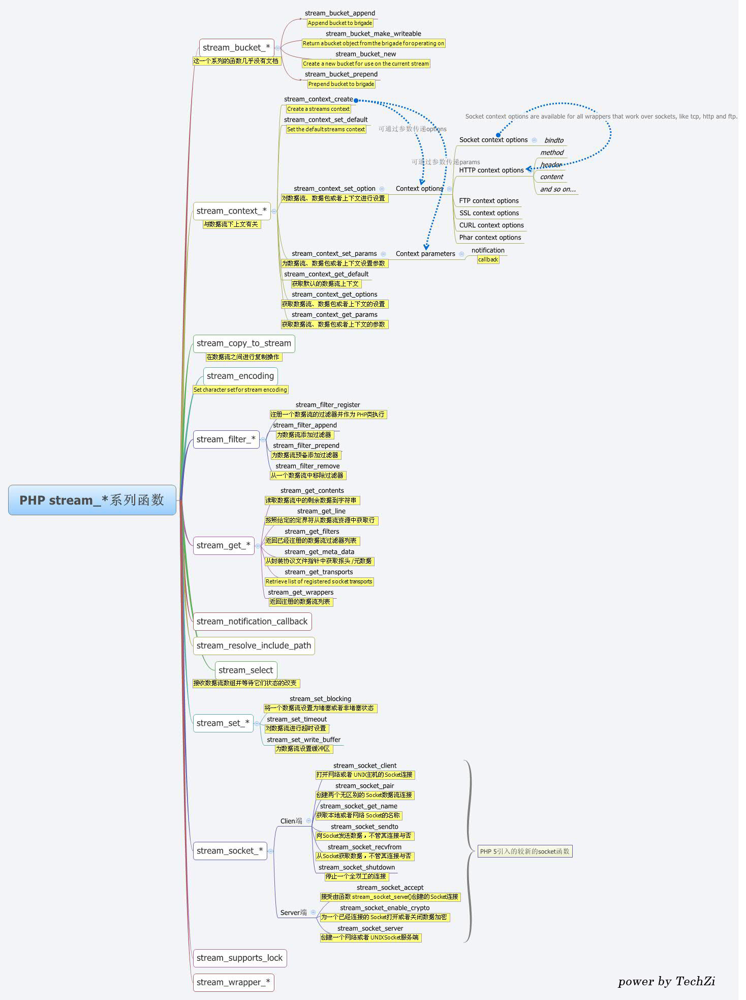

**流是什么：**

流是个抽象的概念，是对输入输出设备的抽象，Java程序中，对于数据的输入/输出操作都是以“流”的方式进行，设备可以是文件，网络，内存等。

流具有方向性，至于是输入流还是输出流则是一个相对的概念，一般以程序为参考，如果数据的流向是程序至设备，我们成为输出流，反之我们称为输入流。

当程序需要从某个数据源读入数据的时候，就会开启一个输入流，数据源可以是文件、内存或网络等等。相反地，需要写出数据到某个数据源目的地的时候，也会开启一个输出流，这个数据源目的地也可以是文件、内存或网络等等。

PHP中对流的描述如下：
每一种流都实现了一个包装器(wrapper)，包装器包含一些额外的代码用来处理特殊的协议和编码。PHP提供了一些内置的包装器，我们也可以很轻松的创建和注册自定义的包装器。我们甚至可以使用上下文(contexts)和过滤器来改变和增强包装器。

PHP中流的形式：<scheme>://<target>。其中<scheme>是包装器的名字，<target>中的内容是由包装器的语法指定，不同的包装器的语法会有所不同。

默认的包装器是file://，也就是说每次我们访问文件系统的时候都使用了流。例如，我们可以使用如下两种方式来读取文件：readfile('/path/to/somefile.txt')和readfile('file:///path/to/somefile.txt')，使用这两种方式读取文件，可以得到相同的结果。

```php
$content = readfile('/home/www/bin/count.sh');
var_dump($content); // #!/bin/bash for ((COUNT = 1; COUNT <= 10; COUNT++)); do echo $COUNT sleep 1 done
$content2 = readfile('file:///home/www/bin/count.sh');
var_dump($content2); // #!/bin/bash for ((COUNT = 1; COUNT <= 10; COUNT++)); do echo $COUNT sleep 1 done
// 逐行读取文件
$file = fopen("file:///home/www/bin/count.sh", "r") or exit("无法打开文件!");
// 读取文件每一行，直到文件结尾
while (!feof($file)) {
    echo fgets($file) . "<br>";
}
fclose($file);
// #!/bin/bash
// for ((COUNT = 1; COUNT <= 10; COUNT++)); do
// echo $COUNT
// sleep 1
// done
// 逐字符读取文件
$file2 = fopen("file:///home/www/bin/count.sh", "r") or exit("无法打开文件!");
while (!feof($file2)) {
    echo fgetc($file2); // #!/bin/bash for ((COUNT = 1; COUNT <= 10; COUNT++)); do echo $COUNT sleep 1 done
}
fclose($file2);
```

```php
PHP 内置的包装器

/**
* 获取已注册的套接字传输协议列表
*/
var_dump(stream_get_transports());
//array (size=9)
//  0 => string 'tcp' (length=3)
//  1 => string 'udp' (length=3)
//  2 => string 'unix' (length=4)
//  3 => string 'udg' (length=3)
//  4 => string 'ssl' (length=3)
//  5 => string 'tls' (length=3)
//  6 => string 'tlsv1.0' (length=7)
//  7 => string 'tlsv1.1' (length=7)
//  8 => string 'tlsv1.2' (length=7)

/**
* 获取已注册的流类型
*/
var_dump(stream_get_wrappers());
// array (size=17)
//   0 => string 'https' (length=5)
//   1 => string 'ftps' (length=4)
//   2 => string 'compress.zlib' (length=13)
//   3 => string 'compress.bzip2' ength=14)
//   4 => string 'php' (length=3)
//   5 => string 'file' (length=4)
//   6 => string 'glob' (length=4)
//   7 => string 'data' (length=4)
//   8 => string 'http' (length=4)
//   9 => string 'ftp' (length=3)
//   10 => string 'phar' (length=4)
//   11 => string 'zip' (length=3)
//   12 => string 'ssh2.shell' (length=10)
//   13 => string 'ssh2.exec' (length=9)
//   14 => string 'ssh2.tunnel' (length=11)
//   15 => string 'ssh2.scp' (length=8)
//   16 => string 'ssh2.sftp' (length=9)

/**
* 获取已注册的数据流过滤器列表
*/
var_dump(stream_get_filters());
//array (size=12)
//  0 => string 'zlib.*' (length=6)
//  1 => string 'bzip2.*' (length=7)
//  2 => string 'convert.iconv.*' (length=15)
//  3 => string 'mcrypt.*' (length=8)
//  4 => string 'mdecrypt.*' (length=10)
//  5 => string 'string.rot13' (length=12)
//  6 => string 'string.toupper' (length=14)
//  7 => string 'string.tolower' (length=14)
//  8 => string 'string.strip_tags' (length=17)
//  9 => string 'convert.*' (length=9)
//  10 => string 'consumed' (length=8)
//  11 => string 'dechunk' (length=7)
```

php://input

php://input是最常用到的流

1、php://input 可以读取没有处理过的POST数据。相较于$HTTP_RAW_POST_DATA而言，它给内存带来的压力较小，并且不需要特殊的php.ini设置。php://input不能用于enctype=multipart/form-data

2、仅当Content-Type为application/x-www-form-urlencoded且提交方法是POST方法时，$_POST数据与php://input数据才是”一致”(打上引号，表示它们格式不一致，内容一致)的。其它情况，它们都不一致

测试代码：

```php
public function phpInput()
{
    $param = file_get_contents('php://input');
    return $param;
}
```

3、php://input读取不到GET数据。是因为_GET数据作为query_path写在http请求头部(header)的PATH字段，而不是写在http请求的body部分。

Get方式请求

PHP中streams函数列表如下：
stream_bucket_append函数：为队列添加数据　
stream_bucket_make_writeable函数：从操作的队列中返回一个数据对象
stream_bucket_new函数：为当前队列创建一个新的数据
stream_bucket_prepend函数：预备数据到队列　
stream_context_create函数：创建数据流上下文
stream_context_get_default函数：获取默认的数据流上下文
stream_context_get_options函数：获取数据流的设置
stream_context_set_option函数：对数据流、数据包或者上下文进行设置
stream_context_set_params函数：为数据流、数据包或者上下文设置参数
stream_copy_to_stream函数：在数据流之间进行复制操作
stream_filter_append函数：为数据流添加过滤器
stream_filter_prepend函数：为数据流预备添加过滤器
stream_filter_register函数：注册一个数据流的过滤器并作为PHP类执行
stream_filter_remove函数：从一个数据流中移除过滤器
stream_get_contents函数：读取数据流中的剩余数据到字符串
stream_get_filters函数：返回已经注册的数据流过滤器列表
stream_get_line函数：按照给定的定界符从数据流资源中获取行
stream_get_meta_data函数：从封装协议文件指针中获取报头/元数据
stream_get_transports函数：返回注册的Socket传输列表
stream_get_wrappers函数：返回注册的数据流列表
stream_register_wrapper函数：注册一个用PHP类实现的URL封装协议
stream_select函数：接收数据流数组并等待它们状态的改变
stream_set_blocking函数：将一个数据流设置为堵塞或者非堵塞状态
stream_set_timeout函数：对数据流进行超时设置
stream_set_write_buffer函数：为数据流设置缓冲区
stream_socket_accept函数：接受由函数stream_ socket_server()创建的Socket连接
stream_socket_client函数：打开网络或者UNIX主机的Socket连接
stream_socket_enable_crypto函数：为一个已经连接的Socket打开或者关闭数据加密
stream_socket_get_name函数：获取本地或者网络Socket的名称
stream_socket_pair函数：创建两个无区别的Socket数据流连接
stream_socket_recvfrom函数：从Socket获取数据，不管其连接与否
stream_socket_sendto函数：向Socket发送数据，不管其连接与否
stream_socket_server函数：创建一个网络或者UNIX Socket服务端
stream_wrapper_restore函数：恢复一个事先注销的数据包
stream_wrapper_unregister函数：注销一个URL地址包