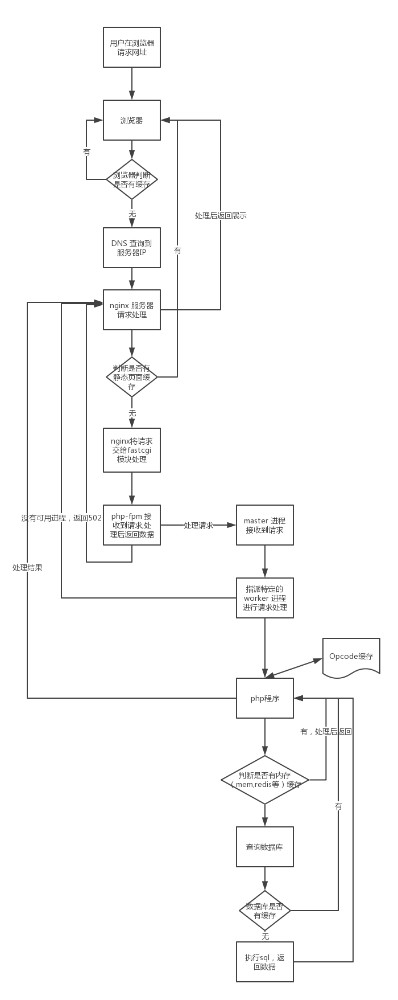

一、php-fpm由来
1.cgi (common gateway interface 公共网关接口)是一种协议，也是一种程序
它是为了保证web server传递过来的数据是标准格式，方便cgi程序的编写者。
web server网站服务器只是内容的分发者(比如nginx)。如果请求/index.html，那么nginx会去文件系统中找到这个文件，发送给浏览器。这里分发的是静态数据。如果请求/index.php，根据配置文件，nginx知道这不是一个静态文件，需要去找php解析器来处理，那么nginx就会把这个请求简单处理交给php解析器。但是nginx传递给php解析器什么呢？url、查询字符串、post数据、header?这时候cgi就出来了，cgi就是规定了要传那些数据并以什么格式传递给后方处理这个请求的协议。
当web server 收到/index.php请求后，会启动对应的cgi程序，这里就是php的解析器。接下来php解析器会解析php.ini文件，初始化执行环境，然后处理请求，再以cgi规定的格式返回处理后的结果，退出进程。web server再把结果返回给浏览器。
2.fastcgi用来提高cgi程序性能的
cgi是个协议，跟进程什么的没关系。cgi程序的性能问题在哪呢？每一次请求过来，启动cgi程序，php解析器会解析php.ini中的基础信息配置，初始化执行环境，每次都要不停的去创建一个进程，读取配置，初始化环境，返回数据，退出进程，久而久之，启动进程的工作变得很累，而且处理每个请求的时间会比较长。所以有了fastcgi
fastcgi会先启动一个master进程，解析配置文件，初始化执行环境，然后启动多个worker。当请求过来时，master会传递给一个worker,然后立即接受下一个请求，这样避免了重复启动以及初始化，效率变高。而且当worker不够用时，master可以根据配置预先启动几个worker等着，当然空闲的worker太多时，也会停掉一些，这样就提高了性能节约资源。
fastcgi是一种与平台无关，与语言无关的接口实现，只需要不同语言按照规定方式实现即可实现与web服务器的通信。


3.php-cgi就是php自带的fastcgi管理器，就是一个程序。php的解释器是php-cgi。
有以下两个问题：问题1php-cgi变更php.ini之后需要重启才能使新的php.ini生效，不能平滑重启；问题2是若直接杀死php-cgi，php便无法运行。由此，php-fpm出现
4.php-fpm完美解决了上述php-cgi的不足，是php5.3.3之后新加入的管理器，在更改php配置之后不需要重启，且由于加入守护进程，所以即使被杀死之后也能快速重启。是一款专用的fastcgi管理器，即php-fastcgi process manager
php-fpm是fastcgi的实现，并提供了进程管理的功能，也是用于调度管理php解释器php-cgi的管理程序（因为php-cgi只只是个CGI程序，他自己本身只能解析请求，返回结果，不会进程管理）。进程包括master进程和worker进程。master进程只有一个，负责监听端口、cgi、php环境初始化、子进程状态，接受来自web server服务器的请求，而worker进程则一般有多个(具体数量根据实际需要配置)，负责处理php请求，每个进程内部嵌入了一个php解释器，是php代码真正执行的地方。


升级的过程：


详见：https://www.awaimai.com/371.html
二、nginx
nginx和apache一样都是一种web服务器。基于REST架构风格，以统一资源标识符URI和统一资源定位符URL作为沟通依据，通过HTTP协议提供各种网络服务。apache稳定开源跨平台，但不支持高并发，在apache上运行数以万计的并发访问，会导致服务器消耗到大量内存。俄罗斯工程师使用c语言开发了Nginx,nginx使用基于事件驱动架构，使得其可以支持数以百万级别的tcp连接。
Nginx是一款自由的、开源的、高性能的HTTP服务器和反向代理服务器，同时也是一个IMAP、POP3、SMTP代理服务器，nginx可以作为一个HTTP服务器进行网站的发布处理，另外还可以作为反向代理进行负载均衡的实现。
1.正向代理
用户访问google，我们需要vpn翻墙才能访问。
vpn对我们来说是可以感知的，但对google服务器来说不可感知，只知道是http请求来的。
人可以感知，但服务器不可以感知到的服务器叫正向代理服务器。正向代理最大的特点是客户端非常明确要访问的服务器地址，服务器端只清楚请求来自那个代理服务器但不清楚来自哪个具体的客户端。


正向代理的用途：
（1）访问原来无法访问的资源，如Google
（2） 可以做缓存，加速访问资源
（3）对客户端访问授权，上网进行认证
（4）代理可以记录用户访问记录（上网行为管理），对外隐藏用户信息
（5）隐藏了客户端信息
2.反向代理：通过反向代理实现负载均衡
当我们访问一个网站时，网站有一个代理服务器，通过这个代理服务器可以做负载均衡，路由到不同的server.
对于我们来说我们是不可感知的，但服务器知道。反向代理代理的是服务端，代服务端接受请求，然后再分发请求。
反向代理的作用：
（1）保证内网的安全，通常将反向代理作为公网访问地址，Web服务器是内网
（2）负载均衡，通过反向代理服务器来优化网站的负载
（3）隐藏了服务端信息
3.负载均衡
客户端发送，nginx反向代理服务器接收到的请求数量，就是负载亮。请求数量按照一定的规则分发到不同的服务器处理的规则就是一种均衡规则。所以，将服务器接收到的请求按照规则分发的过程，称为负载均衡。
分为硬件负载均衡和软件负载均衡。硬负载如F5负载均衡，相对造价成本昂贵。软负载里利用现有的技术结合主机硬件实现的一种消息队列分发机制。
Nginx支持的负载均衡调度算法方式如下：
（1）weight轮询(默认，常用)：接收到的请求按照权重分配到不同的后端服务器，即使在使用过程中，某一台后端服务器宕机，Nginx会自动将该服务器剔除出队列，请求受理情况不会受到任何影响。 这种方式下，可以给不同的后端服务器设置一个权重值(weight)，用于调整不同的服务器上请求的分配率；权重数据越大，被分配到请求的几率越大；该权重值，主要是针对实际工作环境中不同的后端服务器硬件配置进行调整的。
（2）ip_hash（常用）：每个请求按照发起客户端的ip的hash结果进行匹配，这样的算法下一个固定ip地址的客户端总会访问到同一个后端服务器，这也在一定程度上解决了集群部署环境下session共享的问题。
（3）fair：智能调整调度算法，动态的根据后端服务器的请求处理到响应的时间进行均衡分配，响应时间短处理效率高的服务器分配到请求的概率高，响应时间长处理效率低的服务器分配到的请求少；结合了前两者的优点的一种调度算法。但是需要注意的是Nginx默认不支持fair算法，如果要使用这种调度算法，请安装upstream_fair模块。
（4）url_hash：按照访问的url的hash结果分配请求，每个请求的url会指向后端固定的某个服务器，可以在Nginx作为静态服务器的情况下提高缓存效率。同样要注意Nginx默认不支持这种调度算法，要使用的话需要安装Nginx的hash软件包。


负载均衡具体实现：在upstream模块里面
在nginx.conf中：

```
#nginx 多核绑定
worker_processes  16;
worker_cpu_affinity auto;
daemon off;
worker_rlimit_nofile 65535;
events {
    use epoll;
    worker_connections  65535;
}
#后端服务器
http {
      #可以进行设置
      ......
      #添加每个负载的主机以及端口
      # 1轮询方式
      upstream test{
        server 172.25.25.1:80;
        server 172.25.25.3:80;
      }
      # 2权重方式
      upstream test{
	     server localhost:8080 weight=9;   //占90%
	     server localhost:8081 weight=1;  //占10%
	  }
	  # 3 ip_hash
	  upstream test{
		   ip_hash;
	       server 172.25.25.1:80;
	       server 172.25.25.3:80;
      }
      # 4fair 第三方 按后端服务器相应时间来分配，响应时间短的优先分配
      upstream test{
		   fair;
	       server 172.25.25.1:80;
	       server 172.25.25.3:80;
      }
       # 5 url_hash 第三方 按访问url的hash结果来分配请求，是每个url定向到同一个后端服务器，后端服务器为缓存时比较有效
      upstream test{
		    hash $request_uri; 
		    hash_method crc32; 
		    server localhost:8080;
		    server localhost:8081;
      }
}
#这个server也可以新建一个配置然后单独放入，项目中都是这样，然后nginx.conf中将其引入即可（这样重启nginx.conf都会将配置包括引入的配置重启）
server {
    listen       80;
    server_name  www.example.com; 
    root /usr/local/etc/nginx/www/huxintong_admin;
        index index.php; 
        proxy_pass http://test;   #这个就是负载均衡的地方 http代表协议，如果上面写了http:..172.25.25.1:80 那么这块直接写个test即可。
        autoindex on;
    }   
    ......
}
```

proxy_pass的值为 URL为要设置的被代理服务器的地址，包含传输协议、主机名称或IP地址加端口号、URI等要素。
4.主备配置：还是在upstream模块里面。现一般使用keepalived自动检测服务器情况。

```
#设置节点为backup，那么一般情况下所有请求都访问上面的，当上面的server1挂掉或者忙的时候才会访问下面的
upstream webname {
  server 192.168.0.1:8080;
  server 192.168.0.2:8080 backup;
}
#设置节点为down，那么这个server不参与负载

upstream webname {
  server 192.168.0.1:8080;
  server 192.168.0.2:8080 down;
}
```

三、nginx+php-fpm
原理：nginx本身不会对php进行解析，终端对php页面的请求将会被nginx交给fastcgi进程监听的ip地址以及端口，由php-fpm作为动态解析器处理，最后将处理结果再返回给nginx。nginx是一个反向代理服务器，通过反向代理功能将动态请求转向php-fpm，从而实现对php的解析支持，这就思nginx实现php动态解析的原理。
nginx不支持对外部程序的直接调用或者解析，所有的外部程序包括php必须通过fastcgi接口来调用。fastcgi接口在linux下是socket(这个socket可以是文件socket也可以是ip socket)。为了调用cgi程序，还需要一个fastcgi的wrapper(wrapper可以理解为用于启动另一个程序的程序)，这个wrapper绑定在某个固定socket上，如端口或者文件socket。当nginx将cgi请求发送给这个socket的时候，通过fastcgi接口，wrapper接收到请求，然后派生出一个新的线程，这个线程调用解释器或者外部程序处理脚本并读取返回数据，接着，wrapper再将返回的数据通过fastcgi接口，沿着固定的socket传递给nginx,最后nginx将返回的数据发送给客户端。


php-fpm是一个独立的进程，所以需要与nginx进行通信，有两种通信方式：
（1）tcp （2）socket
两种方式都需要进行配置nginx,conf和php-fpm.conf

```
(1)tcp
nginx配置文件：//在每个所配置的server配置模块中
fastcgi_pass 127.0.0.1:9000;
php-fpm配置文件：
listen = 127.0.0.1:9000
#重启nginx
service nginx restart
(2)socket
nginx配置文件：
fastcgi_pass unix:/run/php/php7.0-fpm.sock;
php-fpm配置文件：
listen = /run/php/php7.0-fpm.sock
#重启php-fpm
service php-fpm restart
```

下面我们来配置：
1.配置nginx.conf，在最后一行添加include文件


2.添加对应的server
（1）进入上面添加的路径下，添加一个server,每一个server都是一个文件


进入其中一个：访问这个域名下的文件过来将请求都交给监听9000的php-fpm的进程池处理


配置项含义：

```
server {
    listen       80; #监听80端口，接收http请求
    server_name  www.example.com; #就是网站地址
    root /usr/local/etc/nginx/www/huxintong_admin; # 准备存放代码工程的路径
    #路由到网站根目录www.example.com时候的处理
    location / {
        index index.php; #跳转到www.example.com/index.php
        autoindex on;
    }   

    #当请求网站下php文件的时候，反向代理到php-fpm
    location ~ \.php$ {
        include /usr/local/etc/nginx/fastcgi.conf; #加载nginx的fastcgi模块
        fastcgi_intercept_errors on;
        fastcgi_pass   127.0.0.1:9000; #nginx fastcgi进程监听的IP地址和端口
    }

}
```

 处理流程：


（2）下面启用php的php-fpm来处理这个请求.
打开php-fpm.conf文件，看到如下配置。即php-fpm模块监听127.0.0.1:9000端口.等待请求到来后去处理。
php-fpm中正常脚本由静态www池处理,阻塞脚本由动态curl池处理，这个池可以自己写名称，pm = static | dunamic 区分什么池
[www]
listen = 127.0.0.1:9000
pm = static
pm.max_children = 4
[curl]
listen = 127.0.0.1:9001
pm = dynamic
pm.max_children = 8
pm.start_servers = 4
pm.min_spare_servers = 4
pm.max_spare_servers = 4


3）如果想要使用php-fpm监听多个端口：那么就需要重新copy一份php-fpm命名为php-fpm9001,conf，这样就等于启动了2个php-fpm，每个php-fpm都有自己的master和worker进程


(4)注意：当有请求过来到了server配置的文件中，通过fastcgi_pass知道要到达127.0.0.1:9000，那么请求到达127.0.0.1:9000，这时php-fpm.conf中正配置的是listen127.0.0.1:9000(系统开始时，就会启动每个php-fpm，每个php-fpm就会启动自己的master进程和worker进程来监听)，监听的地址和端口来了请求，该php-fpm就会调用自己的一个worker去处理请求，然后返回给nginx,nginx返回给浏览器。
完整流程：

```
www.example.com
        |
        |
      Nginx
        |
        |
路由到www.example.com/index.php
        |
        |
加载nginx的fast-cgi模块
        |
        |
fast-cgi监听127.0.0.1:9000地址
        |
        |
www.example.com/index.php请求到达127.0.0.1:9000
        |
        |
php-fpm 监听127.0.0.1:9000
        |
        |
php-fpm 接收到请求，启用worker进程处理请求
        |
        |
php-fpm 处理完请求，返回给nginx
        |
        |
nginx将结果通过http返回给浏览器
```




普通的cgi协议实现

