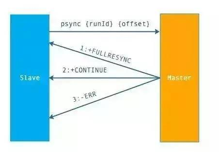
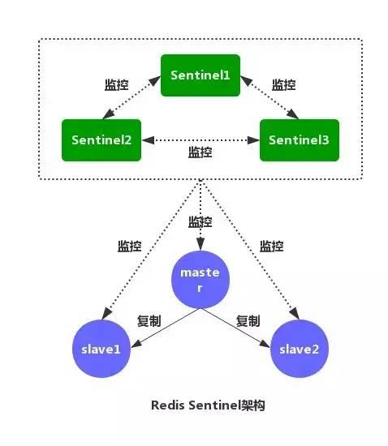
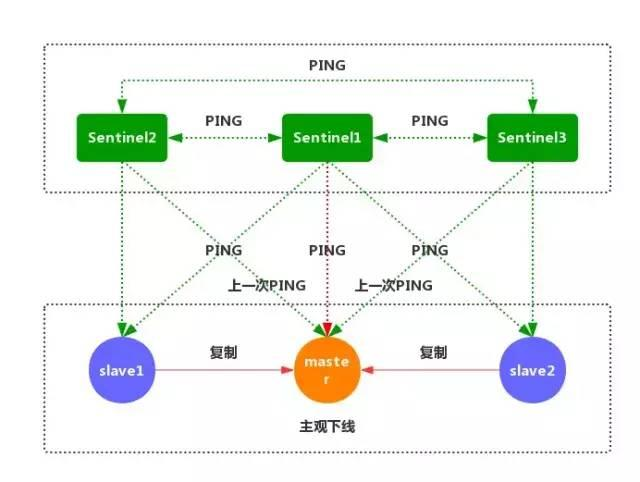
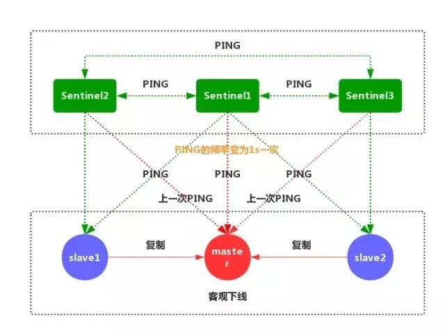

# redis整理

  * 事务
  * redis数据开发设计
  * 主从复制
  * 集群分片
  * 数据备份策略
  * 常见reds错误分析
  * 监控redis的服务状态
  * 可视化管理工具
  * [redis防止商品超发](#redis防止商品超发) 
  * redis持久化

1.Redis支持的数据类型？

2.什么是Redis持久化？Redis有哪几种持久化方式？优缺点是什么？

3.Redis 有哪些架构模式？讲讲各自的特点

4.使用过Redis分布式锁么，它是怎么实现的？

5.使用过Redis做异步队列么，你是怎么用的？有什么缺点？

6.什么是缓存穿透？如何避免？什么是缓存雪崩？何如避免？

7.Redis常用命令

8.为什么Redis 单线程却能支撑高并发？

9.说说Redis的内存淘汰策略

10.Redis的并发竞争问题如何解决?


####Redis支持哪些数据结构及相应的使用场景

字符串（string）
哈希（map）
列表（list）
集合（sets）
有序集合（sorted sets）
redis特点
单线程
数据结构服务器（易于处理集合运算）
快（每秒10万次set操作）
拥有很多原子操作方法，容易保证数据一致性
兼具临时性和永久性
无中心的分布式集群
(1) 速度快，因为数据存在内存中，类似于HashMap，HashMap的优势就是查找和操作的时间复杂度都是O(1)
(2) 支持丰富数据类型，支持string，list，set，sorted set，hash
(3) 支持事务，操作都是原子性，所谓的原子性就是对数据的更改要么全部执行，要么全部不执行
(4) 丰富的特性：可用于缓存，消息，按key设置过期时间，过期后将会自动删除

redis 实战操作RDB和AOF快照持久化
rdb 和 aof 两种持久化机制
rdb 原理每隔一段时间生成redis内存中的数据的一份完整的快照
触发持久化的机制有手动触发和自动触发
手动触发是执行bgsave命令，bgsave会fork一个子进程，在子进程里备份数据
自动触发，/etc/redis/6379.conf文件,手动配置检查点,一条save配置代表一个检查点，redis默认的机制是RDB所以不涉及开启或不开启。例如,我想每隔5s,只要有一条数据更新就生成快照 save 5 1
AOF持久化机制。
原理有数据写入redis,redis自身就会将数据写入aof日志文件,redis并不是直接写入aof文件,而是先写到os cache,然后到一定时间再从os cache会触发操作系统的fsync操作写到磁盘 AOF会无限制的增加吗? 不会,redis中的数据是有一定限量的,不可能说redis内存中的数据无限增长,进而导致AOF无限增长,内存大小是一定的,到一定时候,redis就会用缓存淘汰算法,LRU,自动将一部分数据从内存中给清除,AOF是存放每条写命令的,所以会不断的膨胀,当大到一定的时候,AOF做rewrite操作,将AOF变得小一些,然后将旧的删掉 例如,当redis进行了清理,清除了一部分数据,AOF量到一定程度时,会rewrite,根据redis中新的数据进行rewrite,从而将aof变小,然后将旧的删掉
手动触发。执行bgrewriteaof命令即可
自动触发
由于redis默认的是RDB的持久化方式,AOF的方式默认是关闭的,所以,我们需要手动开启,我们打开/etc/redis/6379.conf配置文件 a.打开AOF机制 appendonly yes
配置rewrite 在/etc/redis/6379.conf文件中有两个配置,auto-aof-rewrite-percentage和auto-aof-rewrite-min-size 第一条命令的意思是,当aof日志文件中的大小大于上一次的一倍了,那就执行rewrite 第二条意思是,就算满足了第一条的条件,但是还是需要和auto-aof-rewrite-min-size配置的值进行比较,当aof的大小大于64m时才会进行rewrite操作
auto-aof-rewrite-percentage 100
auto-aof-rewrite-min-size 64mb
OF的三种写入方式,使用默认的everysec即可,即,每秒写入一次
# appendfsync always
appendfsync everysec
# appendfsync no
####数据恢复方案

a.如果是redis进程挂掉，那么重启redis进程即可，直接基于AOF日志文件恢复数据
b.如果是redis进程所在机器挂掉，那么重启机器后，尝试重启redis进程，尝试直接基于AOF日志文件进行数据恢复
c.如果redis当前最新的AOF和RDB文件出现了丢失/损坏，那么可以尝试基于该机器上当前的某个最新的RDB数据副本进行数据恢复 ①停止redis(命令是redis-cli shutdown), ②在配置文件中关闭aof: appendonly no ③拷贝rdb日志备份到/var/redis/6379目录下 ④启动redis(命令是,先到目录/etc/init.d/目录下, ./redis_6379) ⑤尝试get一个key,确认数据恢复 ⑥命令热修改redis配置,使用redis-cli连接redis,使用命令redis config set appendonly yes打开aof方式,这样aof和rdb数据就一致了 ⑦手动修改6379.conf配置文件中appendonly为yes,因为热修改暂时不会写到配置文件中,所以需要手动修改,然后启动redis,再次确认数据恢复
d.如果当前机器上的所有RDB文件全部损坏，那么从远程的云服务上拉取最新的RDB快照回来恢复数据
c.如果是发现有重大的数据错误,就找最新的并且无错的进行恢复
如果需要恢复数据，只需将备份文件 (dump.rdb) 移动到 redis 安装目录并启动服务即可。获取 redis 目录可以使用 CONFIG 命令
redis 127.0.0.1:6379> CONFIG GET dir
1) "dir"
2) "/usr/local/redis/bin"

####redis常见性能问题和解决方案

Master最好不要做任何持久化工作，如RDB内存快照和AOF日志文件
如果数据比较重要，某个Slave开启AOF备份数据，策略设置为每秒同步一次
为了主从复制的速度和连接的稳定性，Master和Slave最好在同一个局域网内
尽量避免在压力很大的主库上增加从库
主从复制不要用图状结构，用单向链表结构更为稳定，即：Master <- Slave1 <- Slave2 <- Slave3... 这样的结构方便解决单点故障问题，实现Slave对Master的替换。如果Master挂了，可以立刻启用Slave1做Master，其他不变。
Master写内存快照，save命令调度rdbSave函数，会阻塞主线程的工作，当快照比较大时对性能影响是非常大的，会间断性暂停服务，所以Master最好不要写内存快照。
Master AOF持久化，如果不重写AOF文件，这个持久化方式对性能的影响是最小的，但是AOF文件会不断增大，AOF文件过大会影响Master重启的恢复速度。Master最好不要做任何持久化工作，包括内存快照和AOF日志文件，特别是不要启用内存快照做持久化,如果数据比较关键，某个Slave开启AOF备份数据，策略为每秒同步一次。
Master调用BGREWRITEAOF重写AOF文件，AOF在重写的时候会占大量的CPU和内存资源，导致服务load过高，出现短暂服务暂停现象。

####MySQL里有2000w数据，redis中只存20w的数据，如何保证redis中的数据都是热点数据

redis 内存数据集大小上升到一定大小的时候，就会施行数据淘汰策略。redis 提供 6种数据淘汰策略：
voltile-lru：从已设置过期时间的数据集（server.db[i].expires）中挑选最近最少使用的数据淘汰
volatile-ttl：从已设置过期时间的数据集（server.db[i].expires）中挑选将要过期的数据淘汰
volatile-random：从已设置过期时间的数据集（server.db[i].expires）中任意选择数据淘汰
allkeys-lru：从数据集（server.db[i].dict）中挑选最近最少使用的数据淘汰
allkeys-random：从数据集（server.db[i].dict）中任意选择数据淘汰
no-enviction（驱逐）：禁止驱逐数据

####Redis的同步机制了解么？

主从同步。第一次同步时，主节点做一次bgsave，并同时将后续修改操作记录到内存buffer，待完成后将rdb文件全量同步到复制节点，复制节点接受完成后将rdb镜像加载到内存。加载完成后，再通知主节点将期间修改的操作记录同步到复制节点进行重放就完成了同步过程

####是否使用过Redis集群，集群的原理是什么？

Redis Sentinel着眼于高可用，在master宕机时会自动将slave提升为master，继续提供服务。
Redis Cluster着眼于扩展性，在单个redis内存不足时，使用Cluster进行分片存储。

####memache 和redis 内存分配与碎片回收机制

https://blog.csdn.net/jayxujia123/article/details/88544702
memache使用了slab allocator机制
Slab Allocator的基本原理是按照预先规定的大小，将分配的内存以page为单位，默认情况下一个page是1M，可以通过-I参数在启动时指定，分割成各种尺寸的块（chunk）， 并把尺寸相同的块分成组（chunk的集合），如果需要申请内存时，memcached会划分出一个新的page并分配给需要的slab区域
redis的内存机制
Redis的内存管理主要通过源码中zmalloc.h和zmalloc.c两个文件来实现的。Redis为了方便内存的管理，在分配一块内存之 后，会将这块内存的大小存入内存块的头部。如图 5所示，real_ptr是redis调用malloc后返回的指针。redis将内存块的大小size存入头部，size所占据的内存大小是已知的，为 size_t类型的长度，然后返回ret_ptr。当需要释放内存的时候，ret_ptr被传给内存管理程序。通过ret_ptr，程序可以很容易的算出 real_ptr的值，然后将real_ptr传给free释放内存
Redis通过定义一个数组来记录所有的内存分配情况，这个数组的长度为ZMALLOC_MAX_ALLOC_STAT。数组的每一个元素代表当前 程序所分配的内存块的个数，且内存块的大小为该元素的下标。在源码中，这个数组为zmalloc_allocations。 zmalloc_allocations[16]代表已经分配的长度为16bytes的内存块的个数。zmalloc.c中有一个静态变量 used_memory用来记录当前分配的内存总大小。所以，总的来看，Redis采用的是包装的mallc/free，相较于Memcached的内存 管理方法来说，要简单很多
php中类的使用


geohash 算法，给经纬度编码，计算周边信息

一致性哈希算法

https://www.jb51.net/article/137523.htm
主要解决问题分布式的负载问题，即使新增或者删除节点，影响的只是一部分的数据负载。减轻系统的压力
红包分配方法

https://blog.csdn.net/dragon_18/article/details/86378979
redis scan 用法

scan cursor match * count 200
实际上scan后面的count不是要输出的数量。而是要迭代的所有key里的个数。我的理解就是redis里有10000个key。如果我想一次性全部scan出来，我必须把这个count大于redis里所有的key的个数。就类似于o(n)遍历，只不过scan不堵塞，是迭代性的，类似于php和python的协程 yield。
cursor比较有意思。当你后面的count数量太小的时候，或者可以理解为比key的总数小，那么他肯定迭代不完你所有的数据。这个输出的cursor就是目前redis迭代到的位置，如果还想继续输出，可以把cursor替换成这个值，继续输出。如果为0，则表示整个库里都迭代完了

####redis rdb恢复要点
必须 shutdown
rdb恢复目录可以通过 config get dir查看
必须appendonly = no

####redis 持久化机制和线上环境容灾

https://blog.csdn.net/zh15732621679/article/details/80307827
https://www.cnblogs.com/chenhaoyu/p/10837723.html 


- Redis、Memecached 这两者有什么区别？

> 1.  Redis 支持更加丰富的数据存储类型，String、Hash、List、Set 和 Sorted Set。Memcached 仅支持简单的 key-value 结构。
> 2.  Memcached key-value存储比 Redis 采用 hash 结构来做 key-value 存储的内存利用率更高。
> 3.  Redis 提供了事务的功能，可以保证一系列命令的原子性
> 4.  Redis 支持数据的持久化，可以将内存中的数据保持在磁盘中
> 5.  Redis 只使用单核，而 Memcached 可以使用多核，所以平均每一个核上 Redis 在存储小数据时比 Memcached 性能更高。

- Redis 如何实现持久化？

> 1. RDB 持久化，将 Redis 在内存中的的状态保存到硬盘中，相当于备份数据库状态。
> 2. AOF 持久化（Append-Only-File），AOF 持久化是通过保存 Redis 服务器锁执行的写状态来记录数据库的。相当于备份数据库接收到的命令，所有被写入 AOF 的命令都是以 Redis 的协议格式来保存的。


**Redis 是什么**

Redis 是 C 语言开发的一个开源的（遵从 BSD 协议）高性能键值对（key-value）的内存数据库，可以用作数据库、缓存、消息中间件等。

它是一种 NoSQL（not-only sql，泛指非关系型数据库）的数据库。

Redis 作为一个内存数据库：

性能优秀，数据在内存中，读写速度非常快，支持并发 10W QPS。单进程单线程，是线程安全的，采用 IO 多路复用机制。
丰富的数据类型，支持字符串（strings）、散列（hashes）、列表（lists）、集合（sets）、有序集合（sorted sets）等。
支持数据持久化。可以将内存中数据保存在磁盘中，重启时加载。主从复制，哨兵，高可用。
可以用作分布式锁。
可以作为消息中间件使用，支持发布订阅。

**五种数据类型**

说之前，我觉得有必要先来了解下 Redis 内部内存管理是如何描述这 5 种数据类型的。


redisObject 最主要的信息如上图所示：type 表示一个 value 对象具体是何种数据类型，encoding 是不同数据类型在 Redis 内部的存储方式。

比如：type=string 表示 value 存储的是一个普通字符串，那么 encoding 可以是 raw 或者 int。

下面我简单说下 5 种数据类型：

①String 是 Redis 最基本的类型，可以理解成与 Memcached一模一样的类型，一个 Key 对应一个 Value。Value 不仅是 String，也可以是数字。

String 类型是二进制安全的，意思是 Redis 的 String 类型可以包含任何数据，比如 jpg 图片或者序列化的对象。String 类型的值最大能存储 512M。

②Hash是一个键值（key-value）的集合。Redis 的 Hash 是一个 String 的 Key 和 Value 的映射表，Hash 特别适合存储对象。常用命令：hget，hset，hgetall 等。

③List 列表是简单的字符串列表，按照插入顺序排序。可以添加一个元素到列表的头部（左边）或者尾部（右边） 常用命令：lpush、rpush、lpop、rpop、lrange（获取列表片段）等。

应用场景：List 应用场景非常多，也是 Redis 最重要的数据结构之一，比如 Twitter 的关注列表，粉丝列表都可以用 List 结构来实现。

数据结构：List 就是链表，可以用来当消息队列用。Redis 提供了 List 的 Push 和 Pop 操作，还提供了操作某一段的 API，可以直接查询或者删除某一段的元素。

实现方式：Redis List 的是实现是一个双向链表，既可以支持反向查找和遍历，更方便操作，不过带来了额外的内存开销。

④Set 是 String 类型的无序集合。集合是通过 hashtable 实现的。Set 中的元素是没有顺序的，而且是没有重复的。常用命令：sdd、spop、smembers、sunion 等。

应用场景：Redis Set 对外提供的功能和 List 一样是一个列表，特殊之处在于 Set 是自动去重的，而且 Set 提供了判断某个成员是否在一个 Set 集合中。

⑤Zset 和 Set 一样是 String 类型元素的集合，且不允许重复的元素。常用命令：zadd、zrange、zrem、zcard 等。

使用场景：Sorted Set 可以通过用户额外提供一个优先级（score）的参数来为成员排序，并且是插入有序的，即自动排序。

当你需要一个有序的并且不重复的集合列表，那么可以选择 Sorted Set 结构。

和 Set 相比，Sorted Set关联了一个 Double 类型权重的参数 Score，使得集合中的元素能够按照 Score 进行有序排列，Redis 正是通过分数来为集合中的成员进行从小到大的排序。

实现方式：Redis Sorted Set 的内部使用 HashMap 和跳跃表（skipList）来保证数据的存储和有序，HashMap 里放的是成员到 Score 的映射。

而跳跃表里存放的是所有的成员，排序依据是 HashMap 里存的 Score，使用跳跃表的结构可以获得比较高的查找效率，并且在实现上比较简单。

数据类型应用场景总结：


**Redis 缓存**


缓存和数据库数据一致性问题：分布式环境下非常容易出现缓存和数据库间数据一致性问题，针对这一点，如果项目对缓存的要求是强一致性的，那么就不要使用缓存。

我们只能采取合适的策略来降低缓存和数据库间数据不一致的概率，而无法保证两者间的强一致性。

合适的策略包括合适的缓存更新策略，更新数据库后及时更新缓存、缓存失败时增加重试机制。


**Redis 雪崩了解吗？**

目前电商首页以及热点数据都会去做缓存，一般缓存都是定时任务去刷新，或者查不到之后去更新缓存的，定时任务刷新就有一个问题。

举个栗子：如果首页所有 Key 的失效时间都是 12 小时，中午 12 点刷新的，我零点有个大促活动大量用户涌入，假设每秒 6000 个请求，本来缓存可以抗住每秒 5000 个请求，但是缓存中所有 Key 都失效了。

此时 6000 个/秒的请求全部落在了数据库上，数据库必然扛不住，真实情况可能 DBA 都没反应过来直接挂了。

此时，如果没什么特别的方案来处理，DBA 很着急，重启数据库，但是数据库立马又被新流量给打死了。这就是我理解的缓存雪崩。

同一时间大面积失效，瞬间 Redis 跟没有一样，那这个数量级别的请求直接打到数据库几乎是灾难性的。

你想想如果挂的是一个用户服务的库，那其他依赖他的库所有接口几乎都会报错。

如果没做熔断等策略基本上就是瞬间挂一片的节奏，你怎么重启用户都会把你打挂，等你重启好的时候，用户早睡觉去了，临睡之前，骂骂咧咧“什么垃圾产品”。

处理缓存雪崩简单，在批量往 Redis 存数据的时候，把每个 Key 的失效时间都加个随机值就好了，这样可以保证数据不会再同一时间大面积失效。

setRedis（key, value, time+Math.random()*10000）;

如果 Redis 是集群部署，将热点数据均匀分布在不同的 Redis 库中也能避免全部失效。

或者设置热点数据永不过期，有更新操作就更新缓存就好了（比如运维更新了首页商品，那你刷下缓存就好了，不要设置过期时间），电商首页的数据也可以用这个操作，保险。

**那你了解缓存穿透和击穿么，可以说说他们跟雪崩的区别吗？**

先说下缓存穿透吧，缓存穿透是指缓存和数据库中都没有的数据，而用户（黑客）不断发起请求。

举个栗子：我们数据库的 id 都是从 1 自增的，如果发起 id=-1 的数据或者 id 特别大不存在的数据，这样的不断攻击导致数据库压力很大，严重会击垮数据库。

至于缓存击穿嘛，这个跟缓存雪崩有点像，但是又有一点不一样，缓存雪崩是因为大面积的缓存失效，打崩了 DB。

而缓存击穿不同的是缓存击穿是指一个 Key 非常热点，在不停地扛着大量的请求，大并发集中对这一个点进行访问，当这个 Key 在失效的瞬间，持续的大并发直接落到了数据库上，就在这个 Key 的点上击穿了缓存。

缓存穿透我会在接口层增加校验，比如用户鉴权，参数做校验，不合法的校验直接 return，比如 id 做基础校验，id<=0 直接拦截。

Redis 里还有一个高级用法布隆过滤器（Bloom Filter）这个也能很好的预防缓存穿透的发生。

它的原理也很简单，就是利用高效的数据结构和算法快速判断出你这个 Key 是否在数据库中存在，不存在你 return 就好了，存在你就去查 DB 刷新 KV 再 return。

缓存击穿的话，设置热点数据永不过期，或者加上互斥锁就搞定了。

**Redis 为何这么快**

官方提供的数据可以达到 100000+ 的 QPS（每秒内的查询次数），这个数据不比 Memcached 差！

Redis 这么快，为什么还是单线程的吧。

Redis 确实是单进程单线程的模型，因为 Redis 完全是基于内存的操作，CPU 不是 Redis 的瓶颈，Redis 的瓶颈最有可能是机器内存的大小或者网络带宽。

既然单线程容易实现，而且 CPU 不会成为瓶颈，那就顺理成章的采用单线程的方案了（毕竟采用多线程会有很多麻烦）。

Redis 是单线程的，为什么还能这么快吗？

有如下四点：

Redis 完全基于内存，绝大部分请求是纯粹的内存操作，非常迅速，数据存在内存中，类似于 HashMap，HashMap 的优势就是查找和操作的时间复杂度是 O(1)。

数据结构简单，对数据操作也简单。

采用单线程，避免了不必要的上下文切换和竞争条件，不存在多线程导致的 CPU 切换，不用去考虑各种锁的问题，不存在加锁释放锁操作，没有死锁问题导致的性能消耗。

使用多路复用 IO 模型，非阻塞 IO。

Redis 和 Memcached 的区别

为什么选择 Redis 的缓存方案而不用 Memcached 呢？

原因有如下四点：

存储方式上：Memcache 会把数据全部存在内存之中，断电后会挂掉，数据不能超过内存大小。Redis 有部分数据存在硬盘上，这样能保证数据的持久性。

数据支持类型上：Memcache 对数据类型的支持简单，只支持简单的 key-value，，而 Redis 支持五种数据类型。

使用底层模型不同：它们之间底层实现方式以及与客户端之间通信的应用协议不一样。Redis 直接自己构建了 VM 机制，因为一般的系统调用系统函数的话，会浪费一定的时间去移动和请求。

Value 的大小：Redis 可以达到 1GB，而 Memcache 只有 1MB。

**淘汰策略**

Redis 有六种淘汰策略，如下图：


Redis 4.0 加入了 LFU（least frequency use）淘汰策略，包括 volatile-lfu 和 allkeys-lfu，通过统计访问频率，将访问频率最少，即最不经常使用的 KV 淘汰。

**Redis持久化机制**

Redis 为了保证效率，数据缓存在了内存中，但是会周期性的把更新的数据写入磁盘或者把修改操作写入追加的记录文件中，以保证数据的持久化。

**Redis 的持久化策略有两种：**

**RDB：**

快照形式是直接把内存中的数据保存到一个 dump 的文件中，定时保存，保存策略。AOF：把所有的对 Redis 的服务器进行修改的命令都存到一个文件里，命令的集合。Redis 默认是快照 RDB 的持久化方式。

当 Redis 重启的时候，它会优先使用 AOF 文件来还原数据集，因为 AOF 文件保存的数据集通常比 RDB 文件所保存的数据集更完整。你甚至可以关闭持久化功能，让数据只在服务器运行时存。

默认 Redis 是会以快照"RDB"的形式将数据持久化到磁盘的一个二进制文件 dump.rdb。

当 Redis 需要做持久化时，Redis 会 fork 一个子进程，子进程将数据写到磁盘上一个临时 RDB 文件中。

当子进程完成写临时文件后，将原来的 RDB 替换掉，这样的好处是可以 copy-on-write。

RDB 的优点是：这种文件非常适合用于备份：比如，你可以在最近的 24 小时内，每小时备份一次，并且在每个月的每一天也备份一个 RDB 文件。

这样的话，即使遇上问题，也可以随时将数据集还原到不同的版本。RDB 非常适合灾难恢复。

RDB 的缺点是：如果你需要尽量避免在服务器故障时丢失数据，那么RDB不合适你。

**AOF：**

使用 AOF 做持久化，每一个写命令都通过 write 函数追加到 appendonly.aof 中，配置方式如下：

appendfsyncyesappendfsync always #每次有数据修改发生时都会写入AOF文件。appendfsync everysec #每秒钟同步一次，该策略为AOF的缺省策略。

AOF 可以做到全程持久化，只需要在配置中开启 appendonly yes。这样 Redis 每执行一个修改数据的命令，都会把它添加到 AOF 文件中，当 Redis 重启时，将会读取 AOF 文件进行重放，恢复到 Redis 关闭前的最后时刻。

使用 AOF 的优点是会让 Redis 变得非常耐久。可以设置不同的 Fsync 策略，AOF的默认策略是每秒钟 Fsync 一次，在这种配置下，就算发生故障停机，也最多丢失一秒钟的数据。

缺点是对于相同的数据集来说，AOF 的文件体积通常要大于 RDB 文件的体积。根据所使用的 Fsync 策略，AOF 的速度可能会慢于 RDB。

**RDB和AOF如何选择**

如果你非常关心你的数据，但仍然可以承受数分钟内的数据丢失，那么可以额只使用 RDB 持久。

AOF 将 Redis 执行的每一条命令追加到磁盘中，处理巨大的写入会降低Redis的性能，不知道你是否可以接受。

数据库备份和灾难恢复：定时生成 RDB 快照非常便于进行数据库备份，并且 RDB 恢复数据集的速度也要比 AOF 恢复的速度快。

当然了，Redis 支持同时开启 RDB 和 AOF，系统重启后，Redis 会优先使用 AOF 来恢复数据，这样丢失的数据会最少。

**主从复制**

Redis 单节点存在单点故障问题，为了解决单点问题，一般都需要对 Redis 配置从节点，然后使用哨兵来监听主节点的存活状态，如果主节点挂掉，从节点能继续提供缓存功能，你能说说 Redis 主从复制的过程和原理吗？

主从配置结合哨兵模式能解决单点故障问题，提高 Redis 可用性。

从节点仅提供读操作，主节点提供写操作。对于读多写少的状况，可给主节点配置多个从节点，从而提高响应效率。

关于复制过程，是这样的：

从节点执行 slaveof[masterIP][masterPort]，保存主节点信息。从节点中的定时任务发现主节点信息，建立和主节点的 Socket 连接。从节点发送 Ping 信号，主节点返回 Pong，两边能互相通信。连接建立后，主节点将所有数据发送给从节点（数据同步）。主节点把当前的数据同步给从节点后，便完成了复制的建立过程。接下来，主节点就会持续的把写命令发送给从节点，保证主从数据一致性。

**那你能详细说下数据同步的过程吗？**

Redis 2.8 之前使用 sync[runId][offset] 同步命令，Redis 2.8 之后使用 psync[runId][offset] 命令。

两者不同在于，Sync 命令仅支持全量复制过程，Psync 支持全量和部分复制。

介绍同步之前，先介绍几个概念：

runId：每个 Redis 节点启动都会生成唯一的 uuid，每次 Redis 重启后，runId 都会发生变化。offset：主节点和从节点都各自维护自己的主从复制偏移量 offset，当主节点有写入命令时，offset=offset+命令的字节长度。从节点在收到主节点发送的命令后，也会增加自己的 offset，并把自己的 offset 发送给主节点。这样，主节点同时保存自己的 offset 和从节点的 offset，通过对比 offset 来判断主从节点数据是否一致。repl_backlog_size：保存在主节点上的一个固定长度的先进先出队列，默认大小是 1MB。

主节点发送数据给从节点过程中，主节点还会进行一些写操作，这时候的数据存储在复制缓冲区中。

从节点同步主节点数据完成后，主节点将缓冲区的数据继续发送给从节点，用于部分复制。

主节点响应写命令时，不但会把命名发送给从节点，还会写入复制积压缓冲区，用于复制命令丢失的数据补救。



上面是 Psync 的执行流程，从节点发送 psync[runId][offset] 命令，主节点有三种响应：

FULLRESYNC：第一次连接，进行全量复制CONTINUE：进行部分复制ERR：不支持 psync 命令，进行全量复制

**全量复制和部分复制的过程**


上面是全量复制的流程。主要有以下几步：

从节点发送 psync ? -1 命令（因为第一次发送，不知道主节点的 runId，所以为?，因为是第一次复制，所以 offset=-1）。主节点发现从节点是第一次复制，返回 FULLRESYNC {runId} {offset}，runId 是主节点的 runId，offset 是主节点目前的 offset。从节点接收主节点信息后，保存到 info 中。主节点在发送 FULLRESYNC 后，启动 bgsave 命令，生成 RDB 文件（数据持久化）。主节点发送 RDB 文件给从节点。到从节点加载数据完成这段期间主节点的写命令放入缓冲区。从节点清理自己的数据库数据。从节点加载 RDB 文件，将数据保存到自己的数据库中。如果从节点开启了 AOF，从节点会异步重写 AOF 文件。

关于部分复制有以下几点说明：

①部分复制主要是 Redis 针对全量复制的过高开销做出的一种优化措施，使用 psync[runId][offset] 命令实现。

当从节点正在复制主节点时，如果出现网络闪断或者命令丢失等异常情况时，从节点会向主节点要求补发丢失的命令数据，主节点的复制积压缓冲区将这部分数据直接发送给从节点。

这样就可以保持主从节点复制的一致性。补发的这部分数据一般远远小于全量数据。

②主从连接中断期间主节点依然响应命令，但因复制连接中断命令无法发送给从节点，不过主节点内的复制积压缓冲区依然可以保存最近一段时间的写命令数据。

③当主从连接恢复后，由于从节点之前保存了自身已复制的偏移量和主节点的运行 ID。因此会把它们当做 psync 参数发送给主节点，要求进行部分复制。

④主节点接收到 psync 命令后首先核对参数 runId 是否与自身一致，如果一致，说明之前复制的是当前主节点。

之后根据参数 offset 在复制积压缓冲区中查找，如果 offset 之后的数据存在，则对从节点发送+COUTINUE 命令，表示可以进行部分复制。因为缓冲区大小固定，若发生缓冲溢出，则进行全量复制。

⑤主节点根据偏移量把复制积压缓冲区里的数据发送给从节点，保证主从复制进入正常状态。

**哨兵**

**主从复制会存在的问题**

一旦主节点宕机，从节点晋升为主节点，同时需要修改应用方的主节点地址，还需要命令所有从节点去复制新的主节点，整个过程需要人工干预。主节点的写能力受到单机的限制。主节点的存储能力受到单机的限制。原生复制的弊端在早期的版本中也会比较突出，比如：Redis 复制中断后，从节点会发起 psync。此时如果同步不成功，则会进行全量同步，主库执行全量备份的同时，可能会造成毫秒或秒级的卡顿。

**比较主流的解决方案**

是哨兵

哨兵有哪些功能？



如图，是 Redis Sentinel（哨兵）的架构图。Redis Sentinel（哨兵）主要功能包括主节点存活检测、主从运行情况检测、自动故障转移、主从切换。

Redis Sentinel 最小配置是一主一从。Redis 的 Sentinel 系统可以用来管理多个 Redis 服务器。

该系统可以执行以下四个任务：

监控：不断检查主服务器和从服务器是否正常运行。通知：当被监控的某个 Redis 服务器出现问题，Sentinel 通过 API 脚本向管理员或者其他应用程序发出通知。自动故障转移：当主节点不能正常工作时，Sentinel 会开始一次自动的故障转移操作，它会将与失效主节点是主从关系的其中一个从节点升级为新的主节点，并且将其他的从节点指向新的主节点，这样人工干预就可以免了。配置提供者：在 Redis Sentinel 模式下，客户端应用在初始化时连接的是 Sentinel 节点集合，从中获取主节点的信息。

**哨兵的工作原理**

直接上图：


①每个 Sentinel 节点都需要定期执行以下任务：每个 Sentinel 以每秒一次的频率，向它所知的主服务器、从服务器以及其他的 Sentinel 实例发送一个 PING 命令。（如上图）



②如果一个实例距离最后一次有效回复 PING 命令的时间超过 down-after-milliseconds 所指定的值，那么这个实例会被 Sentinel 标记为主观下线。（如上图）


③如果一个主服务器被标记为主观下线，那么正在监视这个服务器的所有 Sentinel 节点，要以每秒一次的频率确认主服务器的确进入了主观下线状态。



④如果一个主服务器被标记为主观下线，并且有足够数量的 Sentinel（至少要达到配置文件指定的数量）在指定的时间范围内同意这一判断，那么这个主服务器被标记为客观下线。


⑤一般情况下，每个 Sentinel 会以每 10 秒一次的频率向它已知的所有主服务器和从服务器发送 INFO 命令。

当一个主服务器被标记为客观下线时，Sentinel 向下线主服务器的所有从服务器发送 INFO 命令的频率，会从 10 秒一次改为每秒一次。


⑥Sentinel 和其他 Sentinel 协商客观下线的主节点的状态，如果处于 SDOWN 状态，则投票自动选出新的主节点，将剩余从节点指向新的主节点进行数据复制。


⑦当没有足够数量的 Sentinel 同意主服务器下线时，主服务器的客观下线状态就会被移除。

当主服务器重新向 Sentinel 的 PING 命令返回有效回复时，主服务器的主观下线状态就会被移除。

**总结**

本文在一次面试的过程中讲述了 Redis 是什么，Redis 的特点和功能，Redis 缓存的使用，Redis 为什么能这么快，Redis 缓存的淘汰策略，持久化的两种方式，Redis 高可用部分的主从复制和哨兵的基本原理。

### Redis命令行批量删除相同前缀的key

redis-cli KEYS "topic*" | xargs redis-cli DEL

此种方式不适用与生产环境执行，容易导致服务不可用，或者服务器宕机风险

推荐使用redis SCAN、SSCAN、ZSCAN、HSCAN迭代的方式删除

一下为php示例代码

**SCAN** 用于迭代

- `SCAN cursor [MATCH pattern] [COUNT count]`
- 作用：迭代当前数据库中的数据库键
- SCAN 使用 demo


```php
<?php
$redis = new Redis();
$redis->connect('127.0.0.1', 6379);
/* Options for the SCAN family of commands, indicating whether to abstract
   empty results from the user.  If set to SCAN_NORETRY (the default), phpredis
   will just issue one SCAN command at a time, sometimes returning an empty
   array of results.  If set to SCAN_RETRY, phpredis will retry the scan command
   until keys come back OR Redis returns an iterator of zero */
$redis->setOption(Redis::OPT_SCAN, Redis::SCAN_RETRY);
$iterator = null;
$count = 1000; // 测试时redis中大概有20w个key，用时约2s，当count为500时用时约4s，count越大时扫描用时越短（当然需要根据你的业务需要来定）
$prefix = date('Ymd');
$time1 = msectime();
$total = [];
while ($arrKeys = $redis->scan($iterator, $prefix . '*', $count)) {
    $arrValues = $redis->mget($arrKeys);
    $ret = array_combine($arrKeys, $arrValues);
    $total = array_merge($total, $ret);
}
$time2 = msectime();
$time = $time2 - $time1;
echo 'time : ' . $time  . ' ms; total keys : ' . count($total) . PHP_EOL;
// time : 2009 ms; total keys : 129798  （用时2009 ms，20w中共有129798个前缀为$prefix的key）
function msectime() {
    list($msec, $sec) = explode(' ', microtime());
    $msectime = (float)sprintf('%.0f', (floatval($msec) + floatval($sec)) * 1000);
    return $msectime;
}
```

**SSCAN**

- `SCAN cursor [MATCH pattern] [COUNT count]`
- 作用：用于迭代集合键中的元素
- SSCAN使用demo


```php
<?php
$iterator = null;
$count = 1000;
$mainKey = date('Ymd');
$prefix = $mainKey;
$total = [];
$redis = new Redis();
$redis->connect('127.0.0.1', 6379);
$redis->setOption(Redis::OPT_SCAN, Redis::SCAN_RETRY);
$time1 = msectime();
while ($arrKeys = $redis->sscan($mainKey, $iterator, $prefix . '*', $count)) { // 匹配前缀为当前日期的key
    $total += $arrKeys;
}
$time2 = msectime();
$time = $time2 - $time1;
echo 'use time : ' . $time  . ' ms; total keys : ' . count($total) . PHP_EOL;
// use time : 649 ms; total keys : 90010 （这个集合中有20w个元素）
....... other code ......
```

**ZSCAN**

- `ZSCAN cursor [MATCH pattern] [COUNT count]`
- 作用：用于迭代有序集合中的元素
- ZSCAN使用demo


```php
<?php
$iterator = null;
$count = 1000;
$mainKey = 'test';
$prefix = '10';
$total = [];
$redis = new Redis();
$redis->connect('127.0.0.1', 6379);
$redis->setOption(Redis::OPT_SCAN, Redis::SCAN_RETRY);
$time1 = msectime();
while ($arrKeys = $redis->zscan($mainKey, $iterator, $prefix . '*', $count)) { // 匹配key前缀是 10 的所有key
    var_dump($arrKeys);
    $total += $arrKeys;
}
$time2 = msectime();
$time = $time2 - $time1;
echo 'use time : ' . $time  . ' ms; total keys : ' . count($total) . PHP_EOL;
// use time : 317 ms; total keys : 1111 （这个集合中有10w个元素）
...... other code ......
```

**HSCAN**

- `HSCAN cursor [MATCH pattern] [COUNT count]`
- 作用：用于迭代哈希中的元素
- HSACN 使用demo


```php
<?php
$iterator = null;
$count = 1000;
$mainKey = 'my_hash_key';
$match = "*key*";
$total = [];
$redis = new Redis();
$redis->connect('127.0.0.1', 6379);
$redis->setOption(Redis::OPT_SCAN, Redis::SCAN_RETRY);
$time1 = msectime();
while ($arrKeys = $redis->hscan($mainKey, $iterator, $match, $count)) { // 匹配含有'key'的键
    var_dump($arrKeys);
    $total += $arrKeys;
}
$time2 = msectime();
$time = $time2 - $time1;
echo 'use time : ' . $time  . ' ms; total keys : ' . count($total) . PHP_EOL;
// use time : 1484 ms; total keys : 100000
...... other code ......
```

redis pipe 代码demo (快速向有序集合添加100000个key， 其他操作类似， 只要修改for中的操作即可)


```php
$pipe = $redis->multi(Redis::PIPELINE);
for ($i = 0; $i < 100000; $i++) {
    $redis->zAdd($key, $i, $i);
}
$curValues = $pipe->exec();
$val = $redis->zRange($key, 0, -1, true);
var_dump($val);
```

传送门

- [redis 指令参考 scan](https://links.jianshu.com/go?to=http%3A%2F%2Fdoc.redisfans.com%2Fkey%2Fscan.html%23scan)
- [Redis删除相同前缀的key](https://www.cnblogs.com/east7/p/11665392.html)
- [PHP redis SCAN、SSCAN、ZSCAN、HSCAN 的使用](https://www.jianshu.com/p/68ec98d2e730)
- [php使用redis的scan命令时遇到的坑](https://blog.csdn.net/yaoxiaofeng_000/article/details/79810413)
- [Redis删除特定前缀key的优雅实现](https://www.cnblogs.com/cheyunhua/p/11037824.html)

 cd /usr/local/redis/
./src/redis-server redis.conf

redis 支持的数据类型：
字符串（string） 哈希（hash） 列表（List） 集合（Set） 有序集合（sorted set）

hash是第二种redis结构，在编程语言中非常常见。在redis里，哈希又是另一种键值对结构。redis本身就是key-value型，哈希结构相当于在value里又套了一层kv型数据。哈希和C#里的字典，java里的map结构是一样的。

底层使用字典


Redis 持久化机制 Redis 是一个支持持久化的内存数据库，通过持久化机制把内存中的数据同步到硬盘文件来 保证数据持久化。当 Redis 重启后通过把硬盘文件重新加载到内存，就能达到恢复数据的目 的。 实现：单独创建 fork()一个子进程，将当前父进程的数据库数据复制到子进程的内存中，然 后由子进程写入到临时文件中，持久化的过程结束了，再用这个临时文件替换上次的快照文 件，然后子进程退出，内存释放。

RDB 是 Redis 默认的持久化方式。按照一定的时间周期策略把内存的数据以快照的形式保存 到硬盘的二进制文件。即 Snapshot 快照存储，对应产生的数据文件为 dump.rdb，通过配置 文件中的 save 参数来定义快照的周期。（ 快照可以是其所表示的数据的一个副本，也可以 是数据的一个复制品。） AOF：Redis 会将每一个收到的写命令都通过 Write 函数追加到文件最后，类似于 MySQL 的 binlog。当 Redis 重启是会通过重新执行文件中保存的写命令来在内存中重建整个数据库的 内容。 当两种方式同时开启时，数据恢复 Redis 会优先选择 AOF 恢复。

缓存雪崩、缓存穿透、缓存预热、缓存更新、缓存降级等问题 缓存雪崩我们可以简单的理解为：由于原有缓存失效，新缓存未到期间 (例如：我们设置缓存时采用了相同的过期时间，在同一时刻出现大面积的缓存过期)，所有 原本应该访问缓存的请求都去查询数据库了，而对数据库 CPU 和内存造成巨大压力，严重 的会造成数据库宕机。从而形成一系列连锁反应，造成整个系统崩溃。 解决办法： 大多数系统设计者考虑用加锁（ 最多的解决方案）或者队列的方式保证来保证不会有大量 的线程对数据库一次性进行读写，从而避免失效时大量的并发请求落到底层存储系统上。还

有一个简单方案就时讲缓存失效时间分散开。

二、缓存穿透 缓存穿透是指用户查询数据，在数据库没有，自然在缓存中也不会有。这样就导致用户查询 的时候，在缓存中找不到，每次都要去数据库再查询一遍，然后返回空（相当于进行了两次 无用的查询）。这样请求就绕过缓存直接查数据库，这也是经常提的缓存命中率问题。 解决办法; 最常见的则是采用布隆过滤器，将所有可能存在的数据哈希到一个足够大的 bitmap 中，一 个一定不存在的数据会被这个 bitmap 拦截掉，从而避免了对底层存储系统的查询压力。 另外也有一个更为简单粗暴的方法，如果一个查询返回的数据为空（不管是数据不存在，还 是系统故障），我们仍然把这个空结果进行缓存，但它的过期时间会很短，最长不超过五分 钟。通过这个直接设置的默认值存放到缓存，这样第二次到缓冲中获取就有值了，而不会继 续访问数据库，这种办法最简单粗暴。 5TB 的硬盘上放满了数据，请写一个算法将这些数据进行排重。如果这些数据是一些 32bit 大小的数据该如何解决？如果是 64bit 的呢？

对于空间的利用到达了一种极致，那就是 Bitmap 和布隆过滤器(BloomFilter)。 Bitmap： 典型的就是哈希表 缺点是，Bitmap 对于每个元素只能记录 1bit 信息，如果还想完成额外的功能，恐怕只能靠 牺牲更多的空间、时间来完成了。

布隆过滤器（推荐） 就是引入了 k(k>1)k(k>1)个相互独立的哈希函数，保证在给定的空间、误判率下，完成元素 判重的过程。 它的优点是空间效率和查询时间都远远超过一般的算法，缺点是有一定的误识别率和删除困 难。 Bloom-Filter 算法的核心思想就是利用多个不同的 Hash 函数来解决“冲突”。 Hash 存在一个冲突（碰撞）的问题，用同一个 Hash 得到的两个 URL 的值有可能相同。为了 减少冲突，我们可以多引入几个 Hash，如果通过其中的一个 Hash 值我们得出某元素不在集 合中，那么该元素肯定不在集合中。只有在所有的 Hash 函数告诉我们该元素在集合中时， 才能确定该元素存在于集合中。这便是 Bloom-Filter 的基本思想。 Bloom-Filter 一般用于在大数据量的集合中判定某元素是否存在。

三、缓存预热 缓存预热这个应该是一个比较常见的概念，相信很多小伙伴都应该可以很容易的理解，缓存 预热就是系统上线后，将相关的缓存数据直接加载到缓存系统。这样就可以避免在用户请求 的时候，先查询数据库，然后再将数据缓存的问题！用户直接查询事先被预热的缓存数据！ 解决思路： 1、直接写个缓存刷新页面，上线时手工操作下； 2、数据量不大，可以在项目启动的时候自动进行加载； 3、定时刷新缓存；

四、缓存更新 除了缓存服务器自带的缓存失效策略之外（Redis 默认的有 6 中策略可供选择），我们还可

以根据具体的业务需求进行自定义的缓存淘汰，常见的策略有两种： （1）定时去清理过期的缓存； （2）当有用户请求过来时，再判断这个请求所用到的缓存是否过期，过期的话就去底层系 统得到新数据并更新缓存。 两者各有优劣，第一种的缺点是维护大量缓存的 key 是比较麻烦的，第二种的缺点就是每次 用户请求过来都要判断缓存失效，逻辑相对比较复杂！具体用哪种方案，大家可以根据自己 的应用场景来权衡。 五、缓存降级 当访问量剧增、服务出现问题（如响应时间慢或不响应）或非核心服务影响到核心流程的性 能时，仍然需要保证服务还是可用的，即使是有损服务。系统可以根据一些关键数据进行自 动降级，也可以配置开关实现人工降级。 降级的最终目的是保证核心服务可用，即使是有损的。而且有些服务是无法降级的（如加入 购物车、结算）。 以参考日志级别设置预案： （1）一般：比如有些服务偶尔因为网络抖动或者服务正在上线而超时，可以自动降级； （2）警告：有些服务在一段时间内成功率有波动（如在 95~100%之间），可以自动降级或 人工降级，并发送告警； （3）错误：比如可用率低于 90%，或者数据库连接池被打爆了，或者访问量突然猛增到系 统能承受的最大阀值，此时可以根据情况自动降级或者人工降级； （4）严重错误：比如因为特殊原因数据错误了，此时需要紧急人工降级。

服务降级的目的，是为了防止 Redis 服务故障，导致数据库跟着一起发生雪崩问题。因此， 对于不重要的缓存数据，可以采取服务降级策略，例如一个比较常见的做法就是，Redis 出 现问题，不去数据库查询，而是直接返回默认值给用户。

热点数据和冷数据是什么 热点数据，缓存才有价值 对于冷数据而言，大部分数据可能还没有再次访问到就已经被挤出内存，不仅占用内存，而 且价值不大。频繁修改的数据，看情况考虑使用缓存 对于上面两个例子，寿星列表、导航信息都存在一个特点，就是信息修改频率不高，读取通 常非常高的场景。 对于热点数据，比如我们的某 IM 产品，生日祝福模块，当天的寿星列表，缓存以后可能读 取数十万次。再举个例子，某导航产品，我们将导航信息，缓存以后可能读取数百万次。 **数据更新前至少读取两次，**缓存才有意义。这个是最基本的策略，如果缓存还没有起作 用就失效了，那就没有太大价值了。 那存不存在，修改频率很高，但是又不得不考虑缓存的场景呢？有！比如，这个读取接口对 数据库的压力很大，但是又是热点数据，这个时候就需要考虑通过缓存手段，减少数据库的 压力，比如我们的某助手产品的，点赞数，收藏数，分享数等是非常典型的热点数据，但是 又不断变化，此时就需要将数据同步保存到 Redis 缓存，减少数据库压力。

Memcache 与 Redis 的区别都有哪些？ 1)、存储方式 Memecache 把数据全部存在内存之中，断电后会挂掉，数据不能超过内存大 小。 Redis 有部份存在硬盘上，redis 可以持久化其数据 2)、数据支持类型 memcached 所有的值均是简单的字符串，redis 作为其替代者，支持更为

丰富的数据类型 ，提供 list，set，zset，hash 等数据结构的存储 3)、使用底层模型不同 它们之间底层实现方式 以及与客户端之间通信的应用协议不一样。 Redis 直接自己构建了 VM 机制 ，因为一般的系统调用系统函数的话，会浪费一定的时间 去移动和请求。 4).value 值大小不同：Redis 最大可以达到 1gb；memcache 只有 1mb。 5）redis 的速度比 memcached 快很多 6）Redis 支持数据的备份，即 master-slave 模式的数据备份。

单线程的 redis 为什么这么快 (一)纯内存操作 (二)单线程操作，避免了频繁的上下文切换 (三)采用了非阻塞 I/O 多路复用机制

redis 的数据类型，以及每种数据类型的使用场景 回答：一共五种 (一)String 这个其实没啥好说的，最常规的 set/get 操作，value 可以是 String 也可以是数字。一般做一 些复杂的计数功能的缓存。 (二)hash 这里 value 存放的是结构化的对象，比较方便的就是操作其中的某个字段。博主在做单点登 录的时候，就是用这种数据结构存储用户信息，以 cookieId 作为 key，设置 30 分钟为缓存 过期时间，能很好的模拟出类似 session 的效果。 (三)list 使用 List 的数据结构，可以做简单的消息队列的功能。另外还有一个就是，可以利用 lrange 命令，做基于 redis 的分页功能，性能极佳，用户体验好。本人还用一个场景，很合适—取 行情信息。就也是个生产者和消费者的场景。LIST 可以很好的完成排队，先进先出的原则。 (四)set 因为 set 堆放的是一堆不重复值的集合。所以可以做全局去重的功能。为什么不用 JVM 自带 的 Set 进行去重？因为我们的系统一般都是集群部署，使用 JVM 自带的 Set，比较麻烦，难 道为了一个做一个全局去重，再起一个公共服务，太麻烦了。 另外，就是利用交集、并集、差集等操作，可以计算共同喜好，全部的喜好，自己独有的喜 好等功能。 (五)sortedset sortedset多了一个权重参数 score,集合中的元素能够按 score进行排列。可以做排行榜应用， 取 TOPN 操作。

Redis 内部结构 dict 本质上是为了解决算法中的查找问题（Searching）是一个用于维护 key 和 value 映射关 系的数据结构，与很多语言中的 Map 或 dictionary 类似。 本质上是为了解决算法中的查找 问题（Searching） sdssds 就等同于 char* 它可以存储任意二进制数据，不能像 C 语言字符串那样以字符’\0’ 来标识字符串的结 束，因此它必然有个长度字段。 skiplist （跳跃表） 跳表是一种实现起来很简单，单层多指针的链表，它查找效率很高，堪 比优化过的二叉平衡树，且比平衡树的实现，

quicklist ziplist 压缩表 ziplist 是一个编码后的列表，是由一系列特殊编码的连续内存块组成的顺序型 数据结构， redis 的过期策略以及内存淘汰机制 redis 采用的是定期删除+惰性删除策略。 为什么不用定时删除策略? 定时删除,用一个定时器来负责监视 key,过期则自动删除。虽然内存及时释放，但是十分消耗 CPU 资源。在大并发请求下，CPU 要将时间应用在处理请求，而不是删除 key,因此没有采用 这一策略. 定期删除+惰性删除是如何工作的呢? 定期删除，redis 默认每个 100ms 检查，是否有过期的 key,有过期 key 则删除。需要说明的 是，redis 不是每个 100ms 将所有的 key 检查一次，而是随机抽取进行检查(如果每隔 100ms, 全部 key 进行检查，redis 岂不是卡死)。因此，如果只采用定期删除策略，会导致很多 key 到时间没有删除。 于是，惰性删除派上用场。也就是说在你获取某个 key 的时候，redis 会检查一下，这个 key 如果设置了过期时间那么是否过期了？如果过期了此时就会删除。 采用定期删除+惰性删除就没其他问题了么? 不是的，如果定期删除没删除 key。然后你也没即时去请求 key，也就是说惰性删除也没生 效。这样，redis 的内存会越来越高。那么就应该采用内存淘汰机制。 在 redis.conf 中有一行配置

maxmemory-policyvolatile-lru 1 该配置就是配内存淘汰策略的(什么，你没配过？好好反省一下自己) volatile-lru：从已设置过期时间的数据集（server.db[i].expires）中挑选最近最少使用的数据 淘汰 volatile-ttl：从已设置过期时间的数据集（server.db[i].expires）中挑选将要过期的数据淘汰 volatile-random：从已设置过期时间的数据集（server.db[i].expires）中任意选择数据淘汰 allkeys-lru：从数据集（server.db[i].dict）中挑选最近最少使用的数据淘汰 allkeys-random：从数据集（server.db[i].dict）中任意选择数据淘汰 no-enviction（驱逐）：禁止驱逐数据，新写入操作会报错 ps：如果没有设置 expire 的 key, 不满足先决条件(prerequisites); 那么 volatile-lru, volatile-random 和 volatile-ttl 策略的行为, 和 noeviction(不删除) 基本上一致。

Redis 为什么是单线程的 官方 FAQ 表示，因为 Redis 是基于内存的操作，CPU 不是 Redis 的瓶颈，Redis 的瓶颈最有可 能是机器内存的大小或者网络带宽。既然单线程容易实现，而且 CPU 不会成为瓶颈，那就 顺理成章地采用单线程的方案了（毕竟采用多线程会有很多麻烦！）Redis 利用队列技术将 并发访问变为串行访问 1）绝大部分请求是纯粹的内存操作（非常快速）2）采用单线程,避免了不必要的上下文切 换和竞争条件 3）非阻塞 IO 优点： 1.速度快，因为数据存在内存中，类似于 HashMap，HashMap 的优势就是查找和操作的时间 复杂度都是 O(1)

\2. 支持丰富数据类型，支持 string，list，set，sortedset，hash 3.支持事务，操作都是原子性，所谓的原子性就是对数据的更改要么全部执行，要么全部不 执行 4. 丰富的特性：可用于缓存，消息，按 key 设置过期时间，过期后将会自动删除如何解决 redis 的并发竞争 key 问题

同时有多个子系统去 set 一个 key。这个时候要注意什么呢？ 不推荐使用 redis 的事务机制。 因为我们的生产环境，基本都是 redis 集群环境，做了数据分片操作。你一个事务中有涉及 到多个 key 操作的时候，这多个 key 不一定都存储在同一个 redis-server 上。因此，redis 的 事务机制，十分鸡肋。 (1)如果对这个 key 操作，不要求顺序： 准备一个分布式锁，大家去抢锁，抢到锁就做 set 操作即可 (2)如果对这个 key 操作，要求顺序： 分布式锁+时间戳。 假设这会系统 B 先抢到锁，将 key1 设置为{valueB3:05}。接下来系统 A 抢到锁，发现自己的 valueA 的时间戳早于缓存中的时间 戳，那就不做 set 操作了。以此类推。 (3) 利用队列，将 set 方法变成串行访问也可以 redis 遇到高并发，如果保证读写 key 的一致 性 对 redis 的操作都是具有原子性的,是线程安全的操作,你不用考虑并发问题,redis 内部已经帮 你处理好并发的问题了。

Redis 集群方案应该怎么做？都有哪些方案？ 1.twemproxy，大概概念是，它类似于一个代理方式， 使用时在本需要连接 redis 的地方改 为连接 twemproxy， 它会以一个代理的身份接收请求并使用一致性 hash 算法，将请求转 接到具体 redis，将结果再返回 twemproxy。 缺点： twemproxy 自身单端口实例的压力，使用一致性 hash 后，对 redis 节点数量改变 时候的计算值的改变，数据无法自动移动到新的节点。

2.codis，目前用的最多的集群方案，基本和 twemproxy 一致的效果，但它支持在 节点数量 改变情况下，旧节点数据可恢复到新 hash 节点

3.rediscluster3.0 自带的集群，特点在于他的分布式算法不是一致性 hash，而是 hash 槽的 概念，以及自身支持节点设置从节点。具体看官方文档介绍。

有没有尝试进行多机 redis 的部署？如何保证数据一致的？ 主从复制，读写分离 一类是主数据库（master）一类是从数据库（slave），主数据库可以进行读写操作，当发生 写操作的时候自动将数据同步到从数据库，而从数据库一般是只读的，并接收主数据库同步 过来的数据，一个主数据库可以有多个从数据库，而一个从数据库只能有一个主数据库。

对于大量的请求怎么样处理 redis 是一个单线程程序，也就说同一时刻它只能处理一个客户端请求； redis 是通过 IO 多路复用（select，epoll,kqueue，依据不同的平台，采取不同的实现）来处 理多个客户端请求的

Redis 常见性能问题和解决方案？ (1)Master 最好不要做任何持久化工作，如 RDB 内存快照和 AOF 日志文件 (2) 如果数据比较重要，某个 Slave 开启 AOF 备份数据，策略设置为每秒同步一次 (3) 为了主从复制的速度和连接的稳定性， Master 和 Slave 最好在同一个局域网内 (4) 尽量避免在压力很大的主库上增加从库 (5) 主从复制不要用图状结构，用单向链表结构更为稳定，即： Master<-Slave1<-Slave2<Slave3…

讲解下 Redis 线程模型 文件事件处理器包括分别是套接字、 I/O 多路复用程序、 文件事件分派器（dispatcher）、 以及事件处理器。使用 I/O 多路复用程序来同时监听多个套接字， 并根据套接字目前执行 的任务来为套接字关联不同的事件处理器。当被监听的套接字准备好执行连接应答 （accept）、读取（read）、写入（write）、关闭（close）等操作时， 与操作相对应的文 件事件就会产生， 这时文件事件处理器就会调用套接字之前关联好的事件处理器来处理这 些事件。 I/O 多路复用程序负责监听多个套接字， 并向文件事件分派器传送那些产生了事件的套接 字。 工作原理： 1)I/O 多路复用程序负责监听多个套接字， 并向文件事件分派器传送那些产生了事件的套 接字。 尽管多个文件事件可能会并发地出现， 但 I/O 多路复用程序总是会将所有产生事件的套接 字都入队到一个队列里面， 然后通过这个队列， 以有序（sequentially）、同步 （synchronously）、每次一个套接字的方式向文件事件分派器传送套接字： 当上一个套接 字产生的事件被处理完毕之后（该套接字为事件所关联的事件处理器执行完毕）， I/O 多 路复用程序才会继续向文件事件分派器传送下一个套接字。如果一个套接字又可读又可写的 话， 那么服务器将先读套接字， 后写套接字.

为什么 Redis 的操作是原子性的，怎么保证原子性的？ 对于 Redis 而言，命令的原子性指的是：一个操作的不可以再分，操作要么执行，要么不执 行。 Redis 的操作之所以是原子性的，是因为 Redis 是单线程的。 Redis 本身提供的所有 API 都是原子操作，Redis 中的事务其实是要保证批量操作的原子性。 多个命令在并发中也是原子性的吗？ 不一定， 将 get 和 set 改成单命令操作，incr 。使用 Redis 的事务，或者使用 Redis+Lua== 的方式实现.

Redis 事务 Redis 事务功能是通过 MULTI、EXEC、DISCARD 和 WATCH 四个原语实现的 Redis 会将一个事务中的所有命令序列化，然后按顺序执行。 1.redis 不支持回滚“Redis 在事务失败时不进行回滚，而是继续执行余下的命令”， 所以 Redis 的内部可以保持简单且快速。 2.如果在一个事务中的命令出现错误，那么所有的命令都不会执行； 3.如果在一个事务中出现运行错误，那么正确的命令会被执行。

1）MULTI 命令用于开启一个事务，它总是返回 OK。 MULTI 执行之后，客户端可以继续向 服务器发送任意多条命令，这些命令不会立即被执行，而是被放到一个队列中，当 EXEC 命 令被调用时，所有队列中的命令才会被执行。 2）EXEC：执行所有事务块内的命令。返回事务块内所有命令的返回值，按命令执行的先后 顺序排列。 当操作被打断时，返回空值 nil 。 3）通过调用 DISCARD，客户端可以清空事务队列，并放弃执行事务， 并且客户端会从事务 状态中退出。 4）WATCH 命令可以为 Redis 事务提供 check-and-set （CAS）行为。 可以监控一个或多个 键，一旦其中有一个键被修改（或删除），之后的事务就不会执行，监控一直持续到 EXEC 命令。

Redis 实现分布式锁 Redis 为单进程单线程模式，采用队列模式将并发访问变成串行访问，且多客户端对 Redis 的连接并不存在竞争关系 Redis 中可以使用 SETNX 命令实现分布式锁。 将 key 的值设为 value ，当且仅当 key 不存在。 若给定的 key 已经存在，则 SETNX 不 做任何动作

解锁：使用 delkey 命令就能释放锁 解决死锁： 1）通过 Redis 中 expire()给锁设定最大持有时间，如果超过，则 Redis 来帮我们释放锁。 2） 使用 setnxkey “当前系统时间+锁持有的时间”和 getsetkey “当前系统时间+锁持有 的时间”组合的命令就可以实现。

 

## 是数据结构而非类型

很多文章都会说，redis 支持 5 种常用的数据类型，这其实是存在很大的歧义。redis 里存的都是二进制数据，其实就是字节数组（byte []），这些字节数据是没有数据类型的，只有把它们按照合理的格式解码后，可以变成一个字符串，整数或对象，此时才具有数据类型。

这一点必须要记住。所以任何东西只要能转化成字节数组（byte []）的，都可以存到 redis 里。管你是字符串、数字、对象、图片、声音、视频、还是文件，只要变成 byte 数组。

因此 redis 里的 String 指的并不是字符串，它其实表示的是一种最简单的数据结构，即一个 key 只能对应一个 value。这里的 key 和 value 都是 byte 数组，只不过 key 一般是由一个字符串转换成的 byte 数组，value 则根据实际需要而定。

在特定情况下，对 value 也会有一些要求，比如要进行自增或自减操作，那 value 对应的 byte 数组必须要能被解码成一个数字才行，否则会报错。

那么 List 这种数据结构，其实表示一个 key 可以对应多个 value，且 value 之间是有先后顺序的，value 值可以重复。

Set 这种数据结构，表示一个 key 可以对应多个 value，且 value 之间是没有先后顺序的，value 值也不可以重复。

Hash 这种数据结构，表示一个 key 可以对应多个 key-value 对，此时这些 key-value 对之间的先后顺序一般意义不大，这是一个按照名称语义来访问的数据结构，而非位置语义。

Sorted Set 这种数据结构，表示一个 key 可以对应多个 value，value 之间是有大小排序的，value 值不可以重复。每个 value 都和一个浮点数相关联，该浮点数叫 score。元素排序规则是：先按 score 排序，再按 value 排序。

相信现在你对这 5 种数据结构有了更清晰的认识，那它们的对应命令对你来说就是小 case 了。

我的官方群[点击此处](https://link.zhihu.com/?target=https%3A//jq.qq.com/%3F_wv%3D1027%26k%3D5kN6y8c)。

## 集群带来的问题与解决思路

集群带来的好处是显而易见的，比如容量增加、处理能力增强，还可以按需要进行动态的扩容、缩容。但同时也会引入一些新的问题，至少会有下面这两个。

一是数据分配：存数据时应该放到哪个节点上，取数据时应该去哪个节点上找。二是数据移动：集群扩容，新增加节点时，该节点上的数据从何处来；集群缩容，要剔除节点时，该节点上的数据往何处去。

上面这两个问题有一个共同点就是，如何去描述和存储数据与节点的映射关系。又因为数据的位置是由 key 决定的，所以问题就演变为如何建立起各个 key 和集群所有节点的关联关系。\

集群的节点是相对固定和少数的，虽然有增加节点和剔除节点。但集群里存储的 key，则是完全随机、没有规律、不可预测、数量庞多，还非常琐碎。

这就好比一所大学和它的所有学生之间的关系。如果大学和学生直接挂钩的话，一定会比较混乱。现实是它们之间又加入了好几层，首先有院系，其次有专业，再者有年级，最后还有班级。经过这四层映射之后，关系就清爽很多了。

这其实是一个非常重要的结论，这个世界上没有什么问题是不能通过加入一层来解决的。如果有，那就再加入一层。计算机里也是这样的。

redis 在数据和节点之间又加入了一层，把这层称为槽（slot），因该槽主要和哈希有关，又叫哈希槽。

最后变成了，节点上放的是槽，槽里放的是数据。槽解决的是粒度问题，相当于把粒度变大了，这样便于数据移动。哈希解决的是映射问题，使用 key 的哈希值来计算所在的槽，便于数据分配。

可以这样来理解，你的学习桌子上堆满了书，乱的很，想找到某本书非常困难。于是你买了几个大的收纳箱，把这些书按照书名的长度放入不同的收纳箱，然后把这些收纳箱放到桌子上。

这样就变成了，桌子上是收纳箱，收纳箱里是书籍。这样书籍移动很方便，搬起一个箱子就走了。寻找书籍也很方便，只要数一数书名的长度，去对应的箱子里找就行了。

其实我们也没做什么，只是买了几个箱子，按照某种规则把书装入箱子。就这么简单的举动，就彻底改变了原来一盘散沙的状况。是不是有点小小的神奇呢。

一个集群只能有 16384 个槽，编号 0-16383。这些槽会分配给集群中的所有主节点，分配策略没有要求。可以指定哪些编号的槽分配给哪个主节点。集群会记录节点和槽的对应关系。

接下来就需要对 key 求哈希值，然后对 16384 取余，余数是几 key 就落入对应的槽里。slot = CRC16 (key) % 16384。

以槽为单位移动数据，因为槽的数目是固定的，处理起来比较容易，这样数据移动问题就解决了。

使用哈希函数计算出 key 的哈希值，这样就可以算出它对应的槽，然后利用集群存储的槽和节点的映射关系查询出槽所在的节点，于是数据和节点就映射起来了，这样数据分配问题就解决了。

我想说的是，一般的人只会去学习各种技术，高手更在乎如何跳出技术，寻求一种解决方案或思路方向，顺着这个方向走下去，八九不离十能找到你想要的答案。


## 集群对命令操作的取舍

客户端只要和集群中的一个节点建立链接后，就可以获取到整个集群的所有节点信息。此外还会获取所有哈希槽和节点的对应关系信息，这些信息数据都会在客户端缓存起来，因为这些信息相当有用。

客户端可以向任何节点发送请求，那么拿到一个 key 后到底该向哪个节点发请求呢？其实就是把集群里的那套 key 和节点的映射关系理论搬到客户端来就行了。

所以客户端需要实现一个和集群端一样的哈希函数，先计算出 key 的哈希值，然后再对 16384 取余，这样就找到了该 key 对应的哈希槽，利用客户端缓存的槽和节点的对应关系信息，就可以找到该 key 对应的节点了。

接下来发送请求就可以了。还可以把 key 和节点的映射关系缓存起来，下次再请求该 key 时，直接就拿到了它对应的节点，不用再计算一遍了。

理论和现实总是有差距的，集群已经发生了变化，客户端的缓存还没来得及更新。肯定会出现拿到一个 key 向对应的节点发请求，其实这个 key 已经不在那个节点上了。此时这个节点应该怎么办？

这个节点可以去 key 实际所在的节点上拿到数据再返回给客户端，也可以直接告诉客户端 key 已经不在我这里了，同时附上 key 现在所在的节点信息，让客户端再去请求一次，类似于 HTTP 的 302 重定向。

这其实是个选择问题，也是个哲学问题。结果就是 redis 集群选择了后者。因此，节点只处理自己拥有的 key，对于不拥有的 key 将返回重定向错误，即 - MOVED key 127.0.0.1:6381，客户端重新向这个新节点发送请求。

所以说选择是一种哲学，也是个智慧。稍后再谈这个问题。先来看看另一个情况，和这个问题有些相同点。

redis 有一种命令可以一次带多个 key，如 MGET，我把这些称为多 key 命令。这个多 key 命令的请求被发送到一个节点上，这里有一个潜在的问题，不知道大家有没有想到，就是这个命令里的多个 key 一定都位于那同一个节点上吗？

就分为两种情况了，如果多个 key 不在同一个节点上，此时节点只能返回重定向错误了，但是多个 key 完全可能位于多个不同的节点上，此时返回的重定向错误就会非常乱，所以 redis 集群选择不支持此种情况。

如果多个 key 位于同一个节点上呢，理论上是没有问题的，redis 集群是否支持就和 redis 的版本有关系了，具体使用时自己测试一下就行了。

在这个过程中我们发现了一件颇有意义的事情，就是让一组相关的 key 映射到同一个节点上是非常有必要的，这样可以提高效率，通过多 key 命令一次获取多个值。

那么问题来了，如何给这些 key 起名字才能让他们落到同一个节点上，难不成都要先计算个哈希值，再取个余数，太麻烦了吧。当然不是这样了，redis 已经帮我们想好了。

可以来简单推理下，要想让两个 key 位于同一个节点上，它们的哈希值必须要一样。要想哈希值一样，传入哈希函数的字符串必须一样。那我们只能传进去两个一模一样的字符串了，那不就变成同一个 key 了，后面的会覆盖前面的数据。

这里的问题是我们都是拿整个 key 去计算哈希值，这就导致 key 和参与计算哈希值的字符串耦合了，需要将它们解耦才行，就是 key 和参与计算哈希值的字符串有关但是又不一样。

redis 基于这个原理为我们提供了方案，叫做 key 哈希标签。先看例子，{user1000}.following，{user1000}.followers，相信你已经看出了门道，就是仅使用 Key 中的位于 {和} 间的字符串参与计算哈希值。

这样可以保证哈希值相同，落到相同的节点上。但是 key 又是不同的，不会互相覆盖。使用哈希标签把一组相关的 key 关联了起来，问题就这样被轻松愉快地解决了。

相信你已经发现了，要解决问题靠的是巧妙的奇思妙想，而不是非要用牛逼的技术牛逼的算法。这就是小强，小而强大。

最后再来谈选择的哲学。redis 的核心就是以最快的速度进行常用数据结构的 key/value 存取，以及围绕这些数据结构的运算。对于与核心无关的或会拖累核心的都选择弱化处理或不处理，这样做是为了保证核心的简单、快速和稳定。

其实就是在广度和深度面前，redis 选择了深度。所以节点不去处理自己不拥有的 key，集群不去支持多 key 命令。这样一方面可以快速地响应客户端，另一方面可以避免在集群内部有大量的数据传输与合并。


## 单线程模型

redis 集群的每个节点里只有一个线程负责接受和执行所有客户端发送的请求。技术上使用多路复用 I/O，使用 Linux 的 epoll 函数，这样一个线程就可以管理很多 socket 连接。

除此之外，选择单线程还有以下这些原因：

1、redis 都是对内存的操作，速度极快（10W+QPS）

2、整体的时间主要都是消耗在了网络的传输上

3、如果使用了多线程，则需要多线程同步，这样实现起来会变的复杂

4、线程的加锁时间甚至都超过了对内存操作的时间

5、多线程上下文频繁的切换需要消耗更多的 CPU 时间

6、还有就是单线程天然支持原子操作，而且单线程的代码写起来更简单


## 事务

事务大家都知道，就是把多个操作捆绑在一起，要么都执行（成功了），要么一个也不执行（回滚了）。redis 也是支持事务的，但可能和你想要的不太一样，一起来看看吧。

redis 的事务可以分为两步，定义事务和执行事务。使用 multi 命令开启一个事务，然后把要执行的所有命令都依次排上去。这就定义好了一个事务。此时使用 exec 命令来执行这个事务，或使用 discard 命令来放弃这个事务。

你可能希望在你的事务开始前，你关心的 key 不想被别人操作，那么可以使用 watch 命令来监视这些 key，如果开始执行前这些 key 被其它命令操作了则会取消事务的。也可以使用 unwatch 命令来取消对这些 key 的监视。

redis 事务具有以下特点：

1、如果开始执行事务前出错，则所有命令都不执行

2、一旦开始，则保证所有命令一次性按顺序执行完而不被打断

3、如果执行过程中遇到错误，会继续执行下去，不会停止的

4、对于执行过程中遇到错误，是不会进行回滚的

看完这些，真想问一句话，你这能叫事务吗？很显然，这并不是我们通常认为的事务，因为它连原子性都保证不了。保证不了原子性是因为 redis 不支持回滚，不过它也给出了不支持的理由。

不支持回滚的理由：

1、redis 认为，失败都是由命令使用不当造成

2、redis 这样做，是为了保持内部实现简单快速

3、redis 还认为，回滚并不能解决所有问题

哈哈，这就是霸王条款，因此，好像使用 redis 事务的不太多


## 管道

客户端和集群的交互过程是串行化阻塞式的，即客户端发送了一个命令后必须等到响应回来后才能发第二个命令，这一来一回就是一个往返时间。如果你有很多的命令，都这样一个一个的来进行，会变得很慢。

redis 提供了一种管道技术，可以让客户端一次发送多个命令，期间不需要等待服务器端的响应，等所有的命令都发完了，再依次接收这些命令的全部响应。这就极大地节省了许多时间，提升了效率。

聪明的你是不是意识到了另外一个问题，多个命令就是多个 key 啊，这不就是上面提到的多 key 操作嘛，那么问题来了，你如何保证这多个 key 都是同一个节点上的啊，哈哈，redis 集群又放弃了对管道的支持。

不过可以在客户端模拟实现，就是使用多个连接往多个节点同时发送命令，然后等待所有的节点都返回了响应，再把它们按照发送命令的顺序整理好，返回给用户代码。哎呀，好麻烦呀。


## 协议

简单了解下 redis 的协议，知道 redis 的数据传输格式。

发送请求的协议：

- 参数个数 CRLF$ 参数 1 的字节数 CRLF 参数 1 的数据 CRLF...$ 参数 N 的字节数 CRLF 参数 N 的数据 CRLF
  例如，SET name lixinjie，实际发送的数据是：

*3\r\n$3\r\nSET\r\n$4\r\nname\r\n$8\r\nlixinjie\r\n\

接受响应的协议：

单行回复，第一个字节是 +

错误消息，第一个字节是 -

整型数字，第一个字节是:

批量回复，第一个字节是 $

多个批量回复，第一个字节是 *
例如，

+OK\r\n
-ERR Operation against\r\n
1000\r\n
$6\r\nfoobar\r\n
*2\r\n$3\r\nfoo\r\n$3\r\nbar\r\n

可见 redis 的协议设计的非常简单。

