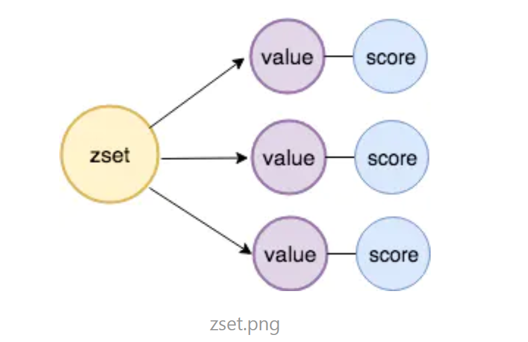
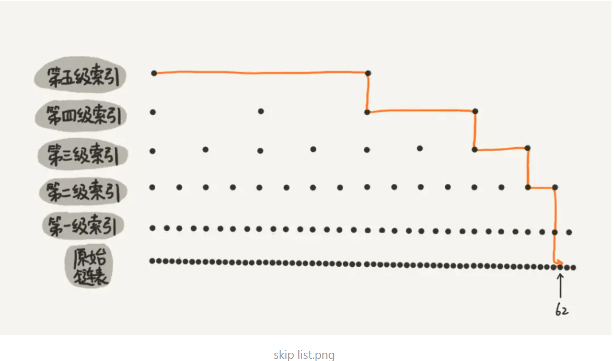
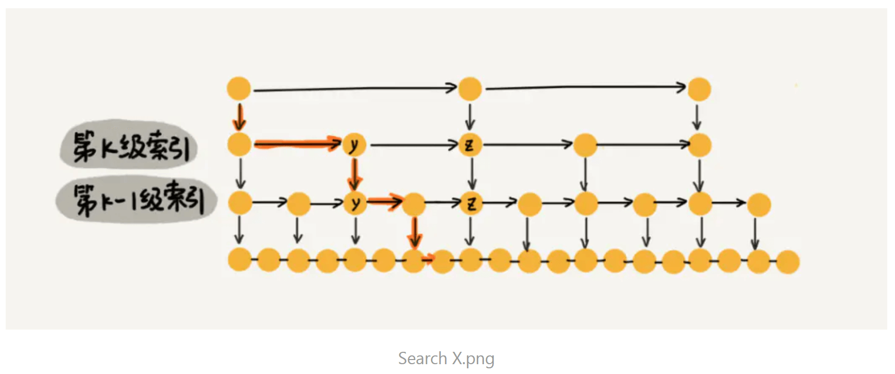
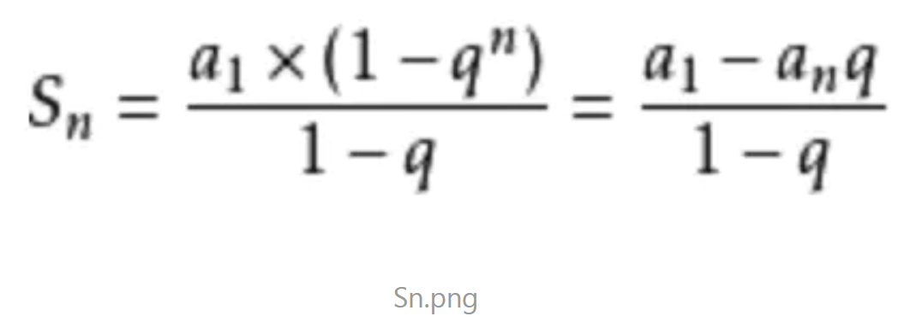

先想一想为什么有序集合需要用跳表实现？回忆一下有序集合的几个关键词：
是SortedSet和HashMap的结合；value具有唯一性；多了一个score；支持范围查询，结构如下：

下面我决定针对zset的功能分析对应的造就这种功能所需的底层结构。
**功能一**：zset支持快速插入和删除
**对应的解决思路**：针对快速插入和删除，有没有想到什么？首选肯定是链表，所以，底层基础得有一个value和score组成的node连接起来的链表。
**功能二**：zset有序且支持范围查询，且是的
**对应的解决思路**：有序这个条件，我们可以先让链表按照顺序排列，但查找来说，链表的查询时间复杂度为O(n)，并不高效，还要满足范围查找，如何解决这个问题？那么这时候就想到，能不能给链表做一个索引，提高它的查找效率的同时，让它也能支持范围查找，构建索引的话，是为了提高效率，如果只构建一层索引，数据量小的时候无所谓，但数据量大的时候呢？好像无法起到根本上提升效率的作用，所以应该给链表添加多级索引，简单示意图如下所示（引用自极客时间王争）：

以上这种链表加多级索引的结构，就是跳表。

 

#### 跳表查询时间复杂度：

有n个结点的链表，假设每两个链表构建一个索引，那么：
第一级索引个数为：n/2；
第二级索引个数为：n/4；
···
第h级索引个数为：n/2^h；
现在假设最后一级索引的个数为2 ，则h +1 = logn，算上最底下的一层链表，那么这个跳表的高度H= logn。
当我们要查找跳表里的一个数时，参考图如下：

在图里，我们想查找x，在第k级，遍历到y结点，发现x大于y，但x小于y后面的结点z，所以先顺着y往下到第k-1级，发现y，z之间有三个节点，所以我们在k-1级索引中，遍历3个节点找到x，以此类推，在每一层需要通过3个节点找目标数，那么总的时间复杂度就为O(3*logn)，因为3是常数，所以最后的时间复杂度为O(logn)。
这一结构相当于让跳表实现了二分查找，只是建立这么多的索引是否会浪费空间呢？我们来看一下跳表的空间复杂度。

#### 跳表的空间复杂度：

还是回到刚刚的例子，我们可以发现，链表上的索引数目按第一层，第二层，···，倒数第二层，最后一层的顺序排列下来分别为：n/2，n/4，···，4，2，观察到了吗？就是一个等比数列，计算该跳表的空间复杂度，相当于给等比数列求和，高中数学都快忘完了，网上求得一个等比数列求和公式，放在这里：

顺着公式依次带入：a1=n/2，an= 2，q=1/2，求得Sn= n-2，所以空间复杂度为O(n)，与此同时，我们顺便考虑一下每三个节点抽取一个索引的情况，还是依据刚刚的思路，发现Sn= n-1/2，空间复杂度将近缩减了一半。
总之，跳表就是空间换时间的那个思路，但如果链表中存储的对象很大时，其实索引占用的这些空间对整个来说是可以忽略不计的。

#### 跳表的高效插入和删除：

##### 插入

  之前就说了，之所以选用链表作为底层结构支持，也是为了高效地动态增删。单链表在知道删除的节点是谁时，时间复杂度为O(1)，因为跳表底层的单链表是有序的，为了维护这种有序性，在插入前需要遍历链表，找到该插入的位置，单链表遍历查找的时间复杂度是O(n)，同理可得，跳表的遍历也是需要遍历索引数，所以是O(logn)。

##### 删除

  删除的节点要分两种情况，如果该节点还在索引中，那删除时不仅要删除单链表中的节点，还要删除索引中的节点；另一种情况是删除的节点只在链表中，不在索引中，那只需要删除链表中的节点即可。但针对单链表来说，删除时都需要拿到前驱节点才可改变引用关系从而删除目标节点。

#### 跳表的动态更新：

跳表更新时有一个不能忽视的重要问题，如果在单链表的两个节点之间一直插入，会导致跳表退化成单链表，就像平衡二叉树和红黑树一样，跳表在这样的插入操作下，也是需要一些调整来维持高效的结构的：
  跳表通过“随机函数”来维护前面的“高效性”，具体的操作是：往跳表中插入数据a时，通过随机函数生成一个随机数h，a插入单链表的同时，在第1级到第h级中也同时插入索引a。随机函数不是乱选的，要能保证索引的大小及跳表的平衡性，防止它退化成单链表的窘境。跳表的实现有点复杂，所以在此不再赘述。

#### 跳表小结：

1. 查找、插入、删除数据效率OK。
2. 支持区间范围查找[100,356]。
3. 迭代输出有序数据。
     说到这里，让我想起来，我们之前在二叉树里讲过的红黑树，让我们在此对跳表和红黑树做一个对比：
4. 跳表和红黑树的查找、插入、删除性能跟跳表不相上下（时间复杂度一致），也可以迭代输出有序数据。
5. 红黑树无法支持区间查找。跳表花费O(logn)的时间复杂度，相当于在单链表中定位到一个起始节点，之后沿着链表往后顺序遍历即可。
6. 跳表代码更容易实现，可读性好不易出错。
7. 跳表更加灵活，可以通过改变索引构建策略，有效平衡执行效率和内存消耗。
8. 红黑树诞生的早，所以数据结构中类似map的结构都依赖红黑树；跳表没有现成能拿来用的，所以如果应用中需要用到跳表，需要自己实现。