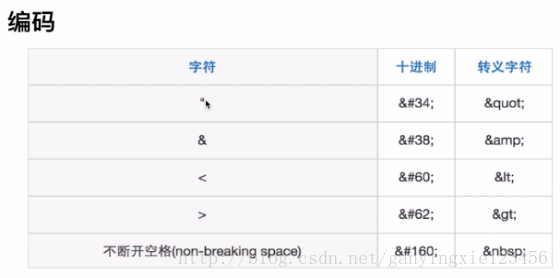

1-

### XSS的定义

跨站脚本攻击(Cross Site Scripting)，缩写为XSS。恶意攻击者往Web页面里插入恶意Script代码，当用户浏览该页之时，嵌入其中Web里面的Script代码会被执行，从而达到恶意攻击用户的目的。

### 2. XSS的原理

攻击者对含有漏洞的服务器发起XSS攻击（注入JS代码）。
诱使受害者打开受到攻击的服务器URL。
受害者在Web浏览器中打开URL，恶意脚本执行。

### 3. XSS的攻击方式

（1）反射型： 发出请求时，XSS代码出现在URL中，作为输入提交到服务器端，服务器端解析后响应，XSS随响应内容一起返回给浏览器，最后浏览器解析执行XSS代码，这个过程就像一次发射，所以叫反射型XSS。
（2）存储型: 存储型XSS和反射型的XSS差别就在于，存储型的XSS提交的代码会存储在服务器端（数据库，内存，文件系统等），下次请求目标页面时不用再提交XSS代码。

### 4. XSS的防御措施

（1）编码：对用户输入的数据进行HTML Entity编码 

（2）过滤：移除用户上传的DOM属性，如onerror等，移除用户上传的style节点，script节点，iframe节点等。
（3）校正：避免直接对HTML Entity编码，使用DOM Prase转换，校正不配对的DOM标签。

strip_tags()

PHP直接输出html的，可以采用以下的方法进行过滤：
1.htmlspecialchars函数
2.htmlentities函数
3.HTMLPurifier.auto.php插件
4.RemoveXss函数（百度可以查到）

PHP输出到JS代码中，或者开发Json API的，则需要前端在JS中进行过滤：
1.尽量使用innerText(IE)和textContent(Firefox),也就是jQuery的text()来输出文本内容
2.必须要用innerHTML等等函数，则需要做类似php的htmlspecialchars的过滤（参照@eechen的答案）

其它的通用的补充性防御手段
1.在输出html时，加上Content Security Policy的Http Header
（作用：可以防止页面被XSS攻击时，嵌入第三方的脚本文件等）
（缺陷：IE或低版本的浏览器可能不支持）
2.在设置Cookie时，加上HttpOnly参数
（作用：可以防止页面被XSS攻击时，Cookie信息被盗取，可兼容至IE6）
（缺陷：网站本身的JS代码也无法操作Cookie，而且作用有限，只能保证Cookie的安全）
3.在开发API时，检验请求的Referer参数
（作用：可以在一定程度上防止CSRF攻击）
（缺陷：IE或低版本的浏览器中，Referer参数可以被伪造）