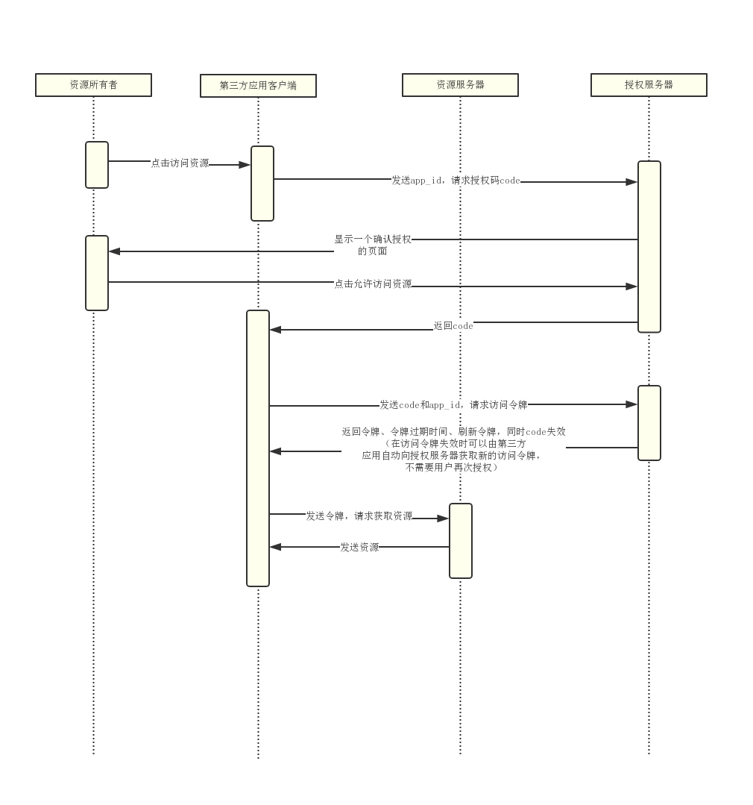

密码模式（resource owner password credentials）

授权码模式（authorization code）

简化模式（implicit）

客户端模式（client credentials）

## 密码模式（`resource owner password credentials`）

- 这种模式是最不推荐的，因为client可能存了用户密码
- 这种模式主要用来做遗留项目升级为oauth2的适配方案
- 当然如果client是自家的应用，也是可以
- 支持refresh token

## 授权码模式（`authorization code`）

- 这种模式算是正宗的oauth2的授权模式
- 设计了auth code，通过这个code再获取token
- 支持refresh token

## 简化模式（`implicit`）

- 这种模式比授权码模式少了code环节，回调url直接携带token
- 这种模式的使用场景是基于浏览器的应用
- 这种模式基于安全性考虑，建议把token时效设置短一些
- 不支持refresh token

## 客户端模式（`client credentials`）

- 这种模式直接根据client的id和密钥即可获取token，无需用户参与
- 这种模式比较合适消费api的后端服务，比如拉取一组用户信息等
- 不支持refresh token，主要是没有必要

> refresh token的初衷主要是为了用户体验不想用户重复输入账号密码来换取新token，因而设计了refresh token用于换取新token

> 这种模式由于没有用户参与，而且也不需要用户账号密码，仅仅根据自己的id和密钥就可以换取新token，因而没必要refresh token

## 小结

- 密码模式（resource owner password credentials）(`为遗留系统设计`)(`支持refresh token`)
- 授权码模式（authorization code）(`正宗方式`)(`支持refresh token`)
- 简化模式（implicit）(`为web浏览器应用设计`)(`不支持refresh token`)
- 客户端模式（client credentials）(`为后台api服务消费者设计`)(`不支持refresh token`)

## 一、理解什么是OAuth2

是开放授权的一个标准，允许用户授权B应用不提供帐号密码的方式去访问该用户在A应用服务器上的某些特定资源。
 *例子：咕咚app通过微信号方式登录，获取到用户的微信名和微信头像等资料。*

## 二、OAuth2四种授权模式

#### 2.1 授权码模式

授权码模式（authorization code）是功能最完整、流程最严密的授权模式，code保证了token的安全性，即使code被拦截，由于没有app_secret，也是无法通过code获得token的。

###### 2.1.1 角色行为与功能

- 资源所有者
   只需要允许或拒绝第三方应用获得授权
- 第三方应用
   申请成为资源服务器的第三方应用
   获取资源服务器提供的资源
- 授权服务器
   提供授权许可code、令牌token等
- 资源服务器
   提供给第三方应用注册接口，需要提供给第三方应用app_id和app_secret
   提供给第三方应用开放资源的接口

###### 2.1.2 授权码模式授权方式顺序图

#### 2.2隐式授权模式/简化模式

和授权码模式类似，只不过少了获取code的步骤，是直接获取令牌token的，适用于公开的浏览器单页应用，令牌直接从授权服务器返回，不支持刷新令牌，且没有code安全保证，令牌容易因为被拦截窃听而泄露。

#### 2.3密码模式

使用用户名/密码作为授权方式从授权服务器上获取令牌，一般不支持刷新令牌。

#### 2.4客户端凭证模式

一般用于资源服务器是应用的一个后端模块，客户端向认证服务器验证身份来获取令牌。