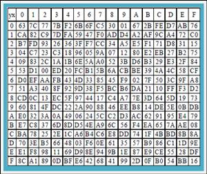

**一、对称加密算法** 

   指加密和解密使用相同密钥的加密算法。对称加密算法用来对敏感数据等信息进行加密，常用的算法包括DES、3DES、AES、DESX、Blowfish、、RC4、RC5、RC6。

   **DES（Data Encryption Standard）**：数据加密标准，速度较快，适用于加密大量数据的场合。
   **3DES（Triple DES）**：是基于DES，对一块数据用三个不同的密钥进行三次加密，强度更高。
   **AES（Advanced Encryption Standard）**：高级加密标准，是下一代的加密算法标准，速度快，安全级别高；

**二、非对称加密算法**

   指加密和解密使用不同密钥的加密算法，也称为公私钥加密。假设两个用户要加密交换数据，双方交换公钥，使用时一方用对方的公钥加密，另一方即可用自己的私钥解密。常见的非对称加密算法：RSA、DSA（数字签名用）、ECC（移动设备用）、Diffie-Hellman、El Gamal。

​    **RSA：**由 RSA 公司发明，是一个支持变长密钥的公共密钥算法，需要加密的文件块的长度也是可变的；
​    **DSA（Digital Signature Algorithm）**：数字签名算法，是一种标准的 DSS（数字签名标准）；
​    **ECC（Elliptic Curves Cryptography）**：椭圆曲线密码编码学。

  ECC和RSA相比，在许多方面都有对绝对的优势，主要体现在以下方面：
（1）抗攻击性强。相同的密钥长度，其抗攻击性要强很多倍。
（2）计算量小，处理速度快。ECC总的速度比RSA、DSA要快得多。
（3）存储空间占用小。ECC的密钥尺寸和系统参数与RSA、DSA相比要小得多，意味着它所占的存贮空间要小得多。这对于加密算法在IC卡上的应用具有特别重要的意义。
（4）带宽要求低。当对长消息进行加解密时，三类密码系统有相同的带宽要求，但应用于短消息时ECC带宽要求却低得多。带宽要求低使ECC在无线网络领域具有广泛的应用前景。

 

**三、散列算法（Hash算法---单向加密算法）**
    散列是信息的提炼，通常其长度要比信息小得多，且为一个固定长度。加密性强的散列一定是不可逆的，这就意味着通过散列结果，无法推出任何部分的原始信息。任何输入信息的变化，哪怕仅一位，都将导致散列结果的明显变化，这称之为雪崩效应。散列还应该是防冲突的，即找不出具有相同散列结果的两条信息。具有这些特性的散列结果就可以用于验证信息是否被修改。

​    **Hash算法：**特别的地方在于它是一种单向算法，用户可以通过Hash算法对目标信息生成一段特定长度的唯一的Hash值，却不能通过这个Hash值重新获得目标信息。因此Hash算法常用在不可还原的密码存储、信息完整性校验等。

单向散列函数一般用于产生消息摘要，密钥加密等，常见的Hash算法：MD2、MD4、MD5、HAVAL、SHA、SHA-1、HMAC、HMAC-MD5、HMAC-SHA1。

​    **MD5（Message Digest Algorithm 5）：**是RSA数据安全公司开发的一种单向散列算法，非可逆，相同的明文产生相同的密文。
​    **SHA（Secure Hash Algorithm）：**可以对任意长度的数据运算生成一个160位的数值；

​    **SHA-1与MD5的比较**
因为二者均由MD4导出，SHA-1和MD5彼此很相似。相应的，他们的强度和其他特性也是相似，但还有以下几点不同：
（1）对强行供给的安全性：最显著和最重要的区别是SHA-1摘要比MD5摘要长32 位。使用强行技术，产生任何一个报文使其摘要等于给定报摘要的难度对MD5是2^(128)数量级的操作，而对SHA-1则是2^(160)数量级的操作。这样，SHA-1对强行攻击有更大的强度。
（2）对密码分析的安全性：由于MD5的设计，易受密码分析的攻击，SHA-1显得不易受这样的攻击。
速度：在相同的硬件上，SHA-1的运行速度比MD5慢。

 

**四、 加密算法的选择**

1.由于非对称加密算法的运行速度比对称加密算法的速度慢很多，当我们需要加密大量的数据时，建议采用对称加密算法，提高加解密速度。
2.对称加密算法不能实现签名，因此签名只能非对称算法。
3.由于对称加密算法的密钥管理是一个复杂的过程，密钥的管理直接决定着他的安全性，因此当数据量很小时，我们可以考虑采用非对称加密算法。
4.在实际的操作过程中，我们通常采用的方式是：采用非对称加密算法管理对称算法的密钥，然后用对称加密算法加密数据，这样我们就集成了两类加密算法的优点，既实现了加密速度快的优点，又实现了安全方便管理密钥的优点。

​     那采用多少位的密钥呢？

​     RSA建议采用1024位的数字，ECC建议采用160位，AES采用128为即可。

> 1、DES
> 已破解，不再安全，基本没有企业在用了
> 是对称加密算法的基石，具有学习价值
> 密钥长度56（JDK）、56/64（BC）
> 2、DESede（三重DES）
> 早于AES出现来替代DES
> 计算密钥时间太长、加密效率不高，所以也基本上不用
> 密钥长度112/168（JDK）、128/192（BC）
> 3、AES
> 最常用的对称加密算法
> 密钥建立时间短、灵敏性好、内存需求低（不管怎样，反正就是好）
> 实际使用中，使用工作模式为CTR（最好用BC去实现），此工作模式需要引入IV参数（16位的字节数组）
> 密钥长度128/192/256，其中192与256需要配置无政策限制权限文件（JDK6）
> 填充模式最常用的两种PKCS5Padding和PKCS7Padding，其中后者只有BC独有。
> 4、IDEA
> 常用的电子邮件加密算法
> 工作模式只有ECB
> 密钥长度128位
> 5、PBE
> 综合了消息摘要算法和对称加密算法，最常见的是PBEWithMD5AndDES
> 工作模式只有CBC（已丧失安全性，不推荐使用），所以PBE也不推荐使用了

常见加密算法 ：

DES（Data Encryption Standard）：数据加密标准，速度较快，适用于加密大量数据的场合； 

3DES（Triple DES）：是基于DES，对一块数据用三个不同的密钥进行三次加密，强度更高；

RC2和 RC4：用变长密钥对大量数据进行加密，比 DES 快；

IDEA（International Data Encryption Algorithm）国际数据加密算法：使用 128 位密钥提供非常强的安全性；

RSA：由 RSA 公司发明，是一个支持变长密钥的公共密钥算法，需要加密的文件块的长度也是可变的；

DSA（Digital Signature Algorithm）：数字签名算法，是一种标准的 DSS（数字签名标准）；

AES（Advanced Encryption Standard）：高级加密标准，是下一代的加密算法标准，速度快，安全级别高，目前 AES 标准的一个实现是 Rijndael 算法；

BLOWFISH，它使用变长的密钥，长度可达448位，运行速度很快； 

其它算法，如ElGamal、Deffie-Hellman、新型椭圆曲线算法ECC等。 比如说，MD5，你在一些比较正式而严格的网站下的东西一般都会有MD5值给出，如安全焦点的软件工具，每个都有MD5。严格来说MD5并不能算是一种加密算法，只能说是一种摘要算法（数据摘要算法是密码学算法中非常重要的一个分支，它通过对所有数据提取指纹信息以实现数据签名、数据完整性校验等功能，由于其不可逆性，有时候会被用做敏感信息的加密。数据摘要算法也被称为哈希([Hash](http://baike.so.com/doc/6570886-6784648.html))算法、散列算法。）

MD5分类：

1、CRC8、CRC16、CRC32

[CRC](http://baike.so.com/doc/5412355-5650481.html)(Cyclic Redundancy Check，循环冗余校验)算法出现时间较长，应用也十分广泛，尤其是通讯领域，现在应用最多的就是 CRC32 算法，它产生一个4字节(32位)的校验值，一般是以8位十六进制数，如FA 12 CD 45等。CRC算法的优点在于简便、速度快，严格的来说，CRC更应该被称为[数据校验](http://baike.so.com/doc/741565-784957.html)算法，但其功能与数据摘要算法类似，因此也作为测试的可选算法。

在 WinRAR、WinZIP 等软件中，也是以 CRC32 作为[文件校验](http://baike.so.com/doc/102128-107784.html)算法的。一般常见的简单文件校验(Simple File Verify – SFV)也是以 CRC32算法为基础，它通过生成一个后缀名为 .SFV 的文本文件，这样可以任何时候可以将文件内容 [CRC32](http://baike.so.com/doc/6840594-7057869.html)运算的结果与 .SFV 文件中的值对比来确定此文件的完整性。

与 SFV 相关工具软件有很多，如MagicSFV、MooSFV等。

2、MD2 、MD4、[MD5](http://baike.so.com/doc/7185663-7409786.html)

这是应用非常广泛的一个算法家族，尤其是 MD5(Message-Digest Algorithm 5，消息摘要算法版本5)，它由MD2、MD3、MD4发展而来，由Ron Rivest(RSA公司)在1992年提出，被广泛应用于数据完整性校验、数据(消息)摘要、数据加密等。MD2、MD4、MD5 都产生16字节(128位)的校验值，一般用32位十六进制数表示。MD2的算法较慢但相对安全，MD4速度很快，但安全性下降，MD5比MD4更安全、速度更快。

在互联网上进行大文件传输时，都要得用MD5算法产生一个与文件匹配的、存储MD5值的文本文件(后缀名为 .md5或.md5sum)，这样接收者在接收到文件后，就可以利用与 SFV 类似的方法来检查文件完整性，绝大多数大型软件公司或开源组织都是以这种方式来校验数据完整性，而且部分操作系统也使用此算法来对用户密码进行加密，另外，它也是目前计算机犯罪中数据取证的最常用算法。

与MD5 相关的工具有很多，如 WinMD5等。

3、SHA1、SHA256、SHA384、SHA512

SHA(Secure Hash Algorithm)是由美国专门制定密码算法的标准机构-- 美国国家标准技术研究院(NIST)制定的，SHA系列算法的摘要长度分别为:SHA为20字节(160位)、SHA256为32字节(256位)、 SHA384为48字节(384位)、SHA512为64字节(512位)，由于它产生的数据摘要的长度更长，因此更难以发生碰撞，因此也更为安全，它是未来数据摘要算法的发展方向。由于SHA系列算法的数据摘要长度较长，因此其运算速度与MD5相比，也相对较慢。

SHA1的应用较为广泛，主要应用于CA和数字证书中，另外在互联网中流行的BT软件中，也是使用SHA1来进行文件校验的。

4、RIPEMD、PANAMA、TIGER、ADLER32 等

[RIPEMD](http://baike.so.com/doc/2490194-2631617.html)是Hans Dobbertin等3人在对MD4，MD5缺陷分析基础上，于1996年提出来的，有4个标准128、160、256和320，其对应输出长度分别为16字节、20字节、32字节和40字节。

TIGER由Ross在1995年提出。Tiger号称是最快的[Hash](http://baike.so.com/doc/6570886-6784648.html)算法，专门为64位机器做了优化。

常用的加密算法有对称加密和非对称加密两大类型：

**对称加密**

简介：

对称加密(也叫[私钥](http://baike.so.com/doc/5284811-5519118.html)加密)指加密和解密使用相同[密钥](http://baike.so.com/doc/4918532-5137444.html)的加密算法。有时又叫传统密码算法，就是加密[密钥](http://baike.so.com/doc/4918532-5137444.html)能够从解密密钥中推算出来，同时解密密钥也可以从加密密钥中推算出来。而在大多数的对称算法中，加密[密钥](http://baike.so.com/doc/4918532-5137444.html)和解密密钥是相同的，所以也称这种加密算法为秘密密钥算法或单密钥算法。它要求发送方和接收方在安全通信之前，商定一个[密钥](http://baike.so.com/doc/4918532-5137444.html)。对称算法的安全性依赖于[密钥](http://baike.so.com/doc/4918532-5137444.html)，泄漏密钥就意味着任何人都可以对他们发送或接收的消息解密，所以密钥的保密性对通信性至关重要。

特点：

对称加密算法的特点是算法公开、计算量小、加密速度快、加密效率高。

不足之处是，交易双方都使用同样钥匙，安全性得不到保证。此外，每对用户每次使用对称加密算法时，都需要使用其他人不知道的惟一钥匙，这会使得发收信双方所拥有的钥匙数量呈几何级数增长，[密钥管理](http://baike.so.com/doc/5571847-5787021.html)成为用户的负担。对称加密算法在分布式网络系统上使用较为困难，主要是因为[密钥管理](http://baike.so.com/doc/5571847-5787021.html)困难，使用成本较高。而与[公开密钥](http://baike.so.com/doc/296087-313468.html)加密算法比起来，对称加密算法能够提供加密和认证却缺乏了签名功能，使得使用范围有所缩小。在计算机专网系统中广泛使用的对称加密算法有DES和IDEA等。美国国家标准局倡导的AES即将作为新标准取代DES。

具体算法：[DES算法](http://baike.so.com/doc/5447735-5686103.html)，[3DES](http://baike.so.com/doc/5438357-5676675.html)算法，TDEA算法，[Blowfish](http://baike.so.com/doc/7724882-7998977.html)算法，[RC5](http://baike.so.com/doc/2680275-2830191.html)算法，IDEA算法。

原理应用：对称加密算法的优点在于加解密的高速度和使用长[密钥](http://baike.so.com/doc/4918532-5137444.html)时的难破解性。假设两个用户需要使用对称加密方法加密然后交换数据，则用户最少需要2个[密钥](http://baike.so.com/doc/4918532-5137444.html)并交换使用，如果企业内用户有n个，则整个企业共需要n×(n-1) 个密钥，密钥的生成和分发将成为企业信息部门的恶梦。对称加密算法的安全性取决于加密[密钥](http://baike.so.com/doc/4918532-5137444.html)的保存情况，但要求企业中每一个持有密钥的人都保守秘密是不可能的，他们通常会有意无意的把密钥泄漏出去--如果一个用户使用的密钥被入侵者所获得，入侵者便可以读取该用户密钥加密的所有文档，如果整个企业共用一个加密密钥，那整个企业文档的保密性便无从谈起。

对称加密算法中最经典的算法莫过于DES加密算法。DES加密采用的是分组加密的方法，使用56位密钥加密64位明文，最后产生64位密文。DES算法的基本流程如图6-2所示。

图6-2 DES加密算法基本流程

现在对图6-2的整个流程做简要的分析。DES对64位的明文分组M进行操作，M经过一个初始置换IP置换成m0，将m0明文分成左半部分和右半部分m0=（L0,R0），各32位长。然后进行16轮完全相同的运算，这些运算称为函数f，在运算过程中，数据与密匙结合。经过16轮运算之后，可以看到第16轮运算，将右侧第15轮运算的结果（R15）作为左侧运算的最终结果（L16），而右侧最后的结果（R16）为左侧第15轮运算结果（L15）和函数f运算结果的异或运算所得。此后，再将左、右部分合在一起经过一个逆置换，输出密文。

实际加密过程要分成两个同时进行的过程，即加密过程和密钥生成过程，如图6-3所示。结合图6-2和图6-3简单讲解密钥生成过程。

 

图6-3 加密与密钥生成

如图6-3所示，在16轮循环的每一轮中，密匙位移位，然后再从密匙的64位中选出48位。通过一个扩展置换将数据的右半部分扩展成48位，并通过一个异或操作替代成新的32位数据，在将其置换一次。这四步运算构成了图6-2中的函数f。然后，通过另一个异或运算，函数f的输出与左半部分结合，其结果成为新的右半部分，原来的右半部分成为新的左半部分。该操作重复16次。

DES算法的解密过程和加密过程几乎完全相同，只是使用密钥的顺序相反。

关于DES算法的更加详细的细节不在本书的讲解范围之内，请读者参考相关资料。

NIST（National Institute of Standards and Technology，美国国家标准技术研究院）在1999年发布了新的DES加密标准，3DES取代DES成为新的加密标准。3DES采用168位的密钥，三重加密，但速度较慢。之后，又出现了AES（Advanced Encryption Standard，先进加密标准）等高级对称机密算法。

## TripleDES加密算法

由于DES算法安全性方面的原因，为了提高DES算法的抗攻击性，因此提出了Triple-DES算法。

Triple-DES算法的基本原理是：用两个密钥对数据进行3次加密/解密运算。即首先使用第一个密钥对数据进行加密，然后用第二个密钥对其进行解密，最后用第一个密钥再加密。这两个密钥可以是同一个，也可以不同，它们也可以来源于一个128位密钥，只是在加密/解密时将其分割成两个64位的密钥，分别轮换使用这两个64位密钥去完成加密/解密运算。Triple-DES算法保留了DES算法运算速度快的特点，通过增加运算次数和密钥长度（两个64位密钥相当于128位密钥）来增加破解者的破解时间，但是从密码学本身来说，其安全强度并没有增加。

## RC系列算法

现在我们用到的RC系列算法包括RC2、RC4、RC5、RC6算法，其中RC4是序列密码算法，其他三种是分组密码算法。

（1） RC2算法

该算法设计的目的是用来取代DES算法，它采用密钥长度可变的对明文采取64位分组的分组加密算法，属于Festel网络结构。

（2） RC4算法

该算法是一个密钥长度可变的面向字节流的加密算法，以随机置换为基础。该算法执行速度快，每输出1字节的结果仅需要8~16字节的机器指令。RC4算法比较容易描述，它首先用8~2048位可变长度的密钥初始化一个256字节的状态矢量S。S的成员标记为S[0],S[1]，…，S[255]，整个置换过程都包含0～255的8比特数。对于加密和解密，设字节数据为K，由S中256个元素按一定方式选出一个元素生成，每生成一个K值，元素中的数据就要被重新置换一次。RC4初始化的伪代码如代码清单6-1所示。

代码清单6-1 RC4初始化的伪代码

for i=0 to 255

{

 S[i]=i;

 T[i]=K[i mod KeyLen ];

}

j=0;

for i=0 to 255

{

 j=(j+T[i]+S[i]) mod 256;

swap(S[i],S[j];

}

如代码清单6-1所示，初始化开始时，S的元素按从0到255依次赋值，同时建立一个临时矢量T。如果密钥K的长度为256字节，则将K赋值给T。否则，若密钥长度为KeyLen字节，则将K的值赋给T的前KeyLen个元素，并循环重复用K余下的元素赋给T剩下的元素。从“j=0”开始，用T产生S的初始置换。从S[0]~S[255]，对每个S[i]根据T[i]确定的方案，将S[i]置换成S中的另一字节。

在完成S的初始化之后，输入密钥将被抛弃，接下来将使用密钥流，生成密钥流的伪代码如代码清单6-2所示。

代码清单6-2 生成密钥流

i=0；

j=0；

while（true）

{

  i=(i+1) mod 256;

  j=(j+S[i]) mod 256;

  swap(S[i],j[i];

  T=(S[i]+S[j]) mod 256;

  K=S[T];

}

如代码清单6-2所示，密钥流的生成是从S[0]到S[255]，对每个S[i]根据当前S的值将S[i]与S中的另一字节替换，当S[255]完成置换后操作继续重复。在加密过程中将K的值与下一明文字节异或，解密过程中将K的值与下一密文字节异或即可。

（3） RC5算法

该算法是一种分组长度、密钥长度、加密迭代轮数都可变的分组加密算法。该算法主要包含三部分内容：密钥扩展、加密算法和解密算法。该算法包含三个参数：w（字的长度，单位：位）、r（迭代次数）、b（密钥长度，单位：字节）。由于RC5算法需要（2r+2）个w位密钥，所以需要密钥扩展。

通过密钥扩展，把密钥K扩展成密钥阵S，它由K所决定的t=2（r+1）个随机二进制字构成。密钥扩展算法利用了两个幻常数：

Pw=Odd（（e-2）2w）[1]

Qw=Odd（（Φ-1）2w）[2]

函数Odd（x）的结果为与x最近的奇整数。密钥扩展的第一步是将密钥K转换成字格式，利用K的各字节构造字阵L。密钥扩展的第二步是利用模232线性同余算法初始化S阵。密钥扩展的第三步是L阵和S阵混合。

加密过程也很简单。假设选用的数据分组长度为2w位（w允许的值有16、32和64），迭代次数为r轮（r为0～255）。首先将明文划分成两个w位的字A和B，运算过程如代码清单6-3所示。

代码清单6-3 RC5算法加密过程

A=A+S0;

B=B+S1;

for i=1 to r

{

 A=（（A+B）<<<B））+S2i;

 B= ((B+A) <<<A)) +S2i+1;

}

代码清单6-3的结果输出到寄存器A和B中。

解密过程是加密过程的逆运算，基本过程如代码清单6-4所示。

代码清单6-4 RC5算法解密过程

for i=r down to 1

{

 B=((B- S2i+1)>>>A)+A;

 A=((A- S2i)>>>B)+B;

}

B=B-S1;

A=A-S0;

**说明** 加密和解密过程中的加减都是模2w的，表示逐位异或。<<<表示循环左移，>>>表示循环右移。

（4） RC6算法

RC6秉承了RC5设计简单、广泛使用数据相关的循环移位思想，同时增强了抵抗攻击的能力，改进了RC5中循环移位的位数依赖于寄存器中所有位的不足。

RC6的特点是输入的明文由原先2个区块扩展为4个区块，另外，在运算方面则是使用了整数乘法，而整数乘法的使用则在每一个运算回合中增加了扩散（diffusion）的行为，并且使得即使很少的回合数也有很高的安全性。同时，RC6中所用的操作可以在大部分处理器上高效率地实现，提高了加密速度。RC6是一种安全、架构完整而且简单的区块加密法。它提供了较好的测试结果和参数方面相当大的弹性。RC6可以抵抗所有已知的攻击，能够提供AES所要求的安全性，可以说是近几年来相当优秀的一种加密法。

## Rijndael算法

Rijndael是一个反复运算的加密算法，它允许可变动的数据区块及密钥的长度。数据区块与密钥长度的变动是各自独立的。

在Rijndael算法中定义了两个名词：

1)    State：在运算过程中所产生的中间值，是一个4×Nb的矩阵，Nb可由数据长度除以32位求得，也就是把数据分割成Nb个区块。

2)    Cipher Key：用来做加密运算的密钥，形式是一个4×Nk的矩阵，Nk可由金钥长度除以32位求得，也就是把密钥分割成Nk个32位的子密钥。

在Rijndael算法中，运算的回合数（Nr）是由Nb及Nk决定的，回合数的变动定义如表6-1所示。

​        表6-1 Rijndael算法回合变动定义

| Nr   | Nb=4 | Nb=6 | Nb=8 |
| ---- | ---- | ---- | ---- |
| Nk=4 | 10   | 12   | 14   |
| Nk=6 | 12   | 12   | 14   |
| Nk=8 | 14   | 14   | 14   |

在Rijndael中使用了许多字节层级的运算，而这些运算是以GF（28）为基础架构。也有一些采用了4-byte的字组运算。各种运算的定义如下：

##### （1） GF（28）的定义

假设一个字节b由b7b6b5b4b3b2b1b0组成，可以把这些bi想象成一个7次多项式的系数，而这些系数不是0就是1：

b7 x7+ b6 x6+ b5 x5+ b4 x4+ b3 x3+ b2 x2+ b1 x + b0

例如，（57）16的二进制表示法为（0101,0111）2，表示成多项式，则为：

x6+ x4+ x2+ x + 1

##### （2）加法

两个多项式的加法，则是定义为相同指数项的系数和再模2，简单地说，就是作EXOR运算（1+1=0）。例如：

（57）16+（83）16=（01010111）2+（10000011）2 = （11010100）2 = （D4）16

或是

（x6+x4+x2+x+1）+（x7+x+1）=x7+x6+x4+x2

##### （3）乘法

在乘法运算中，多项式相乘之后的结果很容易造成溢位的问题，解决溢位的方式是把相乘的结果，再模余一个不可分解的多项式m（x）。在Rijndael中，定义一个这样的多项式为m（x）=x8+x4+x3+x+1或是（11B）16例如：

（57）16‧（83）16

 =（x6+ x4+ x2+ x + 1）‧（x7+ x + 1）

 =x13+ x11+ x9+ x8+ x7+x7+ x5+ x3+ x2+x+x6+ x4+ x2+ x + 1

=（x13+x11+x9+x8+x6+x5+x4+x3+1+x13+x11+x9+x8+x6+x5+x4+x3+1）mod（x8+x4+x3+x+1）

= x7+ x6+ 1

=（C1）16

##### （4）乘以X

若把b（x）乘以x，得到

b7 x8+ b6 x7+ b5 x6+ b4 x5+ b3 x4+ b2 x3+ b1 x2 + b0x

若b7=0，不会发生溢位问题，答案即是正确的；若b7=1，发生溢位问题，必须减去m（x）。可以把这种运算表示为xtime（x），其运算方式为left shift（若溢位则和（1B）16做EXOR运算），例如：

 ‘57’· ‘13’ = ‘FE’

‘57’ · ‘02’ = xtime(57) = ‘AE’

‘57’ · ‘04’ = xtime(AE) = ‘47’

‘57’ · ‘08’ = xtime(47) = ‘8E’

‘57’ · ‘10’ = xtime(8E) = ‘07’

‘57’ · ‘13’ = ‘57’ · (‘01’⊕‘02’⊕‘10’) = ‘57’⊕‘AE’⊕‘07’ = ‘FE’

Rijndael算法分为四个步骤：

**步骤 1** 字节转换。

字节转换是一个以字节为单位的非线性取代运算，取代表（S-box）是经过2个运算过程而建立，并且是可逆的。首先找出每个字节在GF（28）中的乘法反元素；接着经过1个仿射（Affine）转换运算，转换运算的定义如图6-4所示。

图6-4 转换运算定义

取代表生成之后就可以进行字节取代运算。取代运算的示意图如图6-5所示。

图6-5 取代运算示意图

进行如图6-5的取代运算之后，结果如图6-6所示。

图6-6 取代运算后的S-Box

**说明** 字节取代转换的反运算：计算仿射对应之后的相反运算可得到S-1-box，以此S-1-box做字节取代（Subbytes）即可。

**步骤 2** 移行转换。

在这个转换中，State的每一行以不同的偏移量做环状位移：第0 行不动，第1 行位移1 C个字节，第2 行位移2 C个字节，第3 行位移3 C个字节。位移的偏移量C1，C2，C3跟区块的数目（Nb）有关，关系见图6-7。

 

图6-7 C1、 C2、 C3与区块数目（Nb）的关系

移行转换（Shift rows）运算对于State 的影响如图6-8所示。

图6-8 移行转换对State的影响

**说明** 移行转换的反运算：对第2、第3 及第4 行做Nb-C1、、Nb-C2、Nb-C3个字节的环状位移即可。

**步骤 3** 混列转换。

在这个转换中，把State当做一个GF（28）中的多项式。并且对一个固定的多项式C（X）作乘法，如果发生溢位，则再模X4 +1. 表示如下：

C（X） ='03' X3 +'01' X2 +'01' X +'02'

C（X）与X4 +1互质，令

B（X） = C（X）⊕ A（X）

以矩阵乘法表示如图6-9所示。

图6-9 混列转换的矩阵乘法表示

State经过混列（Mix columns）运算之后的变化如图6-9所示。

 

 

 

图6-9 混列运算对State的影响

**说明** 混列转换的反运算是乘以一个特殊的多项式D（X）：

（'03' X3 +'01' X2 +'01' X +'02' ）⊕ D（X）

='01' D（X）

='0B' X3 +'0D' X2 +'09' X +'0E'。

**步骤 4** 轮密钥加。

这个运算主要是把每一个回合密钥（Roundkey）透过简单的Bitwise exor加入到每一个State中，如图6-10所示。

图6-10 Bitwise exor加入后的State

**说明** 此时Add round key的逆是它自身。

 

------------------注：本文部分内容改变自《.NET 安全揭秘》

------

[1]其中，e为自然对数底，e= 2.718281828459……

[2]其中，Φ为黄金分割率。

### 非对称加密

非[对称加密算法](http://baike.so.com/doc/5634847-5847472.html)是一种密钥的保密方法。

非对称加密算法需要两个密钥:[公开密钥](http://baike.so.com/doc/296087-313468.html)(publickey)和私有密钥(privatekey)。公开密钥与私有密钥是一对，如果用公开密钥对数据进行加密，只有用对应的私有密钥才能解密;如果用私有密钥对数据进行加密，那么只有用对应的公开密钥才能解密。因为加密和解密使用的是两个不同的密钥，所以这种算法叫作非对称加密算法。 非对称加密算法实现机密信息交换的基本过程是:甲方生成一对[密钥](http://baike.so.com/doc/4918532-5137444.html)并将其中的一把作为公用密钥向其它方公开;得到该公用密钥的乙方使用该密钥对机密信息进行加密后再发送给甲方;甲方再用自己保存的另一把专用密钥对加密后的信息进行解密。

另一方面，甲方可以使用乙方的公钥对机密信息进行签名后再发送给乙方;乙方再用自己的私匙对数据进行验签。

甲方只能用其专用密钥解密由其公用密钥加密后的任何信息。 非[对称加密算法](http://baike.so.com/doc/5634847-5847472.html)的保密性比较好，它消除了最终用户交换密钥的需要。

非对称[密码体制](http://baike.so.com/doc/6264150-6477571.html)的特点:算法强度复杂、安全性依赖于算法与密钥但是由于其算法复杂，而使得加密解密速度没有对称加密解密的速度快。对称密码体制中只有一种密钥，并且是非公开的，如果要解密就得让对方知道密钥。所以保证其安全性就是保证密钥的安全，而非对称密钥体制有两种密钥，其中一个是公开的，这样就可以不需要像对称密码那样传输对方的密钥了。这样安全性就大了很多。

起源：W.Diffie和M.Hellman 1976年在IEEE Trans.on Information刊物上发表了“ New Direction in Cryptography”文章，提出了“非对称密码体制即公开密钥密码体制”的概念，开创了[密码学](http://baike.so.com/doc/5540093.html)研究的新方向。

工作原理：

**公钥和私钥的产生**

假设Alice想要通过一个不可靠的媒体接收Bob的一条私人讯息。她可以用以下的方式来产生一个公钥和一个私钥：

随意选择两个大的质数p和q，p不等于q，计算N=pq。

根据欧拉函数，不大于N且与N互质的整数个数为(p-1)(q-1)

选择一个整数e与(p-1)(q-1)互质，并且e小于(p-1)(q-1)

用以下这个公式计算d：d×e≡1(mod(p-1)(q-1))

将p和q的记录销毁。

(N,e)是公钥，(N,d)是私钥。(N,d)是秘密的。Alice将她的公钥(N,e)传给Bob，而将她的私钥(N,d)藏起来。

**加密消息**

假设Bob想给Alice送一个消息m，他知道Alice产生的N和e。他使用起先与Alice约好的格式将m转换为一个小于N的整数n，比如他可以将每一个字转换为这个字的Unicode码，然后将这些数字连在一起组成一个数字。假如他的信息非常长的话，他可以将这个信息分为几段，然后将每一段转换为n。用下面这个公式他可以将n加密为c：

$$
n^e \equiv c(mod N)
$$
计算c并不复杂。Bob算出c后就可以将它传递给Alice。

**解密消息**

Alice得到Bob的消息c后就可以利用她的密钥d来解码。她可以用以下这个公式来将c转换为n：

$$
c^d \equiv n(mod N)
$$
解码的原理是

$$
c^d \equiv n^{e-d}(mod N)
$$

以及ed≡1(modp-1)和ed≡1(modq-1)。由费马小定理可证明（因为p和q是质数）

$$
n^{e-d} \equiv n(mod \quad q)
$$
和

$$
n^{e-d} \equiv n(mod \quad p)
$$
这说明（因为p和q是不同的质数，所以p和q互质）

$$
n^{e-d} \equiv n(mod \quad pq)
$$

主要应用：

非对称加密(公钥加密)：指加密和解密使用不同密钥的加密算法，也称为公私钥加密。假设两个用户要加密交换数据，双方交换公钥，使用时一方用对方的公钥加密，另一方即可用自己的私钥解密。如果企业中有n个用户，企业需要生成n对密钥，并分发n个公钥。由于公钥是可以公开的，用户只要保管好自己的私钥即可，因此加密密钥的分发将变得 十分简单。同时，由于每个用户的私钥是唯一的，其他用户除了可以可以通过信息发送者的公钥来验证信息的来源是否真实，还可以确保发送者无法否认曾发送过该信息。非对称加密的缺点是加解密速度要远远慢于对称加密，在某些极端情况下，甚至能比非对称加密慢上1000倍。

DSACryptoServiceProvider

RSACryptoServiceProvider

//加密

UnicodeEncoding encoding = new UnicodeEncoding();

byte[] PasswordBytes = encoding.GetBytes(password);//将密码转换为字节数组RSACryptoServiceProvider crypt=new RSACryptoServiceProvider();//RSA加密算法，非对称PasswordBytes=crypt.Encrypt(password ,false);//加密字节数组，这是加密后的密码值，放入数据库中的表字段中。

string key=crypt.ToXmlString(true);//输出密钥为XML格式的字符串，且包含私钥，这个字符串要作为数据库表中的一个字段同用户的密码放在一起。

//解密

RSACryptoServiceProvider crypt=new RSACryptoServiceProvider();//已随机生成了一个密钥对

crypt.Clear();//毁掉当前密钥对

crypt.FromXmlString(key)//输入密钥对，key是从数据库表字段中读取的那个XML格式的字符串，即密钥字段PasswordBytes=crypt.Decrypt(password ,false);//解密字节数组，返回原始密码给用户

上面方法的一个特点是每个用户对应一个密钥（包含公钥和私钥），它们都是随机生成的，所以各不相同。不过缺点也是很明显的，就是密钥存储在数据库中，如果数据库被攻破密钥就泄漏了。

还有另外一个方法就是依照上面方法随机生成一个密钥对（包含公钥和私钥），通过ToXmlString(true)方法导出，然后把这个XML字符串格式的密钥放到你的Web程序的Web.config文件的AppSetting节点里面，然后通过FromXmlString(key)方法读入密钥，这样就意味着所有的用户密码都用同一个密钥对加密和解密。

主要功能：

非对称加密体系不要求通信双方事先传递密钥或有任何约定就能完成保密通信，并且密钥管理方便，可实现防止假冒和抵赖，因此，更适合网络通信中的保密通信要求。

主要算法：

RSA、Elgamal、背包算法、Rabin、HD,ECC（椭圆曲线加密算法）。

使用最广泛的是RSA算法，Elgamal是另一种常用的非对称加密算法。

Elgamal由Taher Elgamal于1985年发明，其基础是DiffieˉHellman密钥交换算法，后者使通信双方能通过公开通信来推导出只有他们知道的秘密密钥值［DiffieˉHellman］。DiffieˉHellman是Whitfield Diffie和Martin Hellman于1976年发明的，被视为第一种 非对称加密算法，DiffieˉHellman 与RSA的不同之处在于，DiffieˉHellman不是加密算法，它只是生成可用作对称密钥的秘密数值。在DiffieˉHellman密钥交换过程中，发送方和接收方分别生成一个秘密的[随机数](http://baike.so.com/doc/5329034.html)，并根据随机数推导出公开值，然后，双方再交换公开值。DiffieˉHellman算法的基础是具备生成共享密钥的能力。只要交换了公开值，双方就能使用自己的私有数和对方的公开值来生成对称密钥，称为共享密钥，对双方来说，该对称密钥是相同的，可以用于使用对称加密算法加密数据。

与RSA相比，DiffieˉHellman的优势之一是每次交换密钥时都使用一组新值，而使用RSA算法时，如果攻击者获得了私钥，那么他不仅能解密之前截获的消息，还能解密之后的所有消息。然而，RSA可以通过认证（如使用X.509[数字证书](http://baike.so.com/doc/1127980.html)）来防止中间人攻击，但Diff ieˉHellman在应对[中间人](http://baike.so.com/doc/5412673.html)攻击时非常脆弱。

## 与对称加密算法的区别

首先，用于消息解密的密钥值与用于消息加密的密钥值不同;

其次，非对称加密算法比对称加密算法慢数千倍，但在保护通信安全方面，非对称加密算法却具有对称密码难以企及的优势。

为说明这种优势，使用对称加密算法的例子来强调：

（图）非对称加密算法

Alice使用密钥K加密消息并将其发送给Bob，Bob收到加密的消息后，使用密钥K对其解密以恢复原始消息。这里存在一个问题，即Alice如何将用于加密消息的密钥值发送给 Bob?答案是，Alice发送密钥值给Bob时必须通过独立的安全通信信道（即没人能监听到该信道中的通信）。

这种使用独立安全信道来交换对称加密算法密钥的需求会带来更多问题：

首先，有独立的安全信道，但是安全信道的带宽有限，不能直接用它发送原始消息。

其次，Alice和Bob不能确定他们的密钥值可以保持多久而不泄露（即不被其他人知道）以及何时交换新的密钥值

当然，这些问题不只Alice会遇到，Bob和其他每个人都会遇到，他们都需要交换密钥并处理这些密钥管理问题（事实上，X9.17是一项DES密钥管理ANSI标准［ANSIX9.17］）。如果Alice要给数百人发送消息，那么事情将更麻烦，她必须使用不同的密钥值来加密每条消息。例如，要给200个人发送通知，Alice需要加密消息200次，对每个接收方加密一次消息。显然，在这种情况下，使用对称加密算法来进行安全通信的开销相当大。

非对称加密算法的主要优势就是使用两个而不是一个密钥值:一个密钥值用来加密消息，另一个密钥值用来解密消息。这两个密钥值在同一个过程中生成，称为密钥对。用来加密消息的密钥称为公钥，用来解密消息的密钥称为私钥。用公钥加密的消息只能用与之对应的私钥来解密，私钥除了持有者外无人知道，而公钥却可通过非安全管道来发送或在目录中发布。

Alice需要通过电子邮件给Bob发送一个机密文档。首先，Bob使用电子邮件将自己的公钥发送给Alice。然后Alice用Bob的公钥对[文档加密](http://baike.so.com/doc/6792965.html)并通过电子邮件将加密消息发送给Bob。由于任何用Bob 的公钥加密的消息只能用Bob的私钥解密，因此即使窥探者知道Bob的公钥，消息也仍是安全的。Bob在收到加密消息后，用自己的私钥进行解密从而恢复原始文档。

**Base64加密算法**

Base64加密后进行GZIP压缩处理，获得明文，安全性得到了保证。

**简介**

　　标准的Base64并不适合直接放在URL里传输，因为URL编码器会把标准Base64中的“/”和“+”字符变为形如“%XX”的形式，而这些“%”号在存入数据库时还需要再进行转换，因为ANSI SQL中已将“%”号用作通配符。

　　为解决此问题，可采用一种用于URL的改进Base64编码，它不在末尾填充'='号，并将标 准Base64中的“+”和“/”分别改成了“*”和“-”，这样就免去了在URL编解码和数据库存储时所要作的转换，避免了编码信息长度在此过程中的增 加，并统一了数据库、表单等处对象标识符的格式。

　　另有一种用于正则表达式的改进Base64变种，它将“+”和“/”改成了“!”和“-”，因为“+”,“*”以及前面在IRCu中用到的“[”和“]”在正则表达式中都可能具有特殊含义。

　　此外还有一些变种，它们将“+/”改为“_-”或“._”（用作编程语言中的标识符名称）或“.-”（用于XML中的Nmtoken）甚至“_:”（用于XML中的Name）。

　　Base64要求把每三个8Bit的字节转换为四个6Bit的字节（3*8 = 4*6 = 24），然后把6Bit再添两位高位0，组成四个8Bit的字节，也就是说，转换后的字符串理论上将要比原来的长1/3。

**规则**

　　关于这个编码的规则：

　　①.把3个字符变成4个字符..

　　②每76个字符加一个换行符..

　　③.最后的结束符也要处理..

　　这样说会不会太抽象了？不怕，我们来看一个例子：

　　转换前 aaaaaabb ccccdddd eeffffff

　　转换后 00aaaaaa 00bbcccc 00ddddee 00ffffff

　　应该很清楚了吧？上面的三个字节是原文，下面的四个字节是转换后的Base64编码，其前两位均为0。

　　转换后，我们用一个码表来得到我们想要的字符串（也就是最终的Base64编码），这个表是这样的：（摘自RFC2045）

**转换表**　　

| **索引** | **对应字符** | **索引** | **对应字符** | **索引** | **对应字符** | **索引** | **对应字符** |
| -------- | ------------ | -------- | ------------ | -------- | ------------ | -------- | ------------ |
| 0        | **A**        | 17       | **R**        | 34       | **i**        | 51       | **z**        |
| 1        | **B**        | 18       | **S**        | 35       | **j**        | 52       | **0**        |
| 2        | **C**        | 19       | **T**        | 36       | **k**        | 53       | **1**        |
| 3        | **D**        | 20       | **U**        | 37       | **l**        | 54       | **2**        |
| 4        | **E**        | 21       | **V**        | 38       | **m**        | 55       | **3**        |
| 5        | **F**        | 22       | **W**        | 39       | **n**        | 56       | **4**        |
| 6        | **G**        | 23       | **X**        | 40       | **o**        | 57       | **5**        |
| 7        | **H**        | 24       | **Y**        | 41       | **p**        | 58       | **6**        |
| 8        | **I**        | 25       | **Z**        | 42       | **q**        | 59       | **7**        |
| 9        | **J**        | 26       | **a**        | 43       | **r**        | 60       | **8**        |
| 10       | **K**        | 27       | **b**        | 44       | **s**        | 61       | **9**        |
| 11       | **L**        | 28       | **c**        | 45       | **t**        | 62       | **+**        |
| 12       | **M**        | 29       | **d**        | 46       | **u**        | 63       | **/**        |
| 13       | **N**        | 30       | **e**        | 47       | **v**        |          |              |
| 14       | **O**        | 31       | **f**        | 48       | **w**        |          |              |
| 15       | **P**        | 32       | **g**        | 49       | **x**        |          |              |
| 16       | **Q**        | 33       | **h**        | 50       | **y**        | pad      | =            |

**举例**

　　让我们再来看一个实际的例子，加深印象！
　　转换前 10101101 10111010 01110110
　　转换后 00101011 00011011 00101001 00110110
　　十进制 43 27 41 54
　　对应码表中的值 r b p 2
　　所以上面的24位编码，编码后的Base64值为rbp2
　　解码同理，把 rbq2 的二进制位连接上再重组得到三个8位值，得出原码。
　　（解码只是编码的逆过程，在此我就不多说了，另外有关MIME的RFC还是有很多的，如果需要详细情况请自行查找。）
　　用更接近于编程的思维来说，编码的过程是这样的：
　　第一个字符通过右移2位获得第一个目标字符的Base64表位置，根据这个数值取到表上相应的字符，就是第一个目标字符。
　　然后将第一个字符左移4位加上第二个字符右移4位，即获得第二个目标字符。
　　再将第二个字符左移2位加上第三个字符右移6位，获得第三个目标字符。
　　最后取第三个字符的右6位即获得第四个目标字符。
　　在以上的每一个步骤之后，再把结果与 0x3F 进行 AND 位操作，就可以得到编码后的字符了。
　　可是等等……聪明的你可能会问到，原文的字节数量应该是3的倍数啊，如果这个条件不能满足的话，那该怎么办呢？
　　我们的解决办法是这样的：原文的字节不够的地方可以用全0来补足，转换时Base64编码用=号来代替。这就是为什么有些Base64编码会以一个或两个等号结束的原因，但等号最多只有两个。因为：
　　余数 = 原文字节数 MOD 3
　　所以余数任何情况下都只可能是0，1，2这三个数中的一个。如果余数是0的话，就表示原文字节数正好是3的倍数（最理想的情况啦）。如果是1的话，为了让Base64编码是3的倍数，就要补2个等号；同理，如果是2的话，就要补1个等号。

各种下载软件地址

先以“迅雷下载”为例： 很多下载类网站都提供“迅雷下载”的链接，其地址通常是加密的迅雷专用下载地址。

如thunder://QUFodHRwOi8vd3d3LmJhaWR1LmNvbS9pbWcvc3NsbTFfbG9nby5naWZaWg==
其实迅雷的“专用地址”也是用Base64加密的，其加密过程如下：
一、在地址的前后分别添加AA和ZZ
如www.baidu.com/img/sslm1_logo.gif变成
AAwww.baidu.com/img/sslm1_logo.gifZZ
二、对新的字符串进行Base64编码
如AAwww.baidu.com/img/sslm1_logo.gifZZ用Base64编码得到
QUF3d3cuYmFpZHUuY29tL2ltZy9zc2xtMV9sb2dvLmdpZlpa
三、在上面得到的字符串前加上“thunder://”就成了
thunder://QUF3d3cuYmFpZHUuY29tL2ltZy9zc2xtMV9sb2dvLmdpZlpa
另：
Flashget的与迅雷类似，只不过在第一步时加的“料”不同罢了，Flashget在地址前后加的“料”是[FLASHGET]
而QQ旋风的干脆不加料，直接就对地址进行Base64编码了
