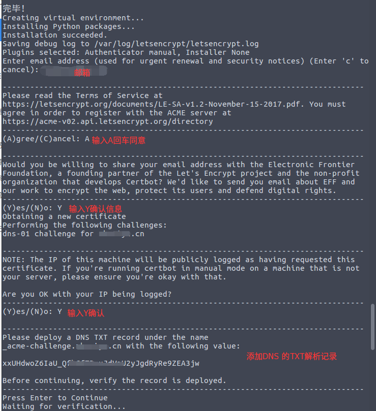

原文链接：https://blog.csdn.net/enweitech/article/details/79608464

2018 年 3 月 14 日，Let’s Encrypt 对外宣布 ACME v2 已正式支持通配符证书。这就意外味着用户可以在 Let’s Encrypt 上免费申请支持通配符的 SSL 证书。

### 什么是 Let’s Encrypt

Let’s Encrypt 是国外一个公共的免费 SSL 项目，由 Linux 基金会托管。它的来头不小，由 Mozilla、思科、Akamai、IdenTrust 和 EFF 等组织发起，目的就是向网站自动签发和管理免费证书。以便加速互联网由 HTTP 过渡到 HTTPS，目前 Facebook 等大公司开始加入赞助行列。

Let’s Encrypt 已经得了 IdenTrust 的交叉签名，这意味着其证书现在已经可以被 Mozilla、Google、Microsoft 和 Apple 等主流的浏览器所信任。用户只需要在 Web 服务器证书链中配置交叉签名，浏览器客户端会自动处理好其它的一切，Let’s Encrypt 安装简单，使用非常方便。

本文将会详细介绍如何免费申请 Let’s Encrypt 通配符证书。

### 什么是通配符证书

域名通配符证书类似 DNS 解析的泛域名概念，通配符证书就是证书中可以包含一个通配符。主域名签发的通配符证书可以在所有子域名中使用，比如 `.example.com`、`bbs.example.com`。

### 申请通配符证书

Let’s Encrypt 上的证书申请是通过 ACME 协议来完成的。ACME 协议规范化了证书申请、更新、撤销等流程，实现了 Let’s Encrypt CA 自动化操作。解决了传统的 CA 机构是人工手动处理证书申请、证书更新、证书撤销的效率和成本问题。

ACME v2 是 ACME 协议的更新版本，通配符证书只能通过 ACME v2 获得。要使用 ACME v2 协议申请通配符证书，只需一个支持该协议的客户端就可以了，官方推荐的客户端是 Certbot。

#### 获取 Certbot 客户端

```
# 下载 Certbot 客户端
$ wget https://dl.eff.org/certbot-auto
# 设为可执行权限
$ chmod a+x certbot-auto
```

注：Certbot 从 0.22.0 版本开始支持 ACME v2，如果你之前已安装旧版本客户端程序需更新到新版本。

更详细的安装可参考官方文档：https://certbot.eff.org/

#### 申请通配符证书

客户在申请 Let’s Encrypt 证书的时候，需要校验域名的所有权，证明操作者有权利为该域名申请证书，目前支持三种验证方式：

- dns-01：给域名添加一个 DNS TXT 记录。
- http-01：在域名对应的 Web 服务器下放置一个 HTTP well-known URL 资源文件。
- tls-sni-01：在域名对应的 Web 服务器下放置一个 HTTPS well-known URL 资源文件。

使用 Certbot 客户端申请证书方法非常的简单，只需如下一行命令就搞定了。

```
$ ./certbot-auto certonly  -d "*.xxx.com" --manual --preferred-challenges dns-01  --server https://acme-v02.api.letsencrypt.org/directory
```

1.申请通配符证书，只能使用 dns-01 的方式。
2.`xxx.com` 请根据自己的域名自行更改。

certonly 表示插件，Certbot 有很多插件。不同的插件都可以申请证书，用户可以根据需要自行选择。
-d 为哪些主机申请证书。如果是通配符，输入 *.xxx.com (根据实际情况替换为你自己的域名)。
--preferred-challenges dns-01，使用 DNS 方式校验域名所有权。
--server，Let's Encrypt ACME v2 版本使用的服务器不同于 v1 版本，需要显示指定。

执行完这一步之后，就是命令行的输出，请根据提示输入相应内容：



执行到上图最后一步时，先暂时不要回车。申请通配符证书是要经过 DNS 认证的，接下来需要按照提示在域名后台添加对应的 DNS TXT 记录。添加完成后，先输入以下命令确认 TXT 记录是否生效：

```
$ dig -t txt _acme-challenge.xxx.com @8.8.8.8 
...
;; OPT PSEUDOSECTION:
; EDNS: version: 0, flags:; udp: 512
;; QUESTION SECTION:
;_acme-challenge.xxx.com. IN TXT
;; ANSWER SECTION:
_acme-challenge.xxx.com. 599 IN TXT "xxUHdwoZ6IaU_ab87h67rvbU2yJgdRyRe9zEA3jw"
...
```

确认生效后，回车继续执行，最后会输出如下内容：

```
IMPORTANT NOTES:
 - Congratulations! Your certificate and chain have been saved at:
 /etc/letsencrypt/live/xxx.com/fullchain.pem
 Your key file has been saved at:
 /etc/letsencrypt/live/xxx.com/privkey.pem
 Your cert will expire on 2018-06-12. To obtain a new or tweaked
 version of this certificate in the future, simply run certbot-auto
 again. To non-interactively renew *all* of your certificates, run
 "certbot-auto renew"
 - If you like Certbot, please consider supporting our work by:
Donating to ISRG / Let's Encrypt: https://letsencrypt.org/donate
 Donating to EFF: https://eff.org/donate-le​
```

到了这一步后，恭喜您，证书申请成功。 证书和密钥保存在下列目录：

```
$ tree /etc/letsencrypt/live/xxx.com/
.
├── cert.pem
├── chain.pem
├── fullchain.pem
└── privkey.pem​
```

校验证书信息，输入如下命令：

```
$ openssl x509 -in /etc/letsencrypt/live/xxx.com/cert.pem -noout -text
# 可以看到证书包含了 SAN 扩展，该扩展的值就是 *.xxx.com
...
Authority Information Access: 
 OCSP - URI:http://ocsp.int-x3.letsencrypt.org
 CA Issuers - URI:http://cert.int-x3.letsencrypt.org/
X509v3 Subject Alternative Name: 
 DNS:*.xxx.com
...​
```

到此，我们就演示了如何在 Let’s Encrypt 申请免费的通配符证书。

### 其它相关

- 证书续期

Let’s encrypt 的免费证书默认有效期为 90 天，到期后如果要续期可以执行：

$ certbot-auto renew

- 在 Nginx 中 配置 Let’s Encrypt 证书

Nginx 配置文件片断：

```
server {
 server_name xxx.com;
 listen 443 http2 ssl;
 ssl on;
 ssl_certificate /etc/cert/xxx.com/fullchain.pem;
 ssl_certificate_key /etc/cert/xxx.com/privkey.pem;
 ssl_trusted_certificate /etc/cert/xxx.com/chain.pem;
location / {
 proxy_pass http://127.0.0.1:6666;
 }
}
```

### 参考文档

[https://www.google.com](https://www.google.com/)
https://www.jianshu.com/p/c5c9d071e395
https://my.oschina.net/kimver/blog/1634575