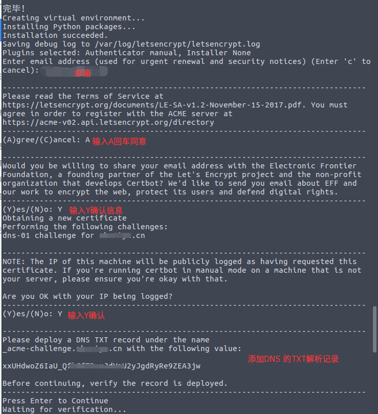

**certbot方式获取证书**

github地址：https://github.com/certbot/certbot

1.获取certbot-auto

```
# 下载
wget https://dl.eff.org/certbot-auto
# 设为可执行权限
chmod a+x certbot-auto​
```

2.开始申请证书

```
# 注xxx.com请根据自己的域名自行更改
./certbot-auto --server https://acme-v02.api.letsencrypt.org/directory -d "*.xxx.com" --manual --preferred-challenges dns-01 certonly
```

执行完这一步之后，会下载一些需要的依赖，稍等片刻之后，会提示输入邮箱，随便输入都行【该邮箱用于安全提醒以及续期提醒】



注意，申请通配符证书是要经过DNS认证的，按照提示，前往域名后台添加对应的DNS TXT记录。添加之后，不要心急着按回车，先执行dig xxxx.xxx.com txt确认解析记录是否生效，生效之后再回去按回车确认


到了这一步后，大功告成！！！ 证书存放在/etc/letsencrypt/live/xxx.com/里面

要续期的话，执行certbot-auto renew就可以了


注：经评论区 ddatsh 的指点，这样的证书无法应用到主域名xxx.com上，如需把主域名也增加到证书的覆盖范围，请在开始申请证书步骤的那个指令把主域名也加上，如下： 需要注意的是，这样的话需要修改两次解析记录

```
./certbot-auto --server https://acme-v02.api.letsencrypt.org/directory -d "*.xxx.com" -d "xxx.com" --manual --preferred-challenges dns-01 certonly​
```


下面是一个nginx应用该证书的一个例子

```
server {
    listen 443;
    server_name daiem.cn www.daiem.cn;
    ssl on;
    ssl_certificate /etc/letsencrypt/live/daiem.cn/fullchain.pem;
    ssl_certificate_key /etc/letsencrypt/live/daiem.cn/privkey.pem;
    ssl_trusted_certificate  /etc/letsencrypt/live/daiem.cn/chain.pem;
    #ssl_session_timeout 5m;
    #ssl_ciphers ECDHE-RSA-AES128-GCM-SHA256:ECDHE:ECDH:AES:HIGH:!NULL:!aNULL:!MD5:!ADH:!RC4;
    #ssl_protocols TLSv1 TLSv1.1 TLSv1.2;
    #ssl_prefer_server_ciphers on;
    location / {
	proxy_redirect off;
       	proxy_set_header Host $host;
        proxy_set_header X-Real-IP $remote_addr;
        proxy_set_header X-Forwarded-For $proxy_add_x_forwarded_for;
        proxy_pass http://127.0.0.1:8080;
    }
}
server {
    listen 80;
    server_name daiem.cn www.daiem.cn;
    rewrite ^(.*)$ https://$host$1 permanent;
}
```

```
./certbot-auto --server https://acme-v02.api.letsencrypt.org/directory -d "*.daiem.cn" -d "daiem.cn" --manual --preferred-challenges dns-01 certonly
/etc/letsencrypt/live/
```

